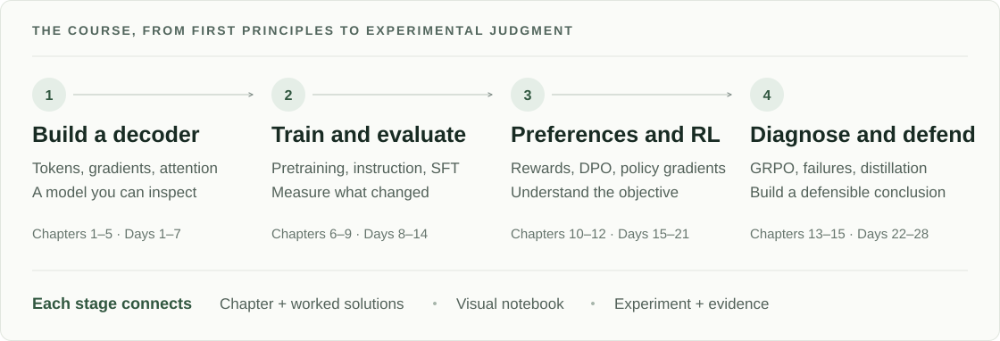
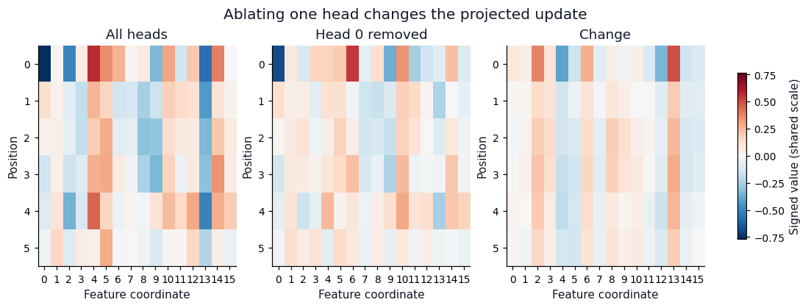
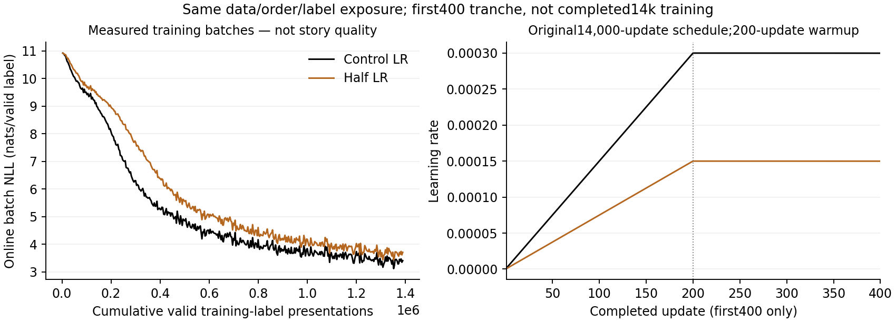

# Dongxi LLMs

**Understand the model. Build the mechanisms. Train it. Defend what you learned.**

A hands-on book and experimental lab for learning how language models work,
from token IDs and gradients to pretraining, supervised fine-tuning, preference
optimization, and reinforcement learning. The course connects mathematical
derivations to readable PyTorch implementations, visual notebooks, and real
training evidence from an NVIDIA DGX Spark.

**15 chapters · 28 learning days · 76 visual notebooks · worked solutions**

[Read the book](book/README.md) · [Explore the notebooks](notebooks/README.md) ·
[Follow the daily route](docs/COURSE_SEQUENCE.md) · [Inspect the experiments](docs/EXPERIMENT_MATRIX.md)



## What you will learn

The course begins with a randomly initialized decoder, then moves to Qwen3
post-training. Each stage asks you to explain not only *how an algorithm works*,
but *why a particular experiment would tell you anything useful*.

| Part | Chapters / days | Questions you will be able to answer |
|---|---|---|
| **I. Build a decoder** | Chapters 1–5 · Days 1–7 | How do tokens become predictions? How do gradients reach embeddings and Q/K/V? Why do residual streams, normalization, position encoding, and KV caches matter? |
| **II. Train and evaluate** | Chapters 6–9 · Days 8–14 | How do data, batching, AdamW, and learning rates interact? What does a falling loss prove? How do templates, masks, and full tuning versus LoRA change an assistant? |
| **III. Preferences and policies** | Chapters 10–12 · Days 15–21 | What can a reward model learn? How does DPO change relative response probabilities? What do REINFORCE, RLOO, and PPO actually optimize? |
| **IV. Diagnose and defend** | Chapters 13–15 · Days 22–28 | When can GRPO learn from verifiable rewards? How do reward hacking and rollout failures arise? What do selection and distillation improve, and how do you demonstrate it? |

Modern architecture companions cover **RMSNorm, RoPE, SwiGLU, grouped-query
attention, and recurrent/looped Transformers**. Later labs examine mathematical
grading, judge disagreement, process versus outcome rewards, candidate
selection, and response-level distillation. The
[reader's guide](book/README.md) links every chapter to its worked solutions.

## Learn by changing the mechanism

Why can a future token provide a training target without leaking into the
current representation? Why can loss remain positive when the gradient is zero?
Why don't all attention heads converge to the same thing?

These questions lead the lessons. The learning cycle is:

**Question → prediction → implementation → controlled change → explanation**

For example, remove an attention head and inspect how the projected update
changes—not just whether the code still runs:

[](notebooks/day-05/02_multi_head_attention.ipynb)

*A small, controlled teaching example from the
[multi-head attention notebook](notebooks/day-05/02_multi_head_attention.ipynb),
not a visualization of a pretrained model's semantic capabilities.*

The companions include architecture maps, tensor heatmaps, probability plots,
gradient checks, and deliberately broken variants. Reference answers sit next
to the exercises with explanations; you do not have to search elsewhere for
the missing step. Reusable implementations live in
[src/dongxi_llms/](src/dongxi_llms/) and are tested outside the notebooks.

Start with a lesson that interests you:

- [Tokenization and vocabulary cost](notebooks/day-02/README.md): the same text,
  different token boundaries, different compute budgets.
- [Logits, softmax, and cross-entropy](notebooks/day-03/README.md): trace the
  path from a hidden state to probabilities and learning signals.
- [Causal attention and KV caching](notebooks/day-04/README.md): test the
  information boundary and cached/full-prefix equivalence.
- [Build the decoder](notebooks/day-05/README.md): connect embeddings,
  attention, residuals, normalization, and feed-forward layers.
- [Preferences and policy gradients](notebooks/day-17/README.md): begin with
  DPO, then follow the [policy-gradient labs](notebooks/day-19/README.md).

## Experiments we actually ran

The course includes real Spark runs, not just proposed recipes. Their reports
retain the settings, raw observations, failures, and limits of each conclusion.

| Experiment | What happened | What it teaches |
|---|---|---|
| **DongxiGPT from scratch** | A **66.64M-parameter** decoder trained on TinyStories for **14,000 updates** and **48.84M valid target presentations**. Fixed-development NLL fell from **10.9049 to 1.6743**. [Run report](experiments/reports/2026-09-14-tinystories-learning-result.md) | Recognizable story structure can emerge while repetition and malformed language remain. Lower loss is not a certificate of coherence. |
| **A matched learning-rate intervention** | Two fresh **400-update** runs used the same data exposure; one halved the learning rate. **192 continuations** were reviewed by two blinded AI reader instances. [Comparison](experiments/reports/2026-10-05-native-story-first400-comparison.md) | Prediction loss, natural stopping, repetition, and meaningful endings are different measurements. This early comparison is not two completed 14,000-update schedules. |
| **Full tuning versus LoRA** | Qwen3-0.6B-Base received the same **400-update** instruction recipe in both arms. Full tuning passed **120/120** strict held-out-value items; merged rank-8 Q/V LoRA passed **0/120**. [Comparison](experiments/reports/2026-10-05-native-sft400-comparison.md) | Adapter choice and stopping behavior matter. Three shared copy/reverse/extract templates do not establish general assistant quality or a universal full-tuning advantage. |
| **Chosen-only SFT versus DPO** | Two **100-update** interventions from the same parent were evaluated alongside that parent in **432 common responses**. [Comparison](experiments/reports/2026-10-05-native-preference-comparison.md) | A larger preference margin need not produce a more accurate decoded answer. Retention must be measured separately. |
| **Reasoning interfaces and RLVR** | Base/Instruct interfaces and generation caps were tested; two policies completed **16 RLVR iterations** with group sizes 4 and 8. Reward advantages remained zero. [Evidence](experiments/reports/2026-10-05-native-reasoning-rlvr-evidence.md) | Running an optimizer is not evidence of reward-driven learning. Zero-variance groups, incomplete generations, and failed supervision are part of the result. |

[](experiments/reports/2026-10-05-native-story-first400-comparison.md)

*Measured training curves from the matched 400-update comparison—not story
quality scores. The report pairs them with fixed-panel likelihoods, generated
text, stopping behavior, and reader ratings.*

The [experiment matrix](docs/EXPERIMENT_MATRIX.md) distinguishes completed runs
from prepared protocols and unrun stages. The
[course evidence map](docs/COURSE_EVIDENCE_MAP.md) connects these observations
back to the chapters. Archived evidence does not include checkpoint weights
or a bundled copy of the training corpus.

## Start reading or coding

You can read the chapters and saved notebook figures without installing
anything. For a guided beginning, read the
[preface](book/front-matter/preface.md), then
[Chapter 1: Evidence Before Optimization](book/chapters/01-evidence-before-optimization.md).
For the from-scratch training story, jump to
[Chapter 6](book/chapters/06-pretraining-as-a-controlled-system.md) and its
[run-reading lab](book/labs/06-reading-a-pretraining-run.md).

The coding route assumes familiarity with Python and basic deep learning;
the mathematical reasoning is developed alongside the implementations.
With **Python 3.12 and uv already installed**, run these commands from the
repository root:

```bash
UV_PROJECT_ENVIRONMENT=.venv-course uv sync --locked --extra course --python 3.12 --no-python-downloads
.venv-course/bin/python -m ipykernel install --prefix .course-kernel --name dongxi-course --display-name "Python (Dongxi CPU course)"
JUPYTER_PATH="$PWD/.course-kernel/share/jupyter" .venv-course/bin/python -m jupyterlab
```

Select **Python (Dongxi CPU course)** in JupyterLab. This creates a separate
CPU teaching environment; it does not replace the Spark GPU environment or
download pretrained weights. [Appendix D](book/appendices/d-reproduction-and-environments.md)
documents environment choices, focused notebook execution, and local verification.

Small CPU experiments make the mechanisms inspectable. Model-scale training
runs use a separately profiled GPU environment and explicit experiment budgets.
**Mac Studio is the intended interactive-learning and media workspace; DGX
Spark is the GPU lab.** Linux execution is recorded; Mac execution is not
inferred from it. To continue across machines, use the
[handoff workflow](docs/LEARNING_WORKFLOW.md): **Switch to Mac / Spark** before
leaving, then **Continue on Mac / Spark** on the destination. Repository sync
and saved progress carry the lesson; live kernels do not move with Git.

## Material, evidence, and project history

This is a complete teaching draft targeting a `v0.1` public beta, not a claim
that every learner has completed the course or that every experimental protocol
has run. The recorded goal-closure Linux snapshot executed **all 76 notebook
references**, produced **210 figures**, and passed **1,533 CPU tests**.
[Verification report](experiments/reports/2026-10-05-final-course-verification.md)
and [notebook manifest](experiments/reports/2026-10-05-final-goal-notebooks/run-01/manifest.json)
retain that revision's exact scope; later edits do not inherit its verification.
Four explicitly unfinished learner exercise cells were preserved, with their
adjacent reference solutions executed.

The material grew through live discussions about tokenization, logits,
gradients, attention, and training failures, then a systematic review against
[LLMs from Scratch](https://github.com/rasbt/LLMs-from-scratch),
[Reasoning from Scratch](https://github.com/rasbt/reasoning-from-scratch), and
[the RLHF Book](https://github.com/natolambert/rlhf-book).
Those projects are references; this book's prose and course implementations
are authored for its own learning pathway. The
[reference audit](docs/REFERENCE_REPOSITORY_AUDIT.md) and
[18-package acceptance review](docs/UPGRADE_ACCEPTANCE_REVIEW.md) document
what was strengthened and what the evidence actually supports.

For ongoing work:

- [Progress](PROGRESS.md) and [learning memory](LEARNING_MEMORY.md): the actual
  learner position, open questions, and next session.
- [Learning artifacts](learning_artifacts/): deep discussions and portable
  article/animation briefs organized by day and topic.
- [Book architecture](BOOK.md) and [roadmap](ROADMAP.md): scope and sequencing.
- [Contributor instructions](AGENTS.md): read before changing the project.

The aim is to leave with more than working code: **a model of how learning
happens, and the judgment to tell a useful result from a misleading one.**
