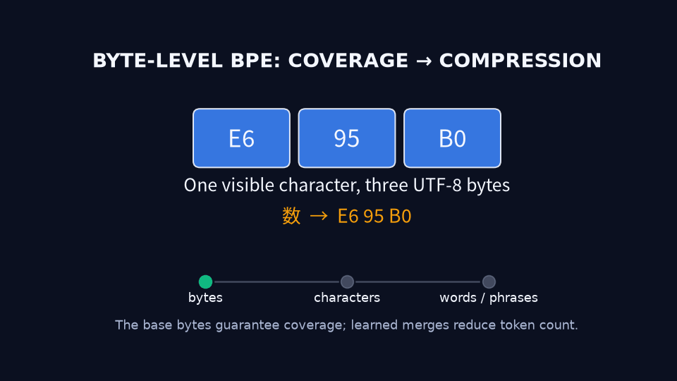

# Chapter 2 — Text, Tokens, and Embeddings

A language model does not receive words. It receives integers.

That simple fact creates an interface problem. Human text is written with
characters, punctuation, spaces, and writing systems; a neural network operates
on fixed-width tensors. Something must decide which pieces of text deserve an
integer, what each integer means, and how that discrete symbol enters continuous
computation.

The answer is not one dictionary lookup. It is a chain:

```text
text → bytes and characters → tokenizer pieces → token IDs
     → embedding vectors → contextual hidden states → next-token scores
```

Every arrow contains a design choice. A tokenizer can compress one language well
and split another into many pieces. The same numeric ID can mean unrelated text
under another tokenizer. Repeated IDs retrieve identical initial vectors, yet
their later hidden states can represent different meanings. A loss can exclude a
prompt position while still sending gradients into its embedding.

This chapter develops those mechanisms as one argument. We will first understand
byte-level BPE, then test multilingual tokenization with a pinned Qwen3 tokenizer,
follow token IDs into an embedding table, and trace next-token supervision back
into that table. By the end, “text becomes vectors” will no longer be a hidden
preprocessing step; it will be an inspectable part of the model.

## 2.1 Learning outcomes

After completing this chapter, you should be able to:

- distinguish written words, grapheme clusters, Unicode code points, UTF-8 bytes,
  tokenizer pieces, and token IDs;
- explain offline BPE training separately from frozen runtime encoding;
- explain how byte-level BPE can encode unseen Chinese text without claiming that
  the model understands it;
- treat a tokenizer as part of a model's interface identity rather than a
  replaceable text utility;
- explain why BPE pieces and token IDs have no built-in semantic hierarchy and
  why a coordinated ID permutation preserves model behavior;
- measure token efficiency with an explicit denominator and defend the limits of
  a small multilingual comparison;
- derive the shape change from token IDs to embedding vectors;
- distinguish input embeddings from contextual hidden states;
- trace lookup, tied-classifier, and masked-response gradient paths;
- distinguish attention masks, loss masks, padding, and semantic end tokens;
- interpret the verified Qwen3 tokenizer and embedding dimensions without
  inventing a rationale for unassigned model rows.

Chapter 1's evidence discipline remains active: predictions precede measurements,
observations remain separate from interpretations, and a worked example does not
silently become a language-wide claim.

## 2.2 Six units that are easy to confuse

Consider the Chinese character `数`. It is one visible character and one Unicode
code point, but UTF-8 stores it as three bytes:

```text
visible character: 数
Unicode code point: U+6570
UTF-8 bytes:        E6 95 B0
```

Now consider the Swedish word `språkmodellen`. It is one orthographic word, but a
particular tokenizer may represent it with several pieces. Conversely, a Chinese
phrase containing multiple characters may be one token.

We therefore need separate names for separate units:

| Unit | Meaning |
|---|---|
| Written word | A language-dependent orthographic unit |
| Grapheme cluster | A user-perceived character, possibly built from several code points |
| Unicode code point | An integer assigned by Unicode to an abstract character |
| UTF-8 byte | One byte in a variable-length encoding of Unicode text |
| Tokenizer piece | A string or byte pattern selected by the tokenizer rules |
| Token ID | The integer address assigned to one tokenizer entry |

None of these units has a universal one-to-one relationship with another. English
words can split into stems or fragments. Chinese characters can split into byte
pieces or merge into phrases. Spaces may be represented as part of the following
piece. Special tokens can represent control events that do not correspond to
ordinary source text.

Even “character” is ambiguous. The family emoji `👨‍👩‍👧‍👦` is one extended
grapheme cluster, but it contains seven Unicode code points—four people joined by
three zero-width joiners—and occupies 25 UTF-8 bytes. Python's `len()` reports
seven because it counts code points, not reader-perceived graphemes.

This is why “How many tokens does this sentence contain?” is incomplete without a
tokenizer identity and configuration.

### The tokenizer is part of the model contract

Suppose tokenizer A maps ID 42 to `cat`, while tokenizer B maps ID 42 to a Chinese
piece. Passing IDs from A into a model trained with B does not produce a type or
shape error. It silently selects the wrong embedding rows.

The model-tokenizer interface is therefore semantic, not merely structural:

```text
tokenizer rules + vocabulary + special-token policy ↔ embedding row meanings
```

A reproducible model identity should include the tokenizer name and immutable
revision, normalization and pre-tokenization behavior, special-token policy, and
whether encoding adds those special tokens. “The IDs have the right shape” is not
evidence that the interface is correct.

### Normalization and pre-tokenization change the input

Tokenization begins before BPE merges. Normalization may rewrite one valid Unicode
sequence into another, while pre-tokenization determines which regions are
eligible to interact. These steps belong to the tokenizer's identity.

The local tokenizer-mechanics experiment compared two canonically equivalent
spellings of `café`:

| Source | Code points | UTF-8 bytes | Graphemes | Qwen3 token IDs | Exact source round trip |
|---|---:|---:|---:|---|---|
| NFC `café` | 4 | 5 | 4 | `[924, 58858]` | yes |
| NFD `café` | 5 | 6 | 4 | `[924, 58858]` | no |

The pinned tokenizer normalized both forms to the same IDs and decoded both as
NFC `café`. The strings are canonically equivalent, but the NFD source and decoded
text are not identical code-point sequences. Its returned offsets also stopped
before the original combining mark. A round trip can therefore preserve normalized
text without preserving the exact source representation, and offset-derived spans
need scrutiny whenever normalization changes the input.

Pre-tokenization and byte representation can also make whitespace part of token
identity. Under the same pinned tokenizer:

```text
token  → ID 5839, internal piece token
 token → ID 3950, internal piece Ġtoken
```

Both examples used one token, but they did not use the same token. Token count
alone hides this interface difference. The exact protocol and negative
round-trip result are preserved in the
[tokenizer-mechanics report](../../experiments/reports/2026-08-31-tokenizer-mechanics.md).

### Special tokens and chat templates package the text

A model-facing prompt may contain more than the visible user content. The pinned
Qwen3 tokenizer encoded raw `Hello` as one ID, `9707`. Rendering the same content
as one user message with a generation prompt produced:

```text
<|im_start|>user
Hello<|im_end|>
<|im_start|>assistant
```

That sequence occupied nine token positions. The added positions came from the
frozen chat template and control tokens, not from BPE learning vocabulary at
runtime. In this snapshot, `<|im_end|>` is the EOS token and `<|endoftext|>` is
used as PAD. Section 2.9 returns to their different learning roles; later
instruction-data chapters will examine chat-template and loss-mask policy in
depth.

## 2.3 BPE learns compression offline

Byte-pair encoding, or BPE, is easier to understand when we separate two phases
that are often described as though they were one operation.

This chapter focuses on **byte-level BPE**, not every tokenizer family:

| Family | Bounded mechanism summary |
|---|---|
| BPE | Grow larger pieces through learned merges, then replay merge priorities during encoding |
| WordPiece | Learn a subword inventory with a different scoring procedure; common encoders select valid pieces greedily |
| Unigram | Begin with many candidate pieces, prune the inventory, and score alternative segmentations probabilistically |

Byte fallback is a separate implementation choice; the name of a subword family
alone does not guarantee complete byte coverage.

### Phase 1: train the tokenizer

In a simplified BPE training loop:

1. represent the training corpus using base symbols;
2. count adjacent symbol pairs that are eligible to merge;
3. select a pair according to the training rule;
4. add its merged form to the vocabulary;
5. rewrite occurrences using that merge;
6. repeat until the merge or vocabulary budget is exhausted.

For a byte-level tokenizer, the base inventory includes all 256 byte values. To
make the training mechanism readable, our tiny executable example instead starts
from characters in a pre-tokenized weighted corpus:

```text
hug     × 5
hugs    × 3
hugging × 2
```

Three measured rounds produced:

| Round | Selected pair | Weighted count |
|---:|---|---:|
| 1 | `h + u → hu` | 10 |
| 2 | `hu + g → hug` | 10 |
| 3 | `hug + s → hugs` | 3 |

At round 1, `h+u` and `u+g` were tied at 10. A declared lexicographic tie break
selected `h+u`; “choose the most frequent pair” was not sufficient to determine
a unique result. After training, frozen replay encoded `hugging` as
`[hug] [g] [i] [n] [g]` and `hugs` as `[hugs]`. The old constituent entries did
not disappear merely because larger pieces were added.

The implementation and complete pair-count trace live in
[`tiny_bpe.py`](../../src/dongxi_llms/tiny_bpe.py) and the
[tokenizer-mechanics report](../../experiments/reports/2026-08-31-tokenizer-mechanics.md).
The example establishes the algorithmic mechanism; it does not reconstruct
Qwen3's historical merge sequence.

Frequency matters, but “frequent text becomes one token” is too strong. A pair
must compete against every other eligible pair for a finite budget. Normalization,
pre-tokenization boundaries, existing merges, corpus weighting, and merge order
all affect the result.

### Phase 2: encode with frozen rules

At runtime, the trained tokenizer does not inspect one new sentence and invent
new vocabulary entries. It:

1. applies its fixed normalization and pre-tokenization rules;
2. converts text to its base representation;
3. replays learned merge priorities where eligible;
4. maps the resulting pieces to fixed IDs.

Encoding is therefore more than “find the longest vocabulary string.” A string
can exist in the vocabulary but fail to appear in a segmentation because its
merge path, rank, or pre-tokenization boundary does not permit it there.

### Byte coverage is not language understanding

A byte-level tokenizer has a useful fallback. Even if its training data contained
only ASCII English, it can still preserve the UTF-8 bytes of `数`:

```text
数 → [E6] [95] [B0]
```

With repeated Chinese exposure, BPE may learn compression inside and across
characters:

```text
[E6] + [95]       → [E6 95]
[E6 95] + [B0]    → [数]
[数] + [据]        → [数据]
[数据] + [库]      → [数据库]
```



This progression is a transparent mechanism, not a reconstruction of any
particular production tokenizer's historical merge sequence.

The distinction is fundamental:

```text
base bytes guarantee reversible coverage
learned merges improve compression
model training creates language capability
```

An English-trained byte tokenizer can encode Chinese without `<unk>` while doing
so inefficiently. A language model trained only on English can receive those
valid byte IDs yet have little ability to interpret them. Encodability,
compression, and understanding are three different claims.

Not every tokenizer has complete byte coverage or byte fallback. Other designs
can still emit an unknown token for unsupported input.

### BPE pieces are procedural atoms, not a semantic family tree

A trained BPE vocabulary can simultaneously contain pieces corresponding to
`数`, `据`, `数据`, and `数据库`. That does not tell the model that one entry is the
semantic parent, child, or sum of another. The merge history determined which
adjacent patterns became reusable pieces during tokenizer training. At runtime,
the tokenizer emits the final selected IDs; the transformer does not normally
receive the merge tree that produced them.

The old constituents remain vocabulary entries because they are still needed in
other contexts. A long piece such as `数据库` is therefore an additional atomic
symbol at the model interface, not a compositional instruction saying “combine
the learned meanings of `数据` and `库`.”

The language model can later learn relationships among these entries through
shared contexts, embedding geometry, attention, and next-token gradients. Those
relationships are induced by model training. They are not guaranteed by string
overlap, merge ancestry, or neighboring token IDs.

## 2.4 Multilingual efficiency must be measured

Before inspecting Qwen3, we predicted token counts for approximately equivalent
English, Chinese, and Swedish sentences. The initial reasoning was plausible:

- Chinese might use approximately one token per character;
- Swedish compounds can express in one written word what English expresses with
  multiple words;
- therefore Swedish might use the fewest tokens, Chinese the middle, and English
  the most.

That prediction failed—and the failure taught more than a correct guess would
have.

### Fixed protocol

The experiment pinned `Qwen/Qwen3-0.6B` at revision
`c1899de289a04d12100db370d81485cdf75e47ca`, disabled added special tokens, and
used tokenizer-default normalization. It recorded:

- Unicode code-point count;
- UTF-8 byte count;
- token count;
- code points and bytes per token;
- exact IDs, vocabulary pieces, and source offsets;
- exact encode/decode round trips.

The complete protocol and output are preserved in the
[tokenizer report](../../experiments/reports/2026-08-30-qwen3-multilingual-tokenization.md).

### Observations

| Language | Code points | UTF-8 bytes | Tokens | Code points/token | Bytes/token |
|---|---:|---:|---:|---:|---:|
| Chinese | 16 | 48 | 9 | 1.777778 | 5.333333 |
| English | 58 | 58 | 11 | 5.272727 | 5.272727 |
| Swedish | 58 | 63 | 20 | 2.900000 | 3.150000 |

All three sequences decoded exactly to their original text. The observed ranking
was the reverse of the initial prediction:

```text
Chinese (9) < English (11) < Swedish (20)
```

The reader-facing spans make the mechanism easier to see than the tokenizer's
internal byte-display alphabet:

```text
Chinese:
[小型] [语言] [模型] [学习] [预测] [下一个] [词] [元] [。]

English:
[The] [ small] [ language] [ model] [ learns] [ to] [ predict]
[ the] [ next] [ token] [.]

Swedish:
[Den] [ l] [illa] [ spr] [å] [k] [mod] [ellen] [ l] [är]
[ sig] [ att] [ för] [uts] [ä] [ga] [ nä] [sta] [ token] [.]
```

`språkmodellen` is one written Swedish word but five tokens in this tokenizer:
` spr`, `å`, `k`, `mod`, and `ellen`. Chinese, meanwhile, receives several
multi-character pieces, including the three-character span `下一个`.

### Interpretation and limits

The result does not mean that Chinese is universally more token-efficient than
Swedish or English. It means that this pinned tokenizer compressed these three
fixed strings in this order.

It does support a broader mechanism:

> Orthographic word structure does not determine token efficiency; the learned
> tokenizer interface does.

The vocabulary is an imperfect compression record of patterns that won finite
capacity during tokenizer training. Corpus mixture and weighting are plausible
causes of multilingual differences, but this experiment did not observe the
original tokenizer-training corpus and cannot assign a causal explanation to a
specific merge.

Efficiency also needs a denominator. Tokens per sentence is useful for billing or
context-window occupancy only when sentences are comparable. Code points per
token and UTF-8 bytes per token reveal different compression properties. None is
a direct measure of comprehension or downstream quality.

Language-wide claims would require a representative, frozen multilingual corpus,
matched content, clear sampling rules, distributional summaries, and uncertainty
or variation across domains—not one sentence per language.

### Vocabulary size trades rows against sequence positions

A tokenizer with fewer learned pieces tends to leave more text decomposed into
bytes or short fragments. That increases token sequence length $T$. More
positions mean more transformer work, more autoregressive generation steps, more
KV-cache entries, and—under full attention—more position pairs.

A larger vocabulary can compress frequent patterns into fewer positions, but it
increases the embedding and output dimensions $V_m$. Dense next-token projection
must compare each contextual state with every output row. The broad trade-off is:

```text
smaller vocabulary → often longer sequences and more transformer positions
larger vocabulary  → wider embedding/output tables and more candidate scores
```

“Often” matters. A large vocabulary allocated mainly to other languages or
domains can compress the target text worse than a smaller specialized one.
Chapter 3 makes the $T$-versus-$V_m$ computation explicit when it constructs the
vocabulary-wide logit tensor.

## 2.5 Embeddings turn addresses into vectors

A token ID is an address, not a learned semantic vector. Let:

- $V_m$ be the model's embedding-row count;
- $d$ be the embedding width;
- $E \in \mathbb{R}^{V_m \times d}$ be the trainable embedding table.

For token IDs $I \in \{0,\ldots,V_m-1\}^{B \times T}$, lookup produces:

\[
X = E[I], \qquad X \in \mathbb{R}^{B \times T \times d}.
\]

For example:

```text
input_ids.shape = [2, 5]
E.shape         = [V_m, 8]
X.shape         = [2, 5, 8]
```

Every ID becomes one length-8 vector, so lookup adds an embedding dimension
rather than replacing the batch or sequence dimensions.

Mathematically, selecting row $i$ is equivalent to multiplying a one-hot row
vector by $E$:

\[
e_i^\top E = E[i].
\]

Implementations use indexed lookup because materializing a mostly zero vector of
length $V_m$ is wasteful.

### Token IDs are categorical addresses

It is tempting to say that the model learns relationships among numbers such as
1, 2, and 3. The important correction is that those integers are only row
addresses. ID 3 is not numerically closer in meaning to ID 4 than to ID 40,000.

Imagine applying one consistent permutation to the tokenizer mappings, every
dataset ID and label, the input embedding rows, the output rows and biases, and
any special-token references. The resulting system can compute exactly the same
function and decode exactly the same text. Only the printed addresses changed.

The model therefore learns token-sequence structure directly and linguistic
structure indirectly through the tokenizer's reversible association between IDs
and text. It does not learn arithmetic on token ID magnitudes. Similarities live
in learned parameters and contextual behavior, not in the integers themselves.

### Repetition means parameter reuse

For IDs `[2, 5, 2]`, lookup returns three vectors:

```text
E[2], E[5], E[2]
```

The first and third values are copies used at different sequence positions, but
they come from the same trainable row. If their position-level gradients are
$g_0$ and $g_2$, the shared parameter receives their sum:

\[
\frac{\partial L}{\partial E[2]} = g_0 + g_2.
\]

Under the controlled sum loss in our transparent PyTorch lab, each occurrence
contributed a vector of ones:

```text
gradient at row 2: [2, 2, 2, 2]
gradient at row 5: [1, 1, 1, 1]
```

Only rows 2 and 5 received a **direct lookup-path gradient** in that example. The
qualification matters because the same table may also participate elsewhere in
the model.

## 2.6 An embedding is a starting point, not a finished meaning

Consider two occurrences of `bank`:

```text
The bank approved the loan.
We rested beside the river bank.
```

If both occurrences have the same token ID, both initially retrieve the same
embedding row. The table cannot select a complete context-specific sense before
the transformer has processed context.

We need three levels:

1. **Token ID:** the discrete address created by the tokenizer.
2. **Input embedding:** a learned, context-independent starting vector for that
   ID.
3. **Contextual hidden state:** a position-specific vector constructed by the
   transformer from the causally available sequence.

For a hidden tensor $H \in \mathbb{R}^{B \times T \times d}$, we use lowercase
$h = H[b,t,:] \in \mathbb{R}^d$ for one position's contextual state. With input
`[cat, sat]`, the final position can be summarized as:

\[
h_{\text{sat}} = \operatorname{Transformer}(E[\text{cat}], E[\text{sat}]).
\]

The two occurrences of one token begin with the same row but can develop
different hidden states because position and surrounding context differ.

### Meaning obeys the information boundary

In a causal decoder, the state at a position can use only that token and earlier
tokens. At `bank` in `The bank approved the loan`, the words `approved` and
`loan` are still in the future. The state at `bank` may therefore remain
ambiguous. Later positions can combine the earlier `bank` representation with
new evidence and form a financial interpretation; they do not travel backward
and rewrite the earlier state.

This suggests a more useful mental model than “the model looks up meaning”:

> A causal transformer maintains an evolving hypothesis about the sequence and
> can preserve ambiguity until later computation has enough evidence.

### Context needs order

`dog bites man` and `man bites dog` retrieve the same set of token-type rows but
describe different events. Token identity alone is insufficient.

Qwen3 uses rotary positional embeddings, or RoPE, inside attention. At a high
level, RoPE rotates queries and keys according to position:

\[
q_t' = R_t q_t, \qquad k_s' = R_s k_s.
\]

Their dot product can then depend on the relative position $t-s$. RoPE does not
simply replace the token embedding with a “position 7” vector; it makes attention
comparisons position-aware. Chapter 4 derives attention and its masks, and
Chapter 5 places RoPE inside the complete decoder.

Meaning in the model therefore emerges from identity, order, accessibility, and
interaction—not from one coordinate or one lookup row. Individual embedding
dimensions generally have no fixed human label. A coordinated change of basis in
the representation space and downstream weights can preserve the network's
function, so “dimension 347 means animalness” is not a sound default claim.

## 2.7 Next-token loss trains the embedding table

Embedding training normally has no separate target vector for `cat`, `sat`, or
`dog`. Supervision comes from the language-model objective:

```text
token IDs
   ↓ lookup
input embeddings
   ↓ transformer
contextual state h
   ↓ output projection
logits over candidate token IDs
   ↓ next-token loss
scalar L
   ↓ backpropagation
embedding and transformer gradients
```

The embedding becomes useful because, across many contexts, its values help the
network predict later tokens. “Meaning” is therefore distributed across the
embedding table and the transformations that consume it.

### Weight tying couples reading and predicting

An untied language model has a separate output matrix $W_{out}$. A tied model
reuses $E$:

\[
z = hE^\top, \qquad z_i = h \cdot E[i].
\]

Here $z_i$ is the logit for candidate token $i$: a raw compatibility score,
not yet a probability. Softmax converts all logits into a shared probability
distribution. Chapter 3 derives that conversion and the next-token loss in full.

For target token $y$, the output-side gradient of cross-entropy with respect to
one tied row is:

\[
\left.\frac{\partial L}{\partial E[i]}\right|_{output}
= \left(p_i - \mathbf{1}[i=y]\right)h.
\]

This creates two distinct paths:

- **lookup path:** only rows selected by input IDs receive direct lookup
  contributions;
- **tied output path:** every row in an ordinary dense softmax generally receives
  an output-classifier contribution.

Selected input rows receive the sum of both paths. Unselected rows can still move
through the tied output path.

### Equal forward values can create different learning trajectories

Our lab initialized an untied output matrix with exactly the same numeric values
as the input table. The tied and untied models therefore produced the same
forward loss, `0.699771`. Their embedding gradients differed:

```text
untied nonzero embedding rows: [1, 3]
tied nonzero embedding rows:   [0, 1, 2, 3, 4, 5]
```

The values were equal, but their parameter identities were not. In the untied
model, two independent parameters happened to contain equal numbers. In the tied
model, one parameter occupied two roles in the computation graph.

This leads to an architectural principle:

> Architecture determines not only the forward function but also how learning
> credit is routed when that function is wrong.

Weight tying saves parameters and encourages one geometry to support both reading
and predicting. It also removes freedom: the two roles cannot adapt independently.
The lab verifies gradient routing, not that tying is universally superior.

Production LLMs commonly use AdamW rather than the simple update
$E \leftarrow E-\eta\nabla E$, but the optimizer still acts on the accumulated
gradient produced by these paths.

## 2.8 Qwen3's concrete interface

We inspected the exact Qwen3-0.6B revision used in the tokenizer experiment. The
runtime measurements were:

```text
tokenizer base vocabulary:        151,643
tokenizer total entries:          151,669
maximum tokenizer-assigned ID:    151,668
model vocabulary rows:            151,936
embedding width:                    1,024
input embedding shape:    [151936, 1024]
output embedding shape:   [151936, 1024]
one-position logits:       [1, 1, 151936]
```

The input and output accessors returned the same Python parameter object backed
by the same storage. Qwen3 therefore implements true runtime weight tying in this
pinned stack.

The model has 267 rows beyond the tokenizer's exposed entries:

```text
ID 151668 → </think>
ID 151669 → no tokenizer piece
ID 151935 → no tokenizer piece
```

Ordinary encoding with this tokenizer cannot select those extra rows as input,
yet the model emits logits for all 151,936 rows. With dense tied classification,
such rows can receive output-side gradients despite receiving no ordinary lookup
gradient.

The model vocabulary size is divisible by 128. That is an observation. Calling
the 267 rows hardware padding is plausible, but the inspected configuration and
weights do not establish why the designers selected this exact size. The full
method and evidence are preserved in the
[Qwen3 interface report](../../experiments/reports/2026-08-31-qwen3-embedding-inspection.md).

This example also sharpens our notation: tokenizer entry count $V_t$ and model
row count $V_m$ can differ. Treating both casually as “the vocabulary size” can
hide a real interface boundary.

## 2.9 Masks define different learning boundaries

Sequences in one batch usually have different lengths. Padding creates a
rectangular tensor:

```text
tokens:
[
  [The, cat, slept, <eos>],
  [Birds, fly, <eos>, <pad>],
]
```

`<pad>` is artificial batch formatting. `<eos>` is a semantic event the model
should learn to predict. Treating them identically would erase the supervision
that teaches generation to stop.

Two masks answer two different questions:

| Mechanism | Question |
|---|---|
| Attention or visibility mask | May this position influence another representation? |
| Loss or supervision mask | Should prediction error at this position contribute to the objective? |

A common representation is:

```text
input_ids =
[
  [12, 24, 31],
  [47, 18,  0],
]

attention_mask =
[
  [1, 1, 1],
  [1, 1, 0],
]

labels =
[
  [12, 24, 31],
  [47, 18, -100],
]
```

This schematic isolates padding and ignore positions. Causal language-model APIs
often accept labels aligned with `input_ids` and perform the one-position shift
inside the loss computation; Chapter 3 makes that alignment explicit.

In common PyTorch cross-entropy usage, label `-100` means “ignore this target.” If
the padded label remained ID 0, the objective would include:

\[
L_{pad} = -\log P(\text{PAD}\mid\text{preceding context}),
\]

training the model on batch formatting rather than intended language.

Exact conventions vary by trainer. Never assume that providing an attention mask
also masks labels; inspect the shifted labels and reduction mask used by the
actual implementation.

### No local loss does not mean no gradient

Instruction tuning later uses the distinction deliberately:

```text
User prompt       → visible context, possibly excluded from direct loss
Assistant response → visible context and supervised targets
```

If a supervised response state attends to prompt states, the response loss
depends on the prompt computation. Backpropagation follows that dependency:

```text
response loss
   → response hidden state
   → attention connection
   → prompt representation
   → prompt-token embedding row
```

A loss mask determines where scalar loss terms originate. It does not detach
earlier visible positions from the graph, and it does not freeze their parameters.

The transparent lab used loss mask `[0, 0, 1]`: only the final response position
contributed direct loss. That response assigned positive attention to both prompt
positions, whose embedding rows received gradient norms `0.303322` and
`0.668485`.

Forward causality and backward credit assignment therefore point in opposite
directions along the same allowed dependency: prompt information moves forward
into the response, and response error moves backward into the computations that
made it possible.

## 2.10 Transparent companion experiments

The chapter's empirical claims come from four small, inspectable artifacts:

| Experiment | What it establishes | What it does not establish |
|---|---|---|
| [Pinned multilingual tokenizer](../../experiments/reports/2026-08-30-qwen3-multilingual-tokenization.md) | Exact pieces, IDs, ratios, and round trips for three strings | General language efficiency or comprehension |
| [Transparent tokenizer mechanics](../../experiments/reports/2026-08-31-tokenizer-mechanics.md) | BPE pair-count trace, Unicode units, normalization, leading-space identity, and chat packaging | Qwen training history or other tokenizer families |
| [Embedding gradient paths](../../experiments/reports/2026-08-31-embedding-gradient-paths.md) | Repeated accumulation, tied/untied routing, response-only masking | Semantic quality, convergence, or Qwen-specific gradient magnitudes |
| [Qwen3 embedding interface](../../experiments/reports/2026-08-31-qwen3-embedding-inspection.md) | Actual shapes, tokenizer boundary, logits width, and runtime tying | Design rationale or hardware benefit |

Run them with the recorded platform environment:

```bash
PYTHONPATH=src /home/dongxi/dgx-spark-dongxi/.venv/bin/python \
  -m dongxi_llms.tokenization_lab --local-files-only

PYTHONPATH=src uv run \
  --with 'transformers==5.16.1' --with 'tokenizers==0.23.1' \
  --with 'regex==2026.1.15' --with 'pyyaml==6.0.1' \
  python -m dongxi_llms.tokenizer_mechanics_lab --local-files-only

PYTHONPATH=src /home/dongxi/dgx-spark-dongxi/.venv/bin/python \
  -m dongxi_llms.embedding_gradient_lab

PYTHONPATH=src /home/dongxi/dgx-spark-dongxi/.venv/bin/python \
  -m dongxi_llms.qwen_embedding_inspection
```

The embedding lab deliberately uses tiny controlled computations instead of a
full transformer where thousands of parameters would obscure the graph. Its
one-head masking demonstration and matched tied/untied classifier isolate the
mechanisms being claimed. The Qwen3 inspection then verifies that those concepts
connect to a real model interface.

## 2.11 Common reasoning failures

### “One character equals one token”

Sometimes true in one example, never a safe general rule. A character can split
into byte pieces, and multiple characters can merge into one token.

### “A compound word must be token-efficient”

Orthographic compounding says nothing about whether the tokenizer learned its
internal patterns. `språkmodellen` was one word and five Qwen3 tokens here.

### “No unknown token means the model understands the language”

Byte coverage guarantees representation, not useful learned behavior.

### “A decode round trip always preserves the original Unicode sequence”

Normalization can map canonically equivalent source strings to the same IDs. The
pinned tokenizer decoded NFD `café` as NFC `café`: the text remained canonically
equivalent, but exact code-point equality failed.

### “The visible user message is the complete model input”

A chat template can add roles, separators, and generation prompts. Raw `Hello`
was one token in the pinned example; its one-message chat representation occupied
nine positions.

### “An embedding row contains the word's complete meaning”

It is a shared starting vector. Contextual meaning is constructed through the
transformer under positional and causal constraints.

### “Unused input rows receive no gradient”

They receive no direct lookup gradient, but tied output classification can update
every row.

### “A zero loss mask stops all learning through that position”

It removes a local loss term. Visible computations can still lie on a path from a
supervised later loss to shared parameters.

### “A configuration flag proves runtime sharing”

`tie_word_embeddings: true` is evidence of intent. Runtime object and storage
identity verified the actual loaded behavior in the inspected stack.

## 2.12 Exercises

1. **Interface corruption.** Two tokenizers both produce tensors of shape
   `[2, 128]`, but their ID-to-piece mappings differ. Explain why a model can run
   successfully while receiving semantically corrupted input. Specify the
   identities that should be recorded to prevent this failure.

2. **Coverage versus understanding.** An English-only byte-level BPE tokenizer
   receives `数`. Trace the most conservative valid encoding path and explain why
   successful round-trip decoding establishes neither efficient tokenization nor
   Chinese understanding.

3. **A failed prediction.** The fixed Qwen3 example produced 9 Chinese, 11
   English, and 20 Swedish tokens. Explain why the original Swedish-first
   prediction was reasonable, why the result contradicted it, and what additional
   evidence would be needed for a language-wide comparison.

4. **Shape and repetition.** Let `input_ids.shape = [3, 7]` and
   `E.shape = [151936, 1024]`. State the lookup output shape. Then explain how
   gradients accumulate if one ID appears at four positions, without assuming
   that its four contextual hidden states are equal.

5. **Where meaning emerges.** Compare the state at `bank` in `The bank approved
   the loan` with a later state at `loan`. Explain why a causal decoder may not
   resolve the financial interpretation locally at `bank`, and where the
   disambiguated information can appear.

6. **Same loss, different future.** A tied and an untied classifier have equal
   numeric matrices and produce equal logits and loss before an update. Explain
   why their input embedding tables can receive different gradients and why the
   two models can diverge after one optimizer step.

7. **Tokenizer-model boundary.** In the pinned Qwen3 snapshot, the tokenizer has
   151,669 entries and the model has 151,936 rows. Explain which gradient paths
   can reach the final 267 rows and distinguish observations from hypotheses
   about why those rows exist.

8. **Visibility versus supervision.** A user prompt is visible to an assistant
   response, but only response positions contribute direct loss. Explain how
   prompt-token embeddings can still receive gradients. Contrast loss masking
   with detaching and freezing.

9. **PAD versus EOS.** Explain the learning failure caused by treating padding as
   an ordinary target, and the different failure caused by masking every EOS
   target. State what you would inspect in a trainer before trusting its masking.

10. **Design an honest tokenizer study.** Propose a multilingual efficiency study
    that could support more than a one-sentence worked example. Define the corpus,
    denominators, controls, uncertainty or variation summaries, and claims that
    would still remain outside scope.

11. **Unicode and prompt packaging.** NFC `café` contains four code points, while
    its NFD spelling contains five; both contain four grapheme clusters. Explain
    why a tokenizer may map them to the same IDs without preserving exact source
    equality. Then explain why raw `Hello` can occupy one token while a chat
    template containing the same visible content occupies nine.

12. **Atomic IDs and learned relationships.** A BPE vocabulary contains `数`,
    `据`, `数据`, and `数据库` as separate entries. Explain what the tokenizer does
    and does not communicate about their relationship to the transformer. Then
    use a consistent ID-permutation thought experiment to show where their
    linguistic relationships can—and cannot—reside.

Worked solutions are provided in
[the Chapter 2 solutions](../solutions/02-text-tokens-and-embeddings.md).

## 2.13 Summary and what follows

Text reaches a transformer through a learned discrete interface. Byte-level BPE
separates universal byte coverage from corpus-dependent compression. Runtime
encoding replays frozen rules; it does not learn vocabulary from the current
sentence. Normalization, pre-tokenization, whitespace, and chat templates can all
change the resulting IDs before model computation begins. Token IDs are meaningful
only under the tokenizer that defined the model's embedding rows. Their numeric
magnitudes and distances have no linguistic meaning; a consistent permutation
of IDs and matching parameter rows preserves the model's function.

Embedding lookup maps `[B,T]` IDs to `[B,T,d]` starting vectors. The transformer
then constructs position- and context-dependent hidden states under a causal
information boundary. Next-token loss trains the table end to end. Repeated
lookups accumulate gradients into shared rows, and tied output weights add a
dense classifier path that can reach rows absent from the input.

Masks define separate boundaries for visibility and supervision. A position with
no local loss can still influence a supervised later state and receive gradient
through that dependency. PAD is artificial formatting; EOS is a meaningful event
the model must learn.

We have followed text to a vector $h$ and seen that the model converts $h$ to
logits. The next question is how those arbitrary real scores become a probability
distribution and a scalar learning signal. Chapter 3 derives softmax,
negative log-likelihood, cross-entropy, perplexity, causal shifting, and the tiny
next-token training loop that closes that gap.
