# Chapter 5 — Building a Modern Decoder

## Foundation: from contextual states to a trainable model

Attention explains how one position can retrieve information from its legal
context. It does not, by itself, explain an entire language model. We still
need a representation to carry through the network, transformations that make
use of retrieved information, and a way to connect the result to next-token
learning.

This chapter builds that connection. Its foundation, developed through Day 5,
uses learned absolute positions, ordinary multi-head attention, LayerNorm, and
a GELU feed-forward network. It is a complete small baseline, not yet the full
modern architecture. The Day 6 continuation begins at Section 5.11 and develops
RMSNorm, SwiGLU, RoPE, grouped-query attention, Q/K normalization, cost accounting,
and recurrent depth as a design axis. The Day 7 synthesis, beginning at Section
5.23, brings these parts together into an architecture defense: trace the actual
computation, diagnose failures, and design an evidence-bearing comparison.
The frontier section is optional; no trained recurrence comparison is claimed.

Prerequisites are the token/embedding distinction from Chapter 2, next-token
cross-entropy from Chapter 3, and causal attention from Chapter 4. By the end
of the chapter, you should be able to follow every tensor boundary, explain
why the block has two different processing branches, distinguish a working
training mechanism from evidence of language capability, and defend a modern
variant under an explicit resource and evaluation contract.

The seven [Day 5 notebooks](../../notebooks/day-05/README.md) are first-class
companion lessons. Read an explanation, predict the effect of its intervention,
then inspect the runnable solution. The [worked-solution guide](../solutions/05-decoder-notebook-solutions.md)
also answers the conceptual exercises at the end of this chapter.

## 5.1 One continuous computation

The baseline has a simple outer structure:

1. Look up token embeddings and add learned position embeddings.
2. Pass those states through a stack of causal decoder blocks.
3. Normalize the final states.
4. Project each state to one logit per vocabulary entry.

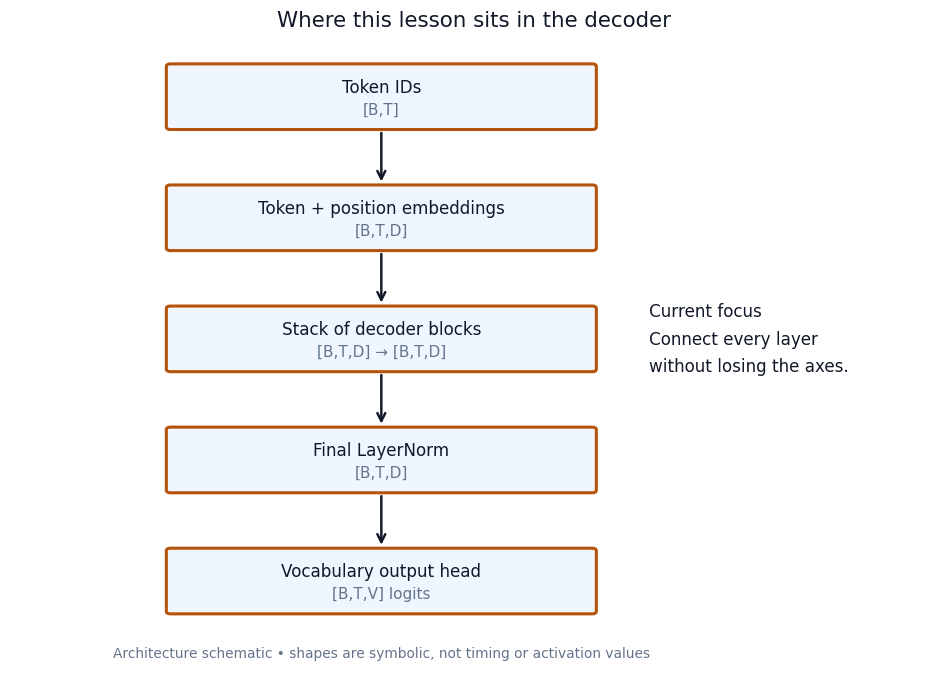

This is an architecture schematic, not a measurement of activation values or
running time. Its highlighted stack is expanded throughout the following
sections. The figures reused here have runnable drawing code in the companion
notebooks; see the [visual reproduction guide](../../docs/NOTEBOOK_VISUALS.md).

Keep the axes distinct:

| Symbol | Meaning | Baseline value |
|---|---|---:|
| $B$ | Number of sequences in a batch | 2 |
| $T$ | Input positions per sequence | 6 |
| $V$ | Vocabulary size | 16 |
| $D$ | Residual-stream feature width | 16 |
| $H$ | Attention heads | 4 |
| $d$ | Features per head | 4 |
| $F$ | MLP intermediate feature width | 32 |
| $L$ | Number of decoder blocks | 2 |

The small vocabulary is a teaching choice: IDs range from 0 to 15. These
integers have no supplied word mapping and are not intended to tokenize real
language. The vocabulary size is neither the sentence length nor the feature
width, even though two of the numbers happen to equal 16.

The main tensor path is $[B,T]\to[B,T,D]\to[B,T,V]$. Inside a block, feature
width can temporarily change, but each branch must return $[B,T,D]$ so its
update can be added to the stream.

## 5.2 Give each position a starting representation

Let $E\in\mathbb R^{V\times D}$ be the token embedding table and
$P\in\mathbb R^{M\times D}$ the learned position table, where $M$ is the
maximum supported length. For token ID $i_{b,t}$ at position $t$:

$$
X^{(0)}_{b,t}=E[i_{b,t}]+P[t].
$$

The ID selects a row; its numerical magnitude is not a language feature.
Repeated occurrences of the same ID retrieve the same row of $E$. Adding a
different position row can give those occurrences different initial states.
Both vectors have $D$ features, and their addition still has $D$ features.
There is no concatenation here.

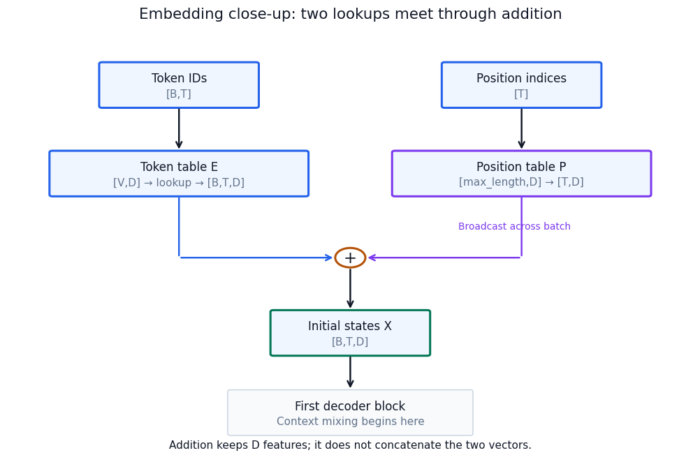

The position table is shared across sequences: position 3 uses the same $P[3]$
in each sequence. Token identity and position are distinct inputs to the initial
representation. Subsequent attention makes that representation contextual.

Removing position embeddings does not turn a causal decoder into a model with
no order-related structure at all: different positions still have different
allowed prefixes. It does remove this explicit learned position signal. The
notebook separates that intervention from removing the causal mask.

### How lookup rows learn

An embedding table is a trainable parameter matrix. Backward routes each
occurrence's gradient into the selected row, summing contributions when the
same ID occurs multiple times.

For an intentionally simple objective that sums all looked-up coordinates, each
occurrence contributes a derivative of 1 per selected coordinate. Why 1? Raising
one selected coordinate by $\delta$ raises the sum by $\delta$: the ratio of
change in output to change in that coordinate is $\delta/\delta=1$. Two uses
of the same coordinate contribute 2. In actual next-token training, these
contributions are gradients from the entire downstream network, not constants.

This selected-row statement concerns the lookup path. If the vocabulary output
head shares $E$, another gradient path can reach rows absent from the input.
We return to that connection in Section 5.7.

**Companion:** [Notebook 1 — Embeddings and positions](../../notebooks/day-05/01_embeddings_and_positions.ipynb).
Inspect repeated-ID gradients and change the position signal while leaving
causal visibility intact.

## 5.3 Several contextual views, learned together

For one receiving position, one attention head creates one distribution over
allowed source positions. Its value coordinates all use that distribution to
form a weighted mixture. A wider value vector can carry more features, but it
does not create another independently parameterized source-weight pattern.

Multiple heads make several patterns available. In the prefix “The tired animal
crossed the river because it”, a useful representation at “it” could need
information about the entity and its earlier description. Separate heads could
retrieve those aspects differently. This is a motivation, not a claim that
particular heads reliably own linguistic jobs.

For head $r$, suppressing the batch dimension:

$$
Q_r=XW_{Q,r},\quad K_r=XW_{K,r},\quad V_r=XW_{V,r},
$$

$$
A_r=\mathrm{softmax}_{\text{sources}}
\left(\frac{Q_rK_r^\top}{\sqrt d}+C\right),\qquad O_r=A_rV_r.
$$

Here $C_{t,s}=0$ when $s\le t$ and $-\infty$ otherwise. The symbol $V_r$
means value activations, not the vocabulary size $V$. Softmax acts on the
scores; values bypass softmax and supply the content being mixed.

Each $W_{Q,r},W_{K,r},W_{V,r}$ has mathematical shape $[D,d]$. Implementations
can combine all heads into one larger projection and then reshape its output.
That is a computational organization, not a requirement for separate Python
modules per head.

| Attention boundary | Shape |
|---|---|
| Incoming states | $[B,T,D]$ |
| Projected and split Q, K, V | $[B,H,T,d]$ |
| Source weights | $[B,H,T,T]$ |
| Value mixtures | $[B,H,T,d]$ |
| Concatenated heads | $[B,T,Hd]$ |
| Output after $W_O\in\mathbb R^{Hd\times D}$ | $[B,T,D]$ |

Our baseline chooses $Hd=D$. Heads do not divide the sentence into different
token groups: every head can attend to the legal prefix at every position.
Concatenation joins feature slices, not time positions.

### Why does the same loss not make every head identical?

Heads are separately parameterized but **jointly learned**. They do not each
receive an independent instruction to predict the next token. The loss judges
the final prediction made from their combined contribution.

At one position, partition $W_O$ into row blocks $W_{O,r}$. Writing head outputs
as row vectors $o_r$, their combined update is:

$$
u=\sum_r o_rW_{O,r}.
$$

If $g=\partial\mathcal L/\partial u$ is the arriving row-vector gradient:

$$
\frac{\partial\mathcal L}{\partial o_r}=gW_{O,r}^\top.
$$

The same arriving gradient passes through different output-weight blocks and
then through different attention computations. Thus the same objective can
produce different Q/K/V parameter gradients. Complementary features can improve
the combined prediction; duplicating a feature is not always equally useful.

Random initialization helps break symmetry, but it does not guarantee diverse
roles. If corresponding head parameters and output connections are exactly
identical and the update rule preserves their symmetry, they can remain
duplicates. Conversely, initially different heads can become redundant. The
ordinary objective contains no guarantee of unique specialization.

More heads are therefore not automatically better. At fixed $D=Hd$, increasing
$H$ narrows each head. It changes the balance between the number of mixtures and
the feature capacity of each mixture.

**Companion:** [Notebook 2 — Multi-head attention](../../notebooks/day-05/02_multi_head_attention.ipynb).
Compare looped and vectorized heads under identical weights. Ablate a head and
inspect the resulting update; a changed output alone does not prove a specific
semantic role or a quality improvement.

## 5.4 Carry a state forward and revise it

Without a residual connection, a transformation passes on $Y=F(X)$. Everything
needed downstream must survive through $F$. A residual sublayer instead uses:

$$
Y=X+F(X).
$$

For example, $X=[2,3]$ and $F(X)=[1,-1]$ produce $Y=[3,2]$. The skip path
carries $X$ unchanged into the addition, but the next layer receives the sum.
It does not receive an untouched backup of $X$.

The **residual stream** is this evolving state across many sublayers. At a later
layer, $X$ already contains earlier updates; it is not the original embedding
being reinserted. A useful analogy is revising the current draft rather than
rewriting a document from a blank page. Unlike a tracked document edit, however,
an added vector does not preserve a separately recoverable revision history.

### Why does the bypass help?

First, identity behavior is easy. When $F(X)=0$, the output is exactly $X$.
The learned branch can make a small correction without reconstructing the
incoming representation in its entirety.

Second, backward has a direct route. For a flattened column-vector state
$y=x+f(x)$, write $g=\partial\mathcal L/\partial y$ and let $J_f$ be the
Jacobian of the branch. Then:

$$
\frac{\partial\mathcal L}{\partial x}=g+J_f^\top g.
$$

The first contribution bypasses the learned transformation; the second passes
through it. Earlier layers need not receive their entire learning signal solely
through a long chain of branch transformations. This structural path can make
deep optimization easier, but it does not guarantee well-behaved gradients.

The counterexample matters: if $f(x)=-x$, both the output and its input
derivative are zero. The two paths cancel. Residual connections make identity
available; they do not enforce information preservation or nonzero gradients.

**Companion:** [Notebook 3 — The residual stream](../../notebooks/day-05/03_residual_stream.ipynb).
Inspect $X+XW$, isolate the two gradient contributions, and compare the zero-
branch control with the cancellation case.

## 5.5 Normalize the branch's reading of the stream

As states are transformed and updated, their numerical scale can change.
LayerNorm prepares a consistently scaled view of a token's features. Think of
adjusting a baseline and contrast: we want the next operation to read relative
feature differences without being as sensitive to a common offset or scale.

Take one token's four features, $[10,20,30,40]$. Their mean is 25. Subtracting
it gives $[-15,-5,5,15]$; dividing by the standard deviation gives approximately
$[-1.34,-0.45,0.45,1.34]$. The values now describe how far each feature lies
above or below the token's mean, relative to its feature spread.

For a token vector $x\in\mathbb R^D$:

$$
\mu=\frac1D\sum_i x_i,\qquad
\sigma^2=\frac1D\sum_i(x_i-\mu)^2,
$$

$$
\hat x_i=\frac{x_i-\mu}{\sqrt{\sigma^2+\epsilon}},\qquad
\mathrm{LN}(x)_i=\gamma_i\hat x_i+\beta_i.
$$

Use population variance, dividing by $D$, not the sample-variance correction
$D-1$. Epsilon prevents division by zero and bounds the denominator away from
zero. Before the learned affine transform, the variance is
$\sigma^2/(\sigma^2+\epsilon)$: approximately one when the variance is large
relative to epsilon, not identically one. A constant vector becomes zero before
the affine transform and $\beta$ afterward.

The vectors $[10,20,30,40]$ and $[100,200,300,400]$ have the same relative
pattern, so their normalized versions are approximately equal. Centering
removes the common offset exactly; epsilon makes positive-scale invariance
approximate. The normalization does discard some input information. Learned
$\gamma,\beta\in\mathbb R^D$ adjust each feature's scale and offset, but do
not recover the original per-token mean and magnitude. Nor must the final
output after those adjustments have zero mean or unit variance.

These learned parameters are shared across positions. The **statistics** are
computed separately at each position. For $[B,T,D]$, normalize over $D$—not
over tokens or across the batch. Using full-sequence time-axis statistics can
let a future token affect an earlier state, even if attention is correctly
masked. Causality must hold throughout the model, not only inside softmax.

### Placement changes the identity path

A pre-norm sublayer is:

$$
Y=X+F(\mathrm{LN}(X)).
$$

Normalize what the branch reads; add its update to the unnormalized stream.
The bypass has not been replaced by normalized values. With a zero branch,
$Y=X$.

A post-norm sublayer is:

$$
Y=\mathrm{LN}(X+F(X)).
$$

Here normalization acts on the combined result. A zero branch gives
$Y=\mathrm{LN}(X)$, generally not $X$. Backward also passes through that
normalization: the sublayer no longer has the same untouched identity route.
This establishes a structural difference, not universal superiority for every
possible training recipe. Our baseline chooses pre-norm and still applies a
final normalization after the stack.

**Companion:** [Notebook 4 — LayerNorm and placement](../../notebooks/day-05/04_layernorm_and_placement.ipynb).
Implement the statistics explicitly, inspect a wrong-axis intervention, and
compare zero-branch behavior under pre-norm and post-norm.

## 5.6 Compute features from the context already gathered

Attention mixes information between positions. A position-wise feed-forward
network, or MLP, transforms features within each position. These jobs are
complementary: retrieve relevant information, then compute useful features from
the state now available.

For “The cat sleeps”, the same MLP processes the states at “The”, “cat”, and
“sleeps” separately. It does not directly consult another position. Yet its
input at “sleeps” can already contain information gathered from earlier tokens
by attention. Position-wise does not mean context-free.

The baseline MLP expands, applies a nonlinear function, and projects back:

$$
\mathrm{MLP}(X)=\mathrm{GELU}(XW_{\rm up}+b_{\rm up})W_{\rm down}
+b_{\rm down}.
$$

Using row-vector mathematics, $W_{\rm up}:[D,F]$ and $W_{\rm down}:[F,D]$.
The state shape follows $[B,T,16]\to[B,T,32]\to[B,T,16]$. Expansion creates
learned combinations of features, not copies of the input and not new token
positions. GELU acts elementwise; the final projection recombines the resulting
features into a same-width update.

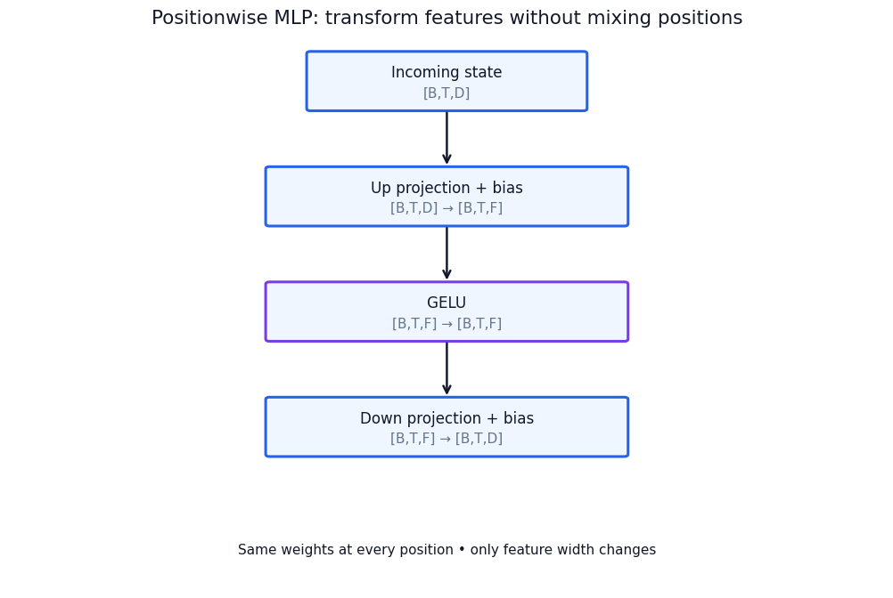

Why introduce nonlinearity? Without it:

$$
(XW_{\rm up}+b_{\rm up})W_{\rm down}+b_{\rm down}
=X(W_{\rm up}W_{\rm down})
+(b_{\rm up}W_{\rm down}+b_{\rm down}).
$$

This is just one affine transformation. Adding an intermediate width alone
does not escape that family. A nonlinear activation enables input-dependent
responses that cannot generally collapse into one affine map. Informally, a
feature combination can matter differently depending on what else is present.
That does not mean each intermediate neuron has a readable semantic rule.

PyTorch stores `Linear.weight` as `[output_features, input_features]` and
evaluates `X @ weight.T + bias`. Consequently, the equivalent stored weight
in the notebook is `down.weight @ up.weight`. This is the same derivation in a
different storage convention, not reversed mathematical logic.

**Companion:** [Notebook 5 — Position-wise MLP](../../notebooks/day-05/05_positionwise_mlp.ipynb).
Remove the activation and construct the exact affine equivalent. Perturb one
position at the MLP input and check that other positions' MLP outputs stay
unchanged. A whole decoder need not have that invariance because it has attention.

## 5.7 Assemble the block and the vocabulary interface

We can now write one complete pre-norm block:

$$
U=X+\mathrm{MHA}(\mathrm{LN}_1(X)),\qquad
Y=U+\mathrm{MLP}(\mathrm{LN}_2(U)).
$$

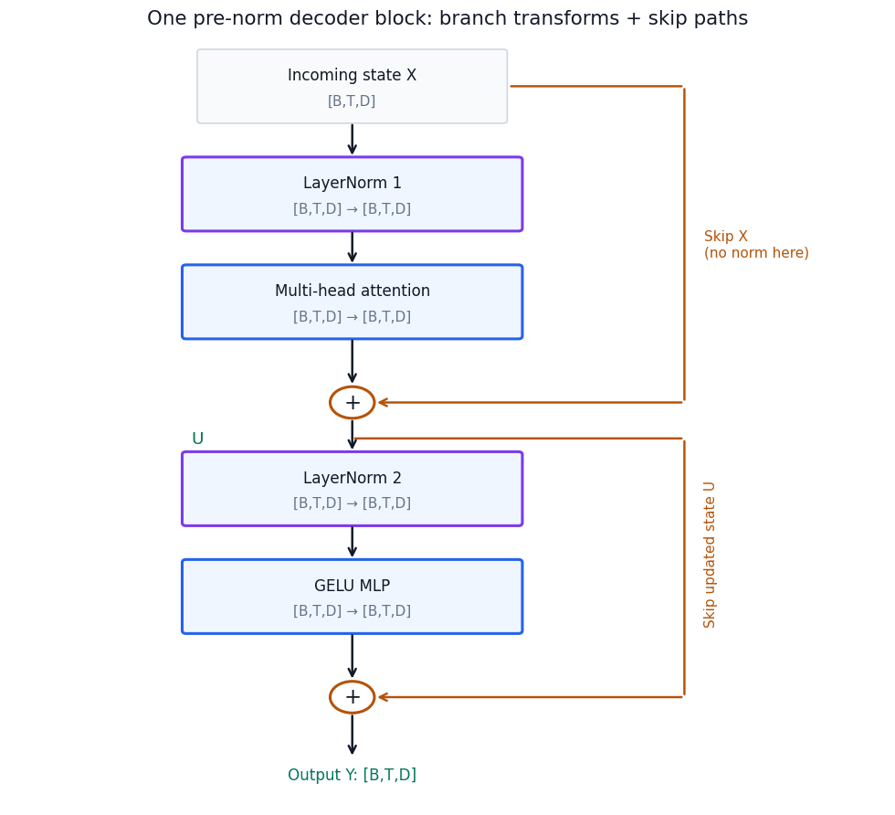

The two normalization modules have separate learned parameters. The MLP reads
the state after attention's update. Both additions preserve $[B,T,D]$.
Stacking blocks repeats these roles with separate parameters in each baseline
block. Parameter sharing across depth is a later, explicitly different design.

After the stack, let $h_{b,t}$ be one final normalized state. A vocabulary head
produces:

$$
z_{b,t}=h_{b,t}W_{\rm vocab},\qquad W_{\rm vocab}\in\mathbb R^{D\times V}.
$$

This is one logit for each vocabulary entry, predicting the next token at that
position. Logits are not probabilities; softmax over $V$ turns them into a
distribution. During generation we usually select from the final position's
distribution, append the selected ID, and repeat with fixed parameters.

Do not confuse two output projections. Attention's $W_O$ merges head features
into a $D$-wide stream update. The vocabulary head maps the final $D$-wide state
to $V$ candidate scores. Neither the token ID's value nor the feature index
in a hidden state is itself a probability.

Our default baseline ties input and output weights, so
$W_{\rm vocab}=E^\top$. The same stored parameter serves as a lookup table and
a classifier matrix. Copying equal numbers into a separate parameter is not
tying: separate copies can subsequently receive different gradients and updates.
With true tying, backward adds contributions from both uses into $E$.

### Initialization is part of the baseline

`TinyDecoder` initializes embedding and linear weights from a normal
distribution with mean zero and standard deviation 0.02, zeros linear biases,
and uses LayerNorm's initial scale 1 and offset 0. It ties the vocabulary head
after initialization. This specifies the teaching model, not an optimal rule
for every depth and width. Randomness helps break symmetry; setting all
trainable weights to zero is not a substitute for a controlled initialization.

Before training, verify finite activations and gradients, vocabulary output
shape, true parameter identity under tying, and causal invariance. Changing a
future token must not change an earlier output in a deterministic full forward
pass. Cached prefix replay should agree with the corresponding full pass under
fixed weights and correct position offsets. These are implementation checks,
not performance benchmarks.

The reusable [decoder implementation](../../src/dongxi_llms/decoder_lab.py)
contains these operations without fused attention, dropout, or padding. Its
clarity and tiny CPU fixtures are deliberate; it is not a serving system.

**Companion:** [Notebook 6 — Assemble the decoder](../../notebooks/day-05/06_assemble_decoder.ipynb).
Follow the complete tensor path, compare tying with copying, and test a copy
oracle against correctly shifted labels. Almost zero loss on an incorrect
current-token objective would not validate next-token learning.

## 5.8 Many token losses, one shared parameter update

Does the model learn token by token? Supervision is position-wise, but an
optimizer step normally combines errors from many positions and sequences.

The declared teaching batch begins with two seven-ID sequences:

```text
sequence 1:  1  2  3  4  5  6  7
sequence 2:  8  9 10 11 12 13 14
```

Inputs take the first six IDs, and labels take the last six:

```text
inputs 1:   1  2  3  4  5  6      labels 1:   2  3  4  5  6  7
inputs 2:   8  9 10 11 12 13      labels 2:   9 10 11 12 13 14
```

Every position produces 16 logits. Thus logits have shape $[2,6,16]$, labels
have shape $[2,6]$, and there are 12 supervised positions. For this unpadded
batch, the mean loss is:

$$
\mathcal L=\frac1{BT}\sum_{b,t}
-\log\mathrm{softmax}(z_{b,t})_{y_{b,t}}.
$$

Each prediction can read only its legal prefix, despite processing positions
in parallel within a layer. The observed next token is available to the loss,
not to the earlier position's forward representation. Labels are shifted once;
the loss helper accepts that alignment and does not shift again.

Differentiation distributes over the sum. Each shared parameter receives the
aggregate of its per-position contributions, scaled by the averaging factor.
This is not a sequence of parameter updates after individual tokens: all the
predictions in the forward pass use the same parameter snapshot. Microbatch
gradient accumulation can combine still more contributions before an optimizer
step; it is not needed in this tiny experiment.

### Backward measures sensitivity; the optimizer changes parameters

`backward()` calculates and accumulates gradients. `step()` applies an update.
For plain SGD the sketch is $\theta_{\rm new}=\theta-\eta\nabla_\theta\mathcal L$.
The learning rate $\eta$ scales the step, not the quality of the training data.

An illustrative scalar objective makes the distinction tangible. Let
$\ell(e)=(e-1)^2$ at $e=0.2$. Its derivative is $-1.6$. SGD with $\eta=0.1$
moves to $0.36$, toward the minimum. But $\eta=1.5$ moves to $2.6$, increasing
the loss from $0.64$ to $2.56$. A locally helpful direction does not justify an
arbitrarily large step. These numbers describe a quadratic, not a recommended
LLM learning rate or the geometry of the actual token loss.

The notebook uses AdamW, which tracks gradient history and squared-gradient
history for adaptive updates; it is not literally the SGD formula. Its weight
decay is explicitly zero in this experiment. Chapter 6 will develop optimizer
state, regularization, schedules, and clipping in depth.

The essential training loop reuses the course implementation:

```python
import torch
from dongxi_llms.decoder_lab import TinyDecoder, teaching_batch, next_token_loss

torch.set_num_threads(1)
torch.manual_seed(505)
model = TinyDecoder()              # CPU float32 under the standard default dtype
ids, labels = teaching_batch()     # [2,6], already shifted once
optimizer = torch.optim.AdamW(model.parameters(), lr=0.02, weight_decay=0.0)

for _ in range(160):
    optimizer.zero_grad(set_to_none=True)
    logits = model(ids)            # [2,6,16]
    loss = next_token_loss(logits, labels)
    loss.backward()
    optimizer.step()
```

Run it after the notebook's import setup. This excerpt exposes the mechanism;
the canonical `fit_one_batch` also checks finite losses and gradients and
records initial and final measurements. Passing logits directly to the
cross-entropy helper avoids a separate, less stable probability-then-log step.

### What the fixed experiment establishes

The [recorded reference experiment](../../experiments/reports/2026-09-06-decoder-notebooks.md)
uses seed 505, the declared batch, and 160 AdamW steps at learning rate 0.02.
It reports mean cross-entropy decreasing from 2.774792432785034 to
0.0007856183219701052 and training-token accuracy reaching 1.0. The later
[visual verification](../../experiments/reports/2026-09-07-decoder-architecture-visuals.md)
reproduced those values. These are stored measurements, not a new run or a
claim about the learner's notebook output.

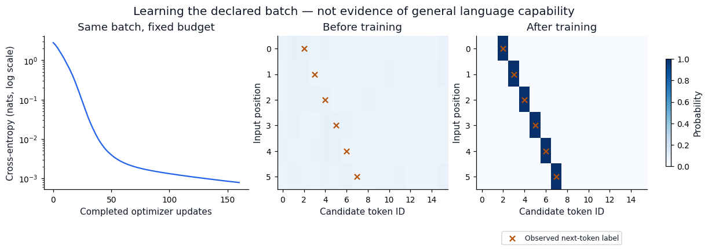

This saved plot belongs to the fixed reference run; rerunning a notebook cell
with different settings does not rewrite it. The training-loss history contains
pre-update measurements, with the separately measured post-final-update loss
appended by the plotting function.

Fitting this deliberately consistent batch shows that the assembled computation
and optimizer can learn its labels. The frozen control provides a useful
contrast: predictions do not improve merely from repeatedly evaluating unchanged
weights. But fitting is not generalization. These sequences have distinct input
IDs and simple successor associations, so memorization does not require rich
contextual reasoning or the useful participation of every attention head.
Even a much simpler model could learn such associations.

The notebook also probes reversed contexts, but defines no gold labels for that
probe. Its outputs are observations, not a scored generalization result. A real
capability claim needs held-out tasks, appropriate controls, and a declared
evaluation contract.

**Companion:** [Notebook 7 — One-batch learning](../../notebooks/day-05/07_one_batch_learning.ipynb).
Inspect the aligned labels, frozen control, parameter changes, and evidence
boundary. Learning a batch is the beginning of a training-system check, not the
end of model evaluation.

## 5.9 Exercises: defend the mechanism

Use explanations and small controlled changes rather than memorizing layer
names. [Worked answers](../solutions/05-decoder-notebook-solutions.md#day-5-foundation--worked-conceptual-solutions)
are provided for every question.

1. The vocabulary has 16 entries and the input has six positions. Why does the
   output have 16 scores per position? Which number changes if you add a token
   position without changing the vocabulary?
2. The same token ID appears twice. Which vectors must match at lookup, and
   which states can differ after positions and attention?
3. All heads minimize the same loss. Why need their gradients and attention
   patterns not match? What fully symmetric setup could keep two heads equal?
4. Does adding more heads at fixed width give every head more information
   capacity? Distinguish source mixtures from features per head.
5. A skip path carries $X$ unchanged. Why does that not make $X$ recoverable from
   the output in general? Give an identity case and a cancellation case.
6. How can normalization over time leak future information even when attention
   has a correct mask? Contrast this with per-token feature normalization.
7. Zero the branch output in pre-norm and post-norm sublayers. Explain their
   different outputs and backward paths.
8. Why is a position-wise MLP not necessarily context-free? Why can two affine
   projections without an activation collapse into one?
9. Distinguish attention's output projection, the vocabulary head, and tying the
   vocabulary head to the embedding table. Why is a copied tensor insufficient?
10. Explain one batch update without saying that parameters change after every
    token. What changes when the same model freely generates text instead?
11. Does the negative gradient guarantee lower loss for every learning rate?
    Use the scalar example to explain local sensitivity versus a finite update.
12. A tiny decoder achieves perfect accuracy on the declared batch. What has
    been established, and what additional evidence would contextual
    generalization or head-specialization claims require?

## 5.10 From a working baseline to modern design choices

The baseline is now a connected argument: embeddings create states; attention
retrieves context through several learned views; MLPs transform available
features; normalization prepares branch inputs; residual paths carry the
evolving state; and the vocabulary head connects that state to next-token loss.
Backpropagation trains the designated parameters jointly through this chain.

The next part changes specific mechanisms while preserving these roles.
RMSNorm changes normalization, SwiGLU changes the MLP, RoPE changes position
handling inside attention, and GQA changes key/value sharing. None should be
introduced as an unexplained replacement acronym. Each needs a controlled
comparison and explicit parameter, compute, and memory accounting.

The [modern companion notebooks](../labs/05-building-a-modern-decoder.md#change-one-mechanism-at-a-time)
support the continuation below. The baseline gives us something precise to
change; the architecture defense will ask whether those changes are justified.

## 5.11 Modernize mechanisms, not just names

The Day 6 question is not “Which acronyms should a decoder contain?” It is:
**Which operation should change, for what reason, and at what cost?** The
next-token contract and residual-stream interface remain the same while we
change how the branches read, transform, and share information.

| Role | Day 5 baseline | Day 6 teaching variant |
|---|---|---|
| Prepare branch inputs | LayerNorm | RMSNorm |
| Transform position-wise features | Two-projection GELU MLP | Three-projection SwiGLU |
| Represent position | Add learned position vectors | Rotate projected Q/K coordinates |
| Form source representations | One K/V head per query head | Share K/V within query-head groups |
| Regulate Q/K magnitude | Scaled dot product only | Optional RMS normalization before RoPE |
| Produce next-token scores | Final norm and vocabulary head | Same roles, with final RMSNorm |

Our three [Day 6 notebooks](../../notebooks/day-06/README.md) move from local
replacements to position/caching consistency and finally to a composed model.
Their figures and reference solutions are part of the reading route. At the
end, you should be able to distinguish a mathematical property, a tested
implementation invariant, an arithmetic estimate, and a measured quality claim.

## 5.12 RMSNorm: rescale without recentering

LayerNorm subtracts a token's feature mean before rescaling. Must normalization
always remove that common component? RMSNorm instead divides by the
root-mean-square magnitude, then applies a learned feature scale. This is the
central change introduced by [Zhang and Sennrich](https://arxiv.org/abs/1910.07467).

Our implementation uses, for one token vector $x\in\mathbb R^D$:

$$
r(x)=\sqrt{\frac1D\sum_i x_i^2+\epsilon},\qquad
\mathrm{RMSNorm}(x)_i=\gamma_i\frac{x_i}{r(x)}.
$$

There is no mean subtraction and no learned additive bias in this variant.
The scale $\gamma\in\mathbb R^D$ is shared across token positions; the RMS
statistic is computed separately for each token. The output shape stays
$[B,T,D]$, and pre-norm placement leaves the skip path unchanged.

To see the distinction, set learned scales to one and LayerNorm biases to zero.
Ignoring epsilon only for this arithmetic illustration:

| Input | LayerNorm | RMSNorm |
|---|---|---|
| $[3,4]$ | $[-1,1]$ | approximately $[0.849,1.131]$ |
| $[13,14]$ | $[-1,1]$ | approximately $[0.962,1.036]$ |
| $[5,5]$ | $[0,0]$ with positive epsilon | approximately $[1,1]$ |

RMSNorm keeps information about the common component relative to the vector's
overall scale. It does not preserve the original magnitude or guarantee that
no information is lost. Adding the same number to all coordinates can change
its output, whereas LayerNorm removes that common shift.

Before learned scaling, the mean square of the RMS-normalized output is
$\mathrm{mean}(x^2)/(\mathrm{mean}(x^2)+\epsilon)$, approximately
one when epsilon is negligible. Its mean need not be zero. For positive $a$:

$$
\frac{ax}{\sqrt{a^2\mathrm{mean}(x^2)+\epsilon}}
=\frac{x}{\sqrt{\mathrm{mean}(x^2)+\epsilon/a^2}}.
$$

This derives approximate positive-scale invariance and shows exactly where
epsilon matters. It is not a guarantee that subsequent projections or learned
scales cannot produce large values.

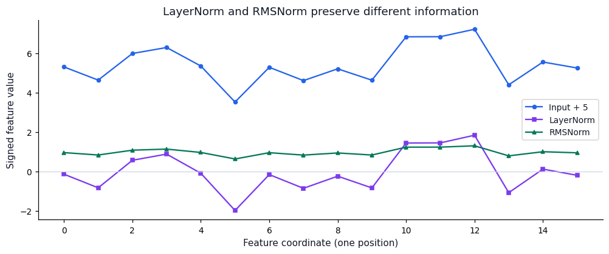

This saved notebook plot compares actual fixture vectors before learned affine
changes. The implementation avoids the mean-subtraction operation, but fewer
formula steps do not by themselves establish a speedup on a particular device.
We verify forward values and input/scale gradients against the library reference;
we do not claim a local latency or trained-quality comparison.

**Companion:** [RMSNorm and SwiGLU, first experiment](../../notebooks/day-06/01_rmsnorm_and_swiglu.ipynb).
Change a common feature offset, then inspect what each normalization preserves.

## 5.13 SwiGLU: learn how features modulate other features

The baseline MLP has one expanded feature branch. A gated MLP gives the same
input two learned views and multiplies their results coordinate by coordinate.
SwiGLU belongs to the GLU family explored by
[Shazeer](https://arxiv.org/abs/2002.05202). We use the bias-free form already
implemented in the lab:

$$
c=XW_{\rm up},\qquad a=XW_{\rm gate},\qquad
g=\mathrm{SiLU}(a)=a\odot\sigma(a),
$$

$$
\mathrm{SwiGLU}(X)=(g\odot c)W_{\rm down}.
$$

Both $c$ and $g$ have shape $[B,T,F]$; the down projection returns $[B,T,D]$.
Think of one branch proposing feature values and the other modulating them
based on the same contextual state. These labels describe computational roles,
not a guarantee that individual coordinates are interpretable concepts.

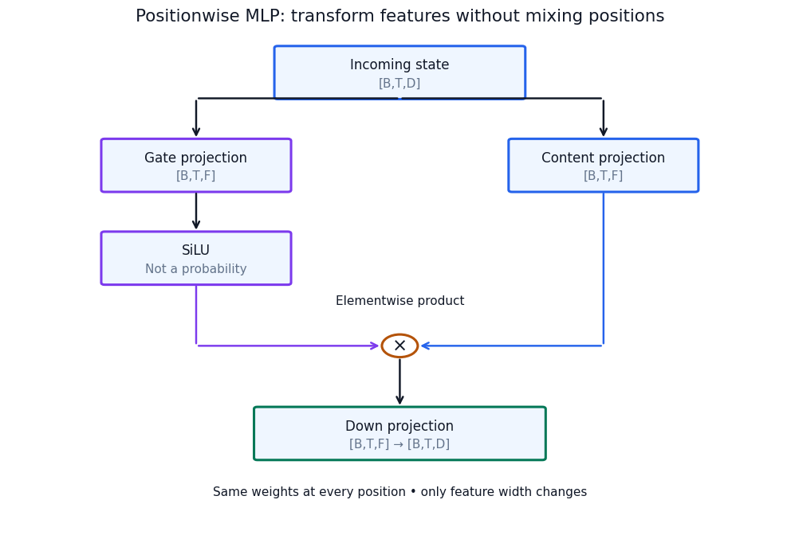

The gate is not an attention probability. Although sigmoid alone lies between
zero and one, SiLU multiplies it by its input. At inputs $-1,0,2$, SiLU is
approximately $-0.269,0,1.762$. Gate values can be negative or exceed one, and
neither the gate vector nor the product must sum to one. This is feature
modulation, not selection of another token position.

The product also gives two gradient routes. If $u=g\odot c$ and its arriving
gradient is $\delta$, then:

$$
\frac{\partial\mathcal L}{\partial c}=\delta\odot g,\qquad
\frac{\partial\mathcal L}{\partial a}
=\delta\odot c\odot\mathrm{SiLU}'(a).
$$

One branch affects the other branch's learning signal. A zero gate makes this
bias-free MLP's output zero, but that alone does not imply zero gate-parameter
gradients: $\mathrm{SiLU}'(0)=1/2$, so the gate can still learn when the
content and downstream gradient are nonzero. Forward suppression and permanent
inability to learn are different claims.

### Match budgets, not just hidden widths

A bias-free GELU MLP stores $2DF$ matrix parameters; SwiGLU stores $3DF$.
Matching their matrix counts approximately gives
$F_{\rm gated}\approx(2/3)F_{\rm GELU}$. Width must still be an integer and
may be rounded for an implementation's preferred dimensions.

The notebook's GELU MLP includes biases. At $D=16,F=32$, its actual count is
$2(16)(32)+32+16=1072$. A same-width SwiGLU has 1536 parameters; using gated
width 22 gives 1056. That is a close budget comparison, not exact equality.
Replacing normalization alone, MLP alone, and then both distinguishes the
functional interventions. Different untrained outputs do not identify which
replacement will achieve better held-out loss after training.

**Companion:** [RMSNorm and SwiGLU, remaining experiments](../../notebooks/day-06/01_rmsnorm_and_swiglu.ipynb).
Inspect both branches, their product, the zero-gate control, and parameter counts.

## 5.14 RoPE: let position change the query–key comparison

The baseline adds a position vector to the token embedding. RoPE takes another
route: it rotates coordinates of projected queries and keys according to their
positions. The [RoFormer paper](https://arxiv.org/abs/2104.09864) introduces
this connection between absolute-position rotations and relative-position
dependence in attention.

For one two-coordinate column vector, define:

$$
R(\theta)=
\begin{bmatrix}\cos\theta&-\sin\theta\\
\sin\theta&\cos\theta\end{bmatrix},\qquad
R(\theta)\begin{bmatrix}a\\b\end{bmatrix}
=\begin{bmatrix}a\cos\theta-b\sin\theta\\a\sin\theta+b\cos\theta\end{bmatrix}.
$$

As a geometric example, rotating $[1,0]$ by 90 degrees gives $[0,1]$. Its
length stays one, but its compatibility with another fixed vector changes.
The notebook uses angles in radians rather than forcing a 90-degree step.

Our implementation groups adjacent coordinates into pairs. Pair $j$ at
position $m$ rotates by $m\omega_j$, with
$\omega_j=10000^{-2j/d}$ for $j=0,\ldots,d/2-1$. Head width must therefore
be even. Different pairs rotate at different rates; position zero is the
identity. These frequencies are deterministic configuration, not a learned
position table. The Q/K projections remain learned.

### Why does relative distance appear?

Use fixed unrotated vectors $q,k$ and write $R_m$ for the block-diagonal rotation
at position $m$. Orthogonality and angle addition give:

$$
(R_mq)^\top(R_nk)
=q^\top R_m^\top R_nk
=q^\top R_{n-m}k.
$$

The score can therefore depend on the difference between positions. Moving
both fixed vectors forward by the same position offset preserves their rotated
dot product. This is an identity for those vectors, not proof that every model
output depends only on distance: their unrotated states also depend on tokens,
prefix boundaries, and previous layers.

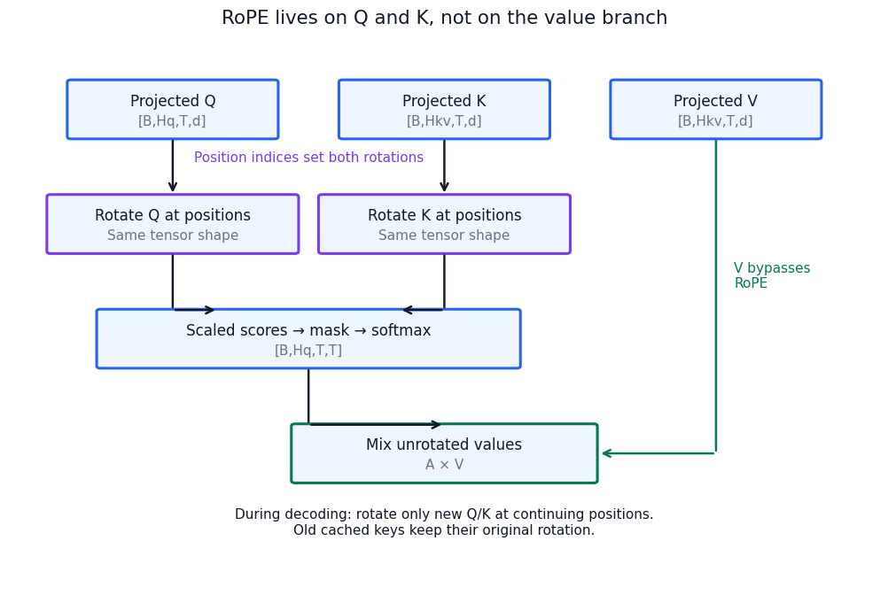

RoPE does not decide which positions are visible. The causal mask still does
that. Our modern path no longer adds learned absolute positions at the input;
instead, each attention layer rotates its Q/K coordinates. Values are unrotated
by this operation, though their incoming states can already contain positional
effects from earlier layers. Shape and coordinate-pair norm are preserved.

A formula that can evaluate rotations at a longer index is not proof of good
long-context behavior. Frequency choices, training lengths, numerical handling,
and the trained model all matter. Nor does using RoPE make this adjacent-pair
toy implementation compatible with every checkpoint's coordinate layout.

**Companion:** [Rotary positions](../../notebooks/day-06/02_rotary_positions.ipynb).
Check pair norms, derivatives, and the relative-position identity before using a cache.

## 5.15 Correct caching requires consistent positions

For a fixed causal prefix under unchanged weights, past per-layer keys and
values need not be recomputed when we append tokens. RoPE adds a precise
condition: cached keys must retain the rotations for their original positions.

Suppose prefill processes positions 0 and 1. The next query and key use position
2. An old key from position 1 is already rotated for position 1; do not rotate
it again. Restarting the new query at zero creates the wrong relative angle,
even if every attention edge is causally legal.

This separates two correctness checks:

- **Visibility:** no query reads a future key.
- **Position consistency:** each query/key comparison uses the intended indices.

The first can pass while the second fails. A cache is not just a bag of vectors;
its entries have layer, request/prefix, head, position, and parameter-version
meaning. Reusing entries after relevant weights or the prefix change generally
invalidates them. Prefix sharing across requests requires equivalent prefix
computation and explicit serving support, not arbitrary sentence reuse.

Prefill computes many positions together and builds the cache. Ordinary decode
then projects the new token's states and reads cached source states. It avoids
redoing old projections and other prefix work, but the new query still attends
over its retained sources. Caching is an optional inference optimization, not
a prerequisite for the transformer definition or teacher-forced training.

**Companion:** [Cached replay and broken offsets](../../notebooks/day-06/02_rotary_positions.ipynb).
The reference compares full-sequence logits with prefill plus incremental
decoding. It deliberately restarts rotation offsets while keeping visibility
correct, making the resulting mismatch attributable to positional consistency.

## 5.16 GQA: keep several questions, share source representations

Ordinary multi-head attention has matching query and K/V head counts.
Grouped-query attention decouples them. Let $H_q$ be the query-head count and
$H_{kv}$ the K/V-head count, with $H_q$ divisible by $H_{kv}$. Multiple queries
can ask different questions about the same projected keys and values. This is
the sharing axis studied by [Ainslie et al.](https://arxiv.org/abs/2305.13245).

For four query heads and two K/V heads, queries 0–1 use K/V head 0, and queries
2–3 use K/V head 1 in our contiguous-group implementation. Their queries differ,
so sharing keys does not force identical attention weights. Their value mixtures
can differ even when they use the same source value vectors.

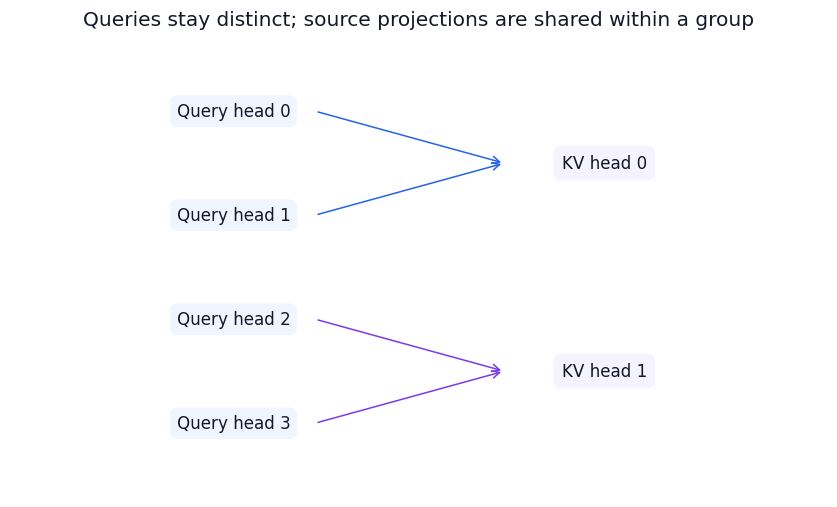

With $r=H_q/H_{kv}$ and group index $g(h)=\lfloor h/r\rfloor$:

$$
A_h=\mathrm{softmax}
\left(\frac{Q_hK_{g(h)}^\top}{\sqrt d}+C\right),\qquad
O_h=A_hV_{g(h)}.
$$

Queries have shape $[B,H_q,T,d]$; compact K/V have $[B,H_{kv},S,d]$; attention
weights still have $[B,H_q,T,S]$. Full-sequence execution uses $S=T$, whereas
decoding includes cached source positions. $H_{kv}=H_q$ recovers ordinary MHA;
$H_{kv}=1$ is multi-query attention.

K/V sharing constrains the learned source representations and sums gradient
contributions from all query heads using each shared source head. That can
reduce storage and projection work, but the model has less independent K/V
parameterization. The quality effect needs training and evaluation, not just
a shape check.

The lab explicitly repeats compact K/V to compare its arithmetic with a
reference attention operation. Repetition is useful for explanation and gradient
verification, but introduces temporary tensors. An optimized grouped-attention
kernel need not implement the same physical expansion. Do not confuse our
mathematical equivalence test with a serving-speed benchmark.

## 5.17 Q/K normalization is not one universal formula

Recall that multiplying both Q and K by 10 multiplies their raw dot products by
100. The $1/\sqrt d$ factor does not undo input-dependent magnitude growth.
Normalizing projected Q/K can reduce that sensitivity before softmax.

Our explicitly defined variant does the following in each attention layer:

1. Project and split Q and K into heads.
2. RMS-normalize each head vector over its $d$ coordinates.
3. Apply learned Q and K feature scales.
4. Apply RoPE, compute dot products, and retain division by $\sqrt d$.

The two learned scale vectors each have shape $[d]$ and are broadcast across
heads and positions within the layer. Thus the lab adds $2d$ parameters per
layer, not $d(H_q+H_{kv})$. “Per-head normalization” here describes where
statistics are computed, not a separate scale vector for every head.

The [original QKNorm paper](https://arxiv.org/abs/2010.04245) instead describes
L2-normalized Q/K and a learned score scale in place of the usual square-root
division. Do not treat its reported results as a measurement of our different
RMS-based implementation.

Even with unit feature scales, RMS normalization is not unit-L2 normalization:
for negligible epsilon a $d$-coordinate RMS-normalized vector has L2 length
$\sqrt d$. With learned coordinate scales, scores are not simply cosine
similarities. Epsilon makes positive-rescaling invariance approximate. Moreover,
featurewise scaling and rotation need not commute, so the declared order—Q/K
normalization before RoPE—is part of the model definition.

**Companion:** [GQA and Q/K normalization](../../notebooks/day-06/03_gqa_qknorm_and_costs.ipynb).
Check grouped forward/backward agreement and sensitivity to rescaling, then
verify that the optional normalization parameters receive finite gradients.
This is not evidence that the variant improves trained stability or quality.

## 5.18 Count parameters, cache bytes, and arithmetic separately

“Smaller” could mean fewer parameters, fewer stored activations, less arithmetic,
or lower latency. These quantities can move differently. Derive each from the
operations rather than treating parameter count as a universal cost score.

### Stored parameters

For our bias-free modern projections, attention stores:

$$
P_{\rm attn}
=DH_qd+DH_{kv}d+DH_{kv}d+H_qdD
=2Dd(H_q+H_{kv}).
$$

The four terms correspond to Q, K, V, and the attention output projection.
One SwiGLU stores $3DF$ parameters. Two block RMSNorm scales store $2D$.
Let $I_{qk}$ be 1 when the optional Q/K norm is enabled and 0 otherwise.
With $L$ blocks, tied embeddings, no learned position table, and final RMSNorm:

$$
P_{\rm total}=VD+
L\left[2Dd(H_q+H_{kv})+3DF+2D+2dI_{qk}\right]+D.
$$

Untying the vocabulary head adds another $VD$. Biases or another normalization
variant require changing this formula. Count shared Parameter objects once;
two equal-valued but independent tensors are still two sets of parameters.

### Logical KV payload

If each cached element occupies $b_e$ bytes, retained length is $S$, and batch
size is $B$, compact keys and values require:

$$
\boxed{M_{\rm KV}=2LBH_{kv}Sd\,b_e.}
$$

The factor 2 is for K and V. This is tensor payload, excluding allocation
overhead, metadata, temporary expansion, and other model memory. Reducing
$H_{kv}$ by half halves this payload under fixed other factors; it does not
halve model weights or total runtime memory.

As a hypothetical sizing example, $L=24,B=1,S=4096,H_{kv}=8,d=64,b_e=2$
gives 201,326,592 bytes, or 192 MiB. With four KV heads it gives 96 MiB.
Those are calculated payloads, not observed device-memory readings.

Weight payload is separately $P_{\rm total}b_w$ for $b_w$ bytes per stored
weight, before quantization metadata or implementation overhead. Training also
needs gradients, optimizer state, and saved/recomputed activations. For an
illustrative all-float32 Adam setup, weights, gradients, and two moment tensors
alone total roughly 16 bytes per parameter; mixed precision, master copies,
sharding, and optimizer implementations change that accounting. This is not a
complete training-memory estimate.

### Dense forward matrix-multiply FLOPs

Count a multiply-add as two operations. For full-sequence attention at $S=T$:

$$
F_{\rm block}
=4BTDd(H_q+H_{kv})+4BH_qT^2d+6BTDF.
$$

The terms count projections, the score/value matrix multiplications, and
SwiGLU's three projections. The vocabulary head adds $2BTDV$ once after the
stack. The estimate excludes normalization, softmax, nonlinearities, masking,
embedding lookup, backward, and other work. It counts the score matrices as
dense even though future entries are masked.

GQA reduces the K/V projection terms, but $H_q$ query distributions remain in
the quadratic term. During one-token decoding, the score/value products instead
scale as approximately $4BH_qSd$ per layer: fewer queries, but a growing source
length. Neither expression directly predicts latency, which also depends on
memory traffic, kernel implementation, hardware, and batching.

The [recorded tiny-model comparison](../../experiments/reports/2026-09-06-decoder-notebooks.md)
uses $B=2,T=6,L=2,D=16,H_q=4,d=4,F=32$, tied embeddings, Q/K norm, and
float64 cache elements:

| KV heads | Unique parameters | Compact KV bytes | Estimated dense forward matmul FLOPs |
|---:|---:|---:|---:|
| 4 | 5,472 | 6,144 | 138,240 |
| 2 | 4,960 | 3,072 | 125,952 |
| 1 | 4,704 | 1,536 | 119,808 |

Parameter and payload counts were reconciled with instantiated tensors; FLOPs
are analytical estimates. None of the columns is a measured speedup or
validation-quality result.

## 5.19 Compose a modern teaching decoder

The block still has two residual updates. Its attention branch now contains
Q/K normalization when enabled, RoPE, and grouped source sharing. Its MLP is
SwiGLU, and its branch/final norms are RMSNorm. Initial states come from token
embeddings alone; RoPE provides position handling within each attention layer.

The following small CPU example reuses the importable implementation. Run it
after the notebook's import-path setup; it performs no training or downloads:

```python
import torch
from dongxi_llms.decoder_lab import (
    DecoderConfig, TinyDecoder, teaching_batch, parameter_count, cost_estimate,
)

torch.set_num_threads(1)
torch.manual_seed(505)
cfg = DecoderConfig(modern=True, qk_norm=True, kv_heads=2)
model = TinyDecoder(cfg).double().eval()
ids, labels = teaching_batch()

with torch.no_grad():
    full = model(ids)
    _, cache = model(ids[:, :2], return_cache=True)
    suffix = model(ids[:, 2:], caches=cache)

torch.testing.assert_close(suffix, full[:, 2:], atol=1e-10, rtol=1e-8)
assert full.shape == (2, 6, 16)
assert parameter_count(model) == 4960
print(cost_estimate(cfg, batch=2, length=6, bytes_per_element=8))
```

This establishes the tested cached/full-forward agreement and shape/count
contract. It does not establish that an untrained modern variant is better
than the fitted Day 5 baseline. The source remains named `TinyDecoder`; it is
the transparent architecture prototype for `DongxiGPT`, not a renamed released
checkpoint or a completed pretraining system.

### Read a real configuration without pretending to load its weights

The pinned [Qwen3-0.6B configuration at c1899de](https://huggingface.co/Qwen/Qwen3-0.6B/raw/c1899de289a04d12100db370d81485cdf75e47ca/config.json),
rechecked 2026-09-07, provides a useful shape contrast:

| Field | Value |
|---|---:|
| Residual width | 1,024 |
| Query / KV heads | 16 / 8 |
| Head width | 128 |
| MLP intermediate width | 3,072 |
| Layers | 28 |
| Vocabulary entries | 151,936 |
| RoPE base | 1,000,000 |

Here $H_qd=2048$, not $D=1024$. In PyTorch storage convention the query
projection therefore has shape `[2048,1024]`, and the attention output
projection `[1024,2048]`. The projections connect different widths; $D=H_qd$
was a baseline choice, not a universal law. The config also enables tied
embeddings. These fields support a configuration comparison, not a claim that
our RoPE layout or implementation can load Qwen weights.

### Candidate model sizes are designs, not allocated models

Notebook 3 defines three accounting-only candidates with vocabulary 16,000,
$d=64$, $H_{kv}=2$, tied embeddings, Q/K norm, and a configured context limit
of 2,048. It uses the formula above without allocating the larger models:

| Target scale | $D$ | $L$ | $H_q$ | $F$ | Calculated parameters |
|---|---:|---:|---:|---:|---:|
| Approximately 50M | 512 | 15 | 8 | 1,408 | 50,480,512 |
| Approximately 100M | 640 | 21 | 10 | 1,728 | 100,587,008 |
| Approximately 150M | 768 | 23 | 12 | 2,048 | 152,508,544 |

The vocabulary is an explicit budget assumption, not an already trained course
tokenizer or the Qwen vocabulary. Before adopting a candidate, choose its data
and tokenizer contract, profile the training implementation, and state the
available memory and compute budget. The table establishes neither trainability
on a particular machine nor a preferred final design.

## 5.20 Frontier: reuse depth without pretending compute is free

Evidence snapshot: 2026-09-07. After understanding a block, we can ask whether
every depth must own independent weights. A simple fixed recurrence instead
uses $h_{r+1}=F_\theta(h_r)$ several times with the same $\theta$. Stored
parameters stay shared while the number of transformations grows.

For $L_P$ prelude blocks, $L_R$ shared core blocks repeated $R$ times, and
$L_C$ final blocks, effective block applications are:

$$
L_{\rm effective}=L_P+RL_R+L_C.
$$

This is an accounting identity, not a claim that tied depth equals the capacity
of independently parameterized depth. Backward sums contributions through the
shared weights' multiple uses. Training must preserve or recompute enough
intermediate state for those paths; weight sharing alone does not make
activation memory constant.

Keep three designs distinct:

- **Fixed recurrence:** use a specified number of shared applications.
- **Variable recurrence:** train or evaluate at different iteration counts.
- **Adaptive token-level recurrence:** a routing mechanism allocates different
  amounts of computation to different tokens.

Geiping et al. study a recurrent-depth model that spends additional test-time
computation in hidden states rather than requiring additional emitted tokens.
That is the relevant conceptual link here; the paper's reported quality gains
are not results from our teaching decoder.
[*Scaling up Test-Time Compute with Latent Reasoning*](https://arxiv.org/abs/2502.05171v2).

Bae et al. combine shared recursive layers with learned token-level depth
routing and describe recursion-aware KV mechanisms, including a separate
KV-sharing variant. Those are explicit architectural choices, not consequences
of weight tying alone.
[*Mixture-of-Recursions*](https://arxiv.org/abs/2507.10524v3).

In the ordinary repeated-block thought experiment, the second application reads
a different state, so it generally produces different K/V even with the same
weights. It is not safe to reuse first-application K/V merely because parameters
match. An explicit architecture can choose different cache semantics, but must
define and validate them.

Extra latent computation and visible chain-of-thought are distinct channels.
Reusing layers does not itself suppress generated reasoning text or prove that
fewer intermediate tokens will be needed. No closed-vendor architecture claim
is required for this argument.

The [optional Day 7 notebook](../../notebooks/day-07/01_recurrent_depth.ipynb)
compares fixed shared applications with equal-valued independent copies and
checks gradient accumulation. It does not implement adaptive routing or show a
trained quality improvement. A later comparison must say whether parameters,
FLOPs, or wall-clock budget are held fixed, and must measure loss, latency,
memory, and fixed samples under the declared contract.

## 5.21 Modern-decoder exercises

Continue the Day 5 exercise numbering. [Worked answers](../solutions/05-decoder-notebook-solutions.md#day-6-modern-decoder--worked-conceptual-solutions)
and the three notebooks support each question.

13. Why do LayerNorm and RMSNorm treat a common feature offset differently?
    What happens to a constant nonzero vector in each?
14. Why is positive-scale invariance only approximate with epsilon? Does RMS
    normalization imply a zero mean or unit L2 length?
15. Why can a SwiGLU gate be negative or exceed one? If its output is zero,
    can its gate weights still receive a gradient?
16. Why is equal MLP hidden width not a parameter-matched GELU/SwiGLU comparison?
17. Derive the relative-position RoPE identity. Why does it not prove arbitrary
    long-context generalization or entire-model translation invariance?
18. A cache has a correct causal mask but incorrect rotation offsets. Why can
    its outputs disagree with a full forward pass?
19. Which tensor dimensions shrink under GQA, which do not, and where do the
    gradients from shared query groups accumulate?
20. Specify the exact Q/K norm used in the lab. Why does “per-head” not mean
    one independently learned scale vector for every head here?
21. What does halving KV heads do to cache payload, total parameters, and
    dense score/value arithmetic? Which statements require a benchmark?
22. Why can $D$ differ from $H_qd$? What evidence does the pinned config provide,
    and what does it not establish about checkpoint compatibility?
23. Does a 100M parameter estimate establish that a training run fits memory?
    What must be added to the accounting before selecting a candidate?
24. When a shared block runs twice, what is shared and what can differ? Why
    are parameter-matched and compute-matched comparisons different experiments?

## 5.22 Bringing the mechanisms together

The modern decoder is not a new collection of unrelated components. Its
residual path, causal information boundary, and next-token objective still
connect the whole model. RMSNorm changes the normalized view, SwiGLU changes
feature computation, RoPE changes positional geometry, GQA changes source
sharing, and optional Q/K norm changes score sensitivity. Recurrence introduces
another axis: how often shared transformations are applied.

The implementation and notebooks establish controlled properties of these
mechanisms. They do not establish a universally best combination. An architecture
defense explains each choice, its tensor shapes, the evidence supporting it,
what it costs, and a failure that would challenge it. This final part of the
chapter develops that argument. Candidate selection, hardware profiling, any
trained recurrence comparison, and the complete release design still require
their own evidence.

The [Day 7 architecture-defense notebook](../../notebooks/day-07/02_architecture_defense.ipynb)
now provides that practical route: trace real module boundaries, audit the
parameter and cache ledger, inspect backward connectivity, diagnose controlled
failures, and write a comparison proposal. Study it before the optional
recurrent-depth notebook. Runnable worked solutions support the exercise; they
do not replace your explanation or execute the proposed training comparison.

## 5.23 Read the model as a connected argument

An architecture diagram says what should connect. A trace asks whether the
implementation actually makes those connections. Begin with a small enough
model that every boundary can be inspected: the defense notebook uses two
blocks, residual width $D=16$, four query heads, two KV heads, head width $d=4$,
and SwiGLU width $F=32$. Its batch has two sequences of six token IDs and its
vocabulary has sixteen entries. These are teaching dimensions, not claims about
the size of a useful language model.

The token IDs have shape `[2,6]`. An embedding lookup produces `[2,6,16]` states.
Unlike the baseline, this modern fixture does not add learned absolute position
embeddings. Position enters through RoPE on Q/K inside each attention branch.
The residual stream remains sixteen features wide throughout both blocks.

Within a block, RMSNorm prepares a view of each position for the attention
projections. The trace records Q projection output `[2,6,16]` and K/V projection
outputs `[2,6,8]`. These are **before head splitting**. Rearranging them gives
Q `[2,4,6,4]` and compact K/V `[2,2,6,4]`. The two KV heads supply four query
heads; they do not reduce the number of query-specific attention distributions.
Q/K normalization, rotation, causal scores, softmax, and value mixing then
produce one result per query head. Concatenation and the output projection
return `[2,6,16]`, ready for residual addition.

The second branch normalizes the updated stream and sends each position
through SwiGLU. Gate and content projections each create `[2,6,32]` features;
their elementwise product is projected back to `[2,6,16]`. Another residual
addition completes the block. After the last block, final normalization and
the tied vocabulary head produce logits `[2,6,16]`.

The final 16 is a different axis from the residual 16. One counts candidate
tokens; the other counts learned features. They happen to match in this fixture.
If vocabulary size changed to 10,000 while residual width stayed sixteen, the
last tensor would be `[2,6,10000]`. The model would still carry sixteen features
per position between blocks. Shape agreement is necessary, but equal numbers
do not mean equal roles.

This tracing exercise also has a boundary: module hooks expose module outputs,
not every internal operation. The separate attention and RoPE notebooks expose
head rearrangement, score matrices, and rotation arithmetic. Together they let
us move between the whole-model explanation and the mechanism microscope.

### From logits back to parameters

The notebook pairs the twelve output positions with twelve correctly shifted
labels. Their mean cross-entropy is one scalar loss. For each position, the
logit derivative is the familiar prediction-minus-target vector, divided by
twelve because this example averages twelve equally weighted losses:

$$
\frac{\partial L}{\partial z_{b,t,i}}
=\frac{p_{b,t,i}-q_{b,t,i}}{12}.
$$

This does not mean the optimizer updates twelve times. Backward combines the
paths into parameter gradients. With tied embeddings, the same table receives
contributions through both input lookup and vocabulary scoring. Attention
connects an answer loss to legal earlier states; it never requires the target
token to enter that position's forward representation.

In the recorded untrained fixture, mean loss was about 2.79849 and all 24
parameter tensors had connected, finite gradients. No optimizer step was taken,
and the parameter values remained unchanged. This verifies backward connectivity
on that batch. It does not show that every scalar derivative is nonzero, that
every head has a useful specialization, or that learning has already occurred.
Backward computes a proposed direction of change; the optimizer applies a rule
for using it.

## 5.24 Diagnose the contract that failed

A program can return plausible numbers while computing the wrong function.
That is why “the loss is finite” is too weak to be our entire correctness test.
The architecture-defense notebook asks three different forward questions:

1. **Finiteness:** are the logits free of infinities and NaNs on this input?
2. **Future invariance:** if later input tokens change, do earlier logits stay
   unchanged within numerical tolerance?
3. **Cache equivalence:** does prefix prefill followed by cached suffix
   processing reproduce the corresponding suffix of a full forward pass?

For the last test, weights and tokens are identical, evaluation mode removes
training-time stochasticity, and the positional convention is held fixed.
The fixture uses float64 CPU arithmetic and an explicit comparison tolerance;
other numerical implementations need tolerances appropriate to their precision.

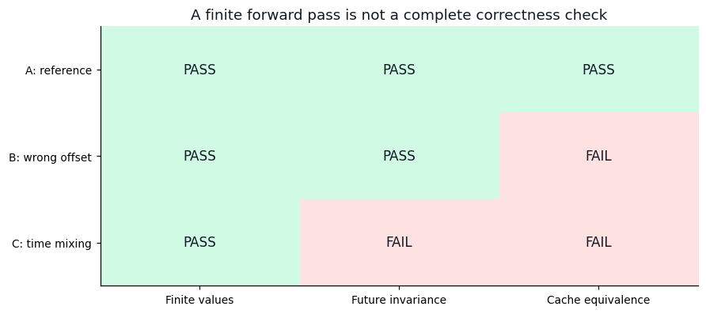

Read the figure by row: each is a controlled implementation variant. Read it by
column: each check asks about a different property. The correct fixture passes
all three. Resetting the new RoPE offsets passes finiteness and future invariance,
but fails cache equivalence. Centering states across the whole time axis passes
finiteness but fails both causal and cache checks.

Why does the offset bug leave causality intact? The mask can still exclude
every future position while permitted Q/K pairs use the wrong relative angles.
It is the geometry of legal edges, not the visibility rule, that has changed.
The recorded maximum cached-suffix logit difference was approximately 0.03252,
while changing future tokens caused no earlier-logit difference in that test.

Why does time-axis centering leak information despite masked attention? An
earlier state now subtracts a mean that includes later states. The forbidden
information arrives through normalization, before the attention mask can help.
The measured earlier-logit difference was about 0.000347. Small is not the same
as absent: under this controlled perturbation it is evidence against the causal
contract, not a harmless improvement in numerical accuracy.

These cases illustrate differential diagnosis, not a universal lookup table of
bugs. A cache mismatch might also come from concatenating along the wrong axis,
stale parameters, a different prefix, or an incorrect mask. A failing check
narrows the investigation; inspecting the relevant operation identifies the
cause. Conversely, passing one short example does not prove correctness for
every length, batch shape, padding pattern, or precision.

The [verification report](../../experiments/reports/2026-09-07-day7-architecture-defense.md)
records the exact fixture and observations. Its successful mechanism tests are
not measurements of language quality or serving performance.

## 5.25 Defend a choice under a declared budget

Now ask a design question: why retain two KV heads rather than four in this
teaching model? “GQA is modern” is not an explanation. A defensible answer
identifies what changes, what remains, and what has actually been measured.

At fixed query-head count, two KV heads reduce the K/V projection matrices and
compact cache payload. They leave four query distributions. In the notebook's
paired configurations, unique parameters decrease from 5,472 to 4,960 and
float64 cache payload decreases from 6,144 to 3,072 bytes. Total model parameters
do not halve because embeddings, MLPs, norms, and Q/output projections remain.

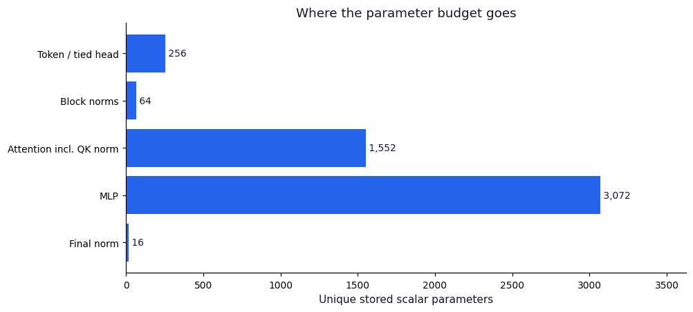

The longest bar is the MLP budget. Changing KV sharing cannot remove those
parameters. The embedding/head bar counts one shared Parameter, not two
equal-valued copies. This is why a component-level ledger is more informative
than a single model-size number.

The two-KV-head fixture stores 3,072 bytes of compact cache tensors, but that is
not the process's peak memory. Its estimated dense forward matrix arithmetic is
125,952 FLOPs, but that is not measured latency. A design defense can honestly
conclude that this variant satisfies the tested shape and cache contracts with
a smaller logical KV payload. It cannot conclude that it is twice as fast or
retains the same trained quality.

### There is more than one fair comparison

Consider the optional recurrent-depth experiment. One shared block application
and two shared applications can store the same parameters, but they do not
spend the same computation. The question determines which budget to hold fixed:

| Contract | What the comparison asks | What is not automatically equal |
|---|---|---|
| Fixed stored parameters and training-token budget | Does extra repeated computation help this parameter-limited model? | FLOPs, elapsed time, activation memory |
| Fixed training-compute budget | Which design makes better use of the allowed arithmetic? | Tokens seen, updates, elapsed time |
| Fixed wall-clock budget on declared hardware | Which implementation reaches better validation quality in the available time? | FLOPs, tokens, utilization |

These are different scientific questions, not three names for the same fair
test. Compensating for extra recurrence by reducing width changes capacity;
compensating by reducing updates changes training exposure. Neither is forbidden,
but both must be visible in the interpretation. Training budget and inference
budget must also be stated separately.

Before running a comparison, write down the tokenizer and data revisions, split
definitions, initialization and seed policy, optimizer and schedule, sequence
length, batch and accumulation settings, stopping budget, and checkpoint
selection rule. Keep tokenization and evaluation loss reduction identical if
comparing token-level cross-entropy directly. Use validation data for recipe
selection and preserve an untouched test set for the final assessment.

Report validation loss together with the resource measurements relevant to the
question. For generation, declare prompt lengths, generated lengths, cache use,
precision, decoding settings, warm-up, and timing boundaries. Fixed prompts
help illustrate behavior; a few attractive samples are not an independent
quality metric. Multiple seeds help reveal whether a small difference is
repeatable, but only runs actually performed may be reported as evidence.

The notebook's recurrence worksheet is such a proposal, not a completed
comparison. Its placeholders for concrete budgets and data must be resolved
before training. The correct conclusion today is that the experiment has a
testable structure—not that recurrence has won.

## 5.26 Architecture-defense exercises

Use the [Day 7 worked answers](../solutions/05-decoder-notebook-solutions.md#day-7-architecture-defense--worked-conceptual-solutions)
after forming an explanation. These questions ask for reasoning, not memorized
acronyms or lengthy arithmetic.

25. The residual states and logits both end in width sixteen in the teaching
    model. Why are they not interchangeable? Which shapes change if only the
    vocabulary grows to 10,000?
26. Every parameter tensor has a connected finite gradient, but the notebook
    takes no optimizer step. What has been established, and what has not? Why
    does averaging twelve token losses matter to their gradients?
27. A model is finite and passes a future-token perturbation check, but cached
    generation differs from full recomputation. Explain one plausible mechanism
    and a follow-up check without claiming that the signature uniquely identifies it.
28. Why can an attention mask be correct while the complete model is noncausal?
    Describe the information path in the time-centering failure.
29. A colleague says, “Halving KV heads halves memory and doubles speed.” Rewrite
    this as a precise supported claim and identify the missing measurements.
30. Design the question for a fixed-parameter one-use versus two-use recurrent
    comparison. What additional contract would make it a compute-efficiency
    study, and what would count as evidence against your initial hypothesis?

## 5.27 From architecture to controlled pretraining

The chapter began with an incomplete explanation: attention retrieves context.
We can now follow the complete path. IDs select embedding rows; residual states
carry learned features; attention mixes information across permitted positions;
MLPs transform each position's contextual features; normalization prepares the
branch inputs; and a vocabulary projection turns final states into candidate
scores. Shifted labels define losses whose gradients reach the shared trainable
parameters. An optimizer then changes those parameters.

Modern choices alter parts of this path without changing its central purpose.
RMSNorm changes normalization, SwiGLU changes feature transformation, RoPE changes
attention's positional geometry, GQA changes K/V sharing, and recurrence changes
how often a shared transformation is applied. Their names do not replace an
explanation of tensor shapes, gradient paths, costs, and failure conditions.

A compact architecture defense follows this chain:

**Choice → mechanism → tensor shapes → evidence → trade-off → failure risk → next experiment.**

For example: “I use two KV heads for four query heads to reduce compact cache
payload. Queries retain separate distributions while groups share source K/V.
The teaching implementation passes the recorded causal and cache checks and
uses half the KV payload of its four-KV-head counterpart. I have not established
a latency or quality benefit. I would next profile the intended workload and
compare validation quality under a declared training budget.” That is stronger
than either an unqualified endorsement or an unexplained list of components.

The next chapter moves from the function we built to the learning process we
can trust: data provenance and splits, token budgets, optimization schedules,
memory and throughput, checkpoints, and held-out evaluation. The small
memorization experiment establishes that the mechanism can fit its batch. The
architecture audit establishes selected implementation properties. Neither
settles whether a larger model will learn useful language patterns from the
planned corpus. That becomes the next controlled experiment.
