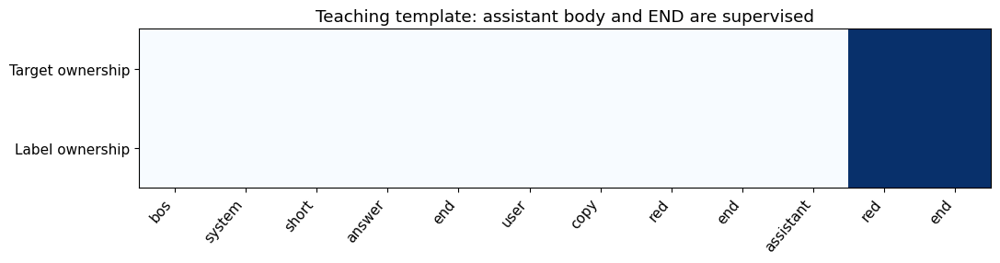
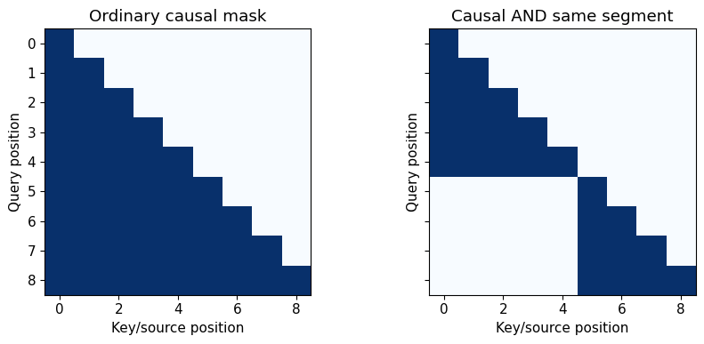
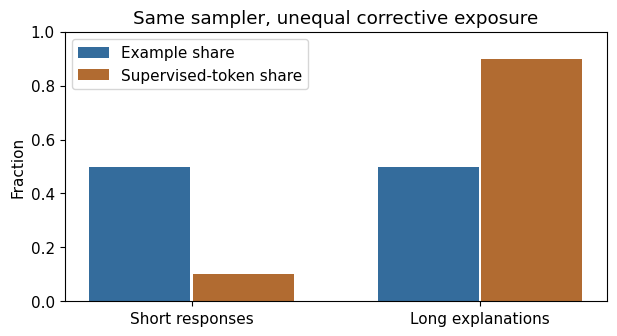

# 8. Instruction Data as an Interface

A user writes “Reply with one color.” The model answers “Here is a short story about a red balloon.” Its language may be fluent and its next-token loss may be low, yet it has failed the requested interface. Instruction tuning makes such interfaces part of the training distribution. The examples teach what an answer looks like, where it begins, whose words are context, and when it should end.

An instruction dataset is therefore a behavioral specification expressed as sequences. Its quality depends on more than the answer text. A wrong role marker, an incorrectly shifted mask, or contamination from the evaluation suite can change the experiment without changing a single natural-language answer.

Day 11 uses [roles and serialization](../../notebooks/day-11/01_roles_templates_and_masks.ipynb), [padding and packing](../../notebooks/day-11/02_padding_packing_boundaries.ipynb), and [mixtures and provenance](../../notebooks/day-11/03_mixtures_and_data_cards.ipynb). Follow the [lab guide](../labs/08-instruction-data-as-an-interface.md); [worked solutions](../solutions/08-instruction-data-as-an-interface.md) explain each exercise.

## What you should be able to explain

- Trace messages through IDs, target ownership and one causal label shift.
- Distinguish supervision, attention visibility and parameter freezing.
- Audit padding, packing, mixture exposure and teacher selection before training.

**Prerequisites:** tokenization from Chapter 2, causal attention from Chapters 4–5,
and source-group evaluation contracts from Chapter 7.

## 8.1 Begin with the user's desired behavior

Consider three examples: copy one word, reverse two words, and return an object with a required key. They all concern instruction following, but they require different output structure. A dataset with only copy tasks cannot establish a general assistant. A dataset with only beautifully formatted answers might teach presentation while leaving factual mistakes untouched.

Write a compact capability table first. Name the input family, answer policy, permitted transformations and regression risk. For a small course dataset, copying and extraction are useful because correctness can be checked exactly. Include held-out values and phrasings when testing transfer. Reusing every value in every training prompt makes a clean-looking score a memorization check.

The model sees demonstrations, not the data designer's intent. If every response begins “Certainly!”, the model can learn that phrase. If long answers dominate the supervised tokens, it receives more corrective pressure for verbosity than the example count suggests. If refusal examples are mixed without defining scope, benign questions may receive refusals. These effects should be anticipated in the card and evaluation suite.

## 8.2 Messages become one token sequence

A conversation often has system, user and assistant messages. A system message supplies behavior instructions or application context. A user message supplies the request. An assistant message supplies a demonstrated response. Tool messages are a separate interface and are outside this chapter's executable fixture.

Roles are encoded through text and special tokens according to a chat template. A decoder does not receive Python dictionaries; preprocessing converts them to IDs. The model learns the significance of those markers through training. The [Transformers chat-template guide](https://huggingface.co/docs/transformers/chat_templating) documents this serialization boundary.

The symbolic notebook format is intentionally small:

> BOS → SYSTEM → short answer → END → USER → copy red → END → ASSISTANT → red → END.

These labels denote discrete teaching IDs. They are not literal Qwen tokenization or an interchangeable industry standard. A real checkpoint's template can use distinct start and end markers, newlines, reasoning delimiters and tool structures. Inspect the actual decoded result from its pinned tokenizer.

For training a complete assistant demonstration, use the full conversation without an extra unfinished generation prompt. For inference, append whatever assistant-start prefix the model expects. A template that already contains BOS or end tokens must not be followed by another automatic special-token insertion. If formatting text first and tokenizing separately, verify the equivalent direct-template path and control additional special tokens.

## 8.3 Ownership is explicit

The role header is not the same as its body. A useful supervision policy learns assistant body tokens and the assistant's termination marker, while treating system/user content and role headers as context. Other policies can also learn headers; the choice must be written and tested.

Our encoder produces three aligned lists: token IDs, a boolean supervised flag, and a human-readable owner. The supervised flag is attached to the token being predicted. This detail matters when the model's logit at position $t$ predicts token $t+1$.

Let $x_{b,t}$ be the full conversation IDs, $m_{b,t}$ the ownership mask, and $a_{b,t}$ the padding-validity mask. Define labels

$$
\ell_{b,t}=
\begin{cases}
x_{b,t}, & m_{b,t}=1\ \text{and}\ a_{b,t}=1,\\
-100, & \text{otherwise}.
\end{cases}
$$

The sentinel $-100$ is an implementation convention for ignored labels, not a token ID. For logits $Z\in\mathbb{R}^{B\times n\times V}$, train using $Z[:,:-1,:]$ against $\ell[:,1:]$. Shift exactly once. Some high-level model APIs shift labels internally; the transparent teaching module performs the shift itself. Combining both shifts predicts two positions ahead.

In the symbolic example, the final assistant body “red” and its END marker are supervised. The ASSISTANT header is ignored. The logit at the header predicts “red”; the logit at “red” predicts END. The target belongs to the assistant even though the producing position may be the header.

### Read the target ownership

Columns are serialized tokens; the two rows show target and label ownership.
The symbolic IDs are `[1, 2, 16, 17, 5, 3, 10, 6, 5, 4, 6, 5]` and the
unshifted labels are `[-100, -100, -100, -100, -100, -100, -100, -100, -100,
-100, 6, 5]` for this saved reference. The notebook prints both arrays and
the producing-position/target pairs; rerun it to inspect changes. Removing END
changes direct supervision without removing the prompt's forward context.

## 8.4 Assistant-only loss still teaches from the prompt

Ignoring a user token's direct loss does not remove it from the forward graph. Its embedding and hidden states can influence later assistant positions through causal attention. The answer loss can therefore update shared parameters and prompt embeddings through those paths.

There are three different controls. The loss mask decides which predictions are scored. The attention mask decides which positions can exchange information. The parameter's trainable flag decides whether an optimizer updates that parameter. They solve different problems. A frozen embedding can participate in useful computation without receiving an update. A zero-loss prompt position can receive a gradient through later outputs. An attention-masked position can be excluded as context even if a careless label still asks the model to predict it.

This distinction links the present chapter to attention's causal boundary. An answer token is permitted to learn from earlier user text, while the earlier user representation cannot use the future answer in that forward pass. Backward information from the answer's loss updates parameters; it does not grant the forward computation access to future tokens.

## 8.5 Termination is part of the demonstration

A model that generates the right answer and continues indefinitely has not learned the complete interface. Include the intended assistant termination token as a supervised target. A maximum-token limit is a runtime cap, not the desired learned stopping behavior.

Do not assume a tokenizer's generic EOS ID equals every model's end-of-assistant marker. Inspect both template output and generation stop settings. Some formats distinguish a message end from conversation end. Suppressing all special tokens while inspecting text can hide whether the correct marker appeared, so retain raw IDs in the audit.

Truncation can erase the termination target or cut a response after only its opening. A recipe must say whether overlength examples are rejected, truncated, split or summarized. Report how many supervised targets survive and how many answers lose their natural ending. Prompt truncation should also preserve the task-defining instruction; chopping off the user's decisive condition changes the example.

The fixture keeps all sequences within a small bound. The Spark runner rejects examples that exceed its maximum length, rather than quietly selecting a different target policy.

## 8.6 Padding is not an instruction

Batches contain different lengths. Padding creates a rectangular tensor $X\in\mathbb{N}^{B\times n}$. Padded labels must be ignored and padded context must be masked appropriately. The attention-validity mask is separate from the supervision mask because valid user context is visible even when its labels are ignored.

Our right-padded microscope has no future influence on earlier real positions under a causal decoder. Its padding loss is still explicitly ignored. A production model should receive the actual attention mask; left padding changes position handling and generation conventions and requires an independent equivalence check.

If a model reuses EOS as its pad value, masking every token whose ID equals EOS can remove genuine end targets. Build padding masks from lengths or tokenizer-provided attention metadata, then combine them with ownership. Values alone cannot distinguish “real EOS here” from “padding placed here.”

A useful audit shows IDs, owners, labels and masks in the same heatmap. The reader can follow one assistant target across the causal shift. Summarized target counts are insufficient: an off-by-one mask can preserve the count while teaching the wrong token.

## 8.7 Packing changes the information boundary

Packing several short conversations into one long sequence reduces padding. A naive concatenation with only a triangular causal mask lets a later conversation attend to all earlier ones. An EOS marker supplies a learned clue; it does not mathematically prevent information flow.

For independent conversations, assign a segment identifier $s_t$ to each position. An allowed-attention mask is

$$
M_{t,u}=\mathbf{1}\{u\le t\}\mathbf{1}\{s_u=s_t\}.
$$

This block-diagonal causal structure allows a conversation to see its own past and excludes preceding independent examples. Whether position IDs reset within segments is another explicit choice. Test equivalence with independent forwards at the chosen positional convention.

Packing also creates an accidental cross-boundary next-token target unless the first token of each new segment is ignored. In our teaching policy BOS and role headers are ignored, so the boundary loss is excluded, but that property must be checked rather than assumed. Some throughput-oriented recipes intentionally allow cross-example context. Such recipes describe a different conditional distribution and should be compared as a controlled change.

The notebook visualizes ordinary causal visibility beside segment-isolated visibility. Change one segment ID and observe precisely which information paths open. No production packing backend is claimed by this schematic alone.

### Compare the information paths

Both matrices are $9\times9$: rows are receiving/query positions and columns
are source/key positions. Five positions belong to segment zero and four to
segment one. The lower-left block is visible under the ordinary triangle and
blocked by the isolated mask. Change one segment ID in the notebook and track
exactly which context paths appear; this figure is a mask computation, not
evidence of a production packing backend.

## 8.8 Mixture weights need a unit

Suppose half the sampled examples belong to short-answer tasks and half to explanation tasks. Short answers average ten supervised tokens; explanations average ninety. Under a global token mean, explanation tokens contribute approximately 90% of the objective, although example sampling is balanced.

If task family $r$ has example probability $w_r$ and mean supervised length $\bar n_r$, its expected token share is

$$
\pi_r=\frac{w_r\bar n_r}{\sum_q w_q\bar n_q}.
$$

To target equal supervised-token shares, one possible sampling strategy chooses $w_r$ proportional to $1/\bar n_r$. This changes the example distribution and increases the frequency of short tasks. Another approach averages each example's loss before averaging examples; that changes gradient weighting. Neither should be introduced silently.

Report examples, input tokens, assistant tokens and source proportions separately. A high fraction of explanation tokens is not necessarily bad; it becomes a problem when it contradicts the intended interface. Use an evaluation slice for concise-output instructions to see whether the behavior transfers.

Data-mixture changes and learning-rate changes should be tested separately when diagnosing a regression. If both change, a resulting score cannot identify the cause.

### Count the objective's exposure

The vertical axis is a fraction. Example share is one half for both families;
supervised-token share is 0.1 versus 0.9 for mean lengths 10 and 90. Change the
lengths or sampler in the notebook and recompute the denominator. Equal example
counts do not by themselves equalize loss pressure.

## 8.9 Provenance survives preprocessing

A data card should include creator/source, license, intended use, excluded use, collection or generation procedure, revisions, languages, task families, split rules, filtering, deduplication, template identity, mask policy, truncation counts and known limitations.

Content hashes are useful but do not replace source information. Identical answers to different tasks may be legitimate; identical instruction-answer pairs across train and test are suspicious. Group exact normalized pairs first, then audit near duplicates and shared document origins. Synthetic examples derived from the same template belong in related groups when assessing transfer.

The original fixture is authored for this course, without copied upstream examples; its data card records authorship and the release's declared license policy. It contains four symbolic copy conversations and intentionally lacks broad instruction diversity. The optional Spark dataset generator creates original deterministic copy/reverse/extraction examples with separate value groups. Its card explicitly limits the resulting claim to these task families.

Do not claim that synthetic authoring eliminates contamination risks. A generator may repeat a benchmark template or leak test values into a training vocabulary. Save the generation code and seeds, record grouping decisions, and verify train/development/test identities before any optimizer step.

## 8.10 From audited data to SFT

A compact acceptance audit checks that every example contains permitted roles, a nonempty assistant response, at least one surviving supervised target, valid vocabulary IDs, a correct termination target, no padded labels, and an understood length policy. Print representative examples selected by rule, including longest, shortest and multi-turn cases.

The automatic audit can verify syntax and alignment; a human or task verifier still needs to check whether the answer obeys the instruction. A well-formed wrong answer is a powerful wrong lesson.

The accepted dataset is now an explicit interface contract: IDs, visibility, labels, endings and source membership must agree.

## 8.11 A teacher response is an attempt before it is a demonstration

Teacher-generated data adds another interface before the one the student sees.
A request is sent, an execution succeeds or fails, a response is parsed, and a
selection procedure decides whether to teach from it. Saving only the final
accepted examples hides the evidence needed to explain that decision.

Begin with an attempt record, not an answer string. Bind it to an item and source
group, sample coordinate, retry coordinate, teacher implementation, sampler,
verifier, content terms and actual input/interface identity. Preserve raw text,
trace and final-answer fields, token IDs when representable, stopping, errors,
and costs even when the attempt is rejected. A trace can be useful provenance
without being a faithful explanation or a suitable student target.

The [teacher-data laboratory](../../notebooks/day-11/04_teacher_attempts_and_matched_rejection_sft.ipynb)
uses an explicitly programmatic copy/reverse teacher. Its controlled faults
produce wrong answers, empty text, unsupported symbols, long answers, a missing
END and an actual local exception. It is not a pretrained model or an API. The
recorded text-serialization costs are therefore not language-model inference
tokens, API charges or GPU throughput. This small teacher makes the accounting
visible before a real, separately specified teacher is substituted.

Retries have distinct identities but share their originating source. If a retry
repeats the same correct answer, it consumed another execution without adding
another independent demonstration. Record that repetition. Do not make a failed
request disappear merely because a later request succeeded.

## 8.12 Resumption and filtering preserve the rejected evidence

An interrupted teacher call may run again without creating an independent
demonstration. Keep failed and rejected attempts alongside committed results,
and distinguish unique saved records from exactly-once physical execution.
The collector's locks and explicit crash controls are described in
[Appendix D](../appendices/d-reproduction-and-environments.md#supervision-and-durable-evidence).

Next separate acceptance from ranking. This lesson's acceptance policy rejects
format, length, stopping, unsupported IDs, source leakage and within-prompt
duplicates. It deliberately does **not** reject well-formed wrong answers.
Otherwise a top-versus-random comparison could secretly compare two sets already
made equally correct by the filter. Multiple reasons may apply to one attempt,
so rejection-reason counts are not a partition of rejected records.

The original reference retains 108 attempts, including twelve error retries.
Seventy-two attempts are rejected and 36 unique candidates survive: twelve
correct and 24 wrong. The fixed task verifier computes correctness from training
prompts and candidate text, not teacher mode labels or held-out reference fields.
Every surviving candidate and every rejection remains linked to its attempt.
Source-group and actual student-ID collisions are gated before collection; an
unseen polite prefix does not make a reused underlying task a new source group.

## 8.13 Selection changes both answers and exposure

Let $C_i$ be the frozen accepted candidate pool for training prompt $x_i$, and
let $s(x_i,y)$ be the declared training-task score. A per-prompt selection is

$$
y_i^\star=\underset{y\in C_i}{\mathrm{argmax}}\,s(x_i,y).
$$

The implementation resolves ties by shorter supervised length and stable
attempt identity. Its random control samples uniformly from the same $C_i$,
using an independently item-keyed seeded stream. Both choose one demonstration
per prompt, preserving prompt coverage. Neither can query the held-out panel.

A global top-$K$ ranking over all pools solves a different problem. It can spend
several selections on one source or omit an entire difficulty slice. Define
prompt coverage as the fraction of training prompts represented at least once.
In this fixture global top 6 covers only six of twelve prompts, all two-word
tasks, because correctness ties favor shorter answers. Global top 12 covers all
twelve. These are separate coverage audits at different sample budgets, not
additional matched student results.

Matching examples and prompts does not match supervised tokens. Let $n_{a,j}$
count the final-answer and END targets in example $j$ of arm $a$. Under $U$
full-batch updates, target exposure is

$$
E_a=U\sum_j n_{a,j}.
$$

All three selected datasets contain twelve examples and all twelve prompts.
Top and length-stratified random each contain 42 targets per batch; unstratified
random contains 46. At eighty updates their exposures are 3,360, 3,360 and 3,680
respectively. Report that difference; do not redefine the denominator to claim
the primary comparison controls everything.

The length-stratified sensitivity samples from candidates with the top answer's
target length for each prompt, without filtering on correctness. Here every
stratum contains both a correct and a wrong response. In a different pool, a
single eligible candidate offers no meaningful alternative; an empty pool
cannot be repaired by inventing a response. Availability and degeneracy belong
in the audit.

## 8.14 A demonstration score is not student capability

Only selected final answers and their real END markers become student targets.
Traces and audit labels do not enter the loss. The existing encoder, collator
and exactly-once shift from this chapter feed an actual tiny causal sequence
student; the next chapter develops that supervised objective in detail.

The experiment pairs initialization across top, random and length-random data
with three fixed student seeds and eighty updates each. Development, test and
polite-prefix control prompts are independently generated source groups under
the frozen task contract. Evaluation records full-vocabulary free generation,
not a forced answer grammar, and scores correctness, format and natural END
separately. Wrong or truncated outputs remain in the denominator.

The measured result is deliberately not a success story. Top chooses twelve
correct demonstrations, but its held-out greedy test accuracy ranges from zero
to 0.25 across seeds. Length-random ranges from zero to 0.5; unstratified random
remains zero. All nine students score zero on the greedy polite-prefix control.
The random data can also attain lower demonstration NLL while teaching wrong
answers. These tiny four-prompt held-out slices cannot rank selection methods
generally, and no recipe was retuned after their inspection.

The [specification](../../experiments/specs/2026-10-04-teacher-data.md) and
[complete report](../../experiments/reports/2026-10-04-teacher-data.md) preserve
the declared teacher, selected IDs, exposure, learning curves and all negative
outputs. The durable lesson is the comparison contract: provenance survives
rejection, controls share a pool, budgets have explicit units, and student
evaluation is independent of the score that selected its demonstrations.
Chapter 15 returns to selection and distillation with reasoning responses; this
programmatic control alone establishes no pretrained-model transfer.

## 8.15 Exercises

1. Draw the serialized sequence for a system-user-assistant conversation.
2. Identify which logit predicts the first assistant body token.
3. Explain why zero prompt loss does not imply zero prompt gradient.
4. Give a case where masking by pad token value removes a valid ending.
5. Specify a safe overlength-example policy and its measurable cost.
6. Construct an attention mask isolating two packed conversations.
7. Explain why EOS alone does not isolate packed context.
8. Calculate token exposure for equally sampled ten-token and ninety-token answers.
9. Design grouping rules for related synthetic examples.
10. Write a data-card limitation that prevents a four-copy-task fixture from becoming a claim about general assistance.
11. Explain why the format filter deliberately retains wrong answers in a top-versus-random experiment.
12. Distinguish a unique committed attempt from an exactly-once physical execution after interruption.
13. Identify what the 42-versus-46 target counts do and do not control at eighty updates.
14. Explain why a shorter-answer tie-break can remove the harder slice under global top 6 but not one-per-prompt selection.
15. Interpret a very low selected-dataset NLL alongside zero held-out control accuracy.
16. Describe how to audit an unsupported response without deleting its raw text or claiming token costs that the programmatic teacher never incurred.

The [worked solutions](../solutions/08-instruction-data-as-an-interface.md) include executable checks and an interpretation of each failure.

## What follows

The next chapter derives the objective and follows answer gradients through the
whole decoder, then compares full tuning with a constrained low-rank update.
Its CPU fixture teaches mechanics; its retained real-model comparison measures
narrow held-out-value instruction behavior under the audited interface.
