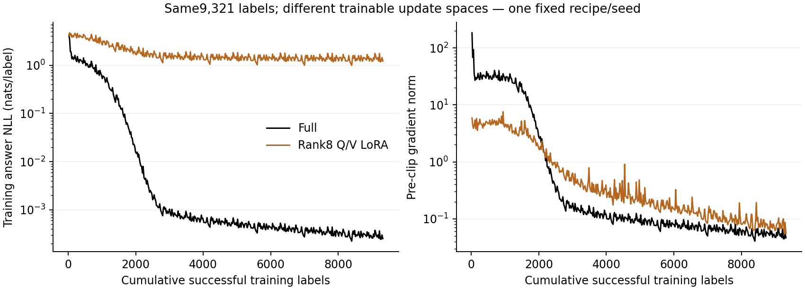

# 9. Supervised Fine-Tuning

A pretrained decoder can continue text without reliably answering a request. Supervised fine-tuning supplies demonstrations of the conditional behavior we want: given this conversation, produce this response and stop at this boundary. The model remains a next-token predictor. We change the distribution of contexts, the targets receiving loss, and often which parameters can move.

This chapter spans Days 12–14. It combines the [objective and gradient notebook](../../notebooks/day-12/01_sft_objective_and_gradient_paths.ipynb), [accumulation and restart notebook](../../notebooks/day-12/02_accumulation_and_checkpoint_identity.ipynb), [bounded training notebook](../../notebooks/day-13/01_tiny_assistant_training.ipynb), and [full versus LoRA notebook](../../notebooks/day-14/01_full_sft_lora_and_recipe_defense.ipynb). The [lab guide](../labs/09-supervised-fine-tuning.md) provides the run order; [worked solutions](../solutions/09-supervised-fine-tuning.md) explain the deep questions.

## 9.1 What transfers from pretraining?

Pretraining establishes representations and continuation patterns across a broad corpus. SFT supplies a narrower distribution of demonstrations. It can make an existing ability accessible through an interface, strengthen a task behavior, teach format compliance or introduce new factual associations. These are distinct outcomes and require distinct evaluation slices.

A model that already knows a fact may answer it correctly after learning when to give a direct response. That does not prove SFT created the fact. Conversely, a model can memorize a new answer without learning a transferable instruction. Compare held-out values, unseen phrasings and unrelated regression tasks.

Model naming matters. The official [Qwen3-0.6B-Base card](https://huggingface.co/Qwen/Qwen3-0.6B-Base) describes a base checkpoint; [Qwen3-0.6B](https://huggingface.co/Qwen/Qwen3-0.6B) is a separately released post-trained model. Fine-tuning the latter is useful continued adaptation, but does not test a first base-to-assistant transition. Record exact revisions so the comparison cannot change when a repository updates.

Our CPU model begins randomly initialized. Its task is deliberately tiny: map four symbolic copy requests to a word and END. Its results verify optimization and gradient mechanics. A real base-to-assistant claim belongs to the separately specified Spark experiment.

## 9.2 Derive the supervised objective

For demonstration $j$, let $c_j$ be its conversation context and $a_j=(a_{j,1},\ldots,a_{j,n_j})$ its assistant sequence, including the intended ending. The causal model gives

$$
p_\theta(a_j\mid c_j)=\prod_{t=1}^{n_j}
p_\theta(a_{j,t}\mid c_j,a_{j,<t}).
$$

Taking negative natural logs turns products into sums:

$$
L_j(\theta)=-\sum_{t=1}^{n_j}
\log p_\theta(a_{j,t}\mid c_j,a_{j,<t}).
$$

The common token-mean objective divides the total sum by the number of supervised targets, $N=\sum_jn_j$:

$$
L(\theta)=\frac{1}{N}\sum_jL_j(\theta).
$$

For a padded full transcript, use ownership mask $m_{b,t}$ and validity mask $v_{b,t}$. Logits $Z$ have shape $[B,T,V]$ and labels have shape $[B,T]$. After one causal shift, the logit gradient is

$$
\frac{\partial L}{\partial z_{b,t,i}}=
\frac{m_{b,t+1}v_{b,t+1}}{N}
\left(p_{b,t,i}-\mathbf{1}\{i=x_{b,t+1}\}\right).
$$

At a directly ignored prediction position, this gradient is zero. At an answer prediction, the observed target gets upward pressure through gradient descent and competing logits get downward pressure. The hidden state, output head and earlier context receive gradients according to the chain rule. The equation gives a derivative with respect to logits; actual parameter updates depend on the entire computation and optimizer.

An example-mean objective instead averages $L_j/n_j$ across examples. This weights each conversation equally even when answer lengths differ. Choose intentionally and retain the denominator in logs; the two objectives need not prefer the same parameters.

## 9.3 Gradients reach the shared decoder

Let the final hidden state be $h_t\in\mathbb{R}^D$ and output matrix $W_{\mathrm{out}}\in\mathbb{R}^{V\times D}$. With row-vector batch notation, $z_t=h_tW_{\mathrm{out}}^\top$. The loss derivative sends pressure to both sides:

$$
\frac{\partial L}{\partial h_t}
=\frac{\partial L}{\partial z_t}W_{\mathrm{out}},
\qquad
\frac{\partial L}{\partial W_{\mathrm{out}}}
=\left(\frac{\partial L}{\partial z_t}\right)^\top h_t.
$$

Backward propagation traverses final normalization, residual additions, MLP transformations and attention. Attention reaches earlier prompt states through the value path and changes routing through the Q/K paths. It eventually reaches token embeddings unless those parameters are frozen.

The gradient notebook displays parameter-family norms from the actual tiny model. A nonzero Q gradient proves that a local training signal reaches that projection for this batch. It does not prove useful specialization, a large update or general capability. A zero gradient may arise from masking, symmetry, frozen parameters or a saturated/unused path; its cause should be investigated in the graph.

Tied input/output embeddings deserve care. A row unused as an input can still receive an output-head gradient because the softmax considers the whole vocabulary. This is why “only looked-up embedding rows update” is true for an isolated lookup experiment but incomplete for a tied language model.

## 9.4 A readable update loop

The transparent implementation separates loss sum from target count. Its main loop performs: clear old gradients, run the model, align labels once, compute summed answer NLL, divide by the correct denominator, backpropagate, check finiteness, clip, and step the optimizer.

For a small experiment, AdamW is a reasonable declared choice. Learning rate controls the scale of updates; clipping bounds the accumulated gradient norm before the step. Clipping is not a substitute for finite-value checks. Weight decay acts through the optimizer and should be reported separately from loss terms.

For a production BF16 path, autocast changes eligible forward operations. It does not imply every parameter, optimizer state or reduction uses two bytes. The runner loads BF16 weights explicitly, uses SDPA, checks the hardware, and records the actual choices. It does not claim a throughput estimate before profiling.

Teacher forcing supplies the demonstrated answer prefix during training. During free generation, the model consumes its own previous outputs. Low answer NLL can coexist with drifting generations, as Chapter 6 showed. Evaluation therefore needs both teacher-forced likelihood and free-response task behavior.

## 9.5 Accumulation must preserve weighting

A logical batch can be split into microbatches when memory is limited. Suppose microbatch $r$ has summed loss $S_r$ and supervised count $N_r$. The desired accumulated objective is

$$
L=\frac{\sum_rS_r}{\sum_rN_r}.
$$

Backward each $S_r/\sum_qN_q$, then perform one optimizer step. Averaging microbatch means instead gives $\frac{1}{R}\sum_rS_r/N_r$, which overweights short-answer microbatches when counts differ.

The accumulation notebook compares gradients from a joint batch with token-weighted split batches. It also deliberately averages means to expose the failure. Use a shared initialization, no stochastic dropout and identical context masks so the only difference is weighting. Floating-point reduction order may introduce tiny numerical differences; define a justified tolerance rather than demanding impossible bitwise equality.

An incomplete final accumulation window needs its own denominator and update policy. Silently dividing it by a fixed full-window count weakens its gradient. The Spark runner materializes the bounded window and counts its labels before backpropagation.

### Count labels before setting a budget

The [pinned tokenizer measurement](../../experiments/reports/2026-10-05-base-tokenizer-sizing.md)
makes this distinction concrete without loading a model. The proposed 20-update
profile selects 80 original examples. Their full transcripts contain 3,154 input
positions but only 455 shifted assistant targets. The mask includes each answer's
message-end marker and trailing template newline; counting answer words would
give the wrong denominator. The maximum context is a ceiling, not the number of
targets actually present.

Both baseline and final evaluation score all 60 development examples, adding
360 targets each. A whole-run work allowance therefore needs 1,175 target
presentations, while training exposure remains 455. Evaluation does not add
optimizer supervision. Generation has a separate allowance: sixteen proposed
attempts of at most 64 new tokens, not another teacher-forced target count.
These are measured token encodings and schedule requirements, not executed
updates, sampled completions, memory-fit evidence or a learned assistant.

### A real profile can improve NLL without producing a correct answer

The subsequent [native Spark profile](../../experiments/reports/2026-10-05-native-base-profile.md)
executed this exact schedule. All20 updates had finite loss and gradient norms;
the process exited0 in61.636 seconds and the external sampled memory minimum
was105.10455GiB, above the25GiB reserve. Both committed snapshots fit their
declared envelopes. This is actual pinned pretrained BF16/SDPA evidence, not the
tiny random model's result extrapolated to Qwen.

Development answer NLL fell from4.061965 to1.100189. Yet both fixed eight-prompt
generation panels produced zero exact answers and zero message-end stops; every
continuation hit64 tokens. This is not contradictory. NLL asks how much
probability the model assigns to each demonstrated token under the demonstrated
prefix. Generation asks which path the model follows under its own selected
tokens, including whether it chooses the ending. Increasing the right token's
probability need not make it the winner, and correct-prefix likelihood need not
protect a wrong-prefix continuation.

The labels already included the message-end marker and template newline, so
“put END in the loss” is necessary supervision, not proof of learned stopping.
Keep likelihood, task correctness and natural termination as separate outcomes.
The short profile verifies the runtime and supplies a resource measurement; its
weights do not replace a fresh initialization in the predeclared full/LoRA
comparison. No publication-test result or broad assistant improvement follows.

## 9.6 Checkpoint identity is wider than weights

Saving weights permits a forward reconstruction. Resuming optimization also needs optimizer state, scheduler state if present, update index, data order, random states, template, tokenizer, mask policy and configuration. A correct restart should reproduce the next update under the same deterministic assumptions.

The CPU demo verifies state-dictionary forward equality. The second Day 12 notebook adds an optimizer-state continuation check: copy the model and AdamW state, feed the same next batch, and compare the resulting parameters. This verifies the stated local boundary; it does not establish bitwise reproducibility across different hardware or backend versions.

### A saved file is not yet a committed training boundary

Imagine that update 2 is durable, update 3 changes the model in memory, and a
crash occurs before its snapshot commits. Recovery must start from update 2 and
retry update 3. A log saying “update 3 finished” does not supply the missing Adam
moments or establish a durable update. Conversely, a committed update 3 snapshot
can survive a crash before its metric reaches the journal. Carry the numerical
metric history inside the snapshot, so that a new invocation can reconstruct
the record without silently losing or counting the update twice.

Keep scientific identity separate from operational choices:

| Preserved across a same-recipe restart | Separately declared for the new invocation |
|---|---|
| Actual input/source/lock bytes, token meanings, template and ending rules | New output directory, command and invocation ID |
| Objective, optimizer, accumulation, precision and schedule horizon | Deadline, memory reserve and snapshot-size envelope |
| Policy, Adam moments, RNG, fixed data order/cursor and cumulative work | Journal attempts and failed operations after the last durable boundary |

Moving identical input bytes is not changing their scientific identity. Changing
the schedule horizon, tokenizer or loss denominator is. It requires a declared
new experiment or migration, not a relaxed equality check. Cumulative targets
also must not reset merely because the resumed process has a new directory.

The [actual native full/LoRA replay](../../experiments/reports/2026-10-05-native-sft-replay.md)
now tests this on the pinned pretrained model. Both fresh update10→20 processes
match all ten numerical updates, serialized tensor entries and final generated
token/stop records. The physical journals count30 executed updates and684
training targets, although each final numerical trajectory ends at20 updates
and455 cumulative targets. Keep those two clocks separate. The earlier full
resume's conflict stop remains an additional failed invocation and wall cost.
This is same-Spark completed-boundary proof, not cross-machine reproducibility
or improved generation quality.

The [shared trusted-local format](../../src/dongxi_llms/training_snapshot.py)
requires a separately retained expected byte digest, exact size, scientific
contract and explicit bound. It checks the untrusted commit marker and actual
bytes before restricted tensor loading, then lets the runner validate its own
cursor and state invariants before applying them. Immutable exclusive snapshots
retain earlier boundaries and failed partial saves. Fsync failure remains a
failure even if a marker is visible. This protects a local replay protocol; it
is neither external authentication nor a hostile-checkpoint allocation sandbox.

The [runner-owned recovery plan](../../docs/PRODUCTION_RECOVERY_PLAN.md) keeps
actual-loop CPU replay, pretrained compatibility and Spark numerical recovery
as separate gates. Replaying a toy optimizer notebook cannot establish all three.

Checkpoint selection uses development criteria declared in advance. “Choose whichever sample looks best” encourages selection on noise. Save fixed intervals and compare the same prompt grid; retain regressions and stopping reasons.

## 9.7 Full tuning changes all allowed parameters

Full SFT allows the optimizer to update every trainable parameter. It offers flexible adaptation, but its optimizer state and gradients can dominate memory. A rough AdamW accounting for $P$ parameters distinguishes weights, gradients and two moment tensors. Additional master weights, activations, temporary buffers and allocator overhead depend on the implementation. Do not promise memory sufficiency from a parameter-only estimate.

Full tuning can alter useful broad behavior while improving the target interface. Evaluate general continuation, arithmetic, format compliance and concise-answer behavior with the same contract before and after. A narrowly successful recipe may be appropriate for a specialized system; its limitations should remain visible.

The microscopic full run uses fixed seed, a bounded update budget and four known requests. It learns the fixture if the observed report supports that conclusion. There is no unseen-language generalization claim, and no best-seed selection.

## 9.8 LoRA constrains an update

For a linear weight $W_0\in\mathbb{R}^{d_{\mathrm{out}}\times d_{\mathrm{in}}}$, LoRA freezes $W_0$ and learns

$$
W=W_0+\frac{\alpha}{r}BA,
\qquad
A\in\mathbb{R}^{r\times d_{\mathrm{in}}},
\quad B\in\mathbb{R}^{d_{\mathrm{out}}\times r}.
$$

The trainable adapter count is $r(d_{\mathrm{in}}+d_{\mathrm{out}})$ rather than $d_{\mathrm{in}}d_{\mathrm{out}}$. The rank of the update is at most $r$. The base matrix remains present, so small trainable state does not mean the whole base model occupies little memory. Activations also remain necessary for adapter training.

The [LoRA paper](https://arxiv.org/abs/2106.09685) introduces this parameterization. Our implementation uses a random $A$ and zero $B$. Initially the adapter output is exactly zero. The first gradient of $A$ is zero because it is multiplied by $B$; $B$ can receive a nonzero gradient through the initialized $A$. This asymmetry explains why “all trainable parameters must have nonzero gradients on the first step” is a poor health check.

For row-batch input $X$, compute $XW_0^\top+\frac{\alpha}{r}(XA^\top)B^\top$. The notebook compares this with a merged matrix and verifies equality. The microscopic adapter targets Q and V projections only. This is a declared design, not a universal optimal target set.

## 9.9 Compare recipes under named constraints

A full-versus-LoRA comparison changes capacity, optimizer state and often preferred learning rate. Using the same learning rate is a useful mechanism control, but may not give each method its best recipe. Conversely, tuning LoRA extensively while giving full tuning one attempt is an unequal selection budget.

Report two comparisons when feasible: a fixed-recipe intervention and a separately declared tuned-recipe comparison. Match training data, token exposure, seed policy and evaluation contract. State whether compute, wall time, updates or supervised tokens define the budget; all four cannot usually be equal at once.

The Day 14 notebook runs both microscopic modes from the same base initialization and plots observed loss against optimizer updates. Its evidence concerns the four symbolic examples, not the general usefulness of LoRA. The Spark plan proposes full SFT versus LoRA at a frozen data/token budget, followed by a Qwen3-1.7B-Base transfer check only after the smaller recipe is healthy. The smaller fixed-recipe runs are now measured below; the larger transfer check remains unexecuted.

The short native acceptance runs now supply a narrower observation: full and
rank-8 Q/V LoRA both recover exactly, but neither answers the eight fixed
development prompts correctly after20 updates. Full tuning has596,049,920
trainable parameters versus LoRA's1,146,880; observed CUDA peaks are6.03GB and
2.06GB respectively. These are specific allocated-byte peaks, not total unified
memory or a universal ratio. The400-update comparison is a separate fresh run.

That [fixed-recipe comparison](../../experiments/reports/2026-10-05-native-sft400-comparison.md)
has now completed. Both arms see9,321 successful training labels and63,378
processed training positions. Full tuning reaches development NLL0.000276425
and answers/stops correctly on all eight fixed development prompts. LoRA
reaches1.320048 but answers/stops correctly on none: all eight exhaust64 tokens,
often after printing a plausible answer prefix. Both run safely and export their
declared artifact. This separates execution success, likelihood learning and
whole-response behavior within one measured experiment.

Equal exposure does not make the update spaces equal. Full tuning can change
the output and embedding layers directly; the constrained Q/V adapter can only
change its selected low-rank paths. The observed result is not a proof that this
capacity difference alone caused the gap, nor that every LoRA recipe would fail.
The learning rate, target modules, rank and single seed remain fixed. The eight
development prompts share task templates with training; they are not the
original120-item publication panel or a broad assistant benchmark.

### Test held-out values without changing the answer rule

The subsequent [original publication comparison](../../experiments/reports/native-assistant-comparison-20261005-run-02/README.md)
contains120 items: copy, reverse and extract for each of40 held-out lexical-value
source groups. All three policies use identical actual prompt token IDs,
the original template, greedy seed1010, context512, cap64 and BF16 generation.
Strict scoring compares the entire decoded answer case-sensitively, excluding
only a terminal special stop from the scoring text. Raw text and stop tokens
remain stored; a correct prefix followed by unwanted text is not repaired.

| Actual held-out-value observation | Base | Full400 | Merged LoRA400 |
|---|---:|---:|---:|
| Strict correct answers |0/120|120/120|0/120|
| Natural message-end stops |0/120|120/120|0/120|
| Responses reaching64-token cap |120/120|0/120|120/120|
| Emitted tokens, including stops |7,680|760|7,680|
| Full-prefix forward input positions |515,840|29,720|515,840|

Each task family has40/40 strict successes for full400 and0/40 for the other
two policies; all producers completed with no response errors. The generic
case-folded parser gives the same correctness results here, but remains a
different scoring rule. Its unconstrained format check passes all120 outputs
in every arm, including the capped wrong answers. Neither execution success
nor format validity establishes answer correctness.

Source-group resampling of the aligned120 greedy IDs uses2,000 draws and
seed1010. The observed full-minus-Base strict gain is100 percentage points;
all group draws return the same gain. A degenerate interval is not a promise
about unseen tasks: there are only three shared synthetic templates and one
training seed. This supports held-out-value interface learning under the
measured recipe, not general assistant capability or a universal method rank.
LoRA's development NLL improvement to1.320048 remains a separate teacher-forced
observation, despite its0/120 generated whole answers. The model's update
subspace, rank8 Q/V targets and common learning rate were not retuned.

Full400 also performs less measured generation work because it ends correctly
after short answers. Summed response-attempt times are27.540 seconds for full,
159.574 for Base and157.873 for LoRA. These are uncached full-prefix loop times,
not optimized inference-engine benchmarks; input-position counts are not FLOPs.
Keep the populations, precision, stopping behavior and cost boundaries visible.

Merging is also a numerical experiment. The original BF16 merge failed its
declared logit tolerance even though adapter recovery passed. Floating-point
addition can round a low-rank update into the base's coarse representation.
Do not infer identical predictions from algebraic equivalence, or increase a
tolerance after seeing a mismatch. A wider-precision merge/reload is a separately
identified artifact, not silent proof that the original BF16 inference path was
unchanged. Preserve actual bytes, interface and numerical precision at handoff.
The separately declared FP32 check subsequently passes all eight prefixes;
fresh reload reproduces its merged logits bitwise and preserves the token
interface. This satisfies a narrow explicit-merge/reload check while keeping
the BF16 mismatch visible. That earlier short-run check is not the400-update
artifact. The independently accepted LoRA400 adapter now has its own
[CPU FP32 merge/reload receipt](../../experiments/reports/native-sft-lora-pilot400-merged-20261005-run-01/acceptance.json):
all eight fixed development-prefix checks meet the predeclared0.002 absolute/
0.001 relative tolerance and fresh merged reload reproduces logits bitwise.
The publication panel then loads that stored FP32 artifact in BF16, matching
the other arms' generation precision. A passed FP32 numerical handoff does not
establish BF16 unmerged-adapter equivalence or favorable task performance.

## 9.10 Interpret gains and regressions

Both lines come from the actual fixed400-update runs. They share label exposure,
not trainable capacity; the log-scale plot does not measure publication quality.

Suppose answer accuracy rises while natural endings decline. Inspect whether EOS targets survived preprocessing, whether decoding uses the correct stop IDs, and whether the token cap differs between comparisons. If one-word tasks become verbose, inspect example weighting and the explanation-token share. If held-out values fail but seen values succeed, test whether the model learned an instruction or a lookup table.

A fall in training loss alone cannot settle these diagnoses. Use the item-level evaluation from Chapter 7 and the alignment audit from Chapter 8. Preserve raw completions and exact settings. For stochastic generation, use multiple declared seeds and compare uncertainty at the item/group level.

Training should stop on nonfinite states, exhausted declared runtime, violated memory reserve or completion of the fixed budget. Choosing an unplanned extension after seeing disappointing examples changes the experiment. Write the new hypothesis and budget as a follow-up run.

## 9.11 The course experiments

The [combined specification](../../experiments/specs/2026-10-04-evaluation-and-sft-course.md) distinguishes three layers: executed CPU correctness checks, bounded microscopic learning, and a proposed real-model Spark campaign. The [report](../../experiments/reports/2026-10-04-evaluation-and-sft-course.md) preserves actual measurements and source identity. Commands and optional dependencies live in the [lab](../labs/09-supervised-fine-tuning.md).

The Spark runner requires exact model/tokenizer revisions, original audited JSONL, an explicit output directory, CUDA, maximum updates, runtime cap and a host-memory reserve. It writes checkpoint state and raw fixed-prompt evaluations. It is prepared tooling; creating it does not launch a GPU run or establish assistant capability.

## 9.12 A teacher response is a supervised sequence

SFT demonstrations need not come from a human. A teacher can generate the response that a smaller student is then trained to imitate. The supervised object is the emitted sequence, not the teacher's hidden states or its entire next-token distribution. For a collected teacher response $a^{(T)}$, the student's response loss is

$$
L_{\mathrm{response}}(\theta)
=-\sum_t \log p_\theta\left(a_t^{(T)}\mid c,a_{<t}^{(T)}\right).
$$

This uses the same prompt-excluded, response-including-EOS causal objective from section 9.2. It differs from forward KL between teacher and student probability vectors: sampled text does not supply every teacher vocabulary probability. Temperature and a $T^2$ multiplier in the [three-logit distillation microscope](../../notebooks/day-26/01_temperature_distillation.ipynb) therefore cannot simply be transferred to a response-only record.

Suppose the teacher prints `STEP 2 ANS 0 EOS`. Complete-response supervision teaches all five tokens. Answer-only supervision extracts `ANS 0 EOS` from that same parent record. The first teaches an intermediate statement and an answer format; the second teaches a shorter continuation. Neither objective directly certifies that the teacher's printed explanation is correct, or that the student's internal computation follows it. A student can reproduce a mistake faithfully.

The [Day 26 sequence notebook](../../notebooks/day-26/03_response_level_distillation.ipynb), routed to Chapter 15, makes this distinction concrete. An original 6,552-parameter causal teacher learns six sum/parity prompts, then generates responses from the full 15-token output vocabulary. A 3,088-parameter causal student learns selected actual responses. STEP, ANS, digits and EOS are all sampled; they are not forced by a grammar. Both student arms begin from identical numerical weights and receive 80 updates. Five versus three targets per source means 2,400 versus 1,440 target presentations per campaign: equal updates do not equal equal token exposure or forward work.

Teacher-data selection is part of the experiment. We take the first well-formed full trace for each training source, without inspecting arithmetic correctness. Malformed outputs, missing endings and exceptions remain in the raw record. Wrong but well-formed content remains eligible. If any source lacks an eligible response, both student arms are explicitly blocked rather than quietly replaced with gold. Each derived short answer retains its actual parent response, teacher checkpoint, source split, vocabulary/template and payload identity. A hash checks recorded consistency, not external authenticity; authored fault controls are labeled separately.

## 9.13 Check the answer and the printed step separately

For the symbolic task, a printed sum and a parity answer can be checked independently. On operands $(a,b)$, the printed step must equal $a+b$, while the final parity answer must equal $(a+b)\bmod 2$. A wrong printed step with a correct answer differs from a valid printed step with a wrong answer. A response with no usable printed step has no observed step correctness; it is not silently counted as a correct or wrong trace.

The [source-bound CPU report](../../experiments/reports/2026-10-04-response-distillation.md) retains all three predeclared campaigns and 1,872 actual neural responses. All six training sources had eligible teacher coverage; the selected traces happened to be correct in these runs. Both student arms achieve first-candidate success on the six training items, but their held-out results vary by seed, source, alias and unseen task family. Each held-out slice has only four items, and source/alias siblings are related within the test split. These are diagnostic observations, not a benchmark of English reasoning.

The teacher's independent generations include 80 wrong-step/right-answer and 24 valid-step/wrong-answer cases. Complete-response student generations include 26 and 15. Thus final-answer success demonstrably cannot stand in for trace correctness. Conversely, checking the printed arithmetic proves only a property of that text. It does not prove causal faithfulness of the model's internal reasoning. The answer-only arm is evaluated on the common final-answer contract; its absent trace cannot satisfy an additional joint-trace requirement.

First-candidate, majority-final and mean model-log-probability selection replay the same eight-candidate pools. The latter is a likelihood ranker, not a preference or truth judge. Majority can select a wrong-step/right-answer output because it votes on finals. Any-correct availability uses gold only after selection, as an evaluator diagnostic. All attempts, caps and rejected formats retain their costs; teacher fitting and data generation remain separate from student training and evaluation. Fewer student parameters establish a smaller architecture, not measured deployment acceleration.

The local-only Spark transfer protocol is prepared source, not an executed larger-model result. It requires actual local teacher/student checkpoints, independently saved interfaces, student re-encoding of teacher text, reviewed rationale claims, frozen source groups and explicit cost/resource limits. This lesson neither downloads those models nor treats the symbolic STEP checker as a natural-language rationale verifier.

## 9.14 Exercises and the next question

1. Derive answer-only NLL from the conditional sequence probability.
2. State the shapes of logits, labels, ownership masks and output projection.
3. Explain how a user embedding receives a gradient with zero direct user loss.
4. Compare token and example averaging on unequal response lengths.
5. Design an accumulation test that exposes incorrect microbatch weighting.
6. Identify what a weights-only restart can and cannot reproduce.
7. Calculate LoRA parameter count and explain the zero-$B$ first-step gradients.
8. Explain why the base matrix still consumes memory during LoRA training.
9. Defend a full/LoRA comparison budget and identify its remaining confounders.
10. Diagnose improved likelihood with worse stopping behavior.
11. Explain why a post-trained starting checkpoint changes a base-transition claim.
12. Specify a regression gate before a larger validation run.
13. Distinguish response NLL from forward KL when only teacher text is available.
14. Explain why first format-eligible selection differs from best-correct teacher selection, and what missing source coverage should do.
15. Interpret a correct final answer with a wrong printed step, a valid step with a wrong answer, and a missing step without claiming internal faithfulness.
16. Defend the complete-response versus answer-only budget and separate teacher cost from student cost.
17. Update 3 was logged after a durable update 2 snapshot, then saving failed. Which boundary is authoritative? What changes if update 3 committed but its metric append failed?
18. The actual20-update profile improves NLL from4.061965 to1.100189 but generates0/8 exact answers and0/8 message-end stops in both panels. Why is this consistent, and which claims does each measurement support?
19. Full400 answers/stops correctly on120/120 held-out-value publication items while Base and merged rank8 Q/V LoRA400 remain0/120 and cap every answer. Both trained arms saw9,321 labels, and LoRA's development NLL improved. What does this intervention establish, why does generic format validity not rescue the failures, and why does a degenerate40-group bootstrap interval not establish a universal method ranking?

SFT demonstrates desired answers. It cannot directly express every trade-off between two plausible answers. Chapter 10 introduces preference observations and asks what a reward model can learn when humans disagree about which response is better.
