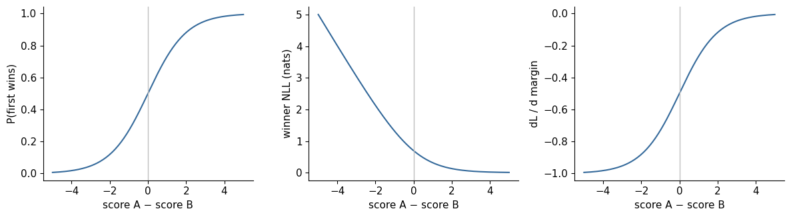
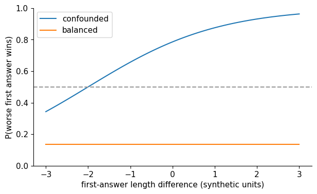

# 10. Preferences and Reward Models

Our story model learned to make locally plausible predictions while still
repeating itself and losing track of characters. Supervised fine-tuning can
demonstrate a better continuation, but demonstrations alone leave another useful
source of information unused: a reader can often recognize a better story
without being able to write an ideal one. This chapter asks how that comparison
becomes a trainable signal, and what the resulting scalar actually measures.

Chapter 9 followed a demonstration through its answer and ending. Now imagine
that we have two generated responses, neither quite the demonstration we would
write. A comparison can still say which better serves the request. That changes
the form of the supervision: we observe a relation between responses, rather
than a token-by-token ideal answer. We will first make that relation numerical,
then ask what happens when correctness and polish travel together in the data.

The prerequisites are next-token likelihood, gradient descent, and the evaluation
contract from Chapter 7. By the end, the reader should be able to derive a
pairwise preference likelihood, fit a transparent reward model, audit its
probabilities, and explain why a high reward is a fallible measurement. Days 15
and 16 share this argument: first define judgments; then model and challenge them.

## 10.1 A judgment needs a question

Imagine two answers to “Where is Lily's ball?” after a story explicitly puts it
in a red box. One answer says “In the red box.” Another gives a polished paragraph
about Lily happily playing outside without answering the question. Which is
better? A rubric emphasizing factual continuity favors the first; a rubric
emphasizing engaging prose might distract an annotator toward the second.

A preference record therefore includes a prompt $x$, two completions $y_a,y_b$,
the judgment, and the conditions under which it was made. Store the rubric,
source identifiers, presentation order, annotator or judge identity, abstentions,
and the reason for a tie. Preserve the original answers. “Chosen” and “rejected”
are convenient names for a selected pair, but they do not mean objectively true
and false. A rejected response can contain useful content, and both can be wrong.

Separate substantive criteria such as correctness, instruction compliance, and
coherence from nuisance criteria such as verbosity, headings, confidence, and
position on the screen. Some users genuinely prefer a particular style; that is
valid if the objective explicitly includes it. The danger is accidental style
selection being interpreted as improved reasoning. This continues Chapter 8's
interface argument: the training target includes every choice made while
constructing the record, not only the intended lesson.

## 10.2 From two scores to one preference probability

Let $r_\phi(x,y)$ be a real-valued score from a parameterized model. Fix one
prompt and write $r_y=r_\phi(x,y)$ briefly. Give each completion a positive strength
$s_y=\exp(r_y)$. If a comparison allocates probability in proportion to strength,
then

$$
P(a\succ b)=\frac{\exp(r_a)}{\exp(r_a)+\exp(r_b)}
=\frac{1}{1+\exp(-(r_a-r_b))}=\sigma(\Delta),\qquad \Delta=r_a-r_b.
$$

This is the Bradley–Terry model. The score difference is a binary classification
logit. A margin of zero means probability one half. A positive margin favors
$a$; a large magnitude expresses confidence under the model. The use of
pairwise likelihoods for language-model reward fitting follows the formulation
in [the DPO paper's preliminaries](https://arxiv.org/html/2305.18290v3#S3).

Why use a difference? The same response can win against a poor answer and lose
against a better one. A reusable scalar score lets us compare it with either;
the pair determines how the scores interact. Exponentiating turns real scores
into positive strengths, and their ratio is $\exp(r_a-r_b)$. This is a model
of judgments with a particular odds structure, rather than a claim that every
human comparison must obey it.

Now record $q=P_{\text{labels}}(a\succ b)$. A hard selection has $q=1$ or $0$;
aggregated repeated votes can give a fraction. The negative log-likelihood is

$$
L(\Delta,q)=-q\log\sigma(\Delta)-(1-q)\log(1-\sigma(\Delta))
=\mathrm{softplus}(\Delta)-q\Delta.
$$

The identity is easier to reproduce after defining
$\mathrm{softplus}(\Delta)=\log(1+e^\Delta)$:
$\log\sigma(\Delta)=\Delta-\mathrm{softplus}(\Delta)$ and
$\log(1-\sigma(\Delta))=-\mathrm{softplus}(\Delta)$.
Substitute these two expressions into the binary loss. The two softplus weights
add to one; the remaining term is $-q\Delta$. This form also connects the
pairwise loss to the cross-entropy machinery we already know.

Use a stable binary-cross-entropy-with-logits implementation. Computing the
sigmoid, then taking logarithms, can turn extreme but finite scores into
infinite losses. For an ordered winning pair, $q=1$ and
$L=\mathrm{softplus}(-\Delta)$. A pair has one likelihood, not two independent
absolute quality labels.

## 10.3 The gradient explains the update

Differentiate the stable expression:

$$
\frac{\partial L}{\partial\Delta}=\sigma(\Delta)-q,
\qquad
\frac{\partial L}{\partial r_a}=\sigma(\Delta)-q,
\qquad
\frac{\partial L}{\partial r_b}=q-\sigma(\Delta).
$$

Suppose annotators favor $a$, but the model currently favors $b$. The first
derivative is negative, so gradient descent raises $r_a$; the second is positive,
so it lowers $r_b$. If the model already predicts the preference confidently,
the correction becomes small. This is the same probability-minus-target
mechanism from Chapter 3, applied to a pair rather than a vocabulary.

Actual network updates also pass through score Jacobians. Two answers share
parameters, so increasing one scalar and decreasing the other are local
directions, not guarantees about every score after an optimizer step. An
embedding or transformer parameter can affect both sides. The transparent lab
first treats scores as independent leaves, then replaces them with
$r_\phi=w^\top f(x,y)$. It makes this distinction visible rather than hiding it
inside a large training library.

### Work one judgment through the correction

Use the existing [margin notebook](../../notebooks/day-15/01_bradley_terry_margin.ipynb)
scores $r_a=0.4$ and $r_b=-0.6$. Their margin is one, so the model predicts
$P(a\succ b)=0.731059$. With a hard label favoring $a$, the loss is
$-\log(0.731059)=0.313262$ nats. The score derivatives are $-0.268941$
and $+0.268941$: gradient descent raises the first leaf score and lowers the
second. Only their difference determines this pair's probability.

**Reader prediction:** keep the scores but replace the hard winner with seven
votes for $a$ and three for $b$. Should training make the margin still larger?

**Reference reasoning:** the target is now $q=0.7$. The first score derivative
becomes $0.731059-0.7=+0.031059$, with the opposite derivative for the second.
Descent slightly reduces the margin: the model is already more confident than
the observed vote fraction. Its optimum is $\log(0.7/0.3)=0.847298$, a
positive finite margin. Label disagreement changes the desired confidence,
rather than merely slowing a demand for certainty.

```python
import torch
from dongxi_llms.reward_model_lab import bt_loss
a = torch.tensor([0.4], dtype=torch.float64, requires_grad=True)
b = torch.tensor([-0.6], dtype=torch.float64, requires_grad=True)
loss = bt_loss(a, b, preference=torch.tensor([0.7], dtype=torch.float64))
print(float(loss.detach()), torch.autograd.grad(loss, (a, b)))
```

Change the preference to one while keeping both score leaves fixed. This
isolates the label's effect on the gradient. Adding the same offset to both
scores instead changes neither margin nor loss; §10.5 explains that freedom.



The horizontal coordinate is the same score difference in all three panels.
At zero the model is undecided and receives a substantial correction. Far to
the right it is confident and the hard-winner gradient approaches zero.
These are exact scalar computations, not measured judge accuracy. The source
is the notebook's margin-sweep reference; execute that companion in a fresh
copy using [Appendix D](../appendices/d-reproduction-and-environments.md).

## 10.4 Disagreement carries information

Suppose ten independent judgments favor $a$ seven times and $b$ three times.
Under a repeated identical comparison and the binary model, the empirical
target is $q=0.7$. Minimizing expected likelihood gives

$$
\sigma(\Delta^*)=q,\qquad
\Delta^*=\log\frac{q}{1-q}.
$$

The optimal margin is finite. The remaining loss is the entropy of the vote
distribution, not evidence that optimization failed. Repeating a deterministic
winner label for a genuinely ambiguous pair instead asks for unlimited margin
in an unconstrained separable model. A regularizer, finite training, or limited
model capacity may stop the scores growing, but these are different mechanisms.

The fraction does not explain *why* people disagree. They may interpret the
rubric differently, have different expertise, make errors, or represent
legitimate conflicting preferences. Annotator-stratified analysis can reveal
that one global probability conceals stable subgroups. A Bradley–Terry scalar
also imposes structure: its implied pair odds satisfy additive log-odds across
alternatives. Strong cyclic judgments cannot generally be represented exactly
by one score per answer. This is a model limitation, not a reason to delete
awkward labels until the dataset looks consistent.

For a concrete cycle at one prompt, suppose judgments require $a\succ b$,
$b\succ c$ and $c\succ a$, each with probability above one half. A scalar
model then requires $r_a-r_b>0$, $r_b-r_c>0$ and $r_c-r_a>0$. Adding the
three left sides gives zero, while the three required positive differences
would have a positive sum. No choice of these three scores can satisfy all
three demands. A pair-conditioned classifier can express richer relations,
but would give up this reusable single-score representation. The choice is
about which judgment structure we intend to model.

Ties require a declared convention. A soft $q=0.5$ says the model should predict
an even binary choice; it does not model a separate “equally good” event. If
ties are frequent and meaningful, use a model with an explicit tie outcome or
retain them for analysis. Abstention because the judge cannot assess a response
is a different event and should not automatically become a half-win label.

## 10.5 Reward has a gauge

For any function $c(x)$, replacing every score for one prompt by
$r'_\phi(x,y)=r_\phi(x,y)+c(x)$ leaves all within-prompt differences unchanged. Preferences
cannot identify the absolute origin of the reward. An intercept shared by the
two answers has zero gradient under pure pairwise loss. Adding fifty to every
score therefore says nothing about improvement.

Nor are raw scores from different reward checkpoints directly comparable.
One checkpoint can stretch margins while retaining identical rankings. Fixed
label-noise assumptions determine the meaning of that stretch: unlike an
additive offset, multiplying all scores changes preference probabilities.
Centering rewards fixes a convenient origin; temperature calibration fixes a
probability mapping. Neither establishes that the scores represent human welfare
or task accuracy on new prompts.

This freedom will matter twice. DPO cancels prompt-specific reward offsets.
Policy-gradient baselines can subtract an action-independent value without
changing the expected gradient. The algebra resembles the reward gauge, but
the purpose differs: identifiability for a preference model versus variance
reduction for an estimator.

## 10.6 Fitting a reward model

The small lab uses three features: substantive quality, response length, and
polished format. These are explicit synthetic coordinates, not measurements
inferred from real stories. Labels depend only on the first feature. A linear
score allows us to read every coefficient and ask which shortcut training found.

A neural reward model instead takes the prompt and completion through a
transformer and maps a selected hidden state to a scalar, for example
$r_\phi=w^\top h_{\text{end}}+b$. Selecting the final nonpadding position
requires an attention-mask-aware index. Padding at a fixed maximum index is not
the answer's end. Whether EOS is included, whether the chat template adds a
turn-ending token, and whether the reward head sees the prompt must be frozen
in the data contract.

The endpoint head makes the learned score useful beyond the original pairs.
We can generate a fresh completion, pass its prompt and complete answer through
the same backbone, and read one scalar at the declared endpoint. The pairwise
loss trains this scoring function by contrasting two such forwards. It does
not turn its scalar into a probability of correctness; only a specified
comparison and sigmoid produce a preference probability.

Both answer branches contribute gradients to shared parameters. A language-model
initialization can supply representations, but the scalar head must still learn
from comparisons. Outcome rewards evaluate a completed answer; process rewards
evaluate intermediate steps under a step-level annotation contract. They are
not interchangeable simply because both return numbers. A process verifier
can reward valid intermediate reasoning yet miss an invalid final claim, or
vice versa. The earlier feature experiment fits an outcome preference model;
the later text lesson below makes terminal and step-supervision boundaries
explicit, without claiming pretrained reward quality or general arithmetic.

Split by prompt or source group before forming answer pairs. Splitting individual
pairs can put the same prompt, near-duplicate answer, or generation family in
both training and development sets. Randomly swapping presentation order is valuable,
but a swap is not a new independent example. Score both orders during audits
to detect an order-dependent judge or preprocessing bug.

## 10.7 Ranking accuracy and calibration ask different questions

Pair accuracy checks whether the sign of $\Delta$ agrees with a winner. It
does not punish unjustified certainty. Probability metrics do. On independent
binary labels $l_i$, the Brier score is

$$
\frac1N\sum_i(p_i-l_i)^2.
$$

In our simulator the true soft probability $q_i$ is known, so the *expected*
binary Brier score is
$N^{-1}\sum_i[q_i(1-p_i)^2+(1-q_i)p_i^2]$. It includes irreducible label
variance. The simple squared discrepancy $(p_i-q_i)^2$ measures another
quantity and should not be mislabeled as the observed binary Brier score.

A reliability diagram bins predicted probabilities and compares mean prediction
against mean label frequency. Show counts in each bin. Empty or tiny bins do
not provide precise estimates. Expected calibration error depends on binning
and can conceal bad subgroup behavior. Keep held-out NLL, Brier score, ranking
accuracy, and slices together. Fit any temperature on a calibration split and
evaluate it on a separate final split; fitting and judging on the same labels
overstates evidence.

Temperature scaling replaces $\sigma(\Delta)$ with $\sigma(\Delta/\tau)$.
For positive $\tau$ it preserves pair rankings while changing confidence. It
cannot repair a systematically reversed ranking or a model that uses length
instead of correctness. Calibration is a conditional statement about a specified
population and label process, not a permanent property of the model.

## 10.8 A controlled shortcut experiment

The predeclared CPU experiment changes the training distribution while keeping
the linear score, seed, optimizer, number of examples, and held-out distribution
fixed. In the confounded arm, length and polished format nearly equal quality.
In the balanced arm, they vary independently. Soft preference labels follow
$\sigma(2\,\Delta\text{quality})$ in both. The held-out distribution and an
adversarial pair are independent of the training fixture.

Predict before running: both arms can fit training comparisons; the confounded
arm has insufficient evidence to isolate quality from correlated nuisance
features. On a pair whose first answer is substantively worse but much longer
and more polished, it may assign the wrong preference. The balanced arm can
identify the intended coordinate more clearly. The report preserves all
coefficients, learning curves, held-out NLL, probability calibration, and the
adversarial prediction. These are measured properties of the synthetic model,
not empirical claims about Qwen or human judges.

### A good fit can leave the important question unidentified

In the confounded data, a quality improvement nearly always accompanies more
length and polish. The optimizer can explain the judgments using any of those
correlated coordinates. Its low loss cannot tell us which explanation will
survive when a long, polished answer is wrong.

The [retained finite reference](../../experiments/reports/2026-10-04-preference-policy-cpu.json)
and the existing `reward_comparison()` helper make that ambiguity visible:

| Fitted arm | Quality coefficient | Length coefficient | Format coefficient | Probability worse polished answer wins |
|---|---:|---:|---:|---:|
| Confounded |0.655898|0.649301|0.651102|0.962504|
| Balanced |1.855388|-0.000018|0.004854|0.136947|

The adversarial difference vector is $(-1,3,3)$: the first answer is worse on
quality, but longer and more polished. Multiplying it by the confounded weights
gives a positive comparison margin; the balanced weights give a negative one.
The same loss and fitting budget therefore produce very different extrapolation
because the training examples supplied different identifying contrasts.

**Controlled change:** hold quality at minus one and format at three, then
vary only the length difference. Predict which fitted scorer changes its
decision before reading the notebook's sweep:



The dashed line is an even preference. The confounded curve crosses it as
length increases; the balanced curve remains below it because its length
coefficient is nearly zero. This source-backed plot is regenerated by
[Day 16's adversarial sweep](../../notebooks/day-16/01_reward_model_bias_audit.ipynb).
The coordinates are authored synthetic features, so the result isolates a
mechanism of confounding rather than demonstrating that a particular real
judge prefers verbosity.

The mechanism generalizes as a diagnostic question: when reward improves,
which feature changed? Audit matched-length pairs, matched-format pairs,
correct-but-plain answers, incorrect-but-polished answers, and refusal versus
valid response cases. Matching can itself alter the population, so report the
construction rule. Do not infer from one adversarial failure that all training
comparisons are useless, or from a high held-out score that a policy may safely
optimize the reward without encountering new failures.

## 10.9 When optimization changes the population

A held-out comparison dataset usually contains responses from a fixed generation
process. A policy maximizing the reward changes that process. It can discover
regions where the reward extrapolates badly: repetitive praise, excessive length,
format tricks, confident nonsense, or phrases correlated with high training
scores. This is the link from measurement to optimization. The reward model
may remain accurate on ordinary held-out comparisons while failing on responses
actively selected to exploit it.

Maintain independent outcome measurements and periodically audit samples from
the evolving policy. Freeze evaluation prompts and decoding settings before
comparing checkpoints. Store negative cases. A larger score is an observation;
improved usefulness requires another argument. Chapter 11 learns directly from
comparisons without a separately trained scalar head, but it still inherits the
preference data's biases and coverage limits.

## 10.10 Collecting judgments without confusing identity and position

Before fitting the reward model, build the observation instrument. A response
has a stable candidate ID, exact text, source checkpoint and generation settings.
Its display slot is temporary. If answer $a$ moves from A to B, a verdict of B
still chooses $a$. Store the displayed order and map it back to canonical answer
identity before writing a chosen/rejected pair. Swapping canonical answers is a
different operation: it reverses the binary preference label, while a display
swap should preserve the selected response. This distinction catches a quiet
failure in which a neutral judge supplies correct judgments but preprocessing
turns half of them into incorrect training labels.

The judge-facing display contains the rubric, question and A/B answer texts,
without checkpoint names or reviewed labels. Blinding removes one source of
influence; it does not establish neutrality. Answer style can reveal its origin,
and untrusted text inside an answer can ask the judge to ignore the rubric.
Preserve the exact displayed object and its hash, judge/revision, rubric/hash,
settings, raw verdict, parser version and every failure. A strict schema rejects
contradictory or malformed outputs rather than guessing the intended winner.
These collection concerns complement the discussion in the pinned
[RLHF Book preference-data chapter](https://github.com/natolambert/rlhf-book/blob/eecc49e1e1daf1be670d7242eb090240b5bb0f04/book/chapters/11-preference-data.md).
The implementation and fixture here are independently written course material.

Use separate outcomes for left preference, right preference, tie, abstention
and invalid observation. A tie says the answers are equally acceptable under
the rubric. Abstention says the judge cannot assess them. An invalid observation
says collection or parsing failed. None is automatically the same as a binary
target of one half. Report every category, then state the subset eligible for
reward training. Otherwise, a judge that declines hard cases may appear accurate
merely because its decisive denominator shrinks.

Ratings and rankings also need an explicit conversion. Equal observed ordinal
ratings may become a tie; missing ratings become an abstention. A score gap of
four on a five-point scale does not justify a Bradley–Terry logit of four: the
scale has not established equal utility spacing or calibrated odds. A ranking
of three answers yields three related comparisons, not three new independent
questions. Retain raw ratings or ordered tie groups beside the derived pairs
and record the conversion version.

## 10.11 Audit the judge before trusting the labels

An order audit presents the same pair in both directions and compares the
canonical outcomes. A repeat audit holds the pair and order fixed while
collecting another judgment. A verbosity intervention changes redundant wording
without changing the intended substantive answer. An injection intervention
adds untrusted instructions inside a candidate. Keep matched baseline/variant
identities so a change in judgment can be distinguished from a changed question.
Independently review whether the intervention actually preserves the rubric
label; an intended nuisance can become substantive under another objective.

No single check is enough. A judge can select the same answer in both orders,
yet prefer whichever answer is longer. It can be stable across repeats, yet
obey an injected instruction every time. First-position choice, canonical order
consistency, repeat disagreement and matched nuisance sensitivity answer
different questions. Show their numerators and denominators, along with
agreement against independent reviewed labels. Agreement does not prove the
reviewer is correct, and agreement between two judges sharing a shortcut does
not remove the shortcut.

The [offline collection notebook](../../notebooks/day-15/03_preference_collection_and_judges.ipynb)
makes those distinctions visible. Eight original authored base comparisons
cover six source groups. Three turns share one story source. Verbosity and
injection variants produce twenty-four pairs; five deterministic simulated
judges each supply two repeats in both orders. Four separately identified
malformed/transport controls bring the retained total to 484 observations.
Reference labels are authored separately from the toy judge rules; they are
not independent human feedback. Human, AI, authored and simulated provenance
remain distinct in the data contract and report.

In the [measured CPU report](../../experiments/reports/2026-10-04-preference-audit.md),
the first-slot rule has first-position choice rate 1 but canonical order
consistency 0.25. Ties and abstentions explain why consistency is not zero.
The longer-answer rule has order consistency 1, yet changes its outcome on
37.5% of matched verbosity observations. The injection-sensitive rule also
passes order consistency, while changing on 37.5% of matched injection
observations. The repeat-unstable rule disagrees on 75% of paired repeats.
These are deliberately constructed simulations, not measured failure rates
of a live language-model judge. A transparent keyword rule supplies a perfect
positive control on this narrow fixture, not a credible general evaluator.

## 10.12 Source weighting is part of the objective

Group conversational siblings, repeated comparisons, swapped displays and
perturbations by their original source prompt. Assign the group to a split
before generating its pairs. Changing a turn's row ID or inventing a new source
ID does not make it independent of its conversation. The audit rejects source
or task-family split collisions, cross-source conversation siblings, inconsistent
candidate content IDs and duplicate comparison records. Near-duplicate source
discovery still needs its own declared rule; these exact identity checks are
not a semantic contamination detector.

If source $s$ supplies $n_s$ training pairs and the intended population weights
each source equally, one suitable objective is

$$
L=\frac{1}{S}\sum_{s=1}^{S}\frac{1}{n_s}
\sum_{j=1}^{n_s}L_{s,j}.
$$

Each source contributes total weight one before the final normalization. Our
box-story source supplies nine pair rows after nuisance expansion, versus three
for each one-turn source. Per-pair weights 1/9 and 1/3 preserve equal source
influence. Equal-pair weighting instead makes the box source three times as
influential. Repeated judge observations require another explicit aggregation
choice; they cannot silently add more independent questions.

The notebook's authored demonstration yields row-weighted outcome agreement 0.5
but source-balanced agreement 1/3 on the same records. Neither number is the
uniquely correct objective: a product may deliberately prefer a traffic-weighted
population. The obligation is to declare the population and weighting, not to
let the number of candidates choose it accidentally. This returns us to
Chapter 7's contract: evaluation and training metrics must name what is counted.

## 10.13 Learning a reward from token sequences

The known-feature shortcut experiment made the confound readable. A text reward
instead learns contextual states and reads one scalar from a chosen endpoint:

$$
H=f_\phi(x,y),\qquad
e=\max\{t:m_t=1\},\qquad
r_\phi(x,y)=w^\top H_e+b.
$$

Here $m_t$ marks valid tokens, $H$ has shape $[n,24]$, and a batch has ID shape
$[B,n]$, hidden-state shape $[B,n,24]$ and score shape $[B]$. Both answers share
the decoder and scalar head, so preference gradients reach the whole backbone.
The [canonical text reward](../../src/dongxi_llms/text_reward_lab.py) reads:

```python
def token_scores(self, ids, mask):
    return self.head(self.hidden(ids, mask)).squeeze(-1)

def forward(self, ids, mask):
    scores = self.token_scores(ids, mask)
    return scores.gather(1, last_valid_indices(mask)[:, None]).squeeze(1)
```

`last_valid_indices` selects the maximum valid array position and rejects an
all-padding row. `mask.sum(-1)-1` works for right padding but fails for left
padding. Valid-token position IDs and zero padded-query contributions preserve
left/right parity and finite gradients. EOS is the declared endpoint here;
a no-EOS variant scores the last answer token. Earlier words still receive
gradients through the endpoint's causal context.

The [three-seed experiment](../../experiments/reports/2026-10-04-text-reward.md)
fits twelve original color-comparison groups. All seeds rank the four ordinary
held-out matched pairs correctly, yet “box” and “book” both become `<unk>`:
all four test encodings duplicate calibration inputs. Training/test encodings
remain distinct, but this apparent success cannot establish independent
calibration generalization. Adding headings yields ranking accuracies
0.5, 1.0, 0.5; making wrong answers longer also exposes a failure. Formatting
changes can shift scores even when substance is unchanged.

Calibration is a different measurement. A frozen temperature grid uses only
four calibration sources; held-out NLL, Brier and counted reliability bins
expose confidence. Temperature can change probabilities without repairing a
ranking inversion. Authored tie targets use probability one half, whose expected
Bernoulli Brier minimum is one quarter. These are synthetic targets, not measured
human preference frequencies or an explicit tie model.

## 10.14 Outcome labels and process labels supervise different questions

Consider “Compute 2+3.” A trace can write the false equality “2+3=6,” then
give the correct final answer 5. Another can write the valid equality “2+3=5,”
then give the wrong final answer 6. A terminal correctness label cannot identify
which intermediate equation was valid. A local step-validity label cannot
establish that the eventual conclusion is correct. Both crossed cases are
original records in the text fixture rather than merely hypothetical caveats.

The outcome microscope predicts a binary target from the final EOS state.
The process microscope predicts a separate binary target at each explicit
step marker. Let $\mathcal B$ be the declared supervised boundary positions,
$a_b\in\{0,1\}$ their authored validity labels and $s_b$ the scalar logits:

$$
L_{\mathrm{step}}=-\frac{1}{|\mathcal B|}
\sum_{b\in\mathcal B}
\left[a_b\log\sigma(s_b)+(1-a_b)\log(1-\sigma(s_b))\right].
$$

Implement this with stable binary cross-entropy on logits. Unlabeled tokens,
padding and the final-answer position do not receive a step target. When
sources contribute different numbers of traces or boundaries, declare how
those losses are weighted; the reference averages within a source, then across
sources. The terminal and process models are trained separately so their
different contracts do not disappear behind one combined scalar.

Each step state is causal. Changing only the later final answer leaves an
earlier step score unchanged in the same forward pass. Training on its local
step label can still update the shared encoder. That label is not a value
target: a critic in Chapter 12 estimates expected future reward under a policy,
whereas this process label judges a displayed equality under an annotation
rubric. A useful-looking scalar does not make those meanings interchangeable.

One-step/two-step traces include all four terminal/local correctness combinations. Yet the held-out outcome and step
classifiers each reach only 0.5 accuracy for all three seeds. The report exposes
a concrete reason: numbers 7 and 8 are absent from the training vocabulary and
both become the same unknown ID. Opposite labels can therefore have identical
encoded inputs. No classifier can distinguish those records from that
representation alone. High confidence in those failed predictions is retained,
not explained away as successful reasoning. The character intervention below tests this diagnosis while retaining the failed run.

## 10.15 Freeze the reward before optimizing a policy

Freeze the predeclared seed 1601 word-token reward regardless of which seed
looks best on a nuisance slice. The [saved numeric export](../../fixtures/text-reward/frozen-preference-seed1601.json)
preserves weights, ordered token meanings, preprocessing, special IDs and the
EOS/endpoint policy. Equal tensor dimensions alone cannot detect a vocabulary
permutation. The loader disables reward gradients; exact saved-state score
equality is measured in the tested environment.

Freezing holds a proxy fixed without making it true. Retain independent factual
checks and responses rewarded for headings, repetition or other nuisances.
[Appendix D](../appendices/d-reproduction-and-environments.md#policy-reference-and-pending-rollout-identity)
records export/identity boundaries. Neither the known-feature nor the text
microscope establishes pretrained reward quality.

## 10.16 Preserve information before asking for generalization

An unknown token can erase a distinction before the neural network has any
opportunity to learn it. That explains why two differently labeled arithmetic
traces could have identical word-token inputs; it does not imply that restoring
the distinction will make the learned rule correct. **Reader prediction:** if distinct digits now receive distinct IDs, must the
model learn the arithmetic rule?

The [character intervention](../../experiments/reports/2026-10-04-text-reward-character.md)
keeps the original raw fixture, but uses a separately fixed printable ASCII
alphabet. Spaces and punctuation remain characters. Unsupported input is
rejected before casefolding, not silently mapped to UNK. SEP, STEP and EOS keep
their explicit boundary meanings.

Before any fit, the intervention checks exact complete pairs in both candidate
orders, full prompts, prompt/completion inputs and causal prefixes through
supervised STEP markers. Different raw source IDs cannot license equal encoded
inputs across splits. Repeated equal-label prefixes inside one source remain
related observations. Arbitrary shared short prefixes such as the first letter
of “Compute” are not contamination; the full supervised context is the unit
being checked. The character arm has no cross-source/split collisions among 55
baseline, nuisance and trace records. Exact-input separation still does not
establish semantic independence or a large evaluation population.

The same real decoder/head design now processes character sequences. Its
100-entry alphabet and frozen 160-position bound give 11,185 parameters;
training remains float64 CPU, with 120 preference updates and 80 each for
terminal/process models. Seeds 1611, 1612 and 1613 are fixed in advance, and
seed 1611 is exported before its test evaluation. The word arm remains intact; differing sequence lengths and position tables
prevent an equal-compute tokenizer-superiority claim.

All three training objectives fit. Nevertheless, ordinary held-out ranking is
only 0.5 for every seed. Terminal accuracy is 0, 0.5, 0; local-step accuracy is
0, 0.5, 0.5. The network now receives distinct number IDs, so the earlier
unknown-token collision cannot explain these new failures. Preserved
information was necessary, not sufficient, for generalization. High training
accuracy and nonzero backbone/head gradients establish learning on those
examples, not the desired abstract rule.

Calibration can now be measured on distinct encoded calibration/test inputs.
Every seed chooses temperature 4 from the predeclared grid using calibration
NLL alone. For seed 1611, held-out NLL falls from 6.295234 to 1.614901 and
Brier from 0.499997 to 0.460377, but ranking stays 0.5. Temperature softens
overconfidence; it cannot reverse a learned ordering. With only four source
questions, counted bins matter more than the apparent smoothness of a plot.
These authored labels are not calibrated human preference frequencies.

The [frozen character export](../../fixtures/text-reward/frozen-char-preference-seed1611.json)
has its own complete numeric state, protocol, source, encoding and endpoint
identity. Exact reload compares the same saved state in the same environment.
Fresh retraining under a newer Torch version is a different reproducibility
question; the notebook retains the first failed portability assertion and
prints that difference rather than rewriting historical weights. A linked
policy experiment must state which frozen proxy it optimizes. Separate
balanced/confounded fits need their own fixture, selection rule and exports,
plus independent factual measurements. Freezing an imperfect reward does not
make its score true.

## 10.17 Companion route and exercises

Run [Day 15's margin microscope](../../notebooks/day-15/01_bradley_terry_margin.ipynb),
[Day 15's disagreement/calibration lab](../../notebooks/day-15/02_disagreement_and_calibration.ipynb),
[Day 15's collection/judge audit](../../notebooks/day-15/03_preference_collection_and_judges.ipynb),
[Day 16's shortcut audit](../../notebooks/day-16/01_reward_model_bias_audit.ipynb),
and [Day 16's text/outcome/process lesson](../../notebooks/day-16/03_text_reward_and_process_labels.ipynb).
The [lab guide](../labs/10-preferences-and-reward-models.md) records the machine
route and reproduction command; [worked solutions](../solutions/10-preferences-and-reward-models.md)
follow each exercise. Use the [specification](../../experiments/specs/2026-10-04-preference-policy-cpu.md)
and [measured report](../../experiments/reports/2026-10-04-preference-policy-cpu.md)
to distinguish predictions from results.

1. Derive the score gradients for a soft preference target and explain their signs.
2. What does adding a prompt-specific constant to all rewards change? What does multiplying rewards by two change?
3. Why can a well-trained preference model have nonzero minimum loss on repeated judgments?
4. Construct cyclic preferences and explain the restriction imposed by one score per answer.
5. Design a split that prevents a prompt with many candidate pairs from leaking into the development set.
6. Explain how two models can have identical pair accuracy and different Brier scores.
7. Why should calibration temperature be fitted on a different split from final evaluation?
8. Diagnose a reward model that likes longer incorrect answers. What would distinguish intended style from a shortcut?
9. Which hidden state should a padded transformer reward head score? Explain an off-by-one failure.
10. Why can optimization reveal reward failures absent from a fixed held-out pair set?
11. When an answer moves from A to B, what must change in a raw verdict and what must stay fixed in the selected candidate identity?
12. Why can a judge pass an order audit yet fail a verbosity or instruction-injection audit?
13. A source yields nine pair rows while another yields three. Compare equal-pair and equal-source objectives, and explain how repeats affect the evidence unit.
14. How should equal ratings, missing ratings, contradictory verdicts and transport failures differ in a preference collection contract?
15. Why does `mask.sum(-1)-1` fail with left padding, and what positional convention preserves the score of unchanged text?
16. Construct a correct final answer with an invalid step and a wrong final answer with a valid step. Where should each supervision target be placed?
17. Why is a process-validity target different from a critic's expected future-return target?
18. If different numbers become the same unknown token, what can and cannot be learned about their held-out labels?
19. Which identities must accompany a frozen scalar reward head, and why must its checkpoint be chosen before looking at nuisance-test performance?
20. Why can raw source groups be disjoint while actual model inputs collide? What does a whole-pair/swap/causal-prefix audit add, and what does it still not prove?
21. If distinct characters remove unknown-token collisions but heldout predictions still fail, what can you conclude about representation versus generalization?
22. Why can calibration lower NLL without improving ranking? Distinguish same-state reload equality from identical retraining across package versions.

The next chapter retains the pairwise probability model, but replaces the scalar
reward with a policy's change in log-probability relative to a frozen reference.
Understanding the score difference, its gauge, and its evidence limits makes
that transformation much easier to interpret.
