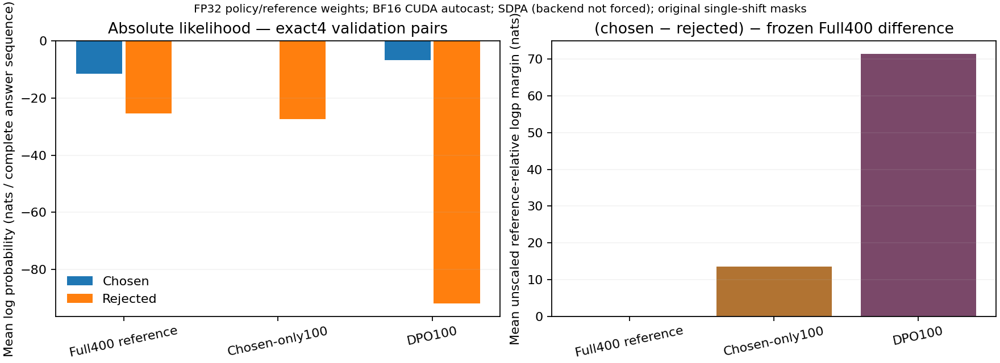

# 11. Direct Preference Optimization

A preference tells us that one answer is better than another. The previous
chapter turned this judgment into a scalar reward model, then warned that
optimizing the scalar can discover its mistakes. Can we use the comparison to
train the language policy directly? Direct Preference Optimization, or DPO,
answers that question through a change of variables. Its simplicity becomes
useful only when we understand what is being compared, which reference is held
fixed, and what the loss does not guarantee.

This chapter builds on sequence likelihood, Bradley–Terry modeling, and
supervised fine-tuning. Days 17 and 18 form one route: derive the objective,
audit its implementation, then compare policies using a frozen evaluation
contract. The complete derivation below is an independently worked finite-space
example of the construction introduced in
[Rafailov and colleagues' DPO paper](https://arxiv.org/abs/2305.18290).

## 11.1 The reference is a distribution over possible continuations

Fix prompt $x$ and let $\pi_{\text{ref}}(y\mid x)$ be a reference policy over
complete responses. It is commonly a supervised checkpoint at the start of
preference training. A policy $\pi$ may move probability toward higher-reward
answers, but a movement penalty expresses a preference for staying near that
reference:

$$
J(\pi)=\sum_y\pi(y\mid x)r(x,y)
-\beta\sum_y\pi(y\mid x)\log\frac{\pi(y\mid x)}{\pi_{\text{ref}}(y\mid x)},
\qquad \beta>0.
$$

The second term is $\beta\,\mathrm{KL}(\pi\Vert\pi_{\text{ref}})$. Its
direction matters: samples would come from the current policy, and their log
ratio is measured against the reference. The finite derivation assumes the
reference is positive on every candidate under discussion and rewards are
finite. A policy placing mass outside the reference support incurs infinite
forward KL. Real softmax models have positive theoretical token probabilities,
but truncation, top-$k$ sampling, and numerical underflow can create a different
effective support. Do not quietly transfer a theorem about one distribution
to another sampler.

This is an objective over response probabilities. It does not mean that two
neural checkpoints have nearby weights, nor that a small KL implies every
rare behavior is preserved. A reference is a behavioral anchor under a specified
prompt population; that population belongs in the experiment contract.

## 11.2 Solve the finite optimization problem

Use a Lagrange multiplier $\lambda$ for $\sum_y\pi_y=1$:

$$
\mathcal{F}=\sum_y\pi_y r_y
-\beta\sum_y\pi_y\log(\pi_y/\pi_{\text{ref},y})
+\lambda\left(\sum_y\pi_y-1\right).
$$

Differentiating with respect to a positive probability gives

$$
r_y-\beta\left(\log\frac{\pi_y}{\pi_{\text{ref},y}}+1\right)+\lambda=0.
$$

Rearrange and absorb the shared constant into normalization:

$$
\pi^*(y\mid x)=\frac{\pi_{\text{ref}}(y\mid x)\exp(r(x,y)/\beta)}{Z(x)},
\qquad Z(x)=\sum_y\pi_{\text{ref}}(y\mid x)\exp(r(x,y)/\beta).
$$

The optimum exponentially tilts the reference toward reward. Compute it as
$\mathrm{softmax}(\log\pi_{\text{ref}}+r/\beta)$ for stability. With fixed
reward, large $\beta$ resists movement; small $\beta$ concentrates mass more
strongly. Adding a prompt-dependent constant to rewards multiplies numerator
and partition function by the same factor, so the policy is unchanged. This
is Chapter 10's reward gauge appearing inside an optimization problem.

The solution is exact for unrestricted finite distributions. A transformer
shares parameters across prompts and may not represent every independently
specified optimum. Optimization, preference coverage, and finite sample noise
are further limitations. The closed form is the reason for the loss design,
not a certificate that a short neural training run reaches the ideal policy.

## 11.3 Replace the latent reward with policy log ratios

Take logarithms of the optimum:

$$
r(x,y)=\beta\log\frac{\pi^*(y\mid x)}{\pi_{\text{ref}}(y\mid x)}
+\beta\log Z(x).
$$

For two responses to the same prompt, the $\log Z(x)$ terms cancel. Define
the policy's reference-relative pair margin

$$
m_\theta=\beta\left[
\log\pi_\theta(y_w\mid x)-\log\pi_{\text{ref}}(y_w\mid x)
-\log\pi_\theta(y_l\mid x)+\log\pi_{\text{ref}}(y_l\mid x)
\right].
$$

Substitute this into the Bradley–Terry preference likelihood. For an ordered
winning pair,

$$
L_{\text{DPO}}=\mathrm{softplus}(-m_\theta).
$$

For an explicit soft preference target $q$, use
$\mathrm{softplus}(m_\theta)-q m_\theta$. The model is now a language policy,
but the classification target is still a preference. Offline DPO needs the
recorded pair's likelihoods; it does not require generating a fresh response
for every update. That operational advantage does not remove biases inherited
from the recorded comparisons.

The reference-relative term asks “How has the policy changed the relative odds
since initialization?” It does not simply ask whether the chosen completion
is more probable than the rejected completion. An answer initially unlikely
under the reference can receive a favorable implicit reward after a modest
probability increase while still remaining unlikely in absolute terms.

## 11.4 The gradient and the meaning of beta

Write $c=\log\pi_\theta(y_w\mid x)$ and
$l=\log\pi_\theta(y_l\mid x)$. With a frozen reference,

$$
\frac{\partial L}{\partial c}=\beta(\sigma(m_\theta)-q),\qquad
\frac{\partial L}{\partial l}=-\beta(\sigma(m_\theta)-q).
$$

At initialization $\pi_\theta=\pi_{\text{ref}}$, every relative margin is
zero. For a hard winning pair the derivatives are $-\beta/2$ and $\beta/2$.
At this point larger $\beta$ gives a larger local gradient for fixed learning
rate. Yet in the fixed-reward optimum larger $\beta$ means stronger restraint.
These statements concern different comparisons and are compatible.

For a fixed noisy target $q$, the optimal classifier margin is
$m^*=\log(q/(1-q))$. The corresponding change in pair log odds is $m^*/\beta$.
Thus changing beta alters both gradient scale and the policy displacement
needed to fit the same preference probability. Report beta with learning rate,
update count, and data noise. It is not inference temperature: sampling
temperature modifies decoding after training, while beta defines the training
objective relative to a reference.

The full parameter gradient combines both answer branches through shared
transformer weights. Just as in Chapter 10, independent scalar derivatives do
not imply independent changes in every sequence probability. DPO can increase
the pair ratio while decreasing *both* answers' absolute likelihoods. Probability
mass can move toward a third continuation absent from the comparison.

## 11.5 Sequence likelihood is a sum with a boundary

An autoregressive completion has

$$
\log\pi_\theta(y\mid x)
=\sum_{t=1}^{|y|}\log p_\theta(y_t\mid x,y_{<t}).
$$

Include a termination token under the declared template when it belongs to the
response. Otherwise a model can assign high prefix likelihood without learning
when to stop. Do not sum prompt likelihood into the DPO response score. The
prompt supplies context and can receive gradients through attention, but its
tokens are not the completion being compared.

For a batch, predictive logits have shape $[B,T,V]$, aligned labels and the
completion mask have shape $[B,T]$, and the gathered token log-probabilities
have shape $[B,T]$. Summing the masked values produces $[B]$ sequence scores.
Chosen and rejected branches each produce one vector. The DPO loss reduces the
pair vector only after these sums.

Perform causal shifting exactly once: run the model on `input_ids[:, :-1]`,
score `input_ids[:, 1:]`, and shift the completion mask with the target tokens.
The first response token is predicted at the final prompt position. A mask
shifted by the input positions instead of target positions drops that token and
may accidentally score another boundary. Padding masks affect attention;
completion masks affect which targets enter the score. They have different jobs.

Use `log_softmax`, gather safe labels, then mask. Labels set to `-100` cannot
be gathered directly; replace unscored labels by a valid temporary index before
gathering. Reject an empty scored completion instead of quietly assigning zero
likelihood. Every branch must use the same tokenizer, template, EOS convention,
precision policy, and response boundary for policy and reference.

## 11.6 Length normalization changes the model

Long sequences often have more negative log-probability because they contain
more terms. Summing is nevertheless the log-likelihood of the full response.
Dividing by response length gives average token log-probability, which describes
a different comparison. Replacing sums by averages in the standard derivation
does not preserve its response distribution interpretation.

This does not mean every length-adjusted preference algorithm is invalid; it
means an adjustment requires a named objective and a separate argument. First
audit preference length differences, EOS handling, truncation, and the generation
length distribution. Compare independent quality slices at matched length as
well as ordinary prompts. Do not declare a loss-mask or sequence-sum bug to be
“length debiasing.” The Day 17 heatmap lab exposes prompt, response, and pad
positions so that this boundary is visible.

## 11.7 A frozen reference is an implementation contract

Put the reference in evaluation mode, disable gradients, and score it under
`no_grad`. Do not update it with the policy optimizer. Disabling dropout matters:
otherwise two identical checkpoints can produce different log-probabilities at
initialization because of stochastic layers. Freezing weights alone is not
evaluation mode, and evaluation mode alone is not freezing gradients.

Reference scores may be cached for a fixed dataset. The cache identity must
include checkpoint hashes, tokenized sequence hashes, template and tokenizer
revisions, completion boundaries, dtype, and any normalization convention.
Changing any of these invalidates the cache. A detached tensor from the current
policy is not a fixed reference: it prevents one backward path but changes every
step, producing a different objective.

For model-scale training, reference memory is a real cost. The optional Spark
runner holds two model copies and one optimizer, uses bounded accumulation,
checks host memory reserve, and records its environment. This simple full-weight
path favors clarity over throughput. A production implementation might use
cached scores, a frozen adapter-disabled base, or distributed placement, but
each requires equivalence checks before it replaces the transparent path.

Recovery must retain the *original* reference as well as the current policy.
Copying a restored, already trained policy into the reference silently changes
every reference-relative margin. It may make the code run while changing the
objective. A completed DPO boundary therefore binds policy/reference weights,
Adam moments, pair sampler and global RNG, completed updates, cumulative branch
work and committed numerical metric history to the same scientific contract.

Save that boundary before final evaluation or HF export. An export failure is
not permission to discard the last durable optimizer state, and a successful
HF export alone is not a complete restart. The shared format from section 9.6
checks separately expected byte identity before restricted tensor loading;
the DPO runner must additionally check frozen-reference identity, parameter
binding, sampler draws and the recorded work counts before applying anything.
See the [runner-owned plan](../../docs/PRODUCTION_RECOVERY_PLAN.md). Same-environment
tiny CPU replay is a source gate, not a pretrained or Spark recovery result.

The resource boundary is wider than that optimizer boundary. Before an accumulated
update, reserve its entire chosen/rejected policy/reference work rather than
drawing examples and then discarding those that exceed a cap. Baseline/final
evaluation and greedy generation need their own panel reservations. Keep a durable
resource journal separate from committed numerical history: a failed attempt after
the latest snapshot still happened, and a new output directory must not refund it.
Conservative logical-position bounds, known actual calls and unknown internal
failed-call work are different records. Chapter14 section14.8 develops this
distinction and the additional physical quota/containment gates; none follows
from a finite loss or a successfully loaded checkpoint.

## 11.8 Controlled experiments and an instructive negative result

Two CPU experiments answer different questions. The categorical experiment has
two contexts and three possible complete answers. It uses known soft preferences
and compares DPO, flipped-label DPO, and chosen-only SFT from the same reference.
Exact expected reward and reference KL are available because the entire response
space can be enumerated. An oracle exponential tilt is an analysis benchmark,
not an extra training label secretly supplied to DPO.

The sequence experiment trains the actual tiny decoder from Chapter 5. Six
short prompts prefer an answer token called A over B; both branches include
EOS. A held-out prompt measures $P(A\mid x_{\text{heldout}})$ independently of
the pair loss. It is intentionally a severe simplification: answers are symbolic,
the prompt set is tiny, and no English capability is being tested.

The [report](../../experiments/reports/2026-10-04-preference-policy-cpu.md)
retains the resulting curves, including failures. A favorable pair margin can
coexist with worse absolute probability of the desired answer. That is a concrete
reason to evaluate free generation and independent tasks after preference
training. The chosen-SFT arm provides a useful control, but it sees demonstration
supervision rather than identical information; equal update count does not make
the two datasets semantically equivalent.

For Day 18's Qwen extension, begin with a saved SFT checkpoint, preserve an
untouched SFT control, train a DPO arm, and include a label-shuffled or matched
chosen-only control under a declared purpose. Use independently frozen tasks,
paired decoding seeds, refusal/correctness/coherence slices, and sample-level
outputs. Reward margins are training diagnostics, not the final verdict. The
[Spark runner](../../scripts/run_chapter11_spark_dpo.py) and
[lab guide](../labs/11-direct-preference-optimization.md) provide an executable
path. Its early tiny CPU results and the later native recovery proof answer
different questions; the fixed 100-update preference comparison remains pending
until its own training and common evaluation records exist.

### 11.8.1 Chosen likelihood and rehearsal: extra objectives, not free repairs

A preference comparison says which of two recorded responses should win. It
does not supervise every other response or every other task. To give an absolute
chosen-likelihood objective a voice, augment the pair loss explicitly:

$$
L_{\alpha,\gamma}=L_{\text{DPO}}
+\alpha N_{\text{chosen}}+\gamma N_{\text{rehearsal}},\qquad
N_{\text{chosen}}=-\frac{\sum_{i=1}^B c_i}{\sum_{i=1}^B T_{w,i}}.
$$

Here $c_i$ is the summed chosen-response log-likelihood, $T_{w,i}$ counts
its valid response tokens including EOS, and $B$ is the number of pairs.
$N_{\text{rehearsal}}$ is a separate supervised next-token loss on retained
demonstrations, also normalized by its own valid-token count. Alpha and gamma
are nonnegative coefficients. This global token mean is not a mean of
per-response averages; variable response lengths make the distinction matter.
Neither auxiliary changes the DPO response sums into token averages.

With hard recorded preferences and frozen references, the direct chosen-score
derivative is

$$
\frac{\partial L_{\alpha,\gamma}}{\partial c_i}
=\frac{\beta}{B}(\sigma(m_i)-1)
-\frac{\alpha}{\sum_j T_{w,j}}.
$$

The extra negative term pushes recorded chosen likelihood upward. Rehearsal
adds its own parameter gradient; it is not a new direct derivative of this
pair's score. Through shared embeddings, attention and MLP weights, those
directions can reinforce or compete. Turning alpha off recovers ordinary DPO
**only when gamma is also zero**. A positive rehearsal coefficient still
defines a different objective.

This added pressure is not a correctness guarantee. If the recorded winner is
wrong, chosen NLL imitates the wrong response. If it is unnecessarily verbose,
the auxiliary teaches that style too. Rehearsal protects only the supplied
distribution under its weight and budget; it neither bounds every forgotten
capability nor ensures transfer to new inputs. These terms change supervision,
not just numerical stability.

The [retention and preference-control notebook](../../notebooks/day-18/02_dpo_retention_and_preference_controls.ipynb)
uses the actual shared decoder and supervised stack, rather than another
independent logit table. A frozen recipe jointly warms the model on symbolic
first-slot copying and a separate parity task, then copies that warm state
into DPO, DPO+chosen NLL, DPO+rehearsal and the combined arm. All three seeds,
fixed coefficients, final checkpoints and four data conditions are retained:
clean pairs, fixed label swaps, longer chosen responses, and matched-length
long responses. The parity pairs never enter preference training, while their
training demonstrations supply rehearsal. Common boundary tokens are shared;
the operands and answer alphabets otherwise differ.

The evaluation asks two different questions: can the policy preserve the
trained parity skill, and can it freely generate the right first-slot response
for unseen ordered pairs? It consumes its own emitted tokens, not a gold
continuation, and records EOS, truncation and full canonical completion.
First-answer correctness is weaker than answer-plus-EOS success. The symbolic
parity held-out uses previously unseen numeral tokens, so it is a severe input
novelty slice rather than isolated arithmetic extrapolation. No held-out row
chooses a coefficient, warm checkpoint or favorable seed.

Inspect absolute chosen and rejected sequence log-likelihood alongside margin;
then inspect generated rows and the separate-task slice. The
[predeclared protocol](../../experiments/specs/2026-10-04-dpo-retention.md) and
[retained evidence](../../experiments/reports/2026-10-04-dpo-retention.md)
disclose pair tokens, chosen auxiliary supervision and additional rehearsal
forwards. Chosen NLL reuses the chosen scores: it adds an objective but not a
new chosen forward. Rehearsal adds different targets and another forward.
Equal update counts are consequently neither equal information nor equal
processing budgets. This new comparison does not replace or relabel the
earlier negative DPO result and establishes no universal repair or Qwen claim.

The fixed experiment also retains failures in the warm control: all three
warm states solve their four training copying prompts, none solves an unseen
copying pair, and parity succeeds on only 3/4, 2/4 and 2/4 trained rows.
Under clean DPO those parity scores become 2/4, 0/4 and 2/4. Chosen NLL keeps
absolute chosen likelihood high here but does not protect parity; rehearsal
arms reach 4/4, 3/4 and 4/4 parity successes. Because parity was not fully
learned initially, this last change includes further supervised learning, not
only protection of an already perfect capability. Held-out copying stays low,
and fixed noisy-label controls fail it entirely. These observations are useful
precisely because the added objectives do not repair every failure.

### 11.8.2 What a matched chosen-SFT control actually matches

Suppose DPO improves the location task. Did the comparison teach a useful
distinction, or would simply showing the preferred answer again have helped?
An untouched-parent arm and a chosen-only SFT arm make that question testable.
They do not make the supervision identical: chosen-SFT never sees the rejected
answer, while DPO evaluates both responses against the original frozen reference.

The [paired-path implementation](../../src/dongxi_llms/chosen_sft_control.py)
uses the existing preference runner's encoding, collator and DPO update, and
the existing SFT runner's summed cross-entropy. It converts the exact chosen
response mask into SFT labels, retaining prompt masking, one shift and the
terminal target. All arms start from the same independently identified parent;
the trainable arms use the same private with-replacement draws. Equal seed
numbers alone would not establish that equality if one runner instead shuffled
through a cyclic data stream.

Chosen-SFT divides the accumulation window's summed cross-entropies by its
total valid chosen targets. DPO uses complete-response log-probability sums
inside a mean-pair loss. These are explicit objective reductions, not interchangeable
uses of a common learning rate. A longer preferred response therefore contributes
through all its valid targets; it is not silently reduced to one equally weighted
per-response token average.

Report what is matched: parent, actual draw indices, chosen IDs/masks, valid
chosen targets, updates and declared optimizer recipe. Then report what is not:
rejected supervision, policy input geometry, reference calls, reduction and
compute. Equal chosen exposure is a useful control for demonstration repetition;
it is not an equal-information or equal-FLOP experiment.

The [two-seed CPU report](../../experiments/reports/2026-10-05-matched-chosen-sft-control.md)
uses saved and reloaded random 6,592-parameter parents, not pretrained weights.
Each trained arm makes 12 identical pair draws and sees 48 chosen targets.
Chosen-SFT submits 12 policy forwards over 288 input positions, with no reference
forwards. DPO additionally supervises 36 rejected targets and submits 24 policy
and 24 reference forwards, over 540 positions in each lane. These training
counters exclude the separate validation/generation work; they are not FLOPs.

All six fixed arm/seed rows receive 0/4 independent exact match. Both chosen-SFT
rows stop naturally on all four prompts, while DPO stops on four and one.
Emitting EOS is not answering correctly. The report retains the actual wrong
texts and caps; no arm, coefficient or checkpoint is chosen to conceal this
failure. The successful matching and mask checks establish an instrument, not
a useful location assistant or a prediction of the pretrained outcome.

The original location fixtures keep training, validation and publication
scenarios separate. The held-out generation consumes its own emitted tokens
and is graded against independently authored answers after generation. Keep
raw failures, EOS versus caps and absolute chosen/rejected likelihoods; neither
the final arm nor its hyperparameters are selected from those held-out scores.
The [lab](../labs/11-direct-preference-optimization.md) explains the executable
path and its verification boundary. Random tiny-model checks do not establish
pretrained quality; the intended Spark control, resource approval and accounted
interrupted recovery require their own evidence before a pilot.

### 11.8.3 A matched control must recover its sampling and its spent work

The [counted chosen-SFT recovery](../../experiments/reports/2026-10-05-chosen-sft-accounted-recovery.md)
now tests that missing CPU boundary explicitly. Restore the exact chosen
objective, full-sequence geometry, parent/interface, Adam, private replacement
sampler and global RNG. Replacing its sampler with shuffled cycling would break
the matching argument even if the restored parameters were correct.

Two actual fresh-process continuations recover update2 and finish the same
six-update trajectory exactly. A deliberately failed later update remains in
the physical journal: seven windows were reserved, but only six numerical
updates completed. Successful training used48 chosen targets and288 full input
positions; permanent reservations remain56 and336. Restore the earlier model
state, not an earlier allowance. The failed second forward also remains an
uncertain attempted cost, not a silently completed or refunded computation.

Independent receipts bind the selected payload bytes and both work/I/O journal
prefixes before load. Chosen-SFT needs a chosen-specific validator, not a DPO
validator expecting rejected likelihoods or a frozen reference. This opt-in API
does not silently retrofit the older unaccounted comparison CLI, establish
pretrained recovery, integrate held-out generation costs, or improve its
original0/4 answers. Those scientific and resource boundaries stay separate.

The later [native Spark replay](../../experiments/reports/2026-10-05-native-chosen-replay.md)
now establishes that recovery boundary on the selected full400 pretrained parent.
Clean2, source2, fresh completed1→2 and an independent CPU comparison all exit0;
the numerical state and metric tail match exactly. Source plus resume physically
present60 chosen training labels, although their recovered two-update trajectory
contains40. Validation and generation have their own counted work. Both location
panels still score0/4 despite natural stops on every prompt. Technical recovery,
stopping and answering therefore remain distinct. This proof permits the fixed
fresh100-update control; its weights do not initialize that pilot.

The DPO arm now also has an [accepted native replay](../../experiments/reports/native-dpo-replay-20261005-run-03/acceptance.json):
clean two updates, source two updates, and a fresh restore of completed update
one followed by update two. The independent CPU comparison finds identical
policy, optimizer, reference, RNG, counters and numerical history. Every child
actually exits successfully within its original 600-second deadline. Runtime
witnesses bind eight Torch compute threads and four bounded workers hashing
complete files; they do not replace the original state or interface checks.
The earlier deadline failures remain failures, even though their second-update
snapshots were durable. See [Chapter 14's recovery diagnosis](14-when-optimization-goes-wrong.md)
for why a saved state is not a completed invocation. Recovery establishes a
technical gate, not improved preference quality, equal compute, or a result for
the still-separate 100-update pilot.

### 11.8.4 The preferred answer can win a pair without winning generation

Consider two different questions. In a preference pair, does the policy favor
the recorded chosen answer over its recorded alternative, relative to the
reference? In free generation, does the policy actually emit the required
answer? DPO directly trains the first question. A common independent generation
panel is needed for the second.

The [actual Spark pilots](../../experiments/reports/2026-10-05-native-preference-comparison.md)
make this distinction concrete. Both begin afresh from the original full400 SFT
export after their separate native recovery gates pass. Both make 100 updates
using the same 400 replacement draws and 2,047 chosen targets. Chosen-only uses
global chosen-token NLL; DPO uses complete-response log-probability sums,
mean-pair loss, beta 0.1, rejected answers and the original frozen reference.
The parent, actual draws, IDs and response masks are matched, not simply their
seed numbers. Neither recovery's trained weights initializes its pilot.

| Training work, excluding validation and generation | Chosen-only100 | DPO100 |
| --- | ---: | ---: |
| Chosen targets |2,047|2,047|
| Rejected targets |0|1,600|
| Policy forwards |400|800|
| Policy positions |13,343|25,439|
| Reference forwards |0|800|
| Reference positions |0|25,439|

Equal chosen exposure is not equal information or compute. Chosen-only
processes full chosen inputs, whereas the DPO path uses its single-shift
chosen/rejected scoring geometry. Validation reference calls in the chosen-only
observer are separate diagnostics, not a hidden reference training objective.
Counts describe processed operations, not FLOPs. Native elapsed time also
includes saving, validation, generation and integrity work; differing observer
paths prevent interpreting its ratio as a universal algorithmic speed comparison.

Both fixed pilots actually exit0, keep their original1,800-second deadlines
and25GiB host reserve, and close their work/I/O journals. This is a technical
success, not an answer-quality certificate. In their own FP32-loaded,
BF16-autocast location diagnostics, both start at 0/4 strict whole answers and
4/4 natural stops. After training, chosen-only reaches 4/4 exact answers and
DPO 1/4; both still stop naturally on all four prompts. These own-run diagnostics
must not be relabeled as the separate common BF16-loaded comparison.

For example, DPO emits `purple pouch` where the fixed expected answer is
`the purple pouch`, and `green` where it is `the green folder`. The original
exact-match contract remains unchanged. Missing an article and missing a noun
are different qualitative errors; a strict nonmatch does not by itself prove
that every response identifies the wrong semantic location. Inspect the actual
text rather than hiding it behind one accuracy number.

Why can the four validation margins improve without perfect answers? A relative
chosen/rejected margin constrains two recorded sequence likelihoods against a
reference. It neither constrains every other possible continuation nor requires
each chosen token to be the greedy winner at each generated prefix. A sequence
can improve its relative odds while an alternative token still wins the first
decoding decision. Once generation takes that alternative, later predictions
condition on a different prefix. Exact stopping is another separate property.

The completed common evaluation now checks the unchanged parent, chosen100
and DPO100 on four validation pairs, four location prompts, 120 instruction
items and 20 annotated reasoning items. All 52 acceptance checks pass and all
three actual children exit 0. Pair scoring uses FP32 weights/BF16 autocast;
generation uses BF16-loaded policies and the same saved-template greedy64
contract. These code-path labels are not instrumented kernel traces.

In the four-pair likelihood panel, mean chosen logp changes from −11.486888
to −0.003524 for chosen-only and −6.642914 for DPO. Both improve absolute
chosen likelihood here; this native case is not the earlier CPU example of
falling chosen likelihood. DPO also strongly suppresses the rejected answers:
its mean unscaled reference-relative margin is 71.370116 nats versus 13.488587
for chosen-only. Multiplication by beta 0.1 gives the loss's scaled margin.

| Independent common generation | Unchanged full400 | Chosen-only100 | DPO100 |
| --- | ---: | ---: | ---: |
| Strict location answers |0/4|4/4|1/4|
| Original instruction answers |120/120|120/120|120/120|
| Annotated reasoning, bounded-parser correct |5/20|6/20|6/20|

All these responses stop naturally; none hits the output cap. The own-run and
common location counts agree, but that agreement had to be measured across
their distinct loading paths. Neither intervention loses a correct instruction
or reasoning item in these panels. Both retain the same five correct reasoning
IDs and add only `math-10`. Nine seen/development items remain 5/9; the eleven
controlled held-out items change 0/11→1/11. A parser score and this narrow
retention panel do not establish mathematical-step validity, faithful reasoning
or broad assistant competence. Known overlap stays annotated.

The four validation likelihood pairs and four independent location prompts
are different populations. Their aggregate comparison is not a same-prompt
causal diagnosis of an omitted article or noun. Tracing a particular decoding
failure would require its own prefix-level evidence. The nine diagnostic math
rows label eight original fixture-development items plus an additional known
RLVR-overlap item, not math examples used in these assistant policies' training.

Read the source-bound report for raw answers, source-group uncertainty and
separate likelihood/generation work. Its CPU-rendered plot consumes complete
actual receipts without loading another model or generating another score.
Keep margins, absolute likelihoods, exact answers, stopping, retention and
costs in their own lanes. One recipe and four location prompts cannot establish
that either training method is universally superior.

## 11.9 Companion route and exercises

Study [the finite optimum](../../notebooks/day-17/01_kl_regularized_optimum.ipynb),
[the sequence boundary audit](../../notebooks/day-17/02_sequence_likelihood_and_masks.ipynb),
then [the controlled DPO comparison](../../notebooks/day-18/01_dpo_controlled_comparison.ipynb)
and [retention/preference controls](../../notebooks/day-18/02_dpo_retention_and_preference_controls.ipynb).
[Worked answers](../solutions/11-direct-preference-optimization.md) explain the
following questions; each notebook also contains adjacent runnable solutions.

1. Derive the exponential-tilt optimum and state its support assumptions.
2. Why does the partition function disappear from a within-prompt preference?
3. Derive the chosen/rejected log-probability gradients with a soft target.
4. Reconcile larger initial gradients at larger beta with stronger fixed-reward restraint.
5. Why can both chosen and rejected likelihoods fall while the DPO margin improves?
6. Draw the single-shift alignment for prompt, first answer token, EOS, and padding.
7. Why is average token log-probability a different objective from sequence likelihood?
8. What invalidates a reference-log-probability cache?
9. Design a DPO/SFT/control comparison and explain unequal information versus unequal compute.
10. If held-out preference accuracy rises but generation correctness falls, what conclusions and next checks are justified?
11. Derive the chosen-NLL contribution to the chosen-score gradient. Why does alpha=0 not remove a nonzero rehearsal term?
12. Can chosen NLL correct a noisy recorded winner or guarantee parity retention? Explain the supervision and shared-parameter boundaries.
13. Why compare longer-chosen and matched-long pairs, absolute likelihoods, free generation and extra token costs together?
14. Why is copying the resumed policy into a new DPO reference an objective change, even when tensor shapes and tokenizer identities agree?
15. Two arms use the same seed and update count. One cycles through shuffled pairs; the other samples with replacement. Why is chosen exposure not necessarily matched, and what must be compared before making that claim?
16. A chosen-only control restores update2 after a failed update3 attempt, then completes six updates. Why can its journal still show seven reserved windows, and why must it not inherit a DPO-specific recovery validator?
17. Two native pilots see exactly 2,047 chosen targets. DPO improves all four validation margins but produces fewer strict whole answers. Why are those observations compatible, what is actually matched, and what does the completed common evaluation establish—and leave unproved?

DPO made preference learning a supervised likelihood problem over log ratios.
Chapter 12 returns to explicit sampled rewards. Its central difficulty is then
estimating how expected reward changes when the policy itself changes the
responses it generates.
