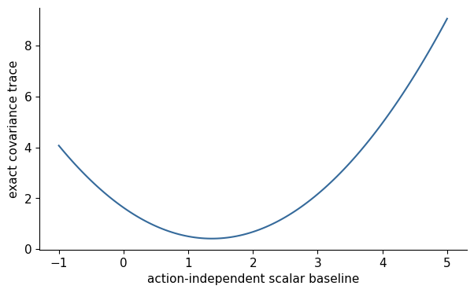
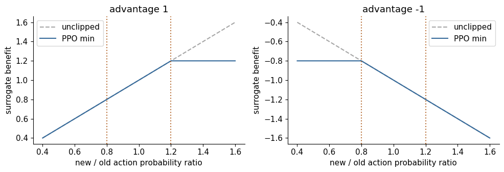

# 12. Language Generation as a Policy

The model answers `2 + 3 =` with `4`, `The answer is 5`, or `5`. A judge can
distinguish these complete responses without supplying the desired token at
every position. How does that final judgment reach the earlier choices that
produced the answer? And if we generate the same responses once and train on
them several times, when does their original probability cease to describe
the policy being updated?

Until now, training usually scored responses already present in a dataset.
Here the policy supplies its own candidates. We will first make their reward
and probability completely inspectable, then introduce the uncertainty hidden
by that small example. A story-continuity judgment or a program test changes
the source of reward; the reward-to-gradient mechanism remains the question.

Days 19–21 derive and test that mechanism before adding a large rollout system.
The prerequisites are autoregressive likelihood, the softmax gradient, and
gradient descent. We will inspect an exact finite policy, prove when baselines
preserve its gradient, examine leave-one-out rewards and proximal policy
optimization (PPO) clipping, and
compare estimators under explicit sampling and update budgets.

## 12.1 Tokens are actions; prefixes are states

For a fixed prompt $x$, define state $s_t=(x,y_{<t})$, action $a_t=y_t$, and
policy $\pi_\theta(a_t\mid s_t)$. Appending a token determines the next state.
A trajectory is the complete sequence $y$, including termination under the
chosen convention. Its probability factorizes:

$$
\pi_\theta(y\mid x)=\prod_t\pi_\theta(y_t\mid x,y_{<t}),\qquad
\log\pi_\theta(y\mid x)=\sum_t\log\pi_\theta(y_t\mid x,y_{<t}).
$$

The environment here can be unusually simple: text concatenation is deterministic,
and a terminal verifier evaluates the answer. That does not make the sampling
problem disappear. Different prefixes lead to different states, and a mistake
can change all subsequent predictions. A terminal reward gives credit to many
actions at once; it does not identify which intermediate step was responsible.

Let $R(x,y)$ be a fixed reward and define
$J(\theta)=\mathbb{E}_{y\sim\pi_\theta}[R(x,y)]$. For now reward has no
direct parameter dependence. Chapter 11's positive $\beta$ weights the
reference penalty in $J_\beta=\mathbb E[R]-\beta\,\mathrm{KL}(\pi_\theta\Vert\pi_{\mathrm{ref}})$;
we retain that objective and KL direction when a penalty is added. If a reward includes policy-dependent KL terms,
we must account for that dependence explicitly rather than reuse this assumption
without checking it.

## 12.2 Derive REINFORCE from the probability distribution

For a finite response space, differentiate the expectation:

$$
\nabla_\theta J=\sum_y R(y)\nabla_\theta\pi_\theta(y)
=\sum_y\pi_\theta(y)R(y)\nabla_\theta\log\pi_\theta(y)
=\mathbb{E}[R(y)\nabla_\theta\log\pi_\theta(y)].
$$

The identity $\nabla\pi=\pi\nabla\log\pi$ replaces a derivative through
discrete sampling with a derivative of the sampled sequence's log-probability.
This score-function family originates in
[Williams' REINFORCE paper](https://doi.org/10.1007/BF00992696).
For terminal reward and autoregressive text,

$$
\nabla_\theta J=\mathbb{E}\left[R(y)\sum_t
\nabla_\theta\log\pi_\theta(y_t\mid x,y_{<t})\right].
$$

A sampled ascent estimate can be implemented by minimizing
$L=-\mathrm{stopgrad}(R)\sum_t\log\pi_\theta(y_t\mid s_t)$. The minus
sign matters: the optimizer minimizes a loss while the objective maximizes
reward. Sampled token IDs and verifier rewards are treated as data. This
estimator is noisy but its expectation is the desired gradient under the stated
sampling assumptions. It is not backpropagation through an argmax decision.

Do not confuse teacher forcing during likelihood scoring with using a demonstration
target. Rollouts are generated by the policy; then their sampled tokens are
fed back to compute likelihoods and gradients. A demonstration-based SFT update
instead scores externally selected targets. Both use log-probabilities, but the
distribution of sequences and their weights differ.

## 12.3 A categorical microscope with an exact answer

Temporarily collapse each complete response into one action. This is a
single-decision, or bandit, version of the problem; no claim about a model's
language understanding follows from it. Use the following **illustrative**
reward rule: correct arithmetic earns one point, and obeying the bare-integer
format earns a second point only when the answer is correct.

| Action | Complete response | Probability $p_i$ | Fixed reward $R_i$ | Contribution $p_iR_i$ |
|---|---|---:|---:|---:|
| 0 | `4` | 0.5 | 0 | 0 |
| 1 | `The answer is 5` | 0.3 | 1 | 0.3 |
| 2 | `5` | 0.2 | 2 | 0.4 |

The mean reward is $J=0.7$. The numbers specify a distribution; they are not
observed frequencies from a trained checkpoint. Logits $z_i=\log p_i$ produce
exactly these probabilities under softmax.

**Reader prediction.** The verbose answer earns positive reward. Should we
always raise its probability? What if the bare answer's reward changes from
two to four while all probabilities stay fixed?

Use three complete answers with logits $z_i$, probabilities $p_i$, and fixed
rewards $R_i$. Then $J=\sum_i p_i R_i$. Since
$\partial\log p_a/\partial z_i=\mathbf{1}[a=i]-p_i$,

$$
\frac{\partial J}{\partial z_i}=p_i(R_i-J).
$$

For our distribution this is

$$
\nabla_zJ=[0.5(0-0.7),\;0.3(1-0.7),\;0.2(2-0.7)]
=[-0.35,0.09,0.26].
$$

Gradient ascent with learning rate 0.1 adds $[-0.035,0.009,0.026]$ to the
logits. The coordinates sum to zero, reflecting softmax's insensitivity to
a common logit shift. They are logit changes, not probability changes; we
must renormalize to obtain the next distribution. A minimized actor loss
has the opposite gradient, and gradient descent makes the same update.

Increasing the last reward to four gives $J=1.1$ and gradient
$[-0.55,-0.03,0.58]$. Now the reward-one response is below average: its logit
receives negative pressure. After the stated learning-rate-0.1 update and
softmax normalization, however, its probability still rises from 0.3 to
approximately 0.303876, compared with 0.305528 under the original rewards.
The first answer's logit falls more sharply, so the verbose answer gains
probability despite its own falling logit. Thus positive reward alone does
not determine either logit pressure or the normalized probability change.
Adding five to **every** reward instead leaves
the original gradient unchanged. The differences from mean reward, rather
than an absolute zero point, determine this exact update.

The correction depends on relative reward, not just whether reward is positive.
An answer receiving reward one can lose probability if the policy's expected
reward is two. At equal rewards every logit gradient is zero: no sampled outcome
distinguishes the actions. Adding a constant to every reward leaves the exact
gradient unchanged because $R_i-J$ is unchanged.

Enumerate the three possible sampled gradients
$g_a=R_a(e_a-p)$, weight them by $p_a$, and compare their mean with both the
formula and automatic differentiation of $J$. This three-way check catches sign,
normalization, and detachment errors. The notebook also plots individual sample
vectors: a single update can point away from the expected direction even when
the estimator is unbiased.

For example, sampling action 1 alone gives
$R_1(e_1-p)=[-0.5,0.7,-0.2]$. This sample suppresses action 2 even though the
exact expected gradient favors it. Sampling action 2 gives $[-1,-0.6,1.6]$;
sampling action 0 gives zero. Weighting these three vectors by 0.3, 0.2 and
0.5 recovers $[-0.35,0.09,0.26]$. The disagreement is sampling noise, not
an autograd error.

The same operations are available in
[`exact_gradient` and `estimator_moments`](../../src/dongxi_llms/policy_gradient_lab.py).
The [Day 19 companion](../../notebooks/day-19/01_exact_reinforce_gradient.ipynb)
uses another declared three-action fixture and compares enumeration with
automatic differentiation. Change its reward vector before changing the
learning rate: does the expected direction change as you predicted?

## 12.4 A baseline changes variance, not the expected gradient

Subtract a value $b(x)$ independent of the sampled action. The return-minus-
baseline difference is an advantage estimate: here it is $R-b$, a comparison
with what this prompt was expected to achieve. Then

$$
\mathbb{E}[(R-b)\nabla\log\pi]
=\nabla J-b\sum_y\nabla\pi(y)=\nabla J.
$$

The probability mass sums to one, so its derivative is zero. For token-level
estimators a baseline may depend on the pre-action state $s_t$, but not on the
current sampled action conditional on that state. A learned value model should
be detached in the policy loss; train it with its own prediction objective.
Action independence is a statistical condition, while detachment is an autograd
condition. One does not replace the other.

Not every baseline reduces variance. In the categorical example, the covariance
trace is $\mathbb{E}[\|g-\mathbb{E}g\|^2]$. Minimizing its baseline-dependent
part gives

$$
b^*=\frac{\mathbb{E}[R\|\nabla\log\pi\|^2]}{
\mathbb{E}[\|\nabla\log\pi\|^2]}.
$$

In detail, write $s=\nabla\log\pi$. The mean gradient is independent of
$b$, so only $\mathbb E[(R-b)^2\|s\|^2]$ matters to this minimization.
Its derivative is $2b\mathbb E[\|s\|^2]-2\mathbb E[R\|s\|^2]$.
Setting it to zero gives the displayed optimum when the denominator is positive.

Expected reward is a useful baseline, but it need not equal this variance-optimal
scalar. A wildly inaccurate yet action-independent baseline preserves expectation
and can increase variance dramatically. The lab enumerates exact means and
variances for several choices; it avoids mistaking one noisy batch for a theorem
about variance reduction.

### Keep the gradient, change the noise

Return to $p=[0.5,0.3,0.2]$ and $R=[0,1,2]$. With baseline $b=J=0.7$, the
three possible sampled ascent vectors become

| Sampled action | $R_a-b$ | $(R_a-b)(e_a-p)$ |
|---|---:|---|
| 0 | −0.7 | $[-0.35,0.21,0.14]$ |
| 1 | 0.3 | $[-0.15,0.21,-0.06]$ |
| 2 | 1.3 | $[-0.65,-0.39,1.04]$ |

Even a zero-reward response now supplies a useful comparison: it was worse
than this prompt's expected outcome. The probability-weighted mean remains
$[-0.35,0.09,0.26]$. Exact enumeration gives these covariance traces:

| Detached scalar baseline | Mean ascent gradient | Covariance trace |
|---:|---|---:|
| 0 | $[-0.35,0.09,0.26]$ | 0.8198 |
| 0.7 | $[-0.35,0.09,0.26]$ | 0.2472 |
| 5 | $[-0.35,0.09,0.26]$ | 10.0598 |

The score-vector squared norms here are $[0.38,0.78,0.98]$, so the scalar
optimum is $b^*=0.626/0.62\approx1.009677$, rather than 0.7. Expected reward
is a natural prediction target; the minimum-variance scalar additionally
weights outcomes by their gradient magnitudes.



The saved [baseline notebook](../../notebooks/day-20/01_baselines_and_rloo.ipynb)
plots the same calculation for its original logits and rewards, not the
numbers in our table. Read the horizontal coordinate as a baseline choice
and the vertical coordinate as estimator noise, not task performance. Moving
far from its minimum makes the noise worse while leaving the expected
gradient unchanged. No optimizer tuning or model training is represented.

An action-dependent “baseline” such as $b=R$ makes every advantage zero and
erases learning. More subtly, the mean reward of a batch includes the sample
whose gradient it weights. That dependence changes expectation unless corrected
or otherwise justified.

## 12.5 RLOO and the self-inclusion factor

For one prompt sample $G\ge2$ independent completions. An advantage estimate
compares a realized return with a pre-action baseline: return minus baseline.
For these complete responses, return is the fixed terminal reward, and the
other responses provide the baseline. Define

$$
b_{-i}=\frac{1}{G-1}\sum_{j\ne i}R_j,
\qquad \hat A_i=R_i-b_{-i}.
$$

For response $i$, write the estimator as $\hat A_i=R_i-b_{-i}$.
The same scalar may weight every token in that response through the sequence
log-probability sum. A state-dependent token estimator $\hat A_{i,t}$, including
GAE below, is generally different; broadcasting a response advantage does not
turn it into a learned token-level return estimate.

Other samples are independent of completion $i$ conditional on the prompt, so
the leave-one-out baseline is action-independent for that sample. Averaging
$\hat A_i\nabla\log\pi(y_i)$ preserves the policy gradient. This is the estimator
studied in [the RLOO paper](https://aclanthology.org/2024.acl-long.662/).
It saves a separate value model but requires multiple sampled completions and
can still have high variance.

Compare against subtracting the inclusive group mean $\bar R$:

$$
R_i-\bar R=\frac{G-1}{G}(R_i-b_{-i}).
$$

For iid samples, the mean-gradient expectation is therefore scaled by
$(G-1)/G$. Multiplying by $G/(G-1)$ recovers the leave-one-out estimator. This
is a precise finite-sample effect. Standardizing by a random sample standard
deviation introduces another dependence and changes the estimator again; do
not call it unbiased merely because the centered group sums to zero.

To see where the factor comes from, let $s_i=\nabla\log\pi(y_i)$.
In $\mathbb E[\bar R s_i]$, the own-reward term contributes
$\nabla J/G$. Each other-reward term contributes zero because it is independent
of $s_i$ and $\mathbb E[s_i]=0$. Thus
$\mathbb E[(R_i-\bar R)s_i]=(1-1/G)\nabla J$.
For $G=4$ our running example's inclusive-centered mean gradient is
$[-0.2625,0.0675,0.195]$; RLOO restores $[-0.35,0.09,0.26]$ in expectation.
This statement concerns all iid groups, not one observed group's usefulness.

Independence needs actual independent sampling conditional on the prompt.
Duplicating one completion, imposing a coupled diversity rule, or accidentally
resetting the random generator for every sample violates the proof. Rewards
from different prompts should not be pooled as though they shared the same
conditional value. Chapter 13 will use grouped relative advantages, while
keeping these distinctions visible.

## 12.6 Old policies, references, and importance ratios

An old policy $\pi_{\mathrm{old}}$ generated a rollout batch. A reference policy
$\pi_{\mathrm{ref}}$ anchors long-term behavioral movement. These may start at
the same checkpoint but play different roles. The old policy usually updates
when a new batch is collected; the reference often remains fixed.

If data come from an old distribution, the exact full-trajectory importance
ratio is

$$
\rho(y)=\frac{\pi_\theta(y\mid x)}{\pi_{\mathrm{old}}(y\mid x)}
=\exp\left(\sum_t[\log\pi_\theta(y_t\mid s_t)-\log\pi_{\mathrm{old}}(y_t\mid s_t)]\right).
$$

With support coverage, weighting an old-policy expectation by this ratio
recovers a current-policy expectation. Long sequence ratios can have enormous
variance because many small token changes multiply. Token-level ratios
$\rho_t$ used in PPO provide a local surrogate at states visited by the old
policy. They are not the same as exact full-sequence importance correction when
the state distribution changes.

Stored old log-probabilities and advantages must stay detached during multiple
optimization epochs. Replacing them with freshly recomputed current values
changes the objective. Aggressive reuse makes the old state distribution less
representative, even if a local clipping rule seems quiet.

### What changes when we reuse the answers?

Collection was **on-policy** when our three answers came from the distribution
being differentiated. After an update, the saved answers come from an earlier
policy: their reuse is **off-policy** relative to the new one. Keep the old
probabilities $[0.5,0.3,0.2]$ and let the new probabilities be $[0.4,0.3,0.3]$.

| Action | Old probability | Current probability | Current/old ratio | Old probability × ratio × reward |
|---|---:|---:|---:|---:|
| 0 | 0.5 | 0.4 | 0.8 | 0 |
| 1 | 0.3 | 0.3 | 1.0 | 0.3 |
| 2 | 0.2 | 0.3 | 1.5 | 0.6 |

The weighted old-policy expectation is 0.9, exactly the current expected
reward. Without the ratios it remains 0.7. In this one-state example every
current action has old-policy support, so the correction is exact. It cannot
create evidence about an action the collector never sampled.

For a text trajectory, four token ratios of 1.1 already multiply to 1.4641.
The [PPO/KL companion](../../notebooks/day-20/02_ppo_clipping_and_kl.ipynb)
checks this product. More positions can magnify variation in trajectory
weights. PPO's next step limits a local sampled incentive, rather than
pretending that the growing product is always a useful estimator.

The [Day 20 probability-accounting notebook](../../notebooks/day-20/03_behavior_probabilities_and_support.ipynb)
turns the coverage assumption into an exact counterexample. It keeps raw model,
temperature/filter-transformed collector and declared update target separate.
Using raw likelihood as the denominator after transformed collection changes both
the expected reward and its gradient. Conditional fixed-support repair is a
different objective, not a universal fix for a full-support target. Chapter 14
§14.3 develops the measured example and its boundary masks.

## 12.7 What PPO clipping actually clips

For one response, write $\hat A_t=\hat A_{i,t}$ and suppress its index $i$.
The clipped per-token surrogate is

$$
L_{\text{clip}}(\theta)=\mathbb{E}\left[
\min\left(\rho_t \hat A_t,
\mathrm{clip}(\rho_t,1-\epsilon,1+\epsilon)\hat A_t\right)\right].
$$

Maximize this expression, or minimize its negative. For positive advantage,
increasing the ratio beyond $1+\epsilon$ gains no more surrogate benefit. For
negative advantage, decreasing it below $1-\epsilon$ gains no more benefit.
Movement in a harmful direction is still penalized. The clipping is asymmetric
with respect to advantage sign; it does not simply clamp every gradient to a
fixed interval. The objective and multiple-epoch rollout reuse are introduced
in [the PPO paper](https://arxiv.org/abs/1707.06347).

**Reader prediction.** At $\epsilon=0.2$, is every ratio outside
$[0.8,1.2]$ ignored? Evaluate both advantage signs before inspecting the table.

| Advantage | Ratio | Unclipped product | Clipped surrogate | Slope with respect to ratio |
|---:|---:|---:|---:|---:|
| +1 | 1.3 | 1.3 | 1.2 | 0 |
| +1 | 0.7 | 0.7 | 0.7 | +1 |
| −1 | 1.3 | −1.3 | −1.3 | −1 |
| −1 | 0.7 | −0.7 | −0.8 | 0 |

Beneficial movement becomes flat beyond the appropriate boundary; harmful
movement remains visible. A blanket clamp would miss the second and third
rows. The value 0.2 is a declared lab choice, not a constant derived from
the reward problem or a universal stable-update threshold.



The [plot's runnable source](../../notebooks/day-20/02_ppo_clipping_and_kl.ipynb)
uses advantages +1 and −1. Compare each solid curve with its unclipped dashed
line; the flat region switches sides with the sign. These are objective
schematics evaluated numerically, not measured learning curves.

Our old-policy baseline gives advantages $[-0.7,0.3,1.3]$. With the changed
distribution above, the unmodified expected ratio-weighted advantage is
$0.9-0.7=0.2$. Clipping reduces it to
$0.5(-0.56)+0.3(0.3)+0.2(1.56)=0.122$: the third action's ratio 1.5 receives
no further benefit above 1.2. This is deliberately a modified objective.
At the initial ratios one, the mean advantage and surrogate value are zero,
yet their derivative is the nonzero policy gradient. A loss value alone
cannot tell us whether learning signal exists.

PPO commonly trains a value function to estimate returns and uses advantages
derived from it. Value error, reward shaping, terminal handling, and padding
can all affect the policy update. Our categorical comparison uses the exact
pre-rollout expected reward as a detached baseline, making critic error zero
so the clipping mechanism can be isolated. That is an oracle analysis control,
not a claim about how a neural critic performs.

Clipping is not a hard bound on policy KL. Shared parameters can alter unsampled
actions, repeated updates can move outside the interval, and the average hides
rare changes. Monitor approximate and, where possible, exact KL, entropy, clip
fractions, length, and independent task outcomes. A low clipped loss alone
cannot establish stable learning.

## 12.8 KL estimates depend on direction and support

Let $p$ be the distribution generating actions and $q$ a positive reference on
the same finite support. For $a\sim p$, define $d(a)=\log p(a)-\log q(a)$.
Then

$$
k_1=d,\qquad k_2=\frac12d^2,\qquad
k_3=\exp(-d)-1+d.
$$

$\mathbb{E}_p[k_1]=\mathrm{KL}(p\Vert q)$. Individual samples of $k_1$ can
be negative although the expectation is nonnegative. $k_2$ is nonnegative but
generally biased for KL; its usefulness comes from a local quadratic
approximation near equal distributions. For common full support,
$\mathbb{E}_p[\exp(-d)]=\sum_a q(a)=1$, so $k_3$ has the same expectation
as $k_1$ and nonnegative individual values because $u-1-\log u\ge0$.

This control-variate identity does not guarantee lower variance everywhere.
Rare actions with very large $q/p$ can give $k_3$ large tails. The notebook
enumerates exact expectations and variances, then perturbs the distributions.
If $p$ is zero on some reference mass, the expectation of $q/p$ over sampled
support is less than one and the simple identity fails. If $q$ is zero where
$p$ is positive, forward KL is infinite. Sampling temperature or top-$k$ changes
the distribution: log-probabilities must describe the sampler required by the
estimator, not a convenient unmodified model distribution.

Estimator values used for monitoring and a differentiable KL regularizer also
have different gradient contracts. Differentiating a sampled estimate while
treating the sampled distribution as constant may omit score-function terms.
For the finite microscope, compute the exact sum for objective gradients and
use sampled estimators to study measurement variance.

## 12.9 A comparison with declared budgets

The CPU task has six arithmetic prompts $(a,b)$ and three answer actions;
the correct action is $(a+b)\bmod3$. Independent logits per prompt intentionally
remove representation learning. We compare REINFORCE, an exact-value baseline,
RLOO, and PPO using the same prompt set, four samples per prompt, rollout update
count, seed schedule, and exact success metric.

**Reader prediction:** should the four methods finish at the same success
probability when sampled completions match but PPO reuses each rollout three
times? State which comparison would test sampling efficiency and which would
test gradient-work efficiency before revealing the results. PPO uses three gradient epochs
per rollout, so it consumes more optimizer work despite equal sampled tokens.
The report exposes both clocks rather than calling the run compute-matched.

The [retained CPU report](../../experiments/reports/2026-10-04-preference-policy-cpu.md)
records 160 rollout updates, six contexts and four sampled actions per context:
3,840 sampled completions per arm, with learning rate 1.5 and fixed seeds.

| Arm | Final exact success probability, seeds 1921 / 1922 / 1923 | Gradient passes |
|---|---|---:|
| REINFORCE | 0.980054 / 0.980184 / 0.980117 | 160 |
| Exact-value baseline | 0.980135 / 0.981667 / 0.981941 | 160 |
| RLOO | 0.980318 / 0.981902 / 0.982335 | 160 |
| PPO, three epochs | 0.991820 / 0.991509 / 0.991530 | 480 |


Read the left panel at matched sampling cost and the right at optimizer work.
Shading is the range of three seeds, not a confidence interval. PPO's higher
endpoint uses more gradient work and an exact pre-rollout value; it supplies
neither a wall-time ranking nor evidence of neural critic quality.

### The finite update in transparent code

The loop below follows [the canonical policy module](../../src/dongxi_llms/policy_gradient_lab.py).
Each row of `logits` is one independent context; columns are the three possible
answers. `correct` contains the verifier's answer action. The surrounding module
initializes the seeded generator and applies this block for the declared updates.

```python
old_logp = logits.detach().log_softmax(-1)
old_p = old_logp.exp()
actions = torch.multinomial(old_p, group, replacement=True, generator=generator)
rewards = (actions == correct[:, None]).to(logits.dtype)
if mode == "rloo":
    advantage = rloo_advantages(rewards)
elif mode in ("baseline", "ppo"):
    advantage = rewards - old_p.gather(1, correct[:, None])
else:
    advantage = rewards
for _ in range(epochs if mode == "ppo" else 1):
    selected = logits.log_softmax(-1).gather(1, actions)
    if mode == "ppo":
        ratio = (selected - old_logp.gather(1, actions)).exp()
        loss = -ppo_surrogate(ratio, advantage).mean()
    else:
        loss = -(selected * advantage).mean()
    (gradient,) = torch.autograd.grad(loss, logits)
    with torch.no_grad():
        logits -= 1.5 * gradient
```

`rloo_advantages` subtracts the mean of the other samples from the same context;
`ppo_surrogate` returns the minimum of `ratio * advantage` and the clipped-ratio
product. The old probabilities and these rewards/advantages have no actor
gradient. The negative sign converts ascent to a minimized loss. Deliberately
recomputing the old probabilities inside each epoch would change this experiment.

This experiment checks estimator behavior and implementation. It has no unseen
arithmetic distribution, no language vocabulary, and no neural generalization
claim. Multiple seeds show sampling variability. A model-scale extension needs
new evidence for rollout memory, throughput, verifier integrity, and retained
capabilities. These operational questions lead into Chapters 13 and 14.

## 12.10 A critic predicts the return before an action

The exact-value comparison above deliberately removed representation error.
Now put that difficulty back. A neural critic reads the same pre-action prefix
$s_t$ as the actor and predicts $V_\psi(s_t)$: the expected discounted future
reward under the current policy. It does not judge the next token alone and
must not see that action when constructing its baseline. Even a prefix with
the correct color can continue into repetition or missing termination.

The critic supplies an estimate before we discover which continuation occurs.
Subtracting that prediction from the realized return gives an **advantage**: how much better
or worse that continuation was than expected at this state. An exact tabular
value, a small value head sharing actor features, or a separate network can
play this role. A critic need not be another policy-sized model; architecture,
shared gradient paths and fitting cost are separate choices. The local
experiment uses separate small backbones to expose those paths.

The critic parameters $\psi$ are separate from the learned reward parameters
$\phi$. Let $R_t$ be the collected reward earned after action $a_t$. A frozen
learned score $r_\phi(x,y)$ can supply a terminal $R_t$, while a verifier can
supply it directly; the return calculation treats either as fixed observed data.
The companion's local per-step reward variables map to $R_t$ here.

For discount $\gamma$ and $n$ observed
actions, the bootstrapped return is

$$
G_t=\sum_{k=t}^{n-1}\gamma^{k-t}R_k
+\gamma^{n-t}c_{n-1}V_\psi(s_n).
$$

Here $c_t=0$ after true termination and $1$ otherwise. Sampled EOS ends the
episode: no continuation value follows it. A collector cap stops observation;
unless the task defines that boundary as terminal, $c_{n-1}=1$. Bootstrap
estimates unobserved continuation, not a secretly generated EOS or an observed
future reward. Padding contributes no action, reward, target or loss.

With two zero-reward actions, $\gamma=0.9$ and bootstrap $1.2$, returns are
$0.972$ and $1.08$. Relabeling the cap as EOS makes both zero. Conversely,
appending a value of nine after actual EOS must not change the completed
return. These checks catch a bug that a finite loss curve can hide.

## 12.11 TD residuals and generalized advantage estimation

A temporal-difference residual compares the present prediction with one
observed transition and its continuation estimate:

$$
\delta_t=R_t+\gamma c_tV_\psi(s_{t+1})-V_\psi(s_t).
$$

Generalized advantage estimation combines those residuals. Let $m_t$ indicate
a valid action and $m_n=0$ immediately beyond observation:

$$
\hat A_t=\delta_t+\gamma\lambda c_t m_{t+1}\hat A_{t+1},
\qquad \hat G_t=\hat A_t+V_\psi(s_t).
$$

The last residual includes a nonterminal bootstrap, but no residual is invented
beyond the collected prefix. At $\lambda=0$, the target is one-step TD. At
$\lambda=1$, intermediate values telescope, leaving $G_t$. Only completed
trajectories remove the final estimate and give fully observed Monte Carlo
returns. The [original GAE paper](https://arxiv.org/abs/1506.02438v6) motivates
a bias–variance trade-off, not a guarantee for this text experiment.

An inaccurate critic can distort bootstrapped targets, particularly at states
never observed beyond the cap. Smaller $\lambda$ trusts short value predictions
more. Larger $\lambda$ uses more observed rewards but cannot recover experience
never collected. “Use GAE” cannot replace checking what terminated and what
was censored.

### Give credit across three positions

Consider a newly calculated, completed three-action trajectory. It earns
$[0,0,1]$ and ends with EOS. Use $\gamma=0.9$, $\lambda=0.95$ and detached
pre-action value predictions $[0.4,0.5,0.8]$; terminal continuation value is zero.

| Position $t$ | Reward $R_t$ | Predicted value $V_t$ | TD residual $\delta_t$ | GAE $\hat A_t$ | Value target $\hat A_t+V_t$ |
|---:|---:|---:|---:|---:|---:|
| 0 | 0 | 0.4 | $0+0.9(0.5)-0.4=0.05$ | 0.384305 | 0.784305 |
| 1 | 0 | 0.5 | $0+0.9(0.8)-0.5=0.22$ | 0.391000 | 0.891000 |
| 2 | 1 | 0.8 | $1-0.8=0.20$ | 0.200000 | 1.000000 |

Work backward: $\hat A_1=0.22+0.855(0.20)=0.391$ and
$\hat A_0=0.05+0.855(0.391)=0.384305$. Thus the final reward influences
earlier actions even though neither earned an immediate reward. The value
predictions decide how surprising each transition is.

**Controlled change.** Set $\lambda=0$: the targets are $[0.45,0.72,1]$,
using only the next value estimate. Set $\lambda=1$: the completed-trajectory
targets become $[0.81,0.9,1]$, the observed discounted returns. Our intermediate
choice trades dependence on the imperfect critic against dependence on more
sampled rewards. The discount 0.9 makes that arithmetic visible; a text task
can choose $\gamma=1$ to value its eventual terminal reward without discount.
These values are not suggested defaults for every task.

Detach advantages in the actor loss and return targets in the critic loss.
Otherwise the actor can change its supposedly fixed comparison through the
critic computation, or the critic can chase a target that moves through its
own gradient path. This computational separation does not itself establish
that the predictions are accurate. The
[learned-critic companion](../../notebooks/day-20/04_learned_critics_and_frozen_text_rewards.ipynb)
provides runnable return/GAE and EOS/cap controls for that distinction.

## 12.12 Three separate gradient contracts

For $N$ sampled responses, the actor minimizes a negative clipped token sum per
response; the critic minimizes valid-state mean-square error:

$$
L_\pi=-\frac1N\sum_{i,t}m_{it}
\min\left(\rho_{it}\,\mathrm{stopgrad}(\hat A_{i,t}),
\mathrm{clip}(\rho_{it},1-\epsilon,1+\epsilon)
\,\mathrm{stopgrad}(\hat A_{i,t})\right),
$$

$$
L_V=\frac{\sum_{i,t}m_{it}
\left(V_\psi(s_{it})-\mathrm{stopgrad}(\hat G_{i,t})\right)^2}
{\sum_{i,t}m_{it}}.
$$

Actor gradients reach current sampled-action likelihoods; old likelihoods and
advantages are data. Critic gradients reach value predictions; targets are
data. The reward is saved, reloaded and frozen: neither loss updates it or
differentiates through sampled IDs. Separate actor/critic causal backbones
make the boundaries directly testable. Shared features would deliberately
receive both objectives and require another analysis.

An exact conditional KL penalty at collected states anchors the initial actor;
the positive coefficient $\beta$ weights that penalty separately from $L_\pi$.
Collection and current/old/reference scoring use identical finite support.
One fresh actor step per rollout starts at ratios one: clipping has not reached
its flat region. This isolates advantage/critic behavior, not PPO epoch reuse
or exact correction of changing state distributions.

## 12.13 Actual fitted rewards and generated text

Chapter 10 fitted a reward from text pairs. Can a policy exploit what those
pairs did not constrain? Our original task asks for a color. The actor reads
actual prompt word tokens and emits color/style tokens and EOS. The reward
reads printable ASCII prompt/completion characters. Neither model receives an
injected quality feature or reference answer.

Balanced preferences match style; confounded preferences associate correctness
with fancy style. Budgets/source groups match, but information does not.
Actual fitted models are exported and reloaded before policy updates. Training
response strings alone determine score centering/scaling; tanh then bounds the
proxy. Bradley–Terry scores are not success probabilities, and pair margins
do not identify their absolute offset.

Independent quality checks requested color, at most one style word and EOS
within the delivered cap. It never enters rewards, critic targets or checkpoint
selection. Four training, two calibration, two final and two control sources
have distinct actual actor/reward encodings. Fourteen finite terminal paths
define the task: early EOS is sampled; a fourth-position syntax boundary
allows only EOS. Main delivery caps at three, so continuation values belong
to this declared environment, not open language.

## 12.14 The measured experiment retains critic and reward failures

Three fixed seeds compare oracle, learned and noisy critics under balanced
reward; confounded reward uses the same learned-critic recipe. Every row
receives forty batches of four prompts and eight paths per prompt. Learned
rows also take one critic step per batch. Oracle/noisy rows enumerate futures
without training a critic. Equal sampled-path budgets do not imply equal
optimizer work, enumeration cost or wall time. No best seed or final-test
checkpoint is selected.

Reward fitting drove pair losses below $7\times10^{-6}$, yet color matching
remained unreliable. Balanced oracle rows emitted constant blue and obtained
quality $0.5$; bare colors were outside styled reward-training pairs. Two
learned-critic seeds collapsed to capped style prefixes with quality zero;
their high value errors remain in the report. A noisy critic also retains
severe failures. The observations are compatible with reward extrapolation and
bootstrap error, but do not uniquely establish either cause or a universal
ranking of critic methods.

Separate observed rewards at emitted EOS, critic continuation estimates after
a cap, and diagnostic reward scores of delivered prefixes. A positive prefix
score is not earned terminal reward. A cap-four diagnostic supplies the
declared last EOS but cannot repair wrong color or repeated style. All training
paths, frozen controls and withheld responses are in the
[report](../../experiments/reports/2026-10-04-critic-policy.md).
The [new notebook](../../notebooks/day-20/04_learned_critics_and_frozen_text_rewards.ipynb)
traces the difference from return tensors to actual sampled text.

## 12.15 Companion route and exercises

Use [Day 19's exact gradient](../../notebooks/day-19/01_exact_reinforce_gradient.ipynb),
[Day 20's baseline microscope](../../notebooks/day-20/01_baselines_and_rloo.ipynb),
[Day 20's PPO/KL laboratory](../../notebooks/day-20/02_ppo_clipping_and_kl.ipynb),
and [Day 21's algorithm comparison](../../notebooks/day-21/01_policy_algorithm_comparison.ipynb).
The [lab guide](../labs/12-language-generation-as-a-policy.md),
[worked solutions](../solutions/12-language-generation-as-a-policy.md), and
[report](../../experiments/reports/2026-10-04-preference-policy-cpu.md) supply
reproduction and evidence boundaries.

1. Derive the score-function gradient and explain why reward is detached.
2. Derive $p_i(R_i-J)$ and interpret a positive reward with a negative gradient.
3. Prove the action-independent baseline identity and give a biased counterexample.
4. Derive the variance-optimal scalar baseline; why need it differ from expected reward?
5. Derive the self-inclusion factor for a group mean and explain RLOO's independence condition.
6. Distinguish a rollout's old policy from the fixed reference policy.
7. Explain why multiplying token ratios differs from PPO's local token surrogate.
8. Draw the clipped objective for both advantage signs and explain which directions remain penalized.
9. Prove the $k_3$ expectation identity and identify the missing-support failure.
10. Design a fair algorithm comparison when one method reuses samples for several epochs.
11. Connect SFT, DPO, REINFORCE, RLOO, and PPO without claiming identical supervision or objectives.
12. If training reward increases and exact task success decreases, what would you inspect before changing the learning rate?
13. Derive lambda-zero and lambda-one targets including a nonterminal final bootstrap.
14. Why do collector caps and emitted EOS need different return masks?
15. Draw actor, critic and frozen reward gradient paths; what changes with shared features?
16. How can a fitted pair reward mis-score bare or repeated-style policy responses?
17. Compare critics without confusing rollout budget, critic work, prefix scores and quality.

We began with a reward on three complete answers, then separated the expected
gradient from the noisy sampled one. Baselines changed its noise; reuse required
probability accounting; clipping changed its incentive; critics supplied
state-level comparisons whose targets depend on termination. None of those
operations made the reward a trustworthy definition of success.

Chapter 13 now removes the learned critic and compares answers within a prompt
group. The next question is sharp: if every sampled answer is equally wrong,
where could a relative improvement signal come from?
