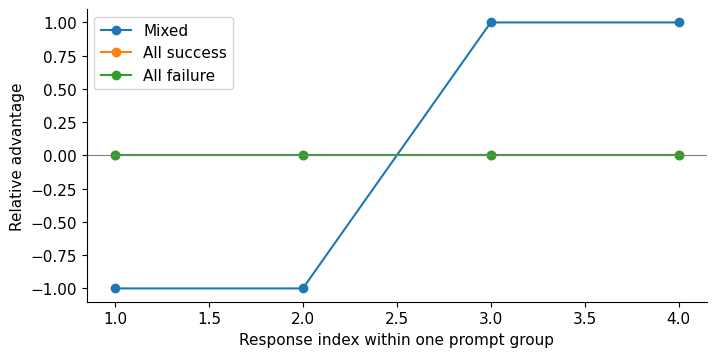

# 13. Group-Relative Policy Optimization

Four answers to the same question receive rewards 0, 0, 1, 1. There is no annotated
reasoning trace and no learned critic. Can these comparisons still teach a language
model? Yes: the successful sampled answers can become more probable relative to
the unsuccessful ones. The difficulty is specifying what “relative” means, which
tokens receive that signal, and how far one update may move the policy.

This chapter connects the trajectory mathematics of Chapter 12 to a complete
autoregressive update. You will calculate group advantages, differentiate a
clipped objective, test a verifier, and follow detached rollout tokens back to the
decoder parameters. Days 22–23 provide the notebook route. The CPU implementation
is executable now; the model-scale Qwen results later in the chapter are a separately measured bounded case.

## 13.1 A baseline from alternative answers

Let $x$ be a prompt and $y_i=(y_{i1},\ldots,y_{in_i})$ a response. A behavior
policy $\pi_{\mathrm{old}}$ generates $G$ responses independently conditional on
the same prompt. The verifier returns $R_i=R(x,y_i)$; a learned reward model would instead
return $r_\phi(x,y_i)$. The reference fixture uses verifier rewards.
Archived code may use `r_i` and `bar_r` for $R_i$ and $\bar R$.
The group supplies a local comparison. Getting reward 1 is an improvement within
a group of mostly failures, but offers no comparison within a group where every
answer succeeds. GRPO replaces a learned value baseline with group statistics;
the original proposal is in [DeepSeekMath](https://arxiv.org/html/2402.03300v3#S4).

The verifier supplies a task outcome rather than a preferred demonstration;
this is reinforcement learning with verifiable rewards, or RLVR. It can
avoid fitting a separate preference reward model when correctness is executable,
but the checker now defines what improvement means. It need not verify every
reasoning step or support every response format.

Why compare answers instead of fitting a critic? Sampling several responses
provides prompt-level outcome variation immediately. A critic would learn
an expected return from states and could reuse information across prompts;
it also needs fitting data, computation and an explicit architecture. That
architecture can be a small head or network, not necessarily another entire
language model. GRPO trades this learned prediction for a within-group
comparison and pays for the additional sampled responses.

We declare the course convention explicitly:

$$
\bar R=\frac1G\sum_{j=1}^{G}R_j,\qquad
s=\sqrt{\frac1G\sum_{j=1}^{G}(R_j-\bar R)^2},\qquad
\hat A_i=\frac{R_i-\bar R}{s+\epsilon_{\mathrm{adv}}},\quad \epsilon_{\mathrm{adv}}=10^{-8}.
$$

The small constant $\epsilon_{\mathrm{adv}}$ stabilizes normalization; archived
code may name it `delta`. It is distinct from Chapter 12's TD residual $\delta_t$.

The implementation uses population standard deviation: Torch's `correction=0`.
Sample standard deviation divides the squared deviations by $G-1$. For a
nonconstant group it is larger by $\sqrt{G/(G-1)}$, so the corresponding normalized
advantages are smaller. At $G=2$ that difference is substantial. An implementation
that changes this choice has changed update scale, even when its code looks
almost identical.

For rewards 0, 0, 1, 1, the mean is 0.5 and population standard deviation 0.5. Ignoring
the tiny epsilon, the advantages are −1, −1, +1, +1. This sign expresses a comparison
inside one prompt's group. It does not say that an answer is globally good or
that a negative-advantage answer is factually false. All-correct groups give zero
relative advantage. All-wrong groups do too. A critic could provide information
across states that this particular relative estimator does not provide.

### Follow a complete mixed group

**Reader prediction.** Change Chapter 12's graded reward into strict success:
accept only the bare integer `5`. Which successful token positions get
positive pressure, and can the two failures still contribute?

For this newly calculated illustration, tokens are the displayed words or
integers plus EOS. They are an explicit teaching alphabet, not Qwen token
counts. Consider this possible group of four independently sampled responses:

| Response | Valid generated tokens | $R_i$ | $R_i-\bar R$ | Rounded $\hat A_i$ |
|---:|---|---:|---:|---:|
| 1 | `4`, EOS | 0 | −0.5 | −1 |
| 2 | `The`, `answer`, `is`, `5`, EOS | 0 | −0.5 | −1 |
| 3 | `5`, EOS | 1 | +0.5 | +1 |
| 4 | `5`, EOS | 1 | +0.5 | +1 |

The squared deviations are four copies of 0.25. Their population mean is
0.25, giving $s=0.5$. With the declared $10^{-8}$ stabilizer the absolute
advantage is approximately 0.99999998; the table rounds it to one. Independent
sampling can legitimately produce identical successful strings. Copying one
saved success twice would instead violate the independence assumption.



The [original group notebook](../../notebooks/day-22/01_group_advantages.ipynb)
uses the exact reward rows $[0,0,1,1]$, $[1,1,1,1]$ and $[0,0,0,0]$.
Read the response index horizontally and signed advantage vertically.
The two flat zero lines have opposite task outcomes, so advantage alone
cannot tell us whether a group succeeded. Changing the same reward row
to sample standard deviation gives approximately ±0.866025 instead of ±1;
the signs survive while the update scale changes.

## 13.2 What normalization changes

Subtracting a baseline and dividing by a standard deviation are different
operations. Centering compares each response to the group's mean. Scaling changes
how strongly groups with different reward spreads contribute. For binary rewards
with empirical success fraction $\hat p$, the population standard deviation is
$\sqrt{\hat p(1-\hat p)}$. A successful answer in a mostly failing group can then
receive a large positive advantage. Across prompts, this is a weighting choice.

The statistics contain the sampled response's own reward. For unnormalized
centering and independent group samples, the expected score-function estimator
has a factor $(G-1)/G$ compared with the estimator using the true expected reward
as baseline. A leave-one-out baseline removes that simple self-inclusion factor.
After standard-deviation normalization, the denominator also depends on all
sampled rewards, so this is no longer merely the same estimator with a fixed
learning-rate rescaling. Chapter 12's baseline identities should not be silently
extended to every normalized group estimator.

There are two questions here. The iid group mean is an unbiased estimate
of expected reward under the **behavior policy at this prompt**. Yet using
that mean to weight its own response's score vector creates dependence.
Value-estimate unbiasedness therefore does not imply policy-gradient
unbiasedness. For our mixed group the RLOO advantages are
$[-2/3,-2/3,2/3,2/3]$; inclusive centering gives
$[-1/2,-1/2,1/2,1/2]$, exactly three quarters as large. Dividing either by
the group's random standard deviation changes the statistical argument again.

If a group is constant, its centered rewards are exactly zero. The implementation
returns exact zero advantages rather than allowing $0/0$. Epsilon protects
near-zero denominators; it cannot invent exploration. Track the fraction of
zero-variance groups. A high fraction may reflect successful saturation, failure
saturation, insufficient sampling, an overly forgiving verifier or an overly
strict one. Its interpretation requires the rewards and representative outputs.

With independent binary success probability $p$, the probability that all $G$
answers are failures is $(1-p)^G$. A larger group may expose an occasional success,
but requires additional decoding. If outputs are effectively duplicates, the
independence approximation exaggerates the benefit. Group size belongs in a
cost-quality comparison, with actual generated token counts recorded.

For a declared iid success probability $p=0.1$, four responses are all wrong
with probability 0.6561; eight responses with probability approximately
0.430467. A group has a nonconstant binary reward with probability
$1-(1-p)^G-p^G$: approximately 0.3438 for four and 0.569533 for eight.
More draws improve the chance of a comparison while roughly doubling
collection work at unchanged response lengths. At $p=0$ they help neither
signal nor correctness; at $p=1$ constant groups indicate success instead.
Those are sampling calculations, not forecasts of the native pilot.

## 13.3 The objective we will implement

At response position $t$, define state $s_{it}=(x,y_{i,<t})$ and token ratio

$$
\rho_{it}(\theta)=
\exp\left(\log\pi_\theta(y_{it}\mid s_{it})-
\log\pi_{\mathrm{old}}(y_{it}\mid s_{it})\right).
$$

The behavior log probability is recorded at collection time and held fixed.
Our educational objective averages token contributions inside each response,
then averages responses:

$$
J(\theta)=\frac1G\sum_{i=1}^{G}\frac1{n_i}\sum_{t=1}^{n_i}
\left[
\min\left(\rho_{it}\hat A_i,
\mathrm{clip}(\rho_{it},1-\epsilon,1+\epsilon)\hat A_i\right)
-\beta D_{it}(\theta)
\right],\qquad L=-J.
$$

Here $\epsilon=0.2$ in the lab. For several prompts we average this expression
over the prompt batch. The advantages, sampled token IDs, behavior log
probabilities and reference parameters are detached. The current policy logits
and chosen KL term remain differentiable. The optimizer minimizes $L$.

For $\hat A_i>0$, raising a token's ratio improves the surrogate until the upper
clip boundary; beyond it that branch supplies no further positive pressure.
For $\hat A_i<0$, reducing its ratio improves the surrogate until the lower
boundary. An unfavorable movement remains penalized. Clipping is a modification
to a sampled surrogate, not a guarantee that every vocabulary probability stays
inside a range or that the next policy has small KL.

With one fresh rollout batch and one optimizer update, current and old policy
weights initially agree. The ratios equal 1, but their derivatives are nonzero.
Updating weights changes the ratios. Several optimization epochs over the same
rollouts make clipping more active and increase reliance on behavior-policy
correction. Our readable baseline uses one update per freshly collected batch.

### Turn relative rewards into token pressure

Return to the four-response illustration. Set $\beta=0$ for this isolated
policy-signal calculation and use a fresh behavior snapshot. Every ratio is
one. The response means are $[-1,-1,+1,+1]$ to the displayed precision,
so $J=0$ and $L=0$. The derivative is nevertheless informative:

$$
\frac{\partial L}{\partial\log\pi_\theta(y_{it}\mid s_{it})}
=-\frac{\hat A_i}{Gn_i}.
$$

For response 1, each of its two valid tokens has coefficient approximately
+0.125. Response 2's five tokens each have +0.05. Responses 3 and 4 each
have −0.125 per token. Minimization suppresses the failed responses'
selected log probabilities and favors the successful ones, including their
EOS. The total nominal weight is equal per response even though the second
response is longer. Shared decoder parameters combine these paths, so those
local coefficients are not guarantees about each final response probability.

The [canonical clipped objective](../../src/dongxi_llms/grpo_lab.py)
accepts selected log probabilities and a valid-token mask with precisely
this reduction. The [token-ratio companion](../../notebooks/day-22/02_token_ratios_kl.ipynb)
lets the reader inspect that loss independently of an entire training run.
For one positive-advantage response with ratios $[1.05,0.9,1.4]$, clipping
at 0.2 gives contributions $[1.05,0.9,1.2]$ and response mean 1.05.
Only the last token's beneficial increase has reached its flat region.

**Controlled change.** Counterfactually replace the reward row by all zeros, leaving tokens,
lengths and old likelihoods unchanged. Every advantage and relative policy
coefficient becomes zero. Replace it by all ones and the coefficients are
also zero. These are reward substitutions that isolate the derivative;
the original wrong strings still fail the unchanged bare-5 checker. A
genuinely all-success group would require different responses and would
also have zero relative advantages. Neither larger learning rate
nor a smaller epsilon can manufacture a comparison from identical rewards.
An exact KL penalty or remembered optimizer moments can still move weights;
those movements need their own explanation rather than the label “learning
from the verifier.” The retained native G8 example in §13.8.4 makes that
distinction consequential.

## 13.4 KL values and KL gradients

The reference policy $\pi_{\mathrm{ref}}$ is a fixed anchor. It differs from the
behavior snapshot, which is refreshed every update. At an enumerable vocabulary
state, the course computes exact forward categorical KL:

$$
D_{it}=\sum_v p_v\log\frac{p_v}{q_v},\qquad
p_v=\pi_\theta(v\mid s_{it}),\quad q_v=\pi_{\mathrm{ref}}(v\mid s_{it}).
$$

For current logits $z_v$, its derivative is

$$
\frac{\partial D}{\partial z_v}
=p_v\left(\log\frac{p_v}{q_v}-D\right).
$$

This follows by differentiating $p$ through softmax and summing the Jacobian
terms. The expression includes how changing logits changes the distribution
that weights the log ratios. Reference logits are constants. Exact vocabulary
KL avoids sampling noise over candidate tokens at the visited state; it still
averages over states reached by the behavior rollouts rather than every possible
current-policy trajectory.

A common sampled nonnegative estimator is

$$
k_3(v)=\frac{q_v}{p_v}-\log\frac{q_v}{p_v}-1.
$$

When $v$ is sampled from $p$, its expectation is forward KL because
$\sum_v p_v(q_v/p_v)=1$ on common positive support. Its individual value
is nonnegative, but its variance is not universally smaller than that of
$\log(p_v/q_v)$; rare actions with large $q_v/p_v$ can have large tails.
This value identity does not mean that differentiating
the integrand while treating samples as fixed produces the gradient of the
full expectation. Sampling from an old policy introduces another distribution
change. A framework may deliberately choose a particular surrogate or
importance correction. State that choice; inspect code and tests rather than
equating every reported “KL” value with one universal gradient rule.

For an exact finite comparison of equal KL values and unequal frozen-sample
gradients, use [the probability notebook](../../notebooks/day-20/03_behavior_probabilities_and_support.ipynb)
and Chapter 14§14.3. The score-function and explicit likelihood-derivative paths
must match the declared regularizer; a scalar estimate alone does not define
what backpropagation should do. The course model adapter deliberately keeps
temperature 1/full support while more complicated sampling is studied separately.

## 13.5 Token weighting is part of the algorithm

The response-mean objective gives each response the same total nominal weight.
A response of length 2 allocates that weight across two tokens; one of length 20
allocates it across 20. A global token-mean objective instead gives the longer
response ten times as much total weight, all else equal. Neither reduction is
just a display setting. Both interact with advantage signs, EOS, truncation and
the distribution of lengths.

Use a valid-response mask $m_{it}$ that includes sampled EOS and excludes padding.
Prompt tokens participate in the forward context but receive no direct response
policy-loss term. Their embeddings and earlier states can still receive gradients
through the response computations, as Chapter 3's loss-mask discussion explains.
For response means, divide by each response's valid count; reject empty
responses. Do not average padded zeros as though they were generated actions.

Normalization variants address different biases. [Dr. GRPO's
analysis](https://arxiv.org/html/2503.20783v1) studies reward-spread and length
weighting and proposes changes. [TRL's documentation](https://huggingface.co/docs/trl/main/en/grpo_trainer)
exposes several loss and reward-scaling options. Their existence is a reason to
declare this chapter's formula precisely. It is not evidence that a newly named
variant automatically improves our model, hardware or target task.

### 13.5.1 Compare objectives before comparing training runs

Changing a loss and changing its sampled responses at the same time makes an
algorithm comparison hard to interpret. The
[matched-rollout notebook](../../notebooks/day-22/03_objective_weighting_and_filtering.ipynb)
holds responses and initial shared-decoder parameters fixed. Three reductions
and three reward-scaling rules expose objective differences; filtering is a
separate collection experiment.

Write $L=-\sum_{i,t}w_{it}u_{it}$. With $N$ responses, valid-action count $n_i$
and declared generation cap $C$, the coefficients are

$$
w_{it}^{\mathrm{response}}=\frac{m_{it}}{Nn_i},\qquad
w_{it}^{\mathrm{token}}=\frac{m_{it}}{\sum_j n_j},\qquad
w_{it}^{\mathrm{fixed}}=\frac{m_{it}}{NC}.
$$

The fixed denominator uses the declared cap, not padded tensor width. At initial
ratio one and away from clipping, the chosen log-probability derivative is

$$
\frac{\partial L}{\partial\ell_{it}}=-w_{it}\hat A_i,
\qquad \ell_{it}=\log\pi_\theta(y_{it}\mid s_{it}).
$$

Changing these coefficients changes the signal reaching shared parameters.
Global-token and fixed-cap derivatives differ by one scalar on a fixed pool.
Response means change individual responses' relative weights, so the parameter
gradient can change direction too. This does not alone predict final generation
length or accuracy.

For reward components $R_{ic}$ with weights $\alpha_c$, normalizing the weighted
total and normalizing components before aggregation are different:

$$
A_i^{\mathrm{total}}=
\frac{\sum_c\alpha_c R_{ic}-\mathrm{mean}_j\sum_c\alpha_c R_{jc}}
{\mathrm{std}_j(\sum_c\alpha_c R_{jc})+\epsilon_{\mathrm{adv}}},\qquad
A_i^{\mathrm{component}}=\sum_c\alpha_c
\frac{R_{ic}-\mathrm{mean}_j R_{jc}}
{\mathrm{std}_j(R_{jc})+\epsilon_{\mathrm{adv}}}.
$$

Statistics are within one prompt's group, using population moments. A constant
component contributes zero. A large raw-scale component can dominate total
normalization; component normalization changes that balance. Subsequent weights
still matter: multiplying every $\alpha_c$ by ten multiplies the component-based
advantage by ten. Normalization cannot decide what behavior ought to be rewarded.

The proxy deliberately combines answer-only correctness, one-numeral completion
format and a small verbosity bonus. Independent quality requires the correct
numeral followed by EOS. A long capped answer can earn answer and verbosity
credit while failing the complete task. Save both measurements rather than
defining the shortcut away.

Asymmetric clipping declares lower and upper widths separately. The derivative
is zero for positive advantage above $1+\epsilon_+$, or negative advantage below
$1-\epsilon_-$. Elsewhere it is $-w_{it}\hat A_i\rho_{it}$. At initial ratio one,
symmetric and asymmetric branches agree. A labeled constructed score fixture
exposes clipping boundaries without pretending those ratios were model outputs.

The [three-seed report](../../experiments/reports/2026-10-04-grpo-objective-controls.md)
checks every analytical selected-score derivative against autograd and retains
all actual sampled paths. Response-mean loss is nearly zero at initial ratio one,
but the shared parameter gradient is nonzero. No optimizer step is performed:
this establishes objective differences, not an algorithm ranking or reasoning gain.

### 13.5.2 Filtering has a collection denominator

Discarding constant-quality groups can increase the fraction of retained groups
with a relative signal. Failed collection is not free. Count attempted prompts,
groups, responses and generated actions, including sampled EOS; retain prompts
that never qualify before the retry cap.

All three measured seeds eventually supply five mixed groups of eight responses.
They need nine, nine and seven attempted groups, consuming 144, 142 and 116 valid
actions. Selected actions total only 86, 86 and 89. These successful seeds do not
prove every prompt will qualify: an all-constant test exhausts the three-attempt
cap and selects nothing. Immediate EOS and cap truncation remain recorded events.

The objective matrix still uses the first-attempt pool. Replacing it with filtered
rollouts would change data as well as loss. The questions are motivated by the
pinned [RLHF loss pathway](https://github.com/natolambert/rlhf-book/blob/eecc49e1e1daf1be670d7242eb090240b5bb0f04/code/policy_gradients/loss.py)
and [reasoning objective extensions](https://github.com/rasbt/reasoning-from-scratch/tree/a788466dc85cfe8617b6c0b809ed4ab9084485de/ch07/03_rlvr_grpo_scripts_advanced).
Our original implementation is not a complete named-method reproduction. It uses
a symbolic conditional grammar, not unrestricted language, and does not execute
a Spark campaign.

## 13.6 The verifier is an executable task definition

“Verifiable” means that a specified program can decide some property. It does
not make the property a complete measure of reasoning. A correct final integer
can accompany an invalid explanation; a valid derivation can be rejected by a
bad parser. Separate answer extraction, canonicalization, task comparison and
reward construction. Retain the original response alongside the extracted answer.

The CPU task has original addition prompts with operands 0..3. The answer must
be one correct numeric token followed by EOS. The text analogue accepts one
ASCII signed integer with surrounding whitespace. It rejects `35 0`, `35.0`,
an embedded answer, Unicode digits, a missing answer and executable-looking text.
It never uses `eval`. This intentionally narrow contract makes failure visible;
it is not a general mathematical-equivalence engine.

Tests must include true positives, ordinary wrong answers, formatting edges,
multiple competing answers, truncation and adversarial strings. A model will be
trained against exactly the behavior of this program. Changing the verifier
changes the task and must change its recorded identity. Freeze training,
development and held-out prompt IDs before collecting rollouts. Procedural data
can leak through identical examples, shared templates or trivial answer coverage;
document each level rather than claiming an exact-ID check proves full isolation.

## 13.7 A complete decoder update

The [source implementation](../../src/dongxi_llms/grpo_lab.py) initializes a
one-layer 16-wide `TinyDecoder` with 12 vocabulary outcomes. It warm-starts on 12
original demonstrations, holds out four operand pairs, freezes a reference and
then executes grouped autoregressive training. This is the same decoder family
constructed in Chapter 5, reduced to make every operation inspectable on CPU.

```python
from dongxi_llms.grpo_lab import decoder_rlvr
result = decoder_rlvr(group_size=4, updates=12, seed=2223)
result['history'][0], result['final']['heldout']
```

Generation occurs under `no_grad`. A response is sampled token by token from a
frozen behavior copy. EOS ends its valid-action mask; later batch padding carries
no policy signal. A training forward pass recomputes current-policy logits using
the same prompt and sampled prefix. The logit at the prompt's last position
predicts the response's first token. Subsequent logits are shifted by one in
exactly the way established in Chapter 3. The reference forward pass supplies
detached distributions at those same states.

Every update records reward, zero-variance fraction, valid tokens, length, gradient
norm, entropy, exact KL, post-update ratio extrema and clipping fraction. A zero
surrogate value at initial ratio 1 can coexist with a nonzero gradient: centered
advantages may sum to zero while their token-specific derivatives do not.
Likewise, a constant-reward group has zero relative policy signal but can still
produce a KL regularization gradient if the current policy has moved from its
reference. AdamW momentum can also move parameters when the current sampled
policy gradient is zero.

### 13.7.1 A pending rollout is already an experimental observation

A crash after collection but before optimization leaves an observed group,
not permission to draw a new one. Resampling can change answers, lengths,
rewards, advantages and the gradient even when policy weights are unchanged.
Recover the retained actions and apply that group once before collecting another.

| Saved boundary | Policy and optimizer | Sampler/RNG and observation | Next action |
|---|---|---|---|
| Completed update | Include the completed update | Source/RNG identify the next uncollected group | Collect next group |
| Collected, unapplied group | Still at the previous completed update | Source/RNG have advanced; actual group is retained | Rescore and apply the retained group |

The pending pool binds prompt/response IDs, stop-inclusive valid masks,
detached old selected log probabilities, stopping events, rewards and advantages
to the behavior-policy identity. Its original frozen reference is a separate
anchor. Substituting the resumed policy as reference changes the objective;
substituting fresh samples changes the observation. Collection work has already
happened even though the optimizer cursor has not advanced.

An interruption during generation differs from a fully collected pool. Retain
partial work and return to the last valid boundary; do not represent a partial
optimizer mutation as a completed update. Snapshot/receipt mechanics and the
actual CPU/native replay evidence are linked in
[Appendix D](../appendices/d-reproduction-and-environments.md#policy-reference-and-pending-rollout-identity).
The conceptual requirement is the same: recover the intended state and data
without erasing attempts that actually consumed resources.

## 13.8 Experiments and their reach

The [bounded specification](../../experiments/specs/2026-10-04-grpo-diagnostics-distillation.md)
compares groups 4 and 8 at the same 12-update schedule. The latter consumes more
rollouts, so the report includes token counts and elapsed time rather than
presenting this as an equal-budget algorithm ranking. All initial and final
held-out rows are retained. Four arithmetic prompts cannot establish broad
reasoning generalization. A failed held-out result is useful evidence about the
limits of a tiny demonstration-trained policy, not a reason to hide the report.

The [measured CPU report](../../experiments/reports/2026-10-04-grpo-diagnostics-distillation.md)
retains an instructive negative result. Both arms fit all 12 warm-start training
prompts, while greedy accuracy on the four held-out pairs is zero before and
after the RL stage. The G4 arm consumes 192 valid response tokens; G8 consumes
385, including differing EOS lengths. The objective and gradients execute, but
this setup supplies no observed held-out gain. That is the result to explain,
rather than translating higher sampled reward into a reasoning claim.

For Qwen3-0.6B, use the [Spark experiment contract](../../experiments/specs/day-23-qwen-rlvr.md).
The loader accepts an immutable local checkpoint revision, uses the
same loss mechanism, and records full configuration. A ready runner and CPU
tests establish implementation readiness; they do not establish GPU execution,
throughput, numerical safety or mathematical benchmark improvement. Run the
declared smoke mode before a longer experiment and preserve the platform's host
memory reserve.

### 13.8.1 Constructive controls: learning can improve without solving the task

The old G4/G8 result stays intact. It begins after fitting all twelve training
demonstrations; a successful warm-start can leave little unsaturated training
signal. To ask whether sampled rewards can change a shared sequence policy, add
a separately identified task whose initial success is low but whose solution is
known. Do not relabel a new easy task as evidence that the old arithmetic task
generalizes.

The [constructive-control notebook](../../notebooks/day-23/03_reasoning_tasks_and_positive_controls.ipynb)
asks a tiny decoder whether the sum of two nonnegative numerals is positive.
Its response is 0 or 1 followed by EOS. An independently authored integer-arithmetic
oracle defines correctness. The neural input is four symbolic tokens, not the
English sentence: BOS, instruction, first numeral, second numeral. Shared token
embeddings, one causal attention block and an MLP produce the outputs; there is
no per-problem lookup in this decoder and no SFT warm-start.

We deliberately supply a syntax grammar, not the answer. The first response
position permits $C_1=\{0,1\}$; the next permits
$C_2=\{0,1,\mathrm{EOS}\}$. The model samples EOS and receives its loss: termination
is not inserted free. With independently fixed correct answer $a^\ast$, the
complete-path probability is

$$
P_\theta(\text{complete correct}\mid x)=
p_\theta(a^\ast\mid x,C_1)
p_\theta(\mathrm{EOS}\mid x,a^\ast,C_2).
$$

This exact probability is a diagnostic, not the training objective. Actual
rollouts supply binary complete-path rewards and group advantages to the sampled
GRPO update. Temperature is 1. Collection and recomputed old/current/reference
likelihoods all renormalize the same allowed logits. The conditional grammar is
part of the objective; using raw-vocabulary likelihoods in its denominator would
repeat Chapter 14's sampling mismatch. The existing Qwen baseline remains
temperature-one/full support.

The [predeclared experiment](../../experiments/specs/2026-10-04-reasoning-controls.md)
uses seeds 2301,2302,2303,120 updates each, four prompts with sixteen responses
per prompt and a two-token cap. The [measured report](../../experiments/reports/2026-10-04-reasoning-controls.md)
retains every seed and evaluates the last scheduled checkpoint. Mean complete-path
probability improves in all three runs; that is genuine bounded sampled sequence
learning. It does not mean every learnable example improves. Two seeds still
fail the sole zero-sum training example while fitting the three positive-sum
examples. Learned stopping and a majority-answer shortcut can improve the mean
together. Inspect answer-only probabilities as well as the EOS-dependent score.

The frozen paired policy retains the same initial weights and decoding seeds.
A separate exact-expectation lookup arm fits only observed problem keys; unseen
keys keep their initial probabilities. It is a transparent counterexample, not
a substitute for sequence-model learning. An oracle establishes feasibility,
while constant 0/1 baselines expose imbalance: always returning 1 plus EOS gets
three of four training items and all positive-sum unseen-source items correct.
High held-out percentages on that slice alone cannot establish the arithmetic
rule has been learned.

Source groups and underlying problems never cross splits. Report new-source,
new-source-plus-template and wholly new-family scores separately. New-template
rows also use new sources, so template effects are not isolated. Odd-sum tasks
are a withheld family; a constant answer can receive half-credit there by chance.
The report preserves those failures rather than treating a tiny average as
evidence of reasoning transfer.

### 13.8.2 From symbolic controls to a real reasoning protocol

The companion [original math panel](../../fixtures/reasoning-controls/README.md)
contains arithmetic, linear equations and two-step quantity problems. Its
references are independently checked with exact arithmetic and the bounded
grader. Oracle, wrong-answer, invalid-answer and truncation probes exercise that
evaluation contract. These authored strings are not generations from the tiny
decoder, which does not parse the English panel. They define broader questions
for a separately specified pretrained experiment.

A model's weights, prompt interface and thinking behavior are distinct choices:

| Intervention | Weight identity | What must be recorded |
|---|---|---|
| Base to instruct | Different actual checkpoints | Parent/data history and both weight hashes |
| Raw to chat on fixed weights | Unchanged | Actual rendered tokens and template identity |
| Supported thinking toggle | Same checkpoint | Flag support, template/path change and token cost |
| Output cap 32 to 128 | Unchanged | Truncation, answer validity, latency and generated tokens |

A base model is not obtained by disabling an instruct model's thinking flag.
Nor does a flag create reasoning capability if that checkpoint/template does not
support it. The planned budget interventions are not promises that 32 tokens
solve a task or 128 tokens produce faithful reasoning. Our synthetic two-token
cap has a different token vocabulary and purpose entirely.

Even a correct numeral can fail to complete a trajectory. Cap 1 preserves a
possibly correct answer while preventing EOS, so its strict reward is zero.
Removing the grammar changes support and can change invalid/truncation rates;
it is a separate answer-producing system, not an unchanged evaluation recipe.
Keep every row in its denominator and report answer correctness, format validity
and completed-path success separately. Exact final-answer verification does not
establish that a visible rationale is valid or caused the answer. The native baseline below has its own measured evidence; CPU controls do not
execute it by implication.

### 13.8.3 Native responses: grading is an interface

**Reader prediction.** A model prints `5 + 6 = 11` and ends its turn naturally.
Does that guarantee a positive reward under a rule requiring a supported boxed
or final answer? Separately predict what changing only the output cap might do
to parser support, stopping and correctness. Then inspect the frozen rules.

The [retained native report](../../experiments/reports/2026-10-05-native-reasoning-rlvr-evidence.md)
compares actual Qwen3-0.6B Base and Instruct checkpoints. The conditions change
checkpoint, raw/custom/native chat, supported thinking mode and cap 32/128.
Base-to-Instruct also changes serialization in this comparison, so its observed
difference cannot isolate instruction training's causal effect.

| Setting | Fixed protocol |
|---|---|
| Generation | BF16 weights, eager CUDA, uncached full-prefix scoring |
| Sampling | Temperature one/full support; four seeds plus separate greedy diagnostic |
| Items | Twenty original problems; eleven controlled held-outs, nine development/seen diagnostics |
| Extraction | Frozen boxed-or-final extraction and exact-rational parser; permissive `any` format |
| Intervention | Compare caps 32/128 at fixed checkpoint/interface; thinking-on/off changes rendered prefix |

Six initial conditions complete all 100 responses each. Two Base/custom-chat
conditions fail decoding, each retaining 40 records and 60 missing responses.
Total observed coverage is 680/800, including two errors; missing draws are not
wrong answers or zero scores. The table below summarizes only the completed
conditions, preserving held-out denominators and separate decoding rules.

| Actual policy/interface | Decoding | Controlled held-out attempts | Declared graded-correct | Natural stop | Capped |
|---|---|---:|---:|---:|---:|
| Instruct/off/cap 32 | Four sampled seeds | 44 | 0/44 | 3/44 | 41/44 |
| Instruct/off/cap 32 | Separate greedy | 11 | 0/11 | 1/11 | 10/11 |
| Instruct/off/cap 128 | Four sampled seeds | 44 | 13/44 | 35/44 | 9/44 |
| Instruct/off/cap 128 | Separate greedy | 11 | 7/11 | 11/11 | 0/11 |
| Instruct/on/cap 32 | Four sampled seeds | 44 | 0/44 | 0/44 | 44/44 |
| Instruct/on/cap 32 | Separate greedy | 11 | 0/11 | 0/11 | 11/11 |
| Instruct/on/cap 128 | Four sampled seeds | 44 | 0/44 | 0/44 | 44/44 |
| Instruct/on/cap 128 | Separate greedy | 11 | 0/11 | 0/11 | 11/11 |
| Base/raw/cap 32 | Four sampled seeds | 44 | 0/44 | 1/44 | 43/44 |
| Base/raw/cap 32 | Separate greedy | 11 | 0/11 | 0/11 | 11/11 |
| Base/raw/cap 128 | Four sampled seeds | 44 | 2/44 | 9/44 | 35/44 |
| Base/raw/cap 128 | Separate greedy | 11 | 1/11 | 2/11 | 9/11 |

Each sampled denominator is 44 draws from eleven problems, not 44 independent
questions; greedy has eleven separate outputs. Nine diagnostics remain excluded:
the eight original fixture-development items and one known RLVR-overlap item.
Only two of those diagnostics carry true RLVR-overlap flags. That distinction
neither proves upstream contamination nor says the assistant SFT/DPO branch
trained on these arithmetic rows. Any-correct availability among four samples
is not the accuracy of a selector that was never deployed.

At fixed Instruct weights/native thinking-off interface, cap 32→128 improves
the observed declared answer grades. Two correct sampled boxes still cap at 128;
parser correctness therefore differs from EOS-complete strict reward. Both
thinking-on caps instead truncate every output without a supported answer.
Those negative outcomes establish a bounded interface result, not a universal
ranking of thinking modes or a prediction about an unrun longer horizon.

### Follow a response through the grader

A retained Instruct/thinking-off response to `Compute 5 + 6.` has raw text
`5 + 6 = 11<|im_end|>` and scoring text `5 + 6 = 11`. The terminal marker is
removed only from the scoring surface, not from action or stopping records.

| Predicate | Retained observation | Meaning |
|---|---|---|
| Natural termination | True | The model emitted its declared turn stop |
| Format validity | True under `any` | The item imposes no restrictive output format |
| Extracted answer | Whole equation | No supported boxed/final marker was present |
| Parser support | `UNSUPPORTED` | The whole equation is outside exact-rational grammar |
| Declared correctness | False | No supported correct final answer was obtained |

The visible equation is mathematically valid, but the frozen reward asks a
more specific question. Preserve its negative grade; a revised bare-numeral
instruction or extraction rule would be a new comparison. Conversely, this
unsupported result does not prove that every mathematical statement is wrong
or that the model's rationale is faithful. The
[worked predicate analysis](../solutions/13-group-relative-policy-optimization.md#19-follow-one-response-through-independent-predicates)
traces the same record without silently rescuing its score.

Base/custom-chat supplies a different failure: an emitted token ID has no
mapping in the selected tokenizer. Its decode-error row and all missing later
responses remain recorded. Increasing its output cap does not repair that
interface error. It must not be pooled with accepted negative reasoning grades.

For subsequent training, keep technical completion separate from reward signal.
Both fixed 16 G4/G8 pilots complete native iterations and exports. G8 passes
supervision; G4 fails final logging acknowledgment and later has a separate
export-consistency closure. That closure does not retroactively pass the failed
invocation. The [supervision evidence](../appendices/d-reproduction-and-environments.md#supervision-and-durable-evidence)
retains these distinctions; the matched outcome below evaluates the actual
identified exports without treating their provenance as identical.

### 13.8.4 Read the matched outcome, not the pooled count

**Reader prediction.** Eight sampled responses contain the correct arithmetic,
but none follows a bare-integer answer rule. What are their strict rewards and
relative advantages? Can an optimizer call still change weights?

Use the first retained G8 training record, update 1 and source `train-0`, rather
than selecting a successful group. The prompt is `Return only the integer answer. 2 + 3 =`.
The native Instruct/thinking-off pilot uses group size eight, temperature one,
full support, a 64-action cap, seed 2323, learning rate $10^{-6}$ and sixteen
iterations. The common evaluation later changes the cap under its own matched
contract. These are actual saved completions:

| Response | Complete scoring text | Stop | Valid actions including stop | Strict reward $R_i$ | $\hat A_i$ |
|---:|---|---|---:|---:|---:|
| 1 | `2 + 3 = 5.` | EOS | 9 | 0 | 0 |
| 2 | `2 + 3 = 5` | EOS | 8 | 0 | 0 |
| 3 | `2 + 3 = 5` | EOS | 8 | 0 | 0 |
| 4 | `2 + 3 = 5, so the integer answer is **5**.` | EOS | 18 | 0 | 0 |
| 5 | `2 + 3 = 5.` | EOS | 9 | 0 | 0 |
| 6 | `2 + 3 = 5` | EOS | 8 | 0 | 0 |
| 7 | `2 + 3 = 5` | EOS | 8 | 0 | 0 |
| 8 | `2 + 3 = 5` | EOS | 8 | 0 | 0 |

The [unchanged acceptance record](../../experiments/reports/native-rlvr-g8-pilot-20261005-run-01/acceptance.json)
stores texts, rewards, advantages, IDs, masks, old likelihoods and policy versions.
Its mask retains 76 real actions; repeated EOS IDs after each stop are padding,
not additional actions. Strict grading rejects the whole equation or explanatory
text even when its arithmetic is correct. A different extraction rule would be
a new task, rather than a corrected version of these measurements.

This constant group supplies no relative reward signal. Its first scalar loss
and pre-update exact KL are zero, yet the retained gradient norm is about
$4.27\times10^{-7}$ and the policy hash changes after the optimizer call.
Finite-precision regularizer gradients and AdamW state/decay must be distinguished
from learning driven by reward advantages. A changed weight hash alone does not
identify which path moved it or establish improved answers. Later groups can
have nonzero KL pressure while retaining zero relative advantages. This one
group illustrates the mechanism; the frozen common panel below measures behavior.

### Common evaluation settings and result

The [actual cap 32/cap 128 comparisons](../../experiments/reports/2026-10-05-native-reasoning-rlvr-evidence.md#47-actual-common20-comparisons-the-denominator-changes-the-conclusion)
join unchanged Instruct, G4 and G8 on every original item/seed contract. Four
fresh evaluations retain 400 records;200 existing baseline records are reused,
not generated again. The original BF16/eager, thinking-off, full-support interface
and frozen whole-output grader remain unchanged. The headline excludes the nine
diagnostic items; sampled 44 means four repetitions of eleven held-out problems,
not 44 independent problems or 55 answers pooled with greedy.

| Cap | Policy | Sampled correct /44 | Sampled natural / cap | Greedy correct /11 | Greedy natural / cap |
|---|---|---:|---:|---:|---:|
| 32 | Unchanged Instruct | 0/44 | 3 / 41 | 0/11 | 1 / 10 |
| 32 | RLVR G4 | 0/44 | 3 / 41 | 0/11 | 1 / 10 |
| 32 | RLVR G8 | 0/44 | 3 / 41 | 0/11 | 1 / 10 |
| 128 | Unchanged Instruct | 13/44 | 35 / 9 | 7/11 | 11 / 0 |
| 128 | RLVR G4 | 11/44 | 37 / 7 | 7/11 | 11 / 0 |
| 128 | RLVR G8 | 13/44 | 38 / 6 | 7/11 | 11 / 0 |

All-original 100 cap 128 correct counts rise 34→35→36, but held-out sampled counts
are 13→11→13 and greedy stays 7/11. Diagnostic successes do not establish held-out
learning. G4's small sampled decrease is not a general regression, and G8's
larger group supplies no correct-count gain here. Every training group had zero
relative advantages: optimizer calls and numerical/KL movement are not proof of
reward-driven improvement. This fixed negative result does not invalidate GRPO
or the separate symbolic positive controls.

Correct-but-capped held-out samples number 2/2/1 at cap 128. Fewer caps and more
natural stops are distinct from correctness; `any` format validity is distinct
from successful extraction. Unsupported and invalid responses stay in the
denominator. No parser rescue, oracle best-of-four selection or rationale-
faithfulness claim is justified by these measurements. Some evaluation time
overlaps CPU notebook verification; recorded whole-child times are not isolated
serving-throughput benchmarks.

## 13.9 Deep questions

1. Why does an all-correct group produce no relative policy signal?
2. How does sample standard deviation change the scale of a two-response group?
3. Why is group normalization more than a harmless reward baseline?
4. Can a zero numerical loss have a nonzero derivative in the first update?
5. Which movements does clipping stop for negative advantages?
6. Why does an unbiased KL value estimator not automatically supply its full gradient?
7. How do response means and token means treat short and long responses differently?
8. Can prompt embeddings receive gradients while their direct policy-loss mask is zero?
9. What failures can a strict verifier create, and how would you test them?
10. What does a successful CPU GRPO run justify saying about Qwen training?
11. Why can genuine sampled learning coexist with a failed known-solvable training item?
12. What would an always-one baseline reveal about a 100% unseen-source score here?
13. Which changes distinguish base/instruct weights, prompt format, thinking support and output budget?
14. Why can response means rotate a parameter gradient, while token means and a
    fixed-cap denominator only rescale it on a fixed pool?
15. Does component normalization make subsequent component weights irrelevant?
16. Which derivative changes when only the upper clip boundary increases?
17. If two filtered batches have forty selected responses each, what else must
    be measured before calling their collection budgets equal?
18. After a crash with a fully collected group awaiting its update, why is
    restoring weights and collecting a fresh group not the same experiment?
19. A native response naturally stops after `5 + 6 = 11`, yet receives a negative
    declared grade and passes the format predicate. Which retained fields explain
    this combination, and what can you say without changing the experiment?
20. What evidence would distinguish a completed RLVR iteration, an optimizer
    application, a nonzero relative policy signal and an improved delivered answer?
21. Both thinking-on caps complete execution but cap every response with an
    unsupported grade. Which checkpoint, template, prompt, seed and cost joins
    make that result interpretable without a general thinking-mode ranking?
22. Why can successful native processes and completed numerical work still fail
    a recovery experiment's independent cleanup or comparison criterion? What
    does a zero-advantage, nonzero-gradient history establish about learning?
23. How can a fresh accepted replay preserve an earlier failed attempt without
    establishing improved reasoning? Distinguish recovery equality from quality.
24. Why can sampled storage slots, newly valid actions and applied targets have
    different totals? Explain the roles of stop masks and retained pending groups.
25. Which claims survive when sixteen iterations and a final export complete but
    required supervision fails? Why are natural stops with zero reward insufficient
    evidence of learning?

The [evidence-reading extensions](../solutions/13-group-relative-policy-optimization.md#evidence-reading-extensions)
retain the original receipt-specific clauses of questions 22–25 and their
unchanged worked answers. Use them to inspect the actual replay, mask counts
and supervision records after answering the conceptual questions above.

[Worked answers](../solutions/13-group-relative-policy-optimization.md) accompany
the [Day 22–23 notebook route](../labs/13-group-relative-policy-optimization.md).
Chapter 14 examines what happens when this exact pipeline faithfully optimizes
the wrong reward or consumes rollouts whose policy identity has changed.
