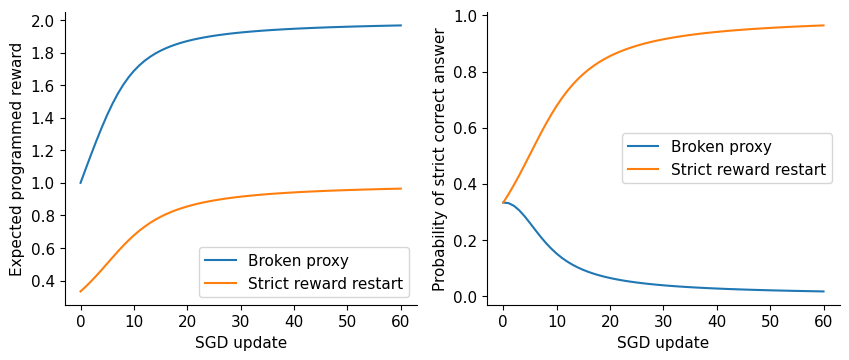
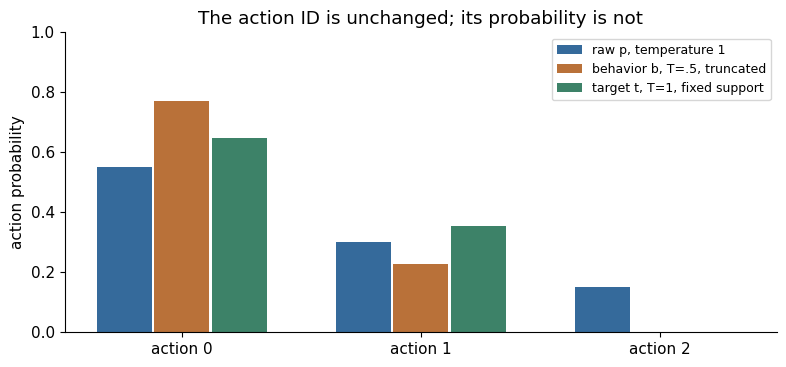
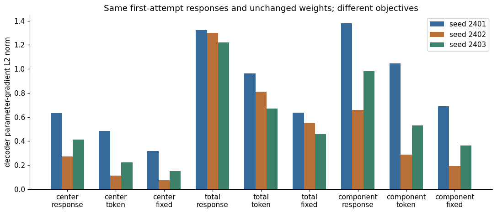

# 14. When Optimization Goes Wrong

A model finds a way to make its reward rise while giving worse answers. The
optimizer has succeeded at the program it was given. The experiment has failed
at the capability it was meant to improve. This distinction connects the
repetitive TinyStories samples of Chapter 6, reward-model selection in Chapter 10,
and the verifier-driven policy updates of Chapter 13.

Days 24–25 study failures as interventions rather than slogans. We deliberately
build an exploitable reward, repair it, compare length reductions, reject stale
rollouts and estimate a rollout pipeline's cost. By the end, a “training is
unstable” report should become a specific account of measurements, hypotheses,
controls and evidence. We will follow three different failures: the wrong
measurement rewards a shortcut; the sampler removes useful alternatives;
and the update differentiates a quantity different from the one its monitor
reports. They can produce similar-looking curves and require different changes.

## 14.1 A real reward-hacking microscope

Imagine a task whose correct answer is 35. Our policy can choose `35`, `35 0` or
`0`. Strict correctness accepts only one integer equal 35. A deliberately broken
proxy accepts text that contains 35 and adds a bonus for apparent extra work:

$$
R_{\mathrm{proxy}}=(1,2,0),\qquad
R_{\mathrm{truth}}=(1,0,0).
$$

With logits $z$ and $p=\mathrm{softmax}(z)$, optimize the exact expected proxy:

$$
J(z)=\sum_a p_a R_a,\qquad
\frac{\partial J}{\partial z_a}=p_a(R_a-J).
$$

The derivative follows from the same softmax Jacobian used for cross-entropy.
Actions above expected reward receive positive logit pressure under ascent;
actions below it receive negative pressure. The final probability changes
also depend on how every other logit changes. At uniform initialization,
the highest-reward malformed answer is favored. No noisy reward estimator,
model-size limitation or distributed bug is needed to create the problem.

**Reader prediction.** The correct answer receives positive reward. Can its
probability still decline on the very first update? At $p=[1/3,1/3,1/3]$,
the proxy mean is one and its ascent gradient is $[0,1/3,-1/3]$.
With the source experiment's learning rate 0.4, the next logits are
$[0,0.133333,-0.133333]$ and probabilities approximately
$[0.331367,0.378630,0.290003]$. The correct answer's logit did not move,
yet its probability fell from one third because the competing normalization
changed. The malformed answer won the comparison the proxy actually defined.

Change only the reward vector to strict correctness. At the same uniform
initialization, its ascent gradient becomes $[2/9,-1/9,-1/9]$, explicitly
favoring the sole correct action. Lowering the original learning rate would
slow the proxy's wrong pressure; it would not turn that pressure into the
strict gradient. This is the causal distinction between an objective failure
and an update-scale failure.

The [CPU experiment](../../src/dongxi_llms/optimization_diagnostics_lab.py)
performs 60 actual SGD updates on these logits. It records expected proxy,
strict accuracy, entropy and every action probability. A paired repair repeats
the same update budget from the same initial logits using the strict verifier.
This isolates the effect of reward definition. It does not show that a hacked
language-model checkpoint can always be repaired with one replacement rule.

In the [measured run](../../experiments/reports/2026-10-04-grpo-diagnostics-distillation.md),
the broken policy's expected proxy rises from 1.000000 to 1.966561 while strict
accuracy falls from 0.333333 to 0.016816. The paired strict-reward restart reaches
0.964428 accuracy. These numbers directly support the finite-policy mechanism:
the optimizer can succeed at the proxy while failing at the task. They do not
measure generalization or repair of any pretrained language model.

The [reward-hacking companion](../../notebooks/day-24/01_reward_hacking.ipynb)
regenerates both panels with `hacking_experiment`. The left panel shows each
arm's own programmed objective: broken proxy for one, strict reward for the
other. Compare the same update within the broken arm across panels:
improvement at its optimized scalar accompanies failure at the independent
task. The strict-reward curve starts again from the same
initial logits; it is not a measured rescue of the final hacked checkpoint.

This mechanism is an example of optimizing an imperfect measurement. Research
on learned reward overoptimization documents related failure under model-scale
selection and training; see [Gao et al.](https://arxiv.org/abs/2210.10760).
Our three-action experiment supplies its own evidence, without inheriting those
papers' quantitative conclusions.

### Learned measurements can fail before the optimizer exploits them

The three-action proxy deliberately encodes a mistake. A text reward model can
instead learn an inadequate measurement from plausible examples. Before blaming
policy optimization, ask whether that measurement can distinguish the examples
and whether its distinctions generalize.

Chapter 10's word-tokenized reward experiment found complete held-out pairs
that became identical model inputs. No weight update could rank two identical
inputs differently. Its [character-tokenizer intervention](../../experiments/reports/2026-10-04-text-reward-character.md)
removes those collisions under a frozen representation contract. Yet all three
seeds still rank only half the ordinary held-out pairs correctly. Removing an
impossibility is necessary for that comparison; it is not evidence that the
model has learned the intended preference. Calibration reduces overconfidence
on its own declared slice without repairing those rankings.

Chapter 12 adds a separate difficulty: a learned critic predicts the future
return of the current policy. At a nonterminal collection cap its bootstrap
can influence the advantage even when no terminal reward has been delivered.
The [learned-critic notebook](../../notebooks/day-20/04_learned_critics_and_frozen_text_rewards.ipynb)
retains actual capped style-token repetitions and weak independent task scores.
A reward-model score displayed for an unfinished prefix is a diagnostic, not
the terminal reward paid by that experiment. Confusing the two would hide the
failure boundary.

Compare oracle, learned and deliberately noisy values, inspect completed and
capped paths separately, and retain the frozen reward's training distribution.
These controls expose plausible failure mechanisms; they do not uniquely prove
that every repetitive response was caused by critic error. A finite policy can
also collapse to a constant answer, and a reward can favor text outside its
training distribution. Diagnose the first failed invariant rather than naming
all three phenomena “reward hacking.”

## 14.2 Separate the task from its checker

A verifier should have a test suite independent of the model's favored outputs.
Test ordinary correct answers, equivalent formatting where allowed, malicious
multiple answers, missing answers, overlong strings, truncated generations and
unexpected encodings. Decide whether leading zeros, signs, decimals or units
are accepted. An arbitrary parser convention can become a hidden training target.

Keep raw response, extracted answer, verifier version and reward components.
If reward mixes correctness, format and length, log each component separately.
Otherwise an increase in total reward can hide declining correctness. Treat
timeouts, exceptions and invalid outputs explicitly. Silently dropping difficult
examples changes the optimization distribution and can make the remaining
reward appear better.

A repair must be evaluated outside the reward used to select it. Repeatedly
writing exceptions for development failures can overfit a checker just as
training can overfit examples. Add adversarial cases to a declared development
suite, preserve a separate test suite and record the checker's revision. A
simple arithmetic verifier can check final correctness; it cannot certify that
every intermediate step in a rationale is valid or that the model used that
rationale internally.

This is the relevant form of Goodhart's observation: a measurement used as
an optimization target can lose its usefulness as a proxy for the purpose
that motivated it. In our example the optimizer needs no strategy or intent;
the reward already encodes the shortcut. Fixing a finite checker removes
this particular incentive, while new outputs can expose another boundary.

## 14.3 Entropy collapse: certainty can mean several things

At a state, categorical entropy is

$$
H(p)=-\sum_v p_v\log p_v.
$$

Low entropy indicates a concentrated next-token distribution. It may reflect
mastery of an easy deterministic answer, repetition of one successful template,
overconfident failure, or the loss of alternatives needed for exploration. Average
entropy over valid response positions and report which states produced it.
Prompt-token entropy, padded rows and EOS-dominated tails answer different
questions. The entropy of a marginal mixture can also differ from average
conditional entropy over prompts.

### Losing alternatives can look like gaining confidence

For three actions, uniform probabilities have entropy $\log3\approx1.098612$
nats. Probabilities $[0.9,0.05,0.05]$ have approximately 0.394398 nats.
Permuting them to $[0.05,0.9,0.05]$ leaves entropy exactly unchanged.
If action 0 is the only correct one, accuracy changes from 0.9 to 0.05.
The entropy number measures concentration, not whether its favored action
deserves that concentration.

A positive sampled advantage supplies pressure toward the sampled choice.
If a proxy repeatedly rewards one response, future samples increasingly
return to it, exposing fewer alternatives. The resulting feedback can amplify
an early shortcut. A strict binary task can instead become concentrated on
a genuinely correct answer. The same low-entropy symptom therefore needs
the independently graded responses beside it.

**Controlled change.** Hold weights fixed and change only collection
temperature or top-p. Sampling entropy and observed diversity can change
without any training. Conversely, under a declared iid policy with only
0.01 probability on the correct alternative, ten draws expose it at least
once with probability $1-0.99^{10}\approx0.095618$. More samples cannot
reliably repair a missing alternative at arbitrarily low probability or
restore support that a truncating sampler removed. Before increasing group
size, inspect whether the intended successful responses can actually appear.

### A measured entropy trace still needs a population

**Reader prediction.** If training-state entropy falls while sampled reward
reaches one, must held-out accuracy improve? Predict what the same model can
confidently get wrong before reading the retained CPU observation.

The [CPU decoder report](../../experiments/reports/2026-10-04-grpo-diagnostics-distillation.json)
records post-update entropy over valid positions on each actual collected
training group. These are the first and final updates of both predeclared arms,
not favorable checkpoints selected from the middle of the curve.

| Group size | Update | Post-update entropy, nats | Mean valid response length | Collected mean reward |
|---:|---:|---:|---:|---:|
|4|1|0.075326|2.0000|0.875|
|4|12|0.025820|2.0000|1.000|
|8|1|0.095885|2.0625|0.875|
|8|12|0.020264|2.0000|1.000|

The one-layer symbolic decoder uses seed 2223, a 60-update warm start and twelve
RL updates. Both arms still score 0/4 on the independent held-out arithmetic pairs
before and after RL. Low entropy at trained prefixes is consequently compatible
with held-out failure. The two arms also consume different rollout counts; this
trace neither ranks group sizes at equal compute nor measures natural-language
reasoning. Mean length includes the sampled EOS and excludes post-stop padding.

An entropy bonus $\lambda_H H(p)$ encourages broader distributions locally. It
does not make low-probability actions useful. On a strict syntax task it can
increase invalid outputs; on a nearly saturated task it can trade correctness
for exploration. Compare valid fraction, correctness and diversity along with
entropy. A diverse set of wrong answers is not task progress.

Policy sampling temperature is another intervention. Raising it changes
collection and inference behavior. If training ratios assume samples came from
the untempered policy while generation used a temperature or top-p restriction,
the behavior likelihood has been misrecorded. A rollout record needs the actual
collection distribution, including truncation and renormalization rules. Our
basic GRPO runner samples at temperature 1 with no top-k or top-p restriction.

### Three distributions, not three names for one vector

A model says an action has probability 0.30. A sampler lowers temperature,
removes unlikely actions and renormalizes. The action ID has not changed, but
its probability has. An update that divides by 0.30 anyway is not using a
record of what generated that action. This can alter an otherwise finite,
apparently healthy gradient.

At one fixed prefix, distinguish raw model probabilities $p$, actual collection
probabilities $b$, and separately declared target probabilities $t_\theta$.
The old policy describes collection; the reference policy defines an anchor.
For collection temperature $\tau_b$ and retained support $S$, our sampler is

$$
b(a)=\frac{\boldsymbol{1}_{a\in S}e^{z_a^{\mathrm{old}}/\tau_b}}
{\sum_{j\in S}e^{z_j^{\mathrm{old}}/\tau_b}}.
$$

Its explicit order is temperature, top-k, renormalization, top-p, then final
renormalization. Top-p retains the action crossing its cumulative threshold;
ties use smaller action ID. Different orders can produce different distributions.
Save the transformation and selected action log probabilities during collection.
A later raw model forward pass need not reproduce them.

A conditional target on the **fixed** retained support can declare its own
temperature $\tau_t$:

$$
t_\theta(a)=\frac{\boldsymbol{1}_{a\in S}e^{z_a^\theta/\tau_t}}
{\sum_{j\in S}e^{z_j^\theta/\tau_t}},\qquad
\rho(a)=\frac{t_\theta(a)}{b(a)}.
$$

Matching logits and support do not imply ratio 1: temperature and renormalization
must match too. Fixing support defines a local conditional objective, not a
derivative through a discontinuous top-k/top-p choice. Recomputing its support
after an update is a different procedure with different boundary behavior.

For fixed rewards, exact enumeration verifies

$$
J(\theta)=\sum_a t_\theta(a)R(a)
=\sum_{a:b(a)>0}b(a)\rho(a)R(a),\qquad
t_\theta(a)>0\Rightarrow b(a)>0.
$$

On fixed support the logit gradient is $t_i(R_i-J)/\tau_t$ and is zero outside
it. Collection probabilities and rewards detach. Replacing the denominator
with raw model probabilities leaves a multiplier $b/p$ in the sum, changing
both value and gradient. PPO clipping does not make an incorrect denominator
true. This single-state action identity also does not solve a complete
autoregressive off-policy problem: different prefix-state distributions and
trajectory weights require their own objective and correction.

### Missing support is missing evidence

**Reader prediction.** Holding logits fixed, does lowering temperature and
removing support reduce entropy because the model learned anything? Which
probability should appear in the importance-ratio denominator?

Read each group of bars at the same action ID. The absent action 2 bar reflects
support removal; the orange-versus-blue difference reflects collection rules.
These are retained finite-fixture probabilities from the notebook and
[sampling-support report](../../experiments/reports/2026-10-04-sampling-support.md),
not a measured training trajectory. The figure's `T` denotes the temperature
written as $\tau$ in this chapter.

The [original CPU microscope](../../src/dongxi_llms/sampling_likelihood_lab.py)
starts with raw probabilities 0.55,0.30,0.15 and rewards 0,1,4. Temperature 0.5,
top-k 2 and top-p 0.9 produce behavior approximately 0.7707,0.2293,0. A declared
temperature-one target on its retained support is approximately 0.6471,0.3529,0.
Correct denominators recover expected reward 0.352941; raw model denominators
produce 0.269764. The [measured report](../../experiments/reports/2026-10-04-sampling-support.md)
retains both gradient vectors, rather than inferring correctness from a
plausible scalar loss. These are finite fixture measurements, not LLM results.

Now ask this collector to optimize the original full-support target. Action 2
has target mass 0.15 and contributes 0.60 to expected reward, but cannot be
sampled. The importance routine rejects this missing support. Zeroing its
ratio would silently omit that contribution. A retained mask cannot repair
the original objective; it can help define a different, conditional objective.
Full-support collection is an alternative when the original raw target must
be retained.

No universal “keep the sampling mask” rule follows. Temperature, renormalization,
target support, changing selection boundaries and prefix-state distributions
all matter. The course Qwen adapter deliberately keeps its simpler
temperature-one/full-support contract. The microscope is motivated by the
[pinned reasoning companion's sampling-mask mechanism](https://github.com/rasbt/reasoning-from-scratch/blob/a788466dc85cfe8617b6c0b809ed4ab9084485de/ch07/03_rlvr_grpo_scripts_advanced/7_7_improvements/deepseek_v32_style.py);
its implementation, prose and fixtures are independent.

### A correct KL value can provide a different KL gradient

At one fixed prefix with positive full-support current $p$ and frozen raw
reference $q$, two sample statistics are

$$
k_1(a)=\log\frac{p(a)}{q(a)},\qquad
k_3(a)=\frac{q(a)}{p(a)}-1+\log\frac{p(a)}{q(a)}.
$$

Both have expectation $D_{\mathrm{KL}}(p\Vert q)$ under $a\sim p$.
For $k_3$ the extra terms cancel because $\sum_a q(a)=\sum_a p(a)=1$.
Shared full support matters: reference mass outside truncated support can
invalidate that cancellation.

Already collected actions do not resample when parameters move. Freeze their
distribution at $b=p_0$ and differentiate each sample term alone. At the fresh
point $p=p_0$, expected current-logit gradients are

$$
\mathbb{E}_b[\nabla_z k_1]=0,\qquad
\mathbb{E}_b[\nabla_z k_3]=p-q.
$$

Neither generally equals the full categorical forward-KL derivative:

$$
\frac{\partial D_{\mathrm{KL}}(p\Vert q)}{\partial z_i}
=p_i\left(\log\frac{p_i}{q_i}-D_{\mathrm{KL}}(p\Vert q)\right).
$$

Their forward values agree; their autodiff contracts differ. Exact categorical
KL differentiates both probabilities and log probabilities. Alternatively,
in this finite full-support example, differentiating the **entire**
$\mathbb{E}_b[(p_\theta/b)k_\theta]$ expression restores the action-distribution
derivative. Detaching its weight removes that term again. This identity is not
a recipe for every trajectory-KL or policy-gradient implementation. Declare
whether an expression is a diagnostic or a chosen differentiable surrogate,
its sampling distribution and its detached terms.

For a concrete full-support example, set $p=[0.5,0.3,0.2]$ and
$q=[0.2,0.3,0.5]$. Both statistics have mean
$D_{\mathrm{KL}}(p\Vert q)=0.3\log2.5\approx0.274887$ nats.
Their gradients under the contracts above are:

| Differentiated expression at $b=p_0=p$ | Expected current-logit gradient |
|---|---|
| Fixed-sample $k_1$ | $[0,0,0]$ |
| Fixed-sample $k_3$ | $[0.3,0,-0.3]$ |
| Complete categorical forward KL | approximately $[0.320702,-0.082466,-0.238236]$ |

The middle coordinate is the revealing one: current and reference probabilities
both equal 0.3, yet changing that logit changes the other probabilities through
normalization, so exact forward KL still has a nonzero derivative there.
Differentiating the value printed by a monitor does not identify its intended
regularizer. The [existing finite utility](../../src/dongxi_llms/sampling_likelihood_lab.py)
and probability notebook compare these paths without sampling noise or
a large-model run.

### Stops and gradient boundaries belong in the contract

A sampled EOS is a response action and receives policy loss. Prompt tokens,
padding and positions after the first generated stop do not. If EOS is also
the padding ID, use prompt boundaries and valid lengths, not token values
alone. A token cap does not assert that the model chose to terminate. In a
continuing-task critic it can permit bootstrapping from the remaining state;
an explicitly finite-horizon task can instead declare its cap terminal.
State that task convention before constructing targets.

The utility tests these distinctions and rejects an unexplained early end.
Recorded old likelihoods, advantages and reference parameters detach; current
target probabilities remain differentiable. Select valid positions before
likelihood arithmetic: zero times a padded NaN is still NaN. A token mask must
still be shifted/sliced once to align the logits predicting those tokens.

Use [Day 20's probability notebook](../../notebooks/day-20/03_behavior_probabilities_and_support.ipynb)
as the bridge from Chapter 12 policy ratios to this failure analysis. Its six
prediction/reference exercises show probabilities, wrong-denominator gradients,
missing support, KL-gradient differences, masks and detachment. Execution
verifies finite mathematics and record integrity, not Mac setup, model-scale
stability, full PPO or a pretrained capability gain.

## 14.4 KL is an anchor and a diagnostic

Forward KL measures departure from a specified reference at specified states.
It is not a measure of truth or a universal acceptable-change threshold. Two
references define different anchors. The reference may be a weak base model,
an SFT assistant or the start of a particular RL phase. Checkpoint identity must
travel with the KL curve.

A sudden rise can reflect a large learning rate, repeated epochs on one rollout
batch, missing behavior correction, incorrect log-probability alignment, a reward
scale change or expected movement toward a new task. The first diagnostic is
whether the log-probabilities and masks are correct. Recompute a small batch
in full precision; verify ratios equal 1 before an update with fresh rollouts;
test whether exact KL is zero for identical policies. Then make one bounded
intervention with a predicted result.

Increasing $\beta$ strengthens the penalty in Chapter 13's objective. If
$\beta$ is too large, it can suppress useful adaptation. If too small, it may
allow harmful drift. A finite per-token KL does not bound total sequence KL
independently of length, and average KL can hide a few extreme prompts. Record
quantiles, length-stratified summaries and representative high-KL cases when
the data budget permits. Do not equate a sampled estimator's occasional negative
value with proof that the true KL is negative.

### Choose the intervention from the first failed mechanism

Suppose reward improves while independent quality does not. Read a fixed
sample of complete responses, then ask which computation first contradicts
the intended experiment:

| Observed failure | Mechanism to check | Controlled change and predicted result |
|---|---|---|
| Malformed answers earn more reward | Checker or learned reward mis-specifies success | Hold logits fixed and substitute the independently declared task scores; the reward-gradient direction should change |
| Every group has the same strict reward | Relative advantages contain no within-group distinction | Inspect centered rewards before stepping; the relative policy derivative should vanish even if a KL derivative remains |
| Diversity falls after sampler changes | Collection distribution or support changed | Hold logits fixed and restore the earlier collector; probability bars should change without a parameter update |
| Importance ratios differ from one before a fresh update | Behavior denominator, temperature, support or alignment is inconsistent | Recompute the selected log probabilities under the actual collection rule; matching distributions should give one |
| Printed KL agrees but parameter pressure differs | Frozen-sample and full-distribution gradient contracts differ | Enumerate one prefix and compare derivatives, not only scalar values |
| Training reward saturates but unseen inputs fail | Fitted behavior may be restricted to training states | Score the same checkpoint on frozen source-separated items and retain both outcomes |

These are hypotheses with predicted computational outcomes, not automatic
diagnoses from a dashboard threshold. Repairing one invariant makes the next
test interpretable; it does not establish that the whole model improved.

The retained cases make that order matter. In the symbolic decoder, mixed
training groups supplied signal and final training reward reached one, yet
held-out arithmetic remained 0/4. In the native strict-format pilots, every
training group had zero relative advantages despite many responses displaying
correct arithmetic. They are different failures: training-set success without
the desired transfer, and absent strict relative signal under the actual
interface. Chapter 13 retains the original responses and denominators for both.
Neither is explained merely by saying that more optimizer calls occurred.

Changing native evaluation from cap 32 to cap 128 also changes delivered
outcomes without changing the evaluated checkpoint's weights. The unchanged
Instruct policy goes from 0/44 to 13/44 held-out sampled successes under those
two contracts. More available output actions allow different completions;
they do not demonstrate an RL learning gain. Preserve the strict grader's
original negative records before proposing a separately defined formatting
or extraction task. This keeps interface diagnosis from becoming retrospective
parser rescue.

## 14.5 Length bias begins in a denominator

Two responses of lengths 2 and 8 receive the same sequence advantage. Under
response means, their total nominal loss weights are 0.5 and 0.5. Under a global
token mean, they are 0.2 and 0.8. Within response means, each token of the shorter
response receives four times the coefficient of each token in the longer one.
This creates different gradient pressures even before reward contains any
explicit length bonus.

The realized effect depends on the token gradients, advantage signs, sampled
states and EOS. “Longer is better” or “shorter is better” cannot be inferred
from a normalization coefficient alone. [Dr. GRPO](https://arxiv.org/html/2503.20783v1)
analyzes consequences of particular normalization choices; our notebooks expose
the coefficients and let the reader test simple counterexamples.

Always record generated valid tokens, natural EOS, token-limit termination and
reward by length bin. A correct answer truncated before its required closing
marker can become an apparent failure. Conversely, a substring-based checker
may reward a long response that lists many possible answers. Treat response
length caps as part of the experimental contract; changing them changes both
computation and the answer distribution.

**Reader prediction.** Keep both response gradients fixed. Does replacing a
response mean with a token mean only multiply the whole parameter gradient by
one constant? Predict the 2-versus-8-token weighting before inspecting actual
matched-rollout derivatives.

Bars compare decoder-gradient norms with the same responses and unchanged
weights. Colors retain three fixed seeds. The horizontal labels separate
component construction (`center`, `total`, `component`) from reduction
(`response`, `token`, `fixed`). A norm changes magnitude; direction must be
checked separately. These one-update derivatives do not rank trained policies.

The [matched-rollout objective notebook](../../notebooks/day-22/03_objective_weighting_and_filtering.ipynb)
compares these pressures on the same generated responses and unchanged decoder
weights. Its analytical selected-score derivatives match autograd. Token-mean
and fixed-cap reductions change scale while sharing a numerator; response means
can also rotate the parameter-gradient direction. Centering a component total
differs from centering and scaling each component before combining them.
None of these gradient observations establishes a better trained policy.

Clipping is a separate intervention. Fresh matching policies have ratio one,
so asymmetric upper clipping cannot improve that fresh surrogate by itself.
A labeled constructed-ratio control shows which pressures change once ratios
move. A separate bounded retry ledger retains rejected groups and their cost.
The [measured CPU comparison](../../experiments/reports/2026-10-04-grpo-objective-controls.md)
attempts 200 responses but selects only 120. Reporting selected tokens alone
would obscure the cost of changing the training population. Filtering is not
silently inserted into the fixed pool used to compare objectives.

### Retention is another measurement, not another name for preference loss

A decreasing DPO loss says the recorded winner is improving relative to its
loser and reference. It does not establish that the winner is a valid answer,
that unrelated skills survive, or that longer winners teach the intended style.
Chapter 11's [retention experiment](../../notebooks/day-18/02_dpo_retention_and_preference_controls.ipynb)
keeps a copy task, an unrelated parity task and held-out sources separate. It
compares preference-only training, chosen-response NLL, rehearsal NLL and their
combination under clean, noisy and length-controlled pairs.

The warm policy did not perfectly solve parity. Rehearsal can therefore continue
learning that task as well as retain what was already learned. Calling every
gain “prevented forgetting” would assume a stronger starting capability than
the evidence supplies. Fixed canonical-answer-and-EOS evaluation also differs
from the preference labels when winners contain extra style tokens. Keep both
measurements: changing evaluation to bless the trained style would conceal
the disagreement rather than diagnose it.

Auxiliary losses consume extra training computation. Report their weights,
tokens, forwards and source overlap; an equal update count is not automatically
an equal compute budget. Negative held-out and noisy-label results remain part
of this comparison. Neither rehearsal nor chosen-response likelihood is a
universal repair for a weak representation or an incorrect preference target.

## 14.6 The rollout system is part of the experiment

A synchronous update has a clear sequence: publish policy version $k$, generate
responses under $k$, verify them, optimize, then publish version $k+1$. The rollout
records retain behavior log probabilities and version $k$. The reference version
is separate and fixed. This makes freshness inspectable without guessing from
timestamps.

Asynchronous systems can generate while a learner updates. That improves hardware
utilization but can increase lag and complicate importance weighting. Accepting
a lagged rollout intentionally differs from accidentally treating it as fresh.
Record the lag distribution, policy weight identity, tokenizer/chat template,
sampling rules, prompt ID, group ID and verifier identity. Every answer in one
group should correspond to the intended prompt and collection contract.

A rollout generated under $k$ does not become a rollout under $k+2$ after weights
are synchronized. Its probabilities must still use $k$ as behavior. Overwriting
the stored denominator defeats the correction. A tokenizer mismatch is more
severe: the token IDs can represent different actions, making the probability
ratio uninterpretable.

The notebook's `RolloutIdentity` rejects stale versions under a strict
zero-lag teaching contract, changed tokenizer/verifier hashes and empty
responses. Passing this check establishes metadata consistency. It does not
prove that the recorded weights really match the hash, that the sampling engine
implemented the requested distribution or that accepted lag is statistically
harmless. Those require integration checks with the actual engine.

## 14.7 Generation can dominate the budget

For $B$ prompts, group size $G$, average valid response length $n$ and useful
generation rate $q$, a first projected synchronous budget is

$$
N= BGn,\qquad
\Delta t_{\mathrm{update}}\approx N/q+
\Delta t_{\mathrm{verify}}+\Delta t_{\mathrm{learn}}+\Delta t_{\mathrm{sync}}.
$$

The estimate ignores queuing and changes in throughput with batch geometry. It
is labeled projected. The lab's default 128 tokens/s is an illustrative control,
not a Spark benchmark. Vary $G$ and $n$, then inspect how the same 6-second optimizer
step becomes a small fraction of total elapsed time. A faster backward pass
may barely change throughput if generation dominates.

Batching can improve generation throughput while increasing active KV cache,
padding, latency or shared memory pressure. Qwen weights, frozen reference,
optimizer moments, gradients, backward activations, rollout tokens and an
inference engine's cache are distinct memory consumers. The Spark's shared host
and GPU memory makes host `MemAvailable` a relevant protection signal in
addition to Torch allocator measurements. Preserve the validated 25 GiB reserve.
An allocation projection is not a measured safe batch size.

vLLM exposes a production inference route; [its documentation](https://docs.vllm.ai/)
describes engine interfaces and serving behavior. Do not import a changing
API into the conceptual definition of GRPO. The course baseline uses a readable
synchronous Torch path first. A later engine adapter must reproduce token IDs,
EOS/masks and behavior log probabilities before its speed comparison is useful.
An engine throughput number without policy correctness is not an RL result.

### Fewer forwarded positions is not automatically faster serving

The [ragged-cache reference](../../experiments/reports/2026-10-04-batched-cache-recovery.md)
uses the actual modern tiny decoder, compact GQA keys/values and differently
sized prompts. Left-padding is storage, not token validity. Logical RoPE
positions follow each row's valid prefix, while an emitted EOS is a real action
even when its ID also serves as padding. Finished rows leave the active cache;
a cap ends collection without inventing EOS.

Under one fixed greedy panel the four paths emit the same 12 useful actions.
Sequential uncached processing forwards 66 positions; batched uncached forwards
90, including 24 padding positions. Sequential caching forwards 21; batched
caching 27, including 6 padding positions. Selected log probabilities match to
the declared tolerance. Those counts isolate saved prefix work, not FLOPs or
latency. Cached batching is slightly slower on this tiny CPU workload; Python
bookkeeping and small kernels can outweigh the work reduction. Do not carry
that timing, or an assumed batching speedup, into a Spark serving claim.

For $L$ layers, active batch $B$, compact KV heads $H_{\mathrm{kv}}$, physical
cache length $S$, head width $d_h$ and element bytes $b$, tensor payload is

$$
M_{\mathrm{KV}}=2LBH_{\mathrm{kv}}Sd_hb.
$$

The factor 2 counts keys and values. This excludes allocator overhead,
snapshots, query-head expansion, activations and model/optimizer storage. Our
explicit tensor counts test this formula; they are not a device-memory profile.

## 14.8 Monitoring should distinguish incidents from causes

A nonfinite loss, low entropy, high KL or exhausted memory reserve is a reason
to investigate. It is not a complete causal explanation. Keep the first failing
invariant, the current policy/interface identity and a bounded output sample.
A successful leader exit also does not establish that its workers stopped or
that its final record was durably retained.

| Incident | First question | Controlled next check |
|---|---|---|
| Reward rises; independent correctness falls | Did the proxy exploit a checker weakness? | Grade retained outputs under a frozen independent verifier |
| Entropy falls | Successful concentration or repeated failure? | Inspect rewards, valid outputs and diversity at the same states |
| KL jumps | Real policy movement or bad alignment/behavior probabilities? | Recompute a small fixed group and verify masks and ratios |
| Useful throughput falls | Longer rollouts, padding or slower kernels? | Separate valid actions, forwarded positions and observed time |
| Leader finishes; invocation fails | Missing acknowledgment or incomplete worker shutdown? | Inspect durable terminal evidence and observed worker ownership |

### Recovery preserves the pending observation

An optimizer-boundary snapshot must retain model, optimizer, scheduler where
used, RNG, data position and reference identity. After collection but before
optimization it must also retain the already generated group and its old-policy
likelihoods. Consume that pending group once before collecting another. Replacing
it with a fresh draw changes the observation and can change the gradient.

The [tiny CPU cache/recovery reference](../../experiments/reports/2026-10-04-batched-cache-recovery.md)
tests completed and post-collection boundaries, with omitted-state controls.
Later [native replay evidence](../../experiments/reports/2026-10-05-native-reasoning-rlvr-evidence.md)
answers a different platform/model question. Neither recovery result implies
better generated answers. Same-environment exact replay also does not promise
bitwise equivalence across software versions or execution hosts.

### A bounded update is not a bounded job

A DPO recipe with 100 updates, four accumulated pairs per update and maximum
sequence length 512 gives 204,800 positions by ordinary update geometry. The
chosen/rejected branches and policy/reference scoring instead admit an upper
bound of 817,600 logical input positions after the one-token causal shift.
Baseline/final evaluation, generation, verification, failed attempts and replay
are still additional work. Neither count is a FLOP estimate.

| Record | What it protects or measures | What it does not establish |
|---|---|---|
| Whole-operation reservation | Capacity before a complete update, evaluation or generation attempt | Exact work inside a failed library call |
| Known successful/partial work | Observed calls, input positions, targets and emitted tokens | FLOPs, total GPU time or unseen partial execution |
| Durable cumulative ledger | Earlier attempts remain charged after numerical recovery | Adversarial authentication or cross-host accounting |

Refuse an operation before its sampler or forward pass when the whole declared
operation cannot fit. Dropping long responses to use the remaining budget changes
the training population; shortening accumulation changes the update. Record a
conservative bound separately from the smaller actual work it may admit.

A checkpoint can restore update 3 while a durable work record already contains
an attempted update 4. Retrying 4 costs additional capacity. Numerical rollback
must not erase physical history. Storage also has a peak: the previous snapshot,
new partial payload and publication markers can coexist. A per-file limit does
not establish a total experiment storage quota.

### Supervision and scientific evidence have different boundaries

A deadline must remain responsive even when a memory observer, logger or worker
blocks. Durable completion, actual leader exit and worker shutdown are separate
observations. The retained [deadline diagnosis](../../experiments/reports/2026-10-05-native-dpo-recovery-deadline.md)
and [RLVR outcomes](../../experiments/reports/2026-10-05-native-reasoning-rlvr-evidence.md)
show why saving a valid numerical snapshot does not retroactively pass a failed
invocation. Preserve failed attempts when a fresh replay or export check succeeds.

Logical budgets protect declared work, while physical quotas and worker cleanup
require measured platform behavior. An authored positive backend fixture proves
a validator accepts that fixture, not that a host enforced a resource boundary.
Read implementation-specific snapshot, hashing, receipt and shutdown details in
[Appendix D](../appendices/d-reproduction-and-environments.md#d6-checkpoints-recovery-and-job-supervision).

Monitoring should ultimately answer mechanism questions: did responses grow,
did groups become uniformly correct or uniformly wrong, did an evaluator change,
or did ratios become extreme? Pair the alert with the relevant measurement and
one stated intervention. Chapter 15 turns those records into a technical defense.

## 14.9 Deep questions

1. How can rising reward and falling accuracy both indicate successful optimization?
2. Why is a repaired checker insufficient evidence that the hacked model is repaired?
3. When can low entropy be a desired result, and when is it dangerous?
4. Why must collection temperature appear in behavior-policy bookkeeping?
5. What information is missing from one average KL number?
6. How can a loss denominator change the pressure on response length?
7. Why does weight synchronization not make an old rollout fresh?
8. Which speedup matters when generation consumes most update time?
9. Which checkpoint state is required to resume the same experiment trajectory?
10. What is an actionable monitoring alert, as opposed to a causal conclusion?
11. Why can identical raw logits still produce an incorrect importance ratio?
12. How can two KL statistics agree in value but disagree in gradient?
13. Why must a sampled EOS and a collection cap produce different critic targets?
14. If a vocabulary intervention removes all held-out input collisions but ranking remains at chance, what has it established?
15. When can rehearsal improvement be continued learning rather than evidence of prevented forgetting?
16. Why can a cached batch forward fewer positions but take longer on a tiny CPU model?
17. What must happen first when resuming a snapshot taken after rollout collection but before its update?

### Systems applications

The following questions retain their original exercise IDs. Their receipt and
implementation details continue in the evidence-reading guide.

18. Why cannot a strong hash distinguish different states that share an ambiguous
    serialization? Separate a representation failure from a hash collision.
19. Why can a successful leader exit still leave the overall invocation incomplete?
20. Why is a per-file limit insufficient evidence of a total storage quota?
21. Why does ordinary DPO update geometry omit policy/reference and chosen/rejected scoring work?
22. Why must an attempted update after a snapshot remain charged when numerical state is restored?
23. Why can the final checkpoint fit a budget while its safe publication needs more space?
24. Why is a valid authored backend fixture different from measured platform enforcement?
25. Why does validating a retained pending pool consume work even when it changes
    no optimizer state and collects no new training responses?
26. Why do actual encoded lengths improve a proposed budget without establishing
    that the complete job fits every declared boundary?
27. How can a conservative reservation exceed the actual cached generation work without becoming its measured count?
28. Why does a budget for snapshot writes leave other job output paths outside
    its storage guarantee?
29. How can a temporary sampler replay check saved history without advancing the
    live training sampler? Which operations still count as work?
30. Why must the evidence allowing snapshot inspection be available before reading
    the payload, rather than only inside it?
31. Why cannot a checkpoint contain its own future completed-save charge? What
    happens to work spent after its saved boundary when it is restored?
32. Why must a work boundary cover preliminary identity hashing as well as the
    eventual payload load?
33. Why do completed and pending snapshots at the same applied-update cursor
    require different next actions? Can later validation work remain charged?
34. Why can a blocked observer or logger defeat a deadline? Which completion
    claims remain uncertain after logging fails?
35. Why are a completed numerical snapshot, a successful whole-child exit and an
    accepted replay comparison separate claims?

The [evidence-reading extensions](../solutions/14-when-optimization-goes-wrong.md#evidence-reading-extensions)
retain the original implementation-specific clauses and worked answers for
18–35, including serialization formats, exact encoded budgets, I/O schedules,
parallel hashing and supervisor receipts. The questions above retain their
general mechanism and evidence reasoning.

[Worked answers](../solutions/14-when-optimization-goes-wrong.md) and the
[Day 24–25 notebook route](../labs/14-when-optimization-goes-wrong.md) connect
these questions to the reward exploit, reduction audit and bounded budget.
