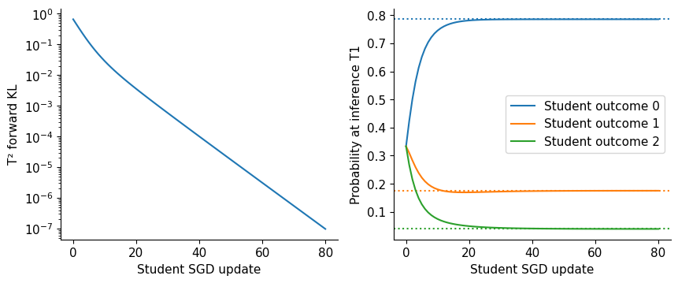
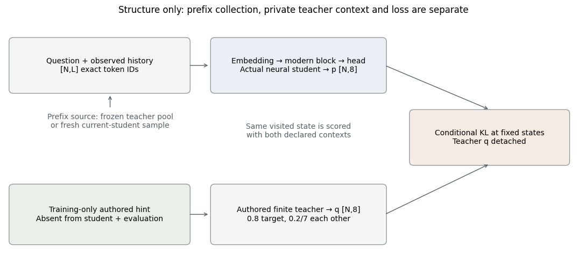
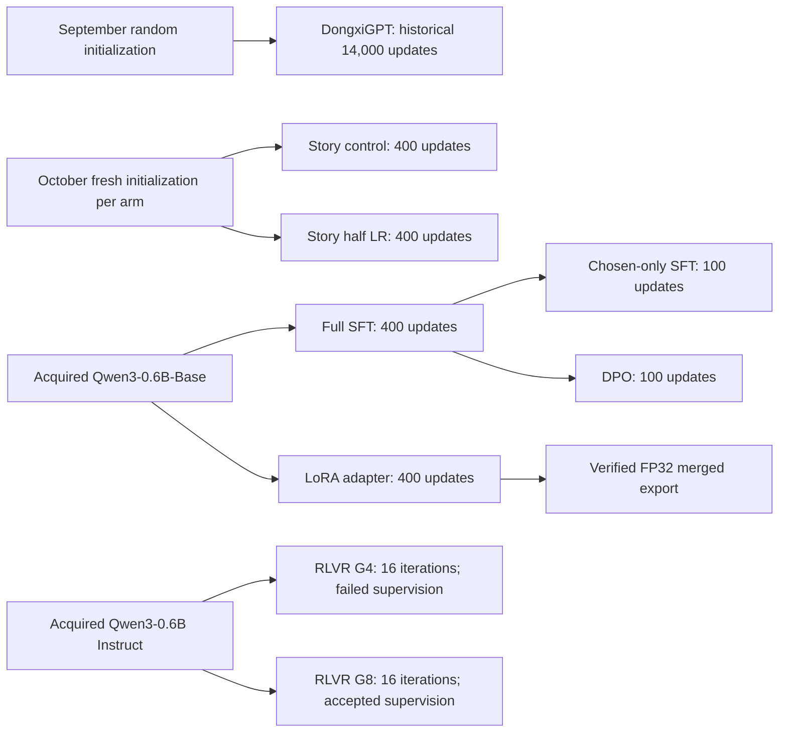

# 15. Distill, Evaluate, and Defend

We now have several ways to change model behavior: next-token training,
demonstrations, preferences and sampled rewards. There is another way to improve
the answer delivered to a user: spend more computation after training, then
select among candidates. A further step is to train a smaller or cheaper model
from the outputs or distributions that this process produces.

These choices share a question: where did the improvement come from, and what
did it cost? Days 26–28 connect inference selection, distillation and final
evaluation. The capstone is a defensible model-development account whose
executable evidence supports a bounded model claim.

Return to the assistant's short answer. We could ask it once, generate several
candidates and choose one, or train a student on the selected answers. All
three can change what a user receives, but only the last changes the student's
weights. Even then, the lesson depends on what we keep: a complete answer and
ending, a single final token, or a teacher distribution at each prefix. This
chapter follows those choices from selection to the student's actual objective.

## 15.1 One model, several answer-producing systems

A checkpoint does not uniquely specify an answer. The prompt template, sampling
temperature, output cap, candidate count, tool use and selection rule also affect
the result. An evaluation comparing a greedy baseline with a sixteen-candidate
system is comparing complete answer-producing systems. That can be a useful
product comparison, but it does not isolate a weight improvement.

Begin with three distinct rules. Single sampling emits one candidate. Majority
voting extracts a canonical answer from several candidates and selects the most
frequent answer. Best-of-$N$ ranks candidates using a verifier or scorer and
returns the highest-ranked one. Record tie rules, invalid-output handling and
candidate token costs for each. Candidate generation may be parallel, so total
compute, latency and peak memory are related but different costs.

The original [self-consistency paper](https://arxiv.org/abs/2203.11171) studies
sampling multiple reasoning paths and aggregating answers. Its mechanism motivates
our comparison; its benchmark gains are not evidence for our tiny simulator or
our trained DongxiGPT checkpoint. A group of sampled answers is useful only to
the extent that the underlying model supplies valid alternatives and the
aggregation rule can identify them.

## 15.2 An oracle ceiling and a real selection rule

If independent candidates are correct with probability $p$, the probability
that at least one is correct is

$$
P(\text{some correct among }N)=1-(1-p)^N.
$$

This is an availability ceiling for an ideal selector. It is not the accuracy
of a deployed ranker. Correlated errors invalidate the independent approximation;
a model that repeats the same wrong answer sixteen times does not gain sixteen
independent opportunities. Retain candidate-level responses so correlation,
diversity and extraction failures can be examined.

Our original categorical simulator samples answer classes with probabilities
0.45 correct,0.40 one repeated wrong answer,0.15 another wrong answer. A fixed
imperfect ranker gives the frequent wrong answer a higher score than the correct
one. Increasing $N$ can increase oracle availability while reducing the ranker's
selected accuracy. Majority voting faces its own question: does the correct
answer have the largest probability mass after canonicalization? Shared wrong
answers can win the vote.

```python
from dongxi_llms.distillation_lab import inference_comparison
comparison = inference_comparison(seed=2628)
comparison['rows']
```

The notebook plots measured Monte Carlo accuracy against an explicitly
illustrative eight-tokens-per-candidate budget. It overlays the independent oracle
formula as a theoretical comparison. These draws are a controlled simulation,
not measured language-model generations. Change the score order or answer
distribution and predict how each rule will change before rerunning.

The [recorded simulation](../../experiments/reports/2026-10-04-grpo-diagnostics-distillation.md)
uses 1200 trials. At 16 candidates, oracle availability is 1.0000 in this finite
sample, majority accuracy is 0.5683, and the imperfect ranker's accuracy is
0.0000. The analytical availability remains slightly below one. These contrasting
results explain why an oracle ceiling must not be presented as a deployed
selector's performance, especially when the scorer rewards the wrong property.

### Actual candidates make the distinction testable

Chapter 7's [actual-candidate experiment](../../experiments/reports/2026-10-04-inference-selection.md)
keeps this simulator as a reference, then replaces its class draws with 864
autoregressive responses from six frozen tiny-decoder policies. Each policy has
its own ordered eight-response pool per item. Prefixes 1,2,4,8 reuse that pool;
gold-blind voting and likelihood selection compete on the same evidence. The
decoder receives symbolic instruction/operand IDs, not parsed English. These
are actual generated answers, not natural-language reasoning traces.

For one fixed trained parity item, the correct answer 0 appears three times,
while the wrong answer 1 appears five times. A correct candidate is available,
but the majority emits the wrong answer. More samples cannot repair a voting
rule when the wrong answer dominates the pool. Train-only likelihood is another
possible ranker, not a correctness label. A constructed longest-output control
has no length contrast here: every eligible answer is one numeral plus EOS.
That absence of a distinction is a result to acknowledge, not an invitation to
infer verbosity effects from the arm's name.

The raw ledger also keeps immediate EOS, repeated numerals, errors and token
caps. Invalid candidates cannot vote but still consume work. A whole-attempt
token-budget replay charges the first overshooting attempt, rejects it from
selection and stops; it does not pretend that completed attempt was free or
that its actual cost fit the cap. Mandatory path rescoring is charged to every
selector in this microscope, although a serving implementation could omit it
for a first-answer rule. Equal attempts, equal nominal token caps and equal
total computation are different comparisons.

The three predeclared seeds retain weak source/template/family generalization.
Across-item error correlations describe this small fixed panel and its related
source siblings; they are not evidence of independent population samples.
Use the [visual notebook](../../notebooks/day-10/05_actual_candidates_and_answer_selection.ipynb)
to inspect available answers, actual decisions and measured work separately.

## 15.3 Selection amplifies scorer errors

Let a scorer return $S(y)=Q(y)+e(y)$, where $Q$ denotes the desired quality and $e$
denotes scoring error. Selecting the maximum $S$ favors candidates that combine
good quality with favorable error. Increasing the candidate pool gives the
selection procedure more opportunities to exploit systematic errors. Even
unbiased errors before selection need not remain unbiased among selected winners.

This is the selection form of the reward problem from Chapter 14. A strong
score on selected candidates cannot independently validate the scorer that
selected them. Use an external frozen evaluator, adversarial examples or
human assessment under a clear rubric. [Reward-model overoptimization
research](https://arxiv.org/abs/2210.10760) studies this issue for best-of-$N$
and policy optimization. Our simulator isolates one understandable case rather
than reproducing the paper's scale relationships.

If a verifier is exact for a narrowly defined task, it can select correct final
answers without estimating broad quality. That still leaves cost, reasoning
validity and domain coverage unresolved. If no candidate passes, report failure
or apply a predeclared fallback. Silently returning the best-looking invalid
answer and counting it as verified changes the system contract.

## 15.4 Rejection sampling creates a new dataset

Rejection sampling generates candidates, applies a criterion and keeps accepted
responses for training. The conditional accepted distribution generally differs
from the original teacher's distribution. Easy prompts with frequent success
can contribute many examples; difficult prompts can disappear. If acceptance
rate is $a$ and one candidate costs $c$ tokens on average, the simple expected
generation cost per accepted example is $c/a$. This estimate assumes stable
independent attempts and omits variable lengths and batch overhead.

Record teacher revision, exact prompt, sampling settings, candidate index,
raw output, acceptance result, verifier revision and dataset split. Bound retries
per prompt. Give rejected outputs a place in the audit rather than making them
vanish. Deduplicate accepted responses and preserve source grouping so prompt
paraphrases or near duplicates do not cross training and evaluation boundaries.

Training on accepted tokens is ordinary supervised sequence learning after a
special data-selection stage. It does not automatically reproduce the teacher's
full conditional distribution. It may reinforce only a narrow successful style.
Compare answer correctness, formatting, diversity, general capability regressions
and cost. A small accepted dataset can be valuable without being a complete
replacement for the demonstrations and controls of Chapter 9.

### Acceptance is not the same decision as selection

The [audited teacher-data experiment](../../experiments/reports/2026-10-04-teacher-data.md)
turns this distinction into an executable pipeline. Its teacher is an original
programmatic copy/reverse function, not an LLM or a human. Across twelve training
prompts it executes 108 attempts, retaining errors, one bounded retry per error,
raw traces, final answers and stops. A format/length/END/deduplication gate admits
36 candidates: twelve correct and 24 wrong. A well-formed answer is not thereby
a good demonstration.

A separate prompt-based task verifier scores that frozen pool. Top-per-prompt,
seeded random and length-matched random each select twelve examples covering
the same twelve source prompts. Their datasets contain 12,4,6 correct examples,
respectively. The verifier can compute the training task's answer; it cannot
inspect held-out gold or use the teacher's declared fault label. Fixture
validation separately checks authored references for consistency. None of these
checks makes the programmatic teacher a neural reasoning model.

Global selection asks a different coverage question. Global top 6 covers only
half the prompts and loses every three-word source, because equally correct
answers are ordered by shorter target length. One-per-prompt selection preserves
both length slices. A higher mean selected score cannot tell us which sources
disappeared; preserve source IDs and excluded prompts alongside the score.

### Equal demonstrations need not mean equal supervision

Let $n_{a,j}$ count assistant-body plus END targets for example $j$ in arm $a$.
With $U$ full-batch updates, valid target exposure is

$$
E_a=U\sum_j n_{a,j}.
$$

Here the three datasets expose 42,46,42 targets per update. Over 80 updates that
means 3360,3680,3360 targets per student. Top versus primary random matches examples
and prompt coverage but not target exposure; length-random is the declared
sensitivity control. These counts still do not equate gradient information,
padded computation or upstream teacher work.

Nine same-initialization tiny sequence students, across three fixed seeds,
actually train and generate. Better-selected demonstrations do not consistently
win the four-prompt held-out test. Every trained arm scores 0/4 on greedy
polite-prefix controls, despite naturally generating END. This is a concrete
reason to separate selected-data correctness, fitting, stopping and transfer.
The small panel does not establish a universal ranking of selection methods.

Use the [teacher-attempt notebook](../../notebooks/day-11/04_teacher_attempts_and_matched_rejection_sft.ipynb)
as a Chapter 8 bridge before distillation. Its journal prevents duplicate committed
attempts on resume, not duplicate physical execution after an uncommitted crash.
The latter can repeat and has a visible unknown lost-cost boundary. Programmatic
serialized words and elapsed time are also not LLM inference tokens or API
billing. Keep those boundaries when replacing the fixture teacher with a
specified real-model adapter later.

## 15.5 Hard responses and soft distributions

Sequence distillation uses teacher-generated token sequences as targets. At each
selected position, the observed target is one-hot. Distribution distillation
instead provides probabilities for several vocabulary outcomes at the same
prefix. These alternatives communicate different information.

The hard-response path is Chapter 9's SFT objective with a new source of
demonstrations. Once selection has chosen the teacher text, each next token is
a target and the student's loss is its negative log probability. The teacher's
other candidates and uncertainty are absent from that update unless we retain
them separately. This can be useful: a student learns to deliver the selected
behavior without generating and ranking the whole teacher pool at inference.
But the selection rule has become part of the training-data generator.

Soft targets can express that two tokens are both plausible, reducing the
pressure to treat an unobserved alternative as equally wrong as every other
token. This connects to Chapter 3's distinction between one observed continuation
and the full conditional language distribution. Soft targets can also preserve
the teacher's mistakes and biases. A teacher probability is a teaching signal,
not ground truth.

### One teacher, two different lessons

Use the [existing three-logit teacher](../../src/dongxi_llms/distillation_lab.py)
$u=(2,0.5,-1)$ at temperature one. Its probabilities are approximately
$q=(0.785597,0.175290,0.039113)$. Compare two forms of supervision at the same
prefix for a student starting uniformly:

| Teaching signal | Target used by the student | Student-logit loss gradient |
|---|---|---|
| One selected teacher token: outcome 0 |(1, 0, 0)|(-0.666667, 0.333333, 0.333333)|
| Frozen teacher distribution |(0.785597, 0.175290, 0.039113)|(-0.452264, 0.158043, 0.294221)|

Both updates favor outcome 0 under gradient descent. The hard target gives
equal direct pressure against the two unobserved outcomes. The soft target
distinguishes them: outcome 1 deserves more retained probability than outcome 2.
The scalar losses are not directly comparable quality scores, because KL
subtracts the teacher's constant entropy while hard-token NLL does not.

**Reader prediction:** after the student becomes concentrated at
$(0.9,0.05,0.05)$, must the soft loss still increase outcome 0 because the
teacher's most likely token is 0?

**Reference reasoning:** the residual is $p-q$. Outcome 0 is now overrepresented
relative to the teacher, so its logit derivative is positive. Outcome 1 is
underrepresented, so its derivative is negative and descent raises its logit.
Soft-target fitting asks for the distribution, rather than unlimited certainty
in its argmax. The same vocabulary coordinate can name a plausible alternative,
a stylistic habit or a teacher error; probability alone does not certify
semantic similarity or correctness.

Reproduce the comparison with `distillation_loss(student_logits,
teacher_logits, temperature=1)` and Chapter 9's token-NLL helper. Change only
the student logits to the logarithms of $(0.9,0.05,0.05)$ to inspect the
second correction. These are finite gradient calculations, separate from the
generating neural students evaluated below.

The student and teacher must refer to the same outcome vocabulary for a direct
token-distribution KL. Matching token IDs from different tokenizers is invalid.
For different tokenizers, sequence/text supervision or an explicit alignment
method is needed. Even shared tokenization does not guarantee shared prefix
states: teacher-forced training on teacher responses and on-policy training on
student prefixes expose different state distributions.

### From three logits to an actual generating student

The [response-distillation experiment](../../experiments/reports/2026-10-04-response-distillation.md)
keeps the exact soft-target lesson below, but asks a different empirical
question. A 6552-parameter tiny teacher actually learns symbolic
`STEP total ANS binary EOS` responses. A 3088-parameter student learns either
its selected complete five-token bodies or answer-only three-token subsequences
from the same actual parent responses. Teacher and student share a 15-ID
vocabulary/template, not hidden dimensions. Neither parses English nor uses a
pretrained reasoning checkpoint.

Each of three predetermined campaigns uses a 120-update teacher and two
same-initialization 80-update student arms. All train-source attempts happen to
be eligible and correct; adversarial malformed/wrong/missing-coverage controls
are separately tested, not invented main-run failures. The adapter selects
first format-eligible traces, not best-gold answers. Independent evaluation
then samples unrestricted tokens, including learned EOS, from teacher, original
student and both fitted students on the same source/template/family panel.

Both fitted arms learn the six training items, but neither consistently wins
all held-out slices. Printed steps and final answers tell different stories:
among 432 teacher evaluation attempts,80 have a wrong step but a correct final,
and 24 a valid step but a wrong final. Complete-response students retain 26 and 15
such contradictions. An independently checked printed total is observable
output validity, not proof that the network used it causally. Answer-only
outputs have no printed step; their step status is missing, not automatically
valid or wrong.

This experiment minimizes response NLL, not the KL of a full teacher vector:

$$
L_{\mathrm{response}}=-\frac{1}{N_{\mathrm{targets}}}
\sum_{t\in\mathrm{response+EOS}}\log p_\theta(y_t\mid x,y_{<t}).
$$

Prompt labels and padding are ignored and the causal shift occurs once.
Complete responses expose 7200 student targets over all campaigns versus 4320
for answer-only. Teacher fitting exposes 10800 more targets and generating its
dataset incurs 720 actions before student evaluation. Smaller student weights
therefore do not by themselves prove lower total cost or faster serving.
The [Day 26 response notebook](../../notebooks/day-26/03_response_level_distillation.ipynb)
connects this sequence evidence to Chapter 9's supervised objective and the
distribution-gradient lesson that follows. The local Spark transfer protocol
remains prepared, not executed.

## 15.6 Distillation loss and its derivative

Let student logits be $z$, frozen teacher logits $u$, temperature $\tau>0$ and

$$
p_i^{(\tau)}=\frac{e^{z_i/\tau}}{\sum_j e^{z_j/\tau}},\qquad
q_i^{(\tau)}=\frac{e^{u_i/\tau}}{\sum_j e^{u_j/\tau}}.
$$

Temperature divides logit differences before normalization. For the same
teacher $u=(2,0.5,-1)$, the targets change as follows:

| Temperature | Teacher probabilities: outcomes 0, 1, 2 |
|---:|---|
|1|(0.785597, 0.175290, 0.039113)|
|2|(0.589798, 0.278601, 0.131602)|
|4|(0.463037, 0.318240, 0.218723)|

The ordering stays the same while more mass reaches the tail. This exposes
relative preferences beyond the top token, but also changes the distribution
we ask the student to fit. Temperature supplies a teaching choice, rather than
extra correctness information.

The distribution-distillation term is

$$
L_{\mathrm{KD}}=\tau^2 D_{\mathrm{KL}}(q^{(\tau)}\Vert p^{(\tau)})
=\tau^2\sum_i q_i^{(\tau)}\log\frac{q_i^{(\tau)}}{p_i^{(\tau)}}.
$$

Teacher probabilities are detached. The entropy of $q$ is constant with respect
to student parameters, so minimizing this KL has the same student gradient as
minimizing soft-target cross-entropy. First differentiate each student
log-softmax coordinate:

$$
\frac{\partial\log p_j^{(\tau)}}{\partial z_i}
=\frac{\mathbf{1}\{i=j\}-p_i^{(\tau)}}{\tau}.
$$

Only the $-\tau^2\sum_jq_j^{(\tau)}\log p_j^{(\tau)}$ part depends on the
student. Weighting the derivative above by the detached teacher probabilities
and using $\sum_jq_j^{(\tau)}=1$ produces

$$
\frac{\partial L_{\mathrm{KD}}}{\partial z_i}
=\tau\left(p_i^{(\tau)}-q_i^{(\tau)}\right).
$$

Without the $\tau^2$ factor, the derivative is $(p_i^{(\tau)}-q_i^{(\tau)})/\tau$.
At sufficiently high temperature, probability differences shrink roughly as
$1/\tau$ for fixed centered logits; the multiplier compensates the resulting
gradient shrinkage. It does not make every temperature produce the same
gradient or require that inference use the training temperature. The classical
motivation is described in [Hinton et al.](https://arxiv.org/abs/1503.02531).

**Controlled change:** retain the same teacher and zero student logits, but
remove the $\tau^2$ factor. Predict how the first logit's correction changes
between temperatures one and four.

**Reference reasoning:** at temperature one its derivative is $-0.452264$
with either convention. At temperature four it is $-0.032426$ without scaling
and $-0.518814$ with scaling. The unscaled correction shrinks from both the
explicit $1/\tau$ and the flatter target. The scaled correction is substantial
but differs from its temperature-one value. [Day 26's temperature reference](../../notebooks/day-26/01_temperature_distillation.ipynb)
checks every component against the analytical residual for temperatures 1, 2
and 4 while verifying that the teacher receives no gradient.

A mixed objective may use

$$
L=\lambda_{\mathrm{KD}} L_{\mathrm{KD}}+(1-\lambda_{\mathrm{KD}})L_{\mathrm{hard}},\quad 0\le\lambda_{\mathrm{KD}}\le1.
$$

At $\lambda_{\mathrm{KD}}=1$, only the teacher-distribution term supplies
correction; at zero, only hard targets do. Intermediate values blend their
gradients. Changing temperature or reduction changes the terms' scale, so the
coefficient alone is not a percentage of “knowledge transferred.” Inspect the
two gradient contributions at the same student state.

Declare whether each term is averaged over tokens or sequences, which positions
are valid and what data each term uses. The scaling changes their relative
influence. If Torch `kl_div` is used, its input/target conventions and reduction
must be checked explicitly; a visually similar expression can reverse the KL or
divide by vocabulary width unexpectedly. The source module writes the sum directly. Its temperature argument and archived
reports may use `T`; $\tau$ here denotes the same temperature, while $n$ or
$\lvert y\rvert$ denotes sequence length.

## 15.7 A bounded distillation experiment

The executable microscope fits three student logits to a fixed teacher with
logits 2, 0.5, −1. It runs 80 SGD updates and records temperature-scaled loss,
student probabilities and teacher probabilities. Autograd is compared with the
analytical $\tau(p-q)$ derivative at several temperatures. The teacher receives no
gradient. The experiment verifies target geometry and optimization mechanics.

The [measured scaled KL](../../experiments/reports/2026-10-04-grpo-diagnostics-distillation.md)
falls from 0.657134229 to approximately $9.77\times10^{-8}$ at $\tau=2$.
This is a successful fit to the specified teacher distribution. The report
retains both probability vectors so the claim can be checked beyond one loss.



The left panel plots the temperature-two training objective on a logarithmic
axis. The right panel evaluates the logits at temperature one; the dotted
lines are the teacher's corresponding probabilities. Read the matching vectors
alongside the falling loss. Both panels are regenerated by the existing
temperature notebook's 80-update three-logit reference. No autoregressive
student or held-out language task is represented by this plot.

It does not verify a smaller neural network's representation capacity, reasoning
transfer, deployment speed, robustness or acceptable regression. A real
teacher/student experiment must declare architecture, tokenization, data,
generation budget, training budget and evaluation. Include the student before
distillation and the teacher in the same panel. If training uses teacher-generated
answers selected by a verifier, distinguish the teacher, selection procedure
and student as three systems.

The [DeepSeek-R1 report](https://arxiv.org/abs/2501.12948) documents model-scale
distillation as part of a broader training process. We use it as an example
of the design category, not as evidence that our small run shares its capabilities.
The course's Qwen distillation pathway should inherit the frozen evaluation
and source identity conventions already established for SFT and RL.

## 15.8 Refinement is a state machine, not a guarantee

Instead of drawing independent alternatives, we can revisit a current draft.
Separate critique, proposed revision and acceptance. For question $x$, draft
$d_r$, critique function $C$ and reviser $R$, write

$$
c_r=C(x,d_r),\qquad u_r=R(x,d_r,c_r),\qquad
d_{r+1}=\begin{cases}u_r,&a_r=1,\\d_r,&a_r=0.\end{cases}
$$

The acceptance decision $a_r$ determines what the user eventually receives.
Advice can be unhelpful, a revision can be worse, and a permissive gate can accept
it. A high score or well-formed output is not a correctness certificate. The
mechanism therefore needs a declared stopping rule, round ceiling, failure path
and evaluator independent of its acceptance score.

Our [critique/revision experiment](../../experiments/reports/2026-10-04-critique-revision.md)
uses explicit programmatic actions, not a neural self-critic. A syntax gate
accepts a single binary symbol followed by natural EOS, including valid ties.
An unchanged accepted token path stops; otherwise the loop has two rounds.
Gold is physically absent from callback views and used only afterward to grade
the proposed and delivered answers. In the exact programmatic panel, contrarian
revision accepts 54 helpful and 54 harmful changes, then returns to the original
answer. Looking only at the final score hides both kinds of transition.

A second panel replays the unchanged 864 actual tiny-decoder candidates from
Chapter 7. Its repair rule makes an invalid draft well formed by retaining its
first binary token and appending EOS. This raises delivered correctness from
30/108 to 65/108 on the fixed mixed-checkpoint panel, but every revision is
programmatic and many are still wrong. No historical model consumes critiques
or generates a revised answer. This is observable format postprocessing, not
evidence that repeated neural thought improves reasoning.

Count the draft and every critique/revision, even rejected ones:

$$
B=n_{\mathrm{draft}}+\sum_{r=1}^{R}
(n_{\mathrm{critique},r}+n_{\mathrm{revision},r}).
$$

The exact control matches this serialized-symbol budget with three or five
independent binary/EOS draws. It does not match neural computation. Replayed
model attempts can overshoot or underfill the ceiling; those counts and the
original generation/rescoring work remain visible rather than disappearing
when an attempt is ineligible. The no-critique baseline spends less work.

Independent review caught an important interface defect: an EOS-looking critique
marked as capped could trigger revision. The hardened instrument requires real
natural stopping and retains the capped tokens/error while skipping revision.
The old measurements and diagnostic-only intermediate revision are preserved;
the new campaign exactly reproduces their ordinary paths under current source.
The [refinement notebook](../../notebooks/day-26/04_critique_revision_and_acceptance.ipynb)
lets you inspect this boundary and harmful transitions, not merely watch a final
answer count rise.

## 15.9 What histories does the teacher teach on?

So far we held the prefix fixed. In a sequence model, it is part of the lesson.
Teacher-produced text supplies teacher-produced histories. During deployment,
the student also visits histories created by its own errors. A perfect fit to
teacher targets at one set of states can leave those other states unconstrained.

KL direction and prefix source are independent choices. Let a state $s$ be the
question plus generated history, $q(\cdot\mid s)$ the frozen teacher distribution
and $p_\theta(\cdot\mid s)$ the student. Offline trajectories supply one state
distribution; the current student supplies another, including its own mistakes.
At those states we may minimize either conditional objective:

$$
L_F(s)=\sum_i q_i(s)\log\frac{q_i(s)}{p_i(s)},\qquad
L_R(s)=\sum_i p_i(s)\log\frac{p_i(s)}{q_i(s)}.
$$

Forward KL weights the discrepancy by teacher probability. Reverse KL weights
it by the student's probability, so its correction is not the same $p-q$
residual. If the student can freely represent the complete teacher vector at
this fixed state, both objectives minimize at $p=q$. Different compromises
arise when the student is constrained or shares parameters across states; a
different KL direction alone does not prove that a fitted neural policy must
cover or discard a particular mode. At temperature 1, with full positive support and
$\ell_i=\log(p_i/q_i)$, the student-logit derivatives are

$$
\frac{\partial L_F}{\partial z_i}=p_i-q_i,\qquad
\frac{\partial L_R}{\partial z_i}
=p_i\left(\ell_i-\sum_jp_j\ell_j\right).
$$

Teacher targets are detached and coordinates must denote the same vocabulary
outcomes. Zero teacher support can make reverse KL infinite. Adding an arbitrary
floor would change the objective rather than resolve that fact.



Follow the top path from question and observed history to the neural student's
next-token vector. The lower path produces the detached teacher target; its
training-only hint never enters the student. The prefix can come from a frozen
pool or a fresh student rollout. This structural diagram is generated by the
[student-prefix notebook](../../notebooks/day-26/05_student_prefix_and_teacher_context.ipynb),
and identifies three independent choices: visited states, teacher context and
conditional loss geometry.

**Reader prediction:** on the authored task `reverse A B`, the student has
already emitted the wrong first token `C`. Does asking the teacher at this new
prefix necessarily supply a helpful correction?

**Reference reasoning:** the finite teacher in this companion deliberately
repeats a wrong-prefix symbol. Without a hint, it assigns probability 0.8 to
`C`. With the private intended sequence `[B, A]`, it assigns probability 0.8
to `A`, the target for the next position. Each other vocabulary outcome has
probability $0.2/7$. The hint changes what the teacher teaches at the same
visited state; it does not erase the student's already emitted wrong `C`.
This example is an authored conditional rule checked by `teacher_distribution`,
not a claim that a real teacher reliably recovers from arbitrary mistakes.

### Sampling student states is not differentiating their occupancy

Our [student-prefix experiment](../../experiments/reports/2026-10-04-student-prefix-distillation.md)
actually trains 24 tiny neural students across three fixed seeds. Its teacher is
an authored finite probability rule, not a pretrained neural teacher. The
factorial comparison changes offline versus current-student prefixes, forward
versus reverse KL, and ordinary versus privileged teacher context. All eight
arms within a seed start at identical student weights and use 30 updates.

The teacher assigns 0.8 to its target and 0.2/7 to every other outcome. On a wrong
prefix, the unhinted rule deliberately repeats a previous symbol; a training-only
authored hint recovers the correct next symbol. This engineered teacher failure
isolates context dependence. The hint never enters a student input or evaluation
generation. A sampled HINT token is simply an invalid output, not private help.

The offline pool is collected once from the finite teacher. On-policy arms
collect actual unrestricted student trajectories before every update. Each
visited pre-action state, including the state emitting EOS, contributes to a
global valid-state mean. A cap contributes only visited states and does not
invent an EOS target. Different stop patterns produce different state exposure
despite equal updates. Ordinary failure controls retain costs and skip the
affected prompt group; the recorded main campaign has no such actual skips.

At a sampled state the implementation differentiates conditional KL with fixed
history and detached teacher targets. It does not differentiate the probability
of visiting that history or add a REINFORCE term. Thus “on-policy” describes how
states were collected, not a claim to compute the full derivative of an
expectation over a parameter-dependent state distribution. An optional
correct-sibling diagnostic reports how many groups would lack a demonstration;
it does not filter the fitted data or turn authored hints into a complete SDPO.

More relevant states do not guarantee better optimization or transfer. The
offline-forward-hint arms score 5/24,6/24,7/24 on this tiny held-out reversal
panel, versus 1/24,0/24,3/24 for the student-prefix-forward-hint arms. All other
arms, EOS/caps, invalid responses, work and negative outcomes remain recorded.
These are results of this frozen task and finite teacher, not a universal
ranking of distillation methods or model-scale reasoning evidence.

### A top-$k$ tail is a coarser lesson

Large vocabularies motivate retaining selected coordinates and aggregating the
rest. Let $T$ contain unselected outcomes, $q_T=\sum_{i\in T}q_i$ and
$p_T=\sum_{i\in T}p_i$. An exact tail bucket conserves both distributions'
mass but loses distinctions within $T$. For forward KL,

$$
D_{\mathrm{KL}}(q\Vert p)=D_{\mathrm{KL}}(q_{\mathrm{bucket}}\Vert
p_{\mathrm{bucket}})+q_TD_{\mathrm{KL}}(q(\cdot\mid T)\Vert p(\cdot\mid T)).
$$

To see the missing detail, write $q_i=q_T\bar q_i$ and $p_i=p_T\bar p_i$
for $i\in T$, with $\bar q$ and $\bar p$ normalized inside the tail. Its
contribution splits into

$$
\sum_{i\in T}q_i\log\frac{q_i}{p_i}
=q_T\log\frac{q_T}{p_T}
+q_T\sum_{i\in T}\bar q_i\log\frac{\bar q_i}{\bar p_i}.
$$

The first term is the bucket's mass comparison; the second compares how the
mass is distributed within it. The retained outcomes contribute identically
to full and bucketed KL. This derivation assumes positive tail masses and
defined conditionals; the implementation's zero-support controls below keep
their separate contracts.

Reverse KL has the corresponding $p_T$-weighted conditional term. This is an
exact decomposition, not a guarantee that bucket and full gradients agree.
Two vectors can match their retained coordinates and total tail mass perfectly
while distributing that mass differently inside the tail. Bucketed KL is then
zero although full KL is positive. At full vocabulary width no detail is lost.
Choosing top-$k$ indices is also discrete; our microscope freezes that selection
for differentiation and does not claim large-vocabulary compute savings. Its
finite tail-detail helper explicitly requires strictly positive full vectors;
zero-support controls use full KL separately, with infinities disclosed rather
than subtracting infinity from infinity. A homogeneous collection cohort is
also required before fitting: individually valid records from different model
states or sampling phases cannot silently become one frozen pool.

The [student-prefix notebook](../../notebooks/day-26/05_student_prefix_and_teacher_context.ipynb)
holds states fixed to compare exact gradients, then varies the collection source.
This separates target geometry, state coverage and free-generation behavior—
three questions that one decreasing training loss cannot answer.

## 15.10 The checkpoint genealogy is part of the claim

A score is ambiguous without the ancestry of its weights. Record checkpoint,
parent, tokenizer/template, training data, objective, precision and evidence
location. Shared parents identify controlled comparisons; separate roots prevent
unrelated measurements from being presented as one continuous improvement.

The following is an architecture/evidence schematic, not a measured performance
plot. Solid arrows show the retained training ancestry. The two story eras are
separate experiments; the October arms are fresh same-seed initializations, not
continuations of the September model.



| Edge or branch | What its evidence establishes | Canonical source |
|---|---|---|
| September initialization → DongxiGPT | Historical from-scratch baseline, distinct from later controlled arms | [Day 9 model card](../../docs/model_cards/day09-dongxigpt.md) |
| Fresh October initialization → control/half LR | Matched 400-update intervention; later declared checkpoints remain unrun | [Story comparison](../../experiments/reports/2026-10-05-native-story-first400-comparison.md) |
| Base → full-SFT 400 and LoRA400 | Equal valid-target exposure in different trainable parameter spaces | [SFT comparison](../../experiments/reports/2026-10-05-native-sft400-comparison.md) |
| LoRA400 → FP32 merged export | Independently verified export precision/loading boundary | [Assistant-study card](../../docs/model_cards/native-assistant-interface-study.md) |
| Full-SFT 400 → chosen-only 100/DPO100 | Original selected parent, matched draws; recovery weights are not pilot parents | [Preference comparison](../../experiments/reports/2026-10-05-native-preference-comparison.md) |
| Instruct → G4/G8 | Separate fixed 16 RLVR branch; no ancestry from custom assistant weights | [Reasoning/RLVR evidence](../../experiments/reports/2026-10-05-native-reasoning-rlvr-evidence.md) |

Thinking-on/off flags and 32/128-token caps change the rendered interface or
answer budget; they are annotations on evaluation, not new weight ancestors.
G4 has a separately checked final export despite failed supervision. That
export closure does not rewrite the failure as an accepted pilot. G8's pilot
acceptance remains a different outcome. [Appendix D](../appendices/d-reproduction-and-environments.md#supervision-and-durable-evidence)
preserves the detailed recovery/logging records.

The [genealogy audit](../../src/dongxi_llms/distillation_lab.py) rejects unknown
parents, cycles, duplicate IDs and inconsistent evaluation hashes. Its tiny
fixture checks graph structure using label hashes; it does not authenticate
real model files. This diagram links real evidence but does not turn metadata
consistency into portable weights, broad quality or external provenance.

## 15.11 Defending the final system

A technical defense follows a continuous argument:

**Target capability → data → model/recipe → measured change → cost → failures → next test.**

Start with what a user should receive, then ask whether the evaluation observes
that behavior. A lower training loss, successful replay or polished model card
answers a different question. Each result needs its own population, comparison
and uncertainty boundary.

### Reader prediction

A full-SFT checkpoint answers every item in a 120-item panel exactly, while its
Base parent and LoRA control answer none. Would that justify calling it a
general assistant? Predict which additional populations and costs a defense
must disclose before reading the worked example.

### Worked defense: narrow instruction transfer

**Target and data.** The target is a complete requested copy/reverse/polite-prefix
answer with natural termination. The frozen panel contains 120 original held-out
items in 40 source groups, but shares three task templates with training. It
measures lexical transfer within those templates, not broad assistant ability.
The [source-bound comparison](../../experiments/reports/native-assistant-comparison-20261005-run-02/README.md)
retains the raw outputs, source roles and exact grading contract.

**Model and comparison controls.** Base, full-SFT 400 and rank 8 Q/V LoRA400 share
the acquired Base origin. Both trained arms present 9,321 valid training labels
under the same fixed update count and learning rate; they optimize different
parameter spaces. The LoRA arm is evaluated through its separately verified
FP32 merged export. Common generation fixes the template, greedy decoding and
64-token cap. Equal exposure does not make the recipes equally expressive or
prove that the LoRA configuration is optimal.

| Complete held-out panel | Base | Full-SFT 400 | LoRA400 FP32 merge |
|---|---:|---:|---:|
| Exact whole answers |0/120|120/120|0/120|
| Natural endings |0/120|120/120|0/120|
| Responses at 64-token cap |120/120|0/120|120/120|

**Read the output.** Use the first aligned held-out item, whose three complete
responses are displayed in [Chapter 9's controlled comparison](09-supervised-fine-tuning.md#99-compare-recipes-under-named-constraints).
Inspect actual content and stop reason together. A permissive format pass alone
can coexist with a cap and an incorrect complete answer; the frozen exact-match
rule does not accept an answer merely because it contains a useful substring.

**Cost.** The measured [SFT report](../../experiments/reports/2026-10-05-native-sft400-comparison.md)
separates training targets, processed positions, trainable parameters and
whole-process elapsed time. The 9,321 labels are completed training exposure,
not all evaluation/generation work or FLOPs. Recovery and failed attempts are
additional physical work. A successful technical continuation cannot refund
them or substitute for this held-out panel.

**Interpretation and uncertainty.** Full tuning wins this fixed three-template
panel under the declared recipes. Its source-group bootstrap difference is
degenerate at one because every retained group has the same observed difference.
That describes this panel; it cannot quantify uncertainty over unseen task
templates, applications or alternative training seeds. The apparent certainty
is a property of the sample and estimand, not universal confidence.

**Failure boundary and next test.** The Base and LoRA rows retain all capped
failures. The separately failed historical BF16 merge remains a failure; this
FP32 export does not replace it. A useful next *proposed* test would freeze new
task templates and compare the same identified policies before choosing another
recipe. No unexecuted test contributes a score to this defense.

### Apply the same argument to other branches

For the story branch, lower held-out NLL and more natural stops do not guarantee
coherent endings; [Chapters 6–7](06-pretraining-as-a-controlled-system.md)
retain that measured distinction and its missing later checkpoints. For
preferences, [Chapter 11](11-direct-preference-optimization.md#1184-the-preferred-answer-can-win-a-pair-without-winning-generation)
compares a pair margin with independently generated whole answers. For RLVR,
[Chapter 13](13-group-relative-policy-optimization.md#1384-read-the-matched-outcome-not-the-pooled-count)
shows why pooled diagnostic gains can coexist with no held-out sampled gain.
These are distinct defenses, not one pooled capability score.

A model card should name intended/excluded uses, data and licenses, architecture,
compute boundaries, evaluation conditions, representative failures and unresolved
claims. An experiment card explains the comparison; a data card explains source
and split identity. Together they distinguish measured mechanisms, measured
model behavior and unexecuted protocols. [Appendix D](../appendices/d-reproduction-and-environments.md)
provides reproduction and verification routes. An evidence review supports only
the claims demonstrated by its records; release decisions are a separate step.

## 15.12 Deep questions

1. Why can the probability of finding a correct candidate rise while selected accuracy falls?
2. What assumptions are required for the independent oracle formula?
3. How can a scorer's errors become larger among selected winners?
4. Which prompts disappear from a rejection-sampled training set?
5. What information does a soft teacher target add beyond one generated token?
6. Derive the temperature-scaled student-logit gradient and explain the $\tau^2$ factor.
7. Why can equal token IDs be insufficient when teacher and student tokenizers differ?
8. How do teacher-prefix and student-prefix training distributions differ?
9. What does a genealogy consistency check establish, and what does it leave unverified?
10. What must a final technical defense say when an intended experiment was never run?
11. If three of eight candidates are correct, why can more sampling still return the wrong answer?
12. Why can equal candidate counts, equal token caps and equal total compute identify different comparisons?
13. Why should a format gate preserve wrong but well-formed answers for a later selection audit?
14. If twelve examples cover the same prompts in two arms, what additional measurements are needed before calling their training budgets matched?
15. Why can a student learn every selected teacher demonstration without learning the teacher's full next-token distribution?
16. What does a valid printed intermediate step establish, and what does a wrong-step/right-answer response reveal?
17. How can refinement leave the final accuracy unchanged while repeatedly harming correct drafts?
18. Why is a serialization-matched revision comparison not necessarily compute matched?
19. Why should a capped critique be retained but forbidden from invoking revision?
20. Which two independent choices change in an offline-forward-KL versus student-prefix-reverse-KL comparison?
21. Why does differentiating conditional KL at sampled student states not include the state-occupancy derivative?
22. How can a zero-loss top-$k$ tail bucket still hide a positive full KL and a different gradient?
23. Why can 120/120 held-out answers and a degenerate bootstrap interval still be insufficient evidence for a general assistant?

[Worked answers](../solutions/15-distill-evaluate-and-defend.md) and the
[Day 26–28 notebook route](../labs/15-distill-evaluate-and-defend.md) close the
book with executable selection, gradient, genealogy and release exercises.
The final product is a set of choices a reader can inspect and reproduce, with
their strengths, failures and evidence boundaries intact.
