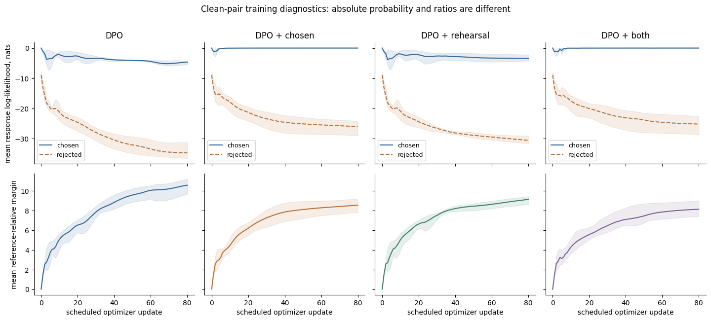
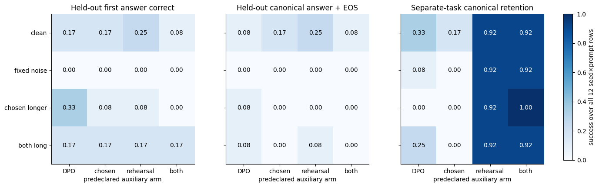

# DXI-11 — absolute likelihood, retention and additional supervision

The bounded shared-decoder comparison passed its mechanism and verification
checks, but it did **not** produce a universal repair. Clean DPO improved pair
margins while lowering chosen likelihood and losing trained copying/parity
responses. Chosen NLL protected the directly supervised copying answers here,
not the separate parity task. Rehearsal helped parity, while genuine held-out
copying remained poor. All 48 fixed seed×condition×arm fits and initial failures
are retained; no favorable coefficient or checkpoint was selected.

The [final JSON](2026-10-04-dpo-retention-verification.json) stores actual
measurements and identities. The [specification](../specs/2026-10-04-dpo-retention.md)
and [original contract](../../fixtures/dpo-retention/contract.json) were saved
before fitting. This is actual CPU training of a shared TinyDecoder using the
existing SFT/DPO stack, not categorical-table optimization, natural-language
capability evidence, human preference data or a pretrained-model run.

## Frozen experiment

Seeds 1811/1812/1813 each initialized a 5640-parameter, one-layer decoder:
vocabulary 16, width 24, four query/two KV heads, head dimension 6, hidden 48,
RoPE/RMSNorm/SwiGLU and tied embeddings. First-slot copying uses four color
symbols. A separate parity task uses distinct numeral/result symbols; common
BOS/EOS boundaries remain shared. Independent copy rules/integer arithmetic
fix evaluation targets. English descriptions and source IDs are metadata, not
features supplied to the policy.

Warm-up ran 120 jointly supervised updates on four copying and four parity
demonstrations, AdamW learning rate 0.015, weight decay 0 and clipping at 1.
Each warm checkpoint was copied into every preference arm for its seed. The
reference stayed bitwise fixed, in evaluation mode and without gradients.
Its score cache identity includes actual weight bytes, token meanings/template,
branch IDs/masks, dtype, normalization and cached values. Every final cache
recomputation and reference hash check passed.

All 48 fits ran the scheduled 80 full-batch updates, AdamW learning rate 0.008,
weight decay 0, clip 1 and beta 0.5. The fixed arms were:

| Arm | Chosen NLL alpha | Rehearsal NLL gamma |
|---|---:|---:|
|DPO|0|0|
|DPO+chosen|0.25|0|
|DPO+rehearsal|0|0.25|
|DPO+both|0.25|0.25|

DPO uses mean pair loss over summed response likelihoods, including EOS.
Chosen/rehearsal NLL each use their own global valid-response-token mean.
The independent tests verify exact ordinary-DPO value/parameter-gradient
recovery at alpha=gamma=0 and agreement with the explicit combined loss.
Alpha=0 alone does not remove a nonzero rehearsal term. Chosen NLL reuses the
pair score but treats the recorded winner as a demonstration; rehearsal adds
different supervised targets. Neither is an equal-information baseline.

The four original copying preference sources also appear in warm-up, and the
four parity warm-up sources supply rehearsal. This staged reuse is deliberate.
Four independent ordered color pairs and four separate numeric problems are
held out of **all** training stages. Source/problem/encoded-prompt leakage is
checked; coefficients and stopping are not selected from held-out outcomes.

## The warm control already contains failures

Entries are complete canonical successes out of four prompts, in seed order
1811, 1812, 1813. Free generation uses the same full vocabulary, greedy rule,
cap 4 and EOS 2 before and after training. It consumes its own previous tokens.

| Warm state | Copying train | Copying held-out | Parity train | Parity held-out |
|---|---|---|---|---|
|Canonical success /4|4,4,4|0,0,0|3,2,2|2,0,2|

All random initialization rows score 0/4 canonical success. Warm-up fully fits
the four copying demonstrations but does not establish a general copying
rule. Parity was only partially learned. Therefore a later rehearsal gain
includes continued supervised learning, not only preservation of an already
perfect capability. Held-out parity uses previously unseen numeral tokens,
so it is a severe input-novelty slice rather than isolated arithmetic transfer.
None of these initial failures prompted a longer warm-up or another seed.

## Clean pairs: ratios and absolute likelihood separate

Values below are mean sequence log-likelihoods/margins over four training pairs
and all three seeds. Log-likelihoods include the response termination token;
they are not per-token averages or probabilities of a freely generated answer.

| State/arm | Absolute chosen log-likelihood | Absolute rejected log-likelihood | Reference-relative margin |
|---|---:|---:|---:|
|Untouched warm control|−0.001810|−8.935555|0|
|DPO final|−4.640873|−34.749167|10.587275|
|DPO+chosen final|−0.000632|−26.052258|8.558941|
|DPO+rehearsal final|−3.402642|−30.616997|9.140305|
|DPO+both final|−0.000998|−25.225496|8.145377|

DPO's larger margin is not the best absolute chosen likelihood or independent
generation result. For seed 1811, clean DPO on `copy-train-0` emits `odd EOS`
instead of `amber EOS`, despite its favorable training ratio. The chosen-NLL
arm emits the canonical answer on that row. Another DPO row emits
`amber dune dune coral` and reaches the cap without EOS. These examples are
retained, not replaced by teacher-forced answer probabilities.



The lines average three fixed seeds; shaded min/max ranges are not confidence
intervals. Different augmented raw losses are not a method-quality ranking.

## All endpoints, including noise and length failures

Each cell lists three complete-success counts **out of four**, ordered
1811/1812/1813. Every row uses the final scheduled update 80. No row or seed is
omitted because another arm appears better.

| Condition | Arm | Copy train | Copy held-out | Parity train | Parity held-out |
|---|---|---|---|---|---|
|clean|DPO|1,2,1|0,1,0|2,0,2|1,0,2|
|clean|chosen|4,4,4|0,1,1|2,0,0|0,0,0|
|clean|rehearsal|2,2,2|1,2,0|4,3,4|0,2,2|
|clean|both|4,4,4|0,1,0|4,3,4|0,2,2|
|fixed noise|DPO|1,0,2|0,0,0|0,1,0|2,2,0|
|fixed noise|chosen|2,2,2|0,0,0|0,0,0|0,0,0|
|fixed noise|rehearsal|0,0,1|0,0,0|4,3,4|0,2,2|
|fixed noise|both|2,2,2|0,0,0|4,3,4|0,2,2|
|chosen longer|DPO|0,0,1|0,1,0|0,0,0|0,0,0|
|chosen longer|chosen|0,0,0|0,0,0|0,0,0|0,0,0|
|chosen longer|rehearsal|0,0,0|0,0,0|4,4,3|2,2,2|
|chosen longer|both|0,0,0|0,0,0|4,4,4|0,0,2|
|matched long|DPO|1,1,3|0,1,0|3,0,0|2,0,0|
|matched long|chosen|0,0,0|0,0,0|0,0,0|0,0,0|
|matched long|rehearsal|1,0,3|0,1,0|4,3,4|2,0,2|
|matched long|both|0,0,0|0,0,0|4,3,4|0,0,2|

Noise swaps exactly training pair indices 1 and 3. Chosen NLL imitates these
wrong recorded winners: seed 1811's noisy `copy-train-1` emits `coral EOS`
when the independent rule requires `birch EOS`. All noisy arms fail the four
held-out copying rows for every seed. Rehearsal parity successes do not imply
the copying label errors were repaired.

The length controls insert two symbolic STYLE tokens before EOS on the chosen
branch, or on both branches. Standard DPO sequence sums are unchanged; no
branch is truncated for scoring. Independent evaluation still requires the
short answer+EOS. For example, longer-chosen NLL emits
`amber STYLE STYLE EOS`: its first answer is right, its recognized syntax is
valid, but its canonical complete success is false. Matched-long controls
remove length asymmetry while keeping the changed recorded style; they do not
restore a short-output guarantee. These STYLE markers are not natural-language
verbosity or faithful rationales.



All 768 final evaluation paths remain in denominators, including 292 invalid
syntactic forms and 144 truncated paths; those categories can overlap. Syntax
validity recognizes an answer atom with optional STYLE STYLE and EOS, not
oracle correctness or task identity. Thus `odd EOS` can be syntactically valid
but wrong for a copying prompt. First-answer correctness, canonical success,
format and stopping are separately stored rather than conflated.

## Additional supervision and processing costs

The 48 fits contribute 3840 actual preference optimizer updates. Three warm-ups
add 360 updates and 5760 supervised response-token presentations. No training
generation is required for offline DPO; the free generations are evaluations.

| Response target work | Clean | Fixed noise | Chosen longer | Matched long |
|---|---:|---:|---:|---:|
|Pair-score targets per update|16|16|24|32|
|Chosen auxiliary targets per update when alpha>0|8|8|16|16|
|Additional parity targets per update when gamma>0|8|8|8|8|

Across all fits, training pair scores process 84480 valid response targets.
Chosen auxiliary objectives use 23040 of those same targets, not new data or
extra chosen forwards. Rehearsal adds 15360 different supervised targets.
Actual training policy forwards total 9600; post-update diagnostic forwards
add 7680, and reference caching/rechecks add 96+96. Every evaluated response
also records its actual generation tokens/forwards and the expected-answer
scoring forward. The 864 random/warm/final evaluation records total 2322
generation forwards and 864 scoring forwards.

These are valid-target/branch-forward counts, not estimates of all padded
matrix work or total FLOPs. Longer branches and right padding affect physical
compute. Equal updates do not equal equal supervision, processing or information;
this comparison makes no wall-time-efficiency ranking.

## Verification and preservation

Final collection: Python 3.12.14, PyTorch 2.14.1+cpu, Linux/aarch64,
`cuda_available:false`, CPU float32. The actual interpreter/kernel prefix is
`/tmp/dongxi-course-reproduction.ZfVaEu/venv`. Torch fitting uses one thread;
OMP/OpenBLAS/MKL were explicitly set to 1 for this final collection and all
check children. Whole 48-fit execution took 12.438 seconds. Linux process
maximum RSS was 754740 KiB, not a system/GPU memory peak or Spark safety test.

| Check | Actual result at final collection |
|---|---|
|Focused independent tests|16 passed, 1.137s|
|Shared unit suite|366 passed, 9.476s|
|Book math source checks|54 Markdown files, 1169 expressions, 0 issues|
|Fresh isolated notebook|8/8 code cells, 5 images, 0 skipped|
|Current-source coherence|All 15 recorded source/input/lock hashes and 5 preview hashes match|

Fresh manifest: `/tmp/dongxi-course-check-w91bozid/manifest.json`, SHA256
`dca2ff985e78c464b7a363e878f8b553e15db23ebffdd0a843d478ff4e9d4aec`.
The actual selected kernel executable/prefix and package versions, not its
label, establish isolated CPU execution. All five exported PNGs were inspected;
the control-grid colorbar overlap was corrected before this final pass.

The [first collection](2026-10-04-dpo-retention.json), SHA256
`40dc7112b23d8a8cd069232a04fb7f7480bd06dde294151b36477c1618aef913`,
is preserved with `check_failed`: all 48 fits, 16 own tests and math checks
passed, but the then-evolving shared 365-test suite had one sibling critic
vocabulary-validation failure. It also inherited unset BLAS/OMP settings and
its fit timer was 117.578 seconds. It is not relabelled as a passing run.
Final verification adds the explicit thread environment, finite-beta guards,
chart layout fix and measured warm-control explanation. All 48 final parameter
hashes, all 3840 fit-history rows and all three warm parameter hashes/360
warm-history rows reproduce the first collection exactly. No numeric recipe,
seed, coefficient or checkpoint selection changed.

The historical negative preference-policy files are unchanged:

- JSON SHA256: `43a852a45e8c505806a5246d3bdedb19b21b1a95959baf95569a492f54247ed8`.
- Markdown SHA256: `a326f7e2b390cd350f1ec4335888989012ffb44c7d69b3ea8c8dd0f896600890`.

All 864 evaluation paths, warm/fitting histories, paired cache identities,
gradient reach and state hashes are in the JSON. No model checkpoints are
persisted: states are measured in memory and reproducible from fixed seeds,
source/contract identities and full histories. The recorded shared-suite check
is a time-scoped result; its full evolving source universe is not covered by
the 15 owned/dependency hashes. Root's consolidated stable-source release
verification is separate.

## Reproduction and evidence boundary

From the course root, use an unused report path and the manifest printed by
the fresh kernel verifier. The environment already exists; these commands do
not install anything or alter the Spark GPU environment.

```bash
CUDA_VISIBLE_DEVICES= \
JUPYTER_PATH=/tmp/dongxi-course-reproduction.ZfVaEu/kernel/share/jupyter \
  /tmp/dongxi-course-reproduction.ZfVaEu/venv/bin/python \
  scripts/verify_course_notebooks.py \
  --notebooks notebooks/day-18/02_dpo_retention_and_preference_controls.ipynb \
  --kernel dongxi-course-clean \
  --expected-prefix /tmp/dongxi-course-reproduction.ZfVaEu/venv

CUDA_VISIBLE_DEVICES= OMP_NUM_THREADS=1 OPENBLAS_NUM_THREADS=1 MKL_NUM_THREADS=1 \
PYTHONPATH=src /tmp/dongxi-course-reproduction.ZfVaEu/venv/bin/python \
  -m dongxi_llms.dpo_retention_lab \
  --report experiments/reports/UNUSED-dpo-retention.json \
  --notebook-manifest /tmp/ACTUAL-FRESH-RUN/manifest.json --export-previews
```

Passing this package means the explicit objective, boundaries, actual shared
model comparison and retained evaluation are verified in the bounded CPU
scope. It does not mean all tasks are learned, all regressions are repaired,
the small held-out slices generalize, or this coefficient is best. Pretrained
SFT→DPO retention, human-preference validity, natural-language quality and
Spark-scale safety require their own separately authorized evidence.
