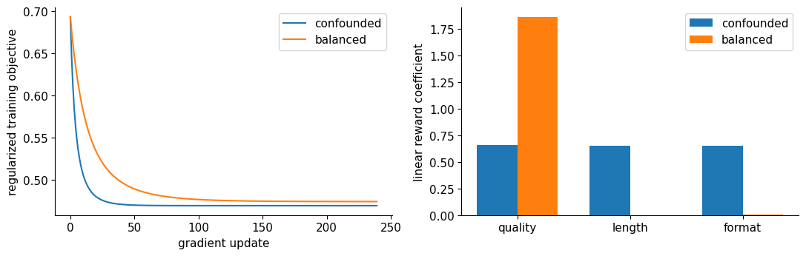
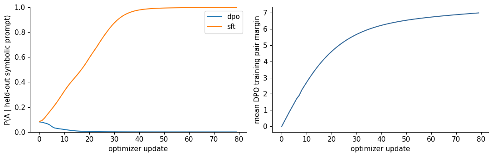
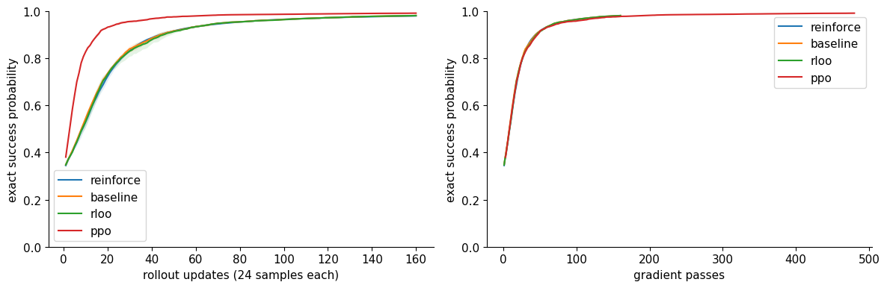

# Chapters 10–12 — Bounded Preference and Policy Evidence

Recorded for the course-material request on 2026-10-04. Mode: CPU mechanism and
learning references. The [specification](../specs/2026-10-04-preference-policy-cpu.md)
was written before the evidence run. [Raw JSON](2026-10-04-preference-policy-cpu.json)
retains all declared arms, full histories, independent metrics, three policy
seeds, environment identity, and source hashes. No result is a model-scale Qwen
run or human-annotation study.

## Execution identity

Canonical command from the course root:

```bash
PYTHONPATH=src OMP_NUM_THREADS=1 /home/dongxi/dgx-spark-dongxi/.venv/bin/python scripts/run_preference_policy_cpu.py
```

Observed: Python3.12.14, PyTorch2.13.0+cu130, Linux aarch64, one Torch CPU
thread. Computation timer1.255712seconds; successful process exit0. The CUDA
build of Torch does not mean the fixture ran on GPU. No downloads, GPU model
loading, inference service, article publication, or animation rendering occurred.

The runner prints evidence and leaves historical reports unchanged. This report
and its JSON were saved from that captured output using repository editing
tools. Reproduction may have a different runtime; deterministic values use the
declared seeds, fixed inputs, and CPU contracts.

## Reward fitting: a measured shortcut

The quality-only soft preference population is unchanged between arms. What
changes is whether nuisance feature differences are nearly equal to quality
in the training distribution. Architecture, optimizer, examples, and validation
distribution stay fixed.

| Measurement | Confounded arm | Balanced arm |
|---|---:|---:|
| Quality coefficient | 0.65590 | 1.85539 |
| Length coefficient | 0.64930 | −0.000018 |
| Format coefficient | 0.65110 | 0.004854 |
| Training preference NLL | 0.466643 | 0.467165 |
| Independent validation NLL | 0.652913 | 0.480995 |
| P(worse but longer/polished answer wins) | 0.962504 | 0.136947 |

Observation: similar training NLL coexists with different independent behavior.
Interpretation: the confounded fixture does not isolate which correlated feature
supports the judgment, and the scorer uses nuisance coordinates. This is a
known synthetic data intervention; the report does not establish how a pretrained
neural reward model represents quality. The adversary was declared before
execution, not selected afterward.



## DPO: relative margins versus absolute desired behavior

The finite categorical experiment can enumerate expected true reward and KL
for every answer. Soft pair judgments depend on known synthetic reward; the
oracle optimum is used only for analysis. Chosen-SFT sees demonstrations;
flipped-label DPO receives the reversed preference direction.

| Arm | Exact expected reward | Reference KL, nats |
|---|---:|---:|
| DPO | 0.518507 | 0.231924 |
| Flipped-label DPO | −0.064057 | 0.300932 |
| Chosen-SFT | 0.645419 | 0.658632 |

These values describe this fixture and declared updates. SFT's higher reward
also involves greater reference movement and a different supervision contract;
the result does not establish a universal method ranking.

The actual tiny decoder gives a stronger caution. Both neural arms start with
the same held-out desired-token probability0.081293. After80updates, DPO's
mean training pair margin is6.984540 and its last training loss0.000926, while
the held-out desired-token probability falls to0.000492. The chosen-SFT arm
reaches0.998066 on that metric. The reference remains bitwise unchanged with
no parameter gradients.



Observation: the trained ratio diagnostic improves while the independent absolute
answer metric worsens. Interpretation: a pair likelihood is insufficient to
certify a desired generation behavior. This does not establish one unique neural
failure cause or a broad language conclusion. The fixture has12IDs, one block,
six training prompts, and one held-out symbolic prompt. It must not be described
as learning or failing English storytelling.

## Policy gradients: exact expectation checks

For logits `[.3,-.2,.1]` and rewards `[0,1,3]`, the exact expected-reward
logit gradient is

```text
[-0.5207036171, -0.0657339318, 0.5864375488]
```

Autograd and the probability-weighted mean of all sampled score vectors agree.
An action-independent baseline1.3 preserves this mean and reduces covariance
trace from1.632041 to0.418325 in this distribution. RLOO withG3 also preserves
the mean; its group-mean estimator covariance trace is0.428464. These variance
numbers have different sampling budgets (one versus three completions), so do
not interpret their direct comparison as equal-cost efficiency.

Inclusive mean centering atG3 yields exactly two thirds of the true gradient,
with covariance trace0.190429. That smaller variance accompanies an altered
mean. Correcting the self-inclusion factor yields the leave-one-out estimator.
The expectation claims depend on iid sampling conditional on one prompt.

## KL estimators and clipping

For the declared positive distributions, exact forward KL is0.675806nats.
The k1 and k3 expectations equal that value; k2's expectation is0.829174.
The sampling variances are1.201635,0.276351,and0.183562 for k1,k2,k3 respectively.
The report preserves sample values, including negative k1 contributions.

The controlled PPO slope checks give `[0,1,-1,0]` at the declared ratios and
advantage signs. Thus already-favorable excessive changes flatten while harmful
changes retain pressure. No global KL constraint is inferred from this local
surrogate. Rare-current-probability perturbations are shown in the notebook;
k3 variance need not be lower everywhere.

## Actual sampled algorithm comparison

Each arm sees3840 sampled completions:160rolloutupdates, six prompts, four
answers per prompt. PPO takes480gradientpasses; the others take160. All use
the same declared task, initialization, seed schedule, and exact success rule.

| Arm | Final exact success probabilities, seeds1921/1922/1923 | Gradient passes |
|---|---|---:|
| REINFORCE | 0.980054 / 0.980184 / 0.980117 | 160 |
| Exact-value baseline | 0.980135 / 0.981667 / 0.981941 | 160 |
| RLOO | 0.980318 / 0.981902 / 0.982335 | 160 |
| PPO, three epochs | 0.991820 / 0.991509 / 0.991530 | 480 |



Observation: PPO obtains a higher endpoint at the matched rollout budget with
more gradient work. The second plot exposes that work; it is not a measured
wall-time efficiency claim. PPO uses an exact detached pre-rollout value, so
critic error is deliberately absent. Six independent prompt-logit tables do
not test unseen arithmetic generalization or neural representation learning.
The shaded range contains three seeds, not a statistical confidence interval.

## Material verification and next evidence

- Ten meaningful objective tests pass: BT signs/gauge, completion masks,
  reference detachment/initial gradient, finite KL stationarity, tiny reference
  immutability, REINFORCE/baseline expectation, RLOO scaling, PPO slopes, KL
  support/expectation, and invalid preference guards.
- Ten notebooks execute40original code cells in fresh CPU/offline kernels,
  producing19reference PNGs. [Portable notebook manifest](2026-10-04-preference-policy-notebooks.json)
  stores notebook/figure hashes and execution records. Source notebooks retain
  learner-friendly empty live output cells and fixed labeled preview links.
- Representative coefficient, mask, negative-DPO, PPO, and algorithm-clock
  figures were visually inspected; heatmap text was corrected for contrast and
  the final notebooks regenerated. This is static scientific-figure QA, not
  browser layout or Mac dependency verification.
- The optional HF DPO runner's CLI/help and source syntax path are checked.
  Three additional file-only contract tests verify modern `chat_template.jinja`
  storage, legacy JSON fallback, and rejection of missing/changed genealogical
  templates. The final checkpoint-chain review caught and repaired a loader
  that would otherwise reject a valid modern HF SFT save.
  Its full/merged checkpoint, tokenizer/template, CUDA/BF16, memory, and
  generation behavior require a new actual Spark smoke. No pretrained model
  DPO result is reported. The authored location fixture and full command exist.

Chapters10–12 now have complete prose,32worked solutions, lab guides, reusable
modules, notebook pathways, measured small experiments, and explicit model-scale
extensions. This verifies material readiness; live learner understanding and
the larger experiments remain distinct future evidence.
