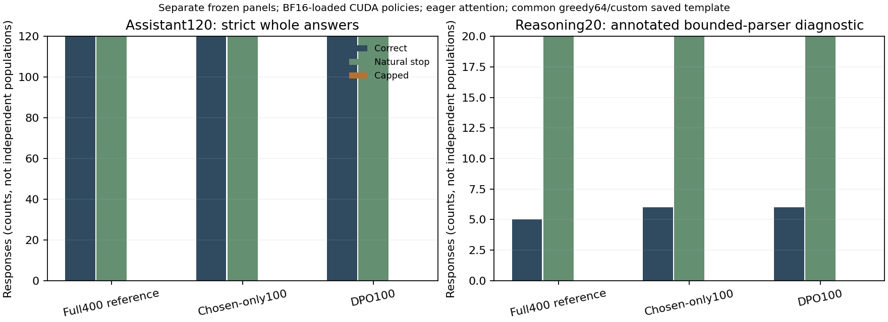

# Preference training needs more than a favorable margin

Status: both fixed100-update training pilots and the separate common evaluation
are accepted. All52 common checks pass; all three actual evaluation children
exit0. The two source-bound CPU figures also pass their complete raw-input join
and before/after checks. Native training diagnostics and common generation
remain distinct observations. No universal ranking of DPO and supervised
fine-tuning is established.

## Same parent and chosen exposure, different objectives and work

Both pilots start afresh from the original
`native-sft-full-pilot400-20261005-run-01/policy`, not a replay artifact.
The [DPO acceptance](native-dpo-pilot-20261005-run-01/acceptance.json)
and [chosen-only acceptance](native-chosen-pilot-20261005-run-01/acceptance.json)
retain the same original eight training pairs, four validation pairs and four
held-out location prompts. The declared seed is 1818, learning rate 5e-7,
accumulation 4, maximum length 512 and generation cap 64. DPO beta is 0.1.
Both use FP32 policy weights with BF16 CUDA autocast, fixed 100 updates and
checkpoint cadence 20. The original full400 parent was specified before its
publication score, not selected afterward to favor either intervention.

| Actual training work only | Chosen-only100 | DPO100 |
| --- | ---: | ---: |
| Completed optimizer updates |100|100|
| Replacement-sampler draws |400|400|
| Valid chosen targets |2,047|2,047|
| Valid rejected targets |0|1,600|
| Policy forward calls |400|800|
| Policy forward positions |13,343|25,439|
| Frozen-reference forward calls |0|800|
| Frozen-reference positions |0|25,439|

These counts come from the 100 retained metric rows and completed training
work, not the entire observer ledger. The chosen-only ledger also counts a
separate preference-validation reference panel; its eight diagnostic reference
forwards are not part of its training objective. The full forward layouts
differ: chosen-only computes on the full chosen input, while DPO scores the
single-shift chosen and rejected branches. Equal labels therefore do not imply
equal processed positions, gradients, information or compute.

Chosen-only minimizes global chosen-token NLL. DPO minimizes mean pair loss
using complete-response log-probability sums relative to the original frozen
reference. Chosen exposure is matched; rejected comparisons and relative-odds
supervision are not. Private replacement draws, encoded IDs and masks belong
in the join, not merely the equal seed number. Labels preserve the actual
template, including the post-message-end newline; decoding stops at its
declared stop, not necessarily after every supervised token.

## Acceptance and recovery precede pilots

The actual [chosen recovery](2026-10-05-native-chosen-replay.md) and
[DPO03 recovery](2026-10-05-native-dpo-replay03-independent-review.md)
pass clean/source/fresh-resume numerical equality and whole-child completion.
The fixed pilots consume their accepted gates but do not inherit their trained
weights. DPO01/02 remain deadline failures with unknown native exits and
retained spending/cleanup errors. Those failures are not erased by run03.

| Actual whole-pilot boundary | Chosen-only100 | DPO100 |
| --- | ---: | ---: |
| Native child exit |0|0|
| Native child seconds |426.071010885993|986.4903892719885|
| Supervisor seconds |426.11806763499044|986.539017128991|
| Minimum sampled available bytes |100,037,660,672|96,169,480,192|
| External deadline, seconds |1,800|1,800|
| Host reserve, GiB |25|25|

All original work and I/O ceilings remain intact, and completed journals have
no open or failed tickets. The [independent DPO100 review](2026-10-05-native-dpo100-independent-review.md)
joins the actual parent, accepted prior gate, runtime witnesses, all 100 rows,
small source/input bindings and export genealogy without another model run.
The [independent chosen100 review](2026-10-05-native-chosen100-independent-review.md)
separately joins its unchanged diagnostic reference, physical work/I/O journals,
actual export and all100 draw/target rows against the DPO arm. It does not
claim that chosen-only uses DPO's artifact-inventory path or hash-worker witness.

The separate outer observations for
[chosen-only](native-chosen-pilot-20261005-run-01/outer-launcher-observation.json)
and [DPO](native-dpo-pilot-20261005-run-01/outer-launcher-observation.json)
are owner-transcribed wrapper intervals, not native receipts or additional
model invocations. Their intervals overlap the table and must not be added.
Native time includes validation, generation, saving and closing work. DPO also
uses its reviewed artifact-inventory path; chosen-only does not. This is not a
matched kernel-throughput benchmark or evidence that DPO has a universal runtime
ratio. Body inventories and independent checks have explicit boundaries
outside the model-work/I/O ledgers. Point memory samples are not a continuous
floor or CUDA peak allocation.

## Native location diagnostics: stopping is not exact answering

Both own-run baselines give 0/4 strict whole answers with 4/4 declared natural
stops. After training, chosen-only gives 4/4 exact answers, while DPO gives 1/4;
both still stop naturally on every prompt. These are the original FP32-loaded,
BF16-autocast diagnostics, not the separate common BF16-loaded evaluation.

One DPO continuation is `purple pouch` when the fixed reference is
`the purple pouch`; another is `green` rather than `the green folder`.
The exact contract is not relaxed after seeing outputs. Missing an article
and missing a noun are different qualitative errors, and a strict nonmatch
alone does not establish that every response has the wrong semantic location.
The original records retain all text, token IDs, stops and expected answers.

The four validation DPO margins are favorable after training, yet its own
independent exact-answer panel is not perfect. A relative margin says how the
chosen/rejected odds moved against the fixed reference; it does not constrain
all other continuations or specify which string greedy decoding will emit.
Do not conclude that chosen-only is universally better from four prompts and
one fixed recipe. The important lesson is to measure the stated task rather
than promote a training diagnostic into a verdict.

## Common likelihood: a large margin need not produce the answer

The original unchanged full400, chosen100 and DPO100 exports were evaluated
on the same four validation pairs, four location prompts, 120 instruction items
and 20 annotated reasoning items. Likelihood uses FP32 policy/reference with
BF16 autocast and the native single-shift masks. Generation loads all three
policies in BF16, uses eager CUDA and the common saved-template greedy64
contract. These configuration/code-path labels are not instrumented kernel
traces. Reasoning retention here is not the separate native-Instruct 32/128
thinking-interface experiment.

The [actual common acceptance](native-preference-evaluation-20261005-run-01/acceptance.json)
and [comparison](native-preference-evaluation-20261005-run-01/comparison.json)
join all four validation pairs and432 generated records across the three arms.
No planned common record is missing or incomplete. Absolute scores below are
mean complete-answer sequence log probabilities, in nats, not token means.
The margin column is **unscaled**; multiplying by beta0.1 gives the DPO loss
margin. It is relative to the original frozen full400 reference.

| Four validation pairs | Mean chosen logp | Mean rejected logp | Mean reference-relative logp margin |
| --- | ---: | ---: | ---: |
| Unchanged full400 |−11.486888|−25.312824|0|
| Chosen-only100 |−0.003524|−27.318045|13.488587|
| DPO100 |−6.642914|−91.838970|71.370116|

Here both interventions raise absolute chosen likelihood on every validation
pair. DPO's much larger relative improvement also includes a large reduction
in rejected likelihood. Thus this particular experiment is not an example of
*falling* chosen likelihood; that possibility is established by separate CPU
controls. It is a native example of a larger relative margin failing to imply
more strict whole answers. Pair likelihoods do not constrain every possible
continuation or make the chosen token win every greedy decision. The four
validation pairs and four independent location prompts differ; their aggregate
comparison does not isolate the cause of an omitted article or noun on a
specific held-out prefix.

## Separate generated-answer and retention populations

| Common BF16-loaded greedy64 panel | Unchanged full400 | Chosen-only100 | DPO100 |
| --- | ---: | ---: | ---: |
| Location: strict whole answers |0/4|4/4|1/4|
| Location: natural stops / caps |4/4;0|4/4;0|4/4;0|
| Instruction: strict whole answers |120/120|120/120|120/120|
| Instruction: natural stops / caps |120/120;0|120/120;0|120/120;0|
| Annotated reasoning: bounded-parser correct |5/20|6/20|6/20|
| Reasoning: natural stops / caps |20/20;0|20/20;0|20/20;0|

The common location outputs retain the same strict counts as the own-run
diagnostics, but that agreement was observed rather than assumed across
precision/loading paths. DPO emits `purple pouch`, `the tall vase`, `green`
with a trailing newline, and `orange tin`. Whole-answer stripping removes the
newline but does not insert missing articles or nouns. Chosen-only emits all
four independently authored expected answers.

There is no measured instruction regression on these120 records in40
lexical-value source groups. The three shared task templates make this a
retention check, not broad assistant competence. In reasoning, both descendants
retain the same five initially correct IDs and add only `math-10`; there is no
item-level correctness loss in this panel. The nine seen/development diagnostic
items remain5/9; the eleven controlled held-out items change0/11→1/11.
The nine diagnostics comprise eight original fixture-development rows
(`math-1`–`math-8`) and the additional known RLVR-overlap `math-9`. Only
`math-2` and `math-9` carry true `rlvr_train_problem_overlap` flags. These
annotations do not mean that full400/chosen100/DPO100 trained on those math
rows, or reconstruct upstream pretraining contamination. Known course overlap
is annotated rather than calling the entire20-item set unseen.
This is a bounded whole-output parser result, not an independent assessment of
every mathematical step or faithful reasoning. It is also not the native-Instruct
thinking-on/off32/128 experiment.

The comparison retains2,000 source-group resamples at seed1010, separate
task/family/template/overlap slices and ancillary stopping/format differences.
The unchanged instruction scores give degenerate zero-difference intervals;
the one-item reasoning gain cannot establish a general capability improvement.
These intervals describe this fixed population, not training-seed uncertainty,
upstream contamination freedom or universal method superiority. No new
bootstrap, pooled score or held-out checkpoint selection was introduced by
the figure consumer.

## Measured common-evaluation work and rendering boundary

| Native common child | Actual exit | Child seconds | Supervisor seconds | Minimum sampled available bytes |
| --- | ---: | ---: | ---: | ---: |
| Unchanged full400 |0|258.9471917170449|259.0211240099743|115,596,341,248|
| Chosen-only100 |0|254.52300773601746|254.60114552400773|115,532,115,968|
| DPO100 |0|246.11960134399123|246.17795224202564|115,509,923,840|

Each retains the original900-second deadline and25GiB reserve with no cleanup
errors. Whole-child time includes loading, pair scoring, three generation
panels and closure; raw response timers have a smaller boundary. The
[outer interval](native-preference-evaluation-20261005-run-01/outer-launcher-observation.json)
is1086.3134524199995 seconds and overlaps those children, not an additional
model run. Independent preparation/export hashing is not a model forward.

Each arm's likelihood panel makes eight policy and eight reference forwards
over256 positions in each lane. Generation is separately counted:

| Panel | Unchanged tokens / positions | Chosen-only tokens / positions | DPO tokens / positions |
| --- | ---: | ---: | ---: |
| Location4 |28/908|16/480|13/385|
| Instruction120 |760/29,720|760/29,720|760/29,720|
| Reasoning20 |245/8,935|111/3,375|86/2,400|

These uncached full-prefix positions and emitted tokens are not FLOPs or
independent additive billing lanes. Shorter answers are not automatically
better answers. The policy/reference likelihood columns and generation columns
have different precision/code paths and evaluation populations.

The [figure acceptance](native-preference-figures-20261005-run-01/acceptance.json)
and [input receipt](native-preference-figures-20261005-run-01/inputs.json) bind both
actual PNGs and all selected metadata/raw inputs before and after rendering.
The reviewed CPU-only consumer actually exits0; it does not load a model,
tokenizer, weight body or GPU, mutate producers, or resample scores. Its separate
29 authored controls establish the instrument, not another pretrained result.
Both figures were visually inspected for the labels and data shown here.

The defensible conclusion is narrow: under this fixed parent/data/recipe,
chosen-only learns all four exact location answers, while DPO learns a much
larger validation relative margin but only one exact location answer; both
retain the original instruction panel. Independent quality, stopping, margins,
regressions and work must be reported together rather than selecting whichever
number makes an intervention look best.
